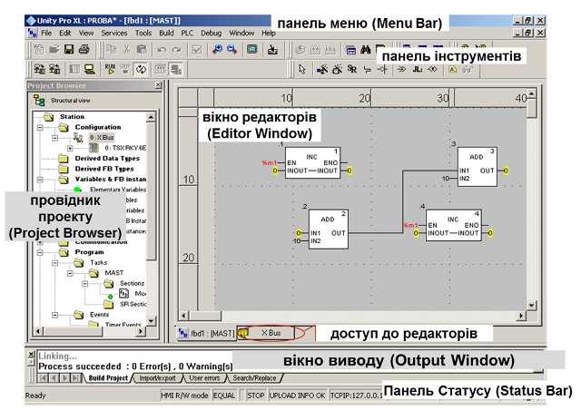

# 3.  Програмування контролерів Modicon у середовищі UNITY PRO

## 3.1.     Середовище UNITY PRO

На сьогоднішній день для конфігурування, програмування, налагодження та діагностики промислових контролерів Modicon Quantum, Premium, Atrium та M340 використовується програмне забезпечення UNITY PRO. 

Середовище розробки UNITY PRO разом з середовищем виконання UNITY дає користувачу такі можливості:

1. Створення виконавчого проекту для контролерів Modicon, а саме:

-    використання мультизадачного режиму середовища виконання: одна MAST, одна FAST, декілька EVT, одна AUX (тільки для QUANTUM та PREMIUM);

-    використання 5-ти мов програмування згідно стандарту IEC 61131-3: LD, ST, IL, FBD, SFC;

-    поділу програми користувача на секції (Section), кожна з яких може бути написана на різних мовах програмування IEC 61131-3;

-    використання підпрограм (SR);

-    функціональне структурування проекту користувача;

-    доступу до великої бібліотеки функцій та функціональних блоків (FFB);

-    використання поряд з локалізованими (located, прив’язаними до конкретної комірки пам’яті) нелокалізованих даних (unlocated, не прив’язаних до конкретної комірки пам’яті); 

-    використання змінних похідного типу (DDT): масивів і структур;

-    створення похідних типів змінних користувача (DDT); 

-    створення похідних функціональних блоків користувача (DFB).

2. Управління ПЛК, а саме:

-  завантаження виконавчого проекту в ПЛК;

-  вивантаження/завантаження проектних даних (Upload Information);

-  управління операційним режимом ПЛК: старт, стоп, ініціалізація.

3. Налагодження програми користувача, а саме: 

-    використання програмного імітатора контролера (simulator) з підтримкою більшості функцій UNITY та можливості доступу до нього з інших програмно-технічних засобів по протоколу Modbus/TCP; 

-    анімації змінних безпосередньо в редакторах за допомогою зміни кольору, відображення числових та текстових значень;

-    управління та контролю змінних за допомогою таблиць анімацій (Animation Table) та операторських екранів (Operator Screens);

-    перегляду стану кроків мови SFC;

-    покрокового виконання програми з використанням точок переривання (Break Point) та спостереження (Watch point);

-    можливості зміни програми користувача в режимі виконання контролером програми управління. 

4. Експлуатації та обслуговування, а саме:

-    спостереження за виконанням програми управління за допомогою створення та використання графічних сторінок (Operator Screens) з анімацією технологічного процесу (подібно засобам HMI);

-    використання вбудованих діагностичних засобів для контролю за станом апаратних засобів контролера;  

-    використання вбудованого вікна тривог Alarm Viewer для перегляду стану діагностичного буферу контролера.

5. Автоматичного створення документації по проекту.

6. Імпорту та експорту частин проекту в форматі .XML для можливості його використання в інших програмних засобах.  

Загальний вигляд середовища UNITY PRO показаний на рис.3.1.  

Рис.3.1.Загальний вигляд середовища UNITY PRO (з відкритим проектом).

Практично всі команди доступні через панель інструментів, яка налаштовується аналогічно як у більшості інструментальних програмних засобів. Деякі опції середовища UNITY PRO налаштовується через команду меню "Tools->Options".

Панель статусу (Status Bar) використовується для відображення статусної інформації відносно ПЛК (див. главу 4.2). Вікно виводу (Output Window) використовується для виводу середовищем UNITY PRO різного типу повідомлень (Build, Import/Export, Errors…).  

​    