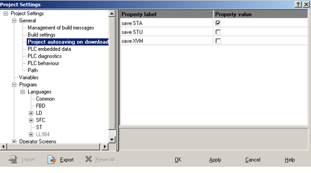

## 3.2. Проект UNITY PRO

Конфігурація та програма ПЛК, а також настройки розподіленої периферії зберігається в проекті UNITY PRO. Проект зберігається на комп’ютері у вигляді одного файлу формату *.STU (Unity Pro File). 

Файли формату .STU несумісні в різних версіях (навіть від старшої до молодшої), тому при перенесенні проекту необхідно зберегти його в архівному форматі *.STA (Unity Pro Archived Application File), який сумісний для більшості версій. Зберегти файл архіву можна через команду меню File->Save Archive. 

Проект можна імпортувати в файл XML формату з розширенням *.XEF\. Цей тип файлу в основному використовується для імпорту змінних в проекти програм SCADA/HMI. Команда експорту викликається в "File-> Export Project" 

У середовищі UNITY PRO можна також відкрити проекти у форматах: PL7 (.FEF, .DFB, .DAT) та Concept (.ASC). При цьому UNITY PRO автоматично конвертує файл в проект формату .STU.

Крім конфігураційних даних та програми користувача проект включає:

-     виконавчий проект для ПЛК, який створюється після його компіляції;

-     анімаційні таблиці;

-     операторські екрани.

Навігація по проекту виконується через провідник проекту (Project Browser, див.рис.3.1), який показується/ховається через команду Tools->Project Browser. По замовченню провідник проекту відкривається у режимі структурного перегляду (меню View->Structural View), однак можна відобразити проект у функціональному вигляді (меню View->Functional View), в якому секції, анімаційні таблиці і екрани можна групувати по функціональній приналежності. Тим не менше, незалежно від функціонального призначення, їх фізичне розміщення буде відповідати структурному вигляду. Крім елементів UNITY PRO у провіднику проекту можна створювати власні папки (меню Edit->Add user directory) і добавляти гіперпосилання (меню Edit->Add Hyperlink).  

Проект містить багато настройок, які налаштовуються користувачем в залежності від потреб. Настройки проекту доступні через команду меню "Tools->Project Settings". Наприклад, на рис.3.2 показано вікно настройки опцій автоматичного створення файлів .STA, .STU, .XVM. 

Через контекстне меню проекту (Application Browser->Project) доступні властивості проекту (Properties). Крім назви проекту, у вікні властивостей можна налаштувати та переглянути параметри ідентифікації проекту (версія проекту, версія UNITY PRO в якому проект був створений, дата компіляції), змінити паролі та активувати/деактивувати захист проекту (вкладка Protection). При активації захисту проекту (задається паролем), всі захищені програмні секції в залежності від їх налаштувань будуть доступні тільки для читання, або взагалі не будуть доступні для перегляду.     

 

Рис.3.2.Вікно налаштування проекту UNITY PRO