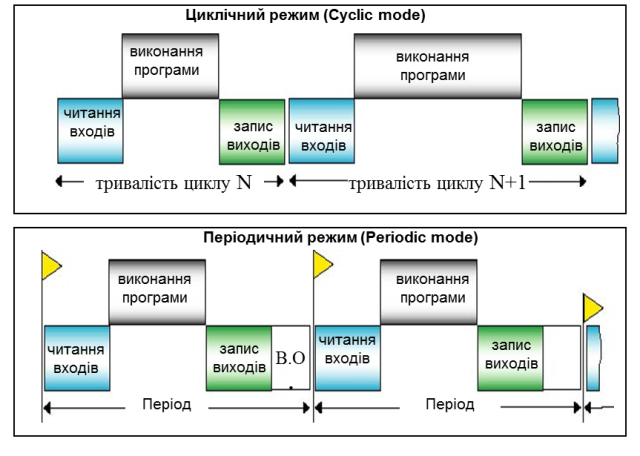
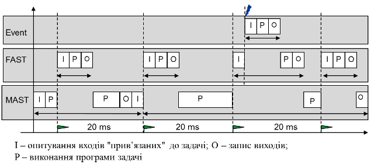
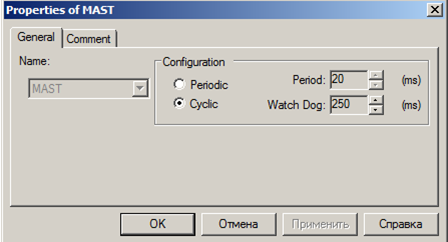
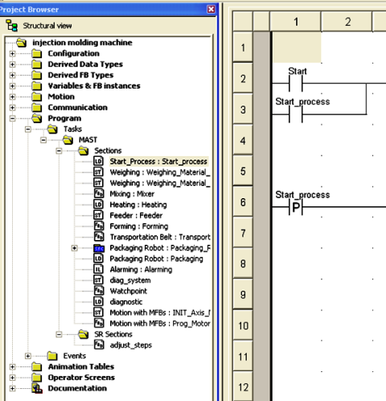
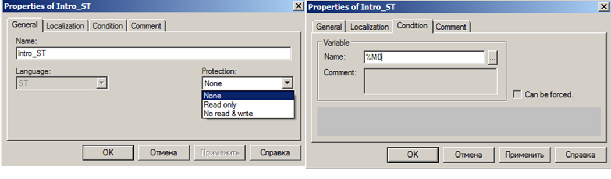

## 3.3. Програма користувача

### 3.3.1. Задачі

Структура програми користувача у ПЛК Modicon може бути однозадачною або багатозадачною. У однозадачній структурі виконується тільки одна основна Задача - MAST. У багатозадачній структурі програми, крім MAST можуть функціонувати також одна Задача FAST та декілька Задач Event. У самих потужних процесорних модулях Premium та Quantum може також функціонувати фонова Задача AUX.

Кожна Задача запускається на виконання тільки за умови знаходження ПЛК в режимі виконання (RUN). У режимі зупинки (STOP) відбувається тільки циклічне опитування входів та внутрішня обробка.

У ПЛК завжди функціонує як мінімум одна Задача – MAST\, яка може виконуватись у циклічному чи періодичному режимах (рис.3.3). Обидва режими передбачають циклічне виконання програми Задачі, яка складається з наступної послідовності дій:

-     операційна система проводить внутрішню обробку: оновлення системних змінних, діагностику, обробку комунікацій, тощо;

-     модуль CPU зчитує значення вхідних каналів, прив’язаних до Задачі MAST, з модулів ПЛК, та записує їх в комірки %I, %IW; 

-     CPU виконує програму користувача, створеної для Задачі MAST;

-     модуль CPU записує значення з комірок %Q, %QW у вихідні канали, прив’язані до Задачі MAST; 

У циклічному режимі, початок наступного виклику Задачі MAST починається відразу по закінченню обробки попереднього. Таким чином, час між викликами Задачі MAST залежить від тривалості її виконання. 

У періодичному режимі\, інтервал (період) між викликами Задачі задається в проекті UNITY PRO. Цей інтервал вибирається завідомо більшим за максимальний час обробки Задачі. Тобто, після закінчення виконання програми та запису виходів Задачі MAST, контролер буде виконувати внутрішню обробку (діагностичні операції, комунікаційний обмін, тощо) до тих пір, поки не прийде час наступного виклику Задачі. 

 Рис.3.3.Циклічний та періодичний режим роботи ПЛК

Робота Задачі MAST контролюється сторожовим таймером (WATCHDOG\), який конфігурується в UNITY PRO. У випадку перевищення тривалості виконання Задачі MAST за встановлене максимально допустиме значення, контролер перейде в режим HALT (аварійна зупинка), що не допустить його "зависання". 

Якщо час виконання Задачі MAST у періодичному режимі буде більший за час виставленого періоду, однак менше ніж час сторожового таймеру (Tperiod<TTASK<Twatchdog), то ПЛК не зупиниться, але попередить про виникнення такої ситуації шляхом виставлення системного біту %S19=TRUE.       

Високопріоритетна Задача FAST запускається завжди в періодичному режимі (рис.3.4). Тобто через періоди часу, визначенні для Задачі FAST, CPU робить наступну послідовності дій:

-     перериває виконання Задачі MAST; 

-     зчитує з модулів ПЛК значення вхідних каналів, прив’язаних до Задачі FAST, та записує їх в комірки %I, %IW; 

-     виконує програму користувача для Задачі FAST;

-     записує значення з комірок %Q, %QW у вихідні канали, прив’язані до Задачі FAST;

-     повертається до виконання Задачі MAST;  

Задача FAST має вищий пріоритет за MAST, тому перериває її виконання. Вона призначена для процесів, які потребують частішої обробки ніж ті, які обробляються в Задачі МAST. Таким чином, високошвидкісні процеси можуть бути оброблені програмою Задачі FAST, а більш повільні – Задачі MAST. Для того щоб вхідні дані для FAST були "свіжими", при конфігуруванні апаратної частини ПЛК до цієї Задачі прив’язують відповідні вхідні канали. Аналогічну операцію треба провести і з вихідними каналами. Якщо Задача FAST буде використовувати вхідні/вихідні значення каналів прив’язаних до MAST, то програма буде обробляти декілька раз одні і ті ж вхідні дані, в чому немає сенсу. 

Слід зазначити, що слово "FAST" (швидкий) не значить, що програма в цій Задачі буде виконуватися швидше ніж в MAST, адже час виконання інструкцій однаковий в усіх Задачах. Слово FAST  вказує на те, що ця Задача призначена для швидкоплинних процесів, тому повинна викликатися частіше. Тим не менше, Задачу FAST можна викликати с періодом, більше ніж у MAST. 

Задача FAST контролюється окремим сторожовим таймером.               

Задачі EVENT\ викликаються в момент виникнення певної події: EVTi – по апаратним подіям, TIMERi – по таймерним. Задачі EVTi\ (де і – номер Задачі даного типу) прив’язуються до певної події, які фіксуються модулями спеціального призначення. Задачі TIMERi\ (де і – номер Задачі даного типу) прив’язуються до таймеру спеціального призначення, який запускається в програмі користувача спеціальною функцією ITCNTRL.

Задачі  EVTi потрібні у тому випадку, коли процес може змінитися в будь який момент часу і потребує миттєвої реакції ПЛК. Таким чином, виникнення апаратного переривання спеціальних каналів (наприклад швидких дискретних входів) приведе до наступної послідовності (рис.3.4):

-     CPU перериває виконання менш пріоритетної Задачі;

-     CPU зчитує входи для %I та %IW, які використовуються в програмі, створеній для Задачі EVTi;

-     CPU виконує програму, яка створена для Задачі EVTi;

-     CPU записує виходи для %Q та %QW, які використовуються в програмі, створеній для Задачі EVTi;

-     CPU повертається до виконання менш пріоритетної Задачі;

Рис.3.4. Приклад роботи контролера у багатозадачному режимі 

Аналогічним чином веде себе ПЛК при спрацюванні таймера Задачі TIMERi. Ця Задача потрібна в тому випадку, коли для розподілу ресурсів ПЛК однієї MAST та однієї FAST Задачі не вистачає. 

Задачі TIMERi мають вищий пріоритет ніж FAST, а EVTi – вище ніж TIMERi. Задачі з вищим пріоритетом будуть переривати виконання менш пріоритетних Задач, які будуть продовжувати своє виконання після закінчення виконання більш пріоритетної Задачі. На рис.3.4 показаний приклад роботи контролера в багатозадачному режимі, з тривалістю періоду Задачі FAST - 20 мс.

Режими, періодичність та сторожові таймери Задач ПЛК конфігуруються через контекстне меню Задач в пункті Properties (рис.3.5). 

 

 Рис.3.5. Вікно властивостей задачі MAST.  

### 3.3.2.  Секції

Програми Задач представляють собою набір секцій\ (Sections\), програма в яких може бути написана на будь-якій з мов IEC 61131-3: IL, LD, ST, FBD чи SFC (SFC тільки для MAST). Секції виконуються одна за одною, в порядку розміщення їх в розділі Sections проекту UNITY PRO  (рис.3.6). Поділ програми Задач на секції дає можливість використати різні, більш зручні для реалізації конкретної частини програми, мови програмування, а також включати та виключати секції при необхідності. 

Секції програми користувача створюються через команду контекстного меню Project Browser-> Sections->New Section. Розділ Sections вибирається у відповідному розділі провідника проекту для Задач MAST, FAST або EVENTS. 

Для секції (рис.3.7) вказується ім’я, мова програмування а також, при необхідності, додаткові властивості захисту (властивість Protection\) та змінна яка буде управляти виконанням секції (вкладка Condition\). Ім’я секції\ повинно включати тільки букви латинського алфавіту та цифри. 

Опціонально, секція може бути захищеною від запису (Read only), або читання та запису (No read & write). Захист діє тільки при умові активності захисту проекту (див. главу 3.2).

При необхідності включення/відключення програми секції в режимі роботи, її можна прив’язати до булевої (BOOL/EBOOL) змінної або адреси. Якщо, наприклад, секція прив’язана до змінної %M0, то вона буде виконуватись тільки в тому випадку, коли %M0=TRUE.  

 Рис.3.6.Приклад вигляду структури задачі MAST.  

Рис.3.7. Вікно настройки властивостей Секцій .  

### 3.3.3.  Підпрограми 

Програми в секціях можуть викликати підпрограми\ (SR\), які записуються в SR Sections тієї ж Задачі, яка викликає підпрограму. Підпрограми доступні тільки в Задачах MAST та FAST. Вони можуть бути написані на одній з 4-х мов IL, LD, ST або FBD, і викликатися в будь якій секції цієї Задачі, незалежно від мови, на якій вона написані.

У підпрограму не можна передавати фактичні параметри, тобто вона завжди викликається без аргументів і не повертає ніякого значення. Тобто підпрограми – це частина коду, яка викликається явно з іншої секції, і після закінчення її виконання, управління знову повертається в секцію, де вона була викликана. Повернення з підпрограми в місце виклику може бути дострокове. Синтаксис виклику секції підпрограми та дострокового повернення з неї залежить від мови програмування і розглядається у відповідних розділах даного посібника.

Якщо необхідно зробити підпрограму користувача з можливістю передачі фактичних параметрів та повернення результатів, використовуються функціональні блоки користувача DFB, які описані в параграфі 3.5.2. 