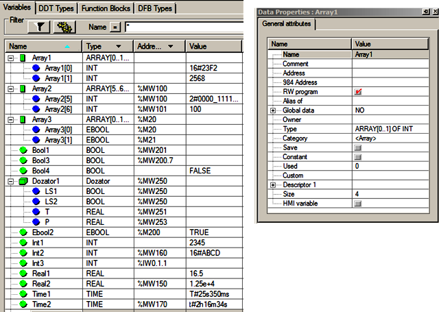
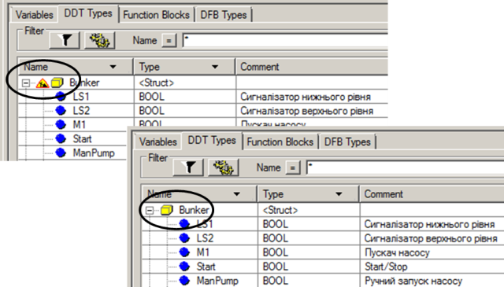
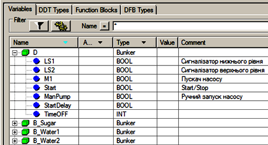
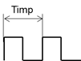
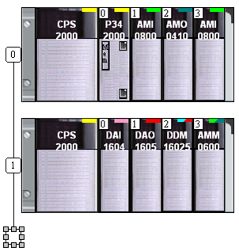
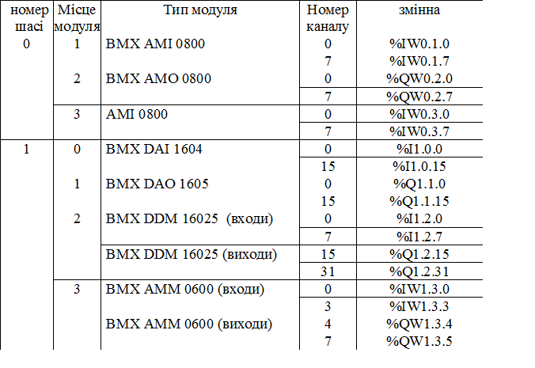
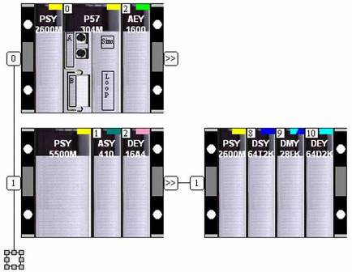
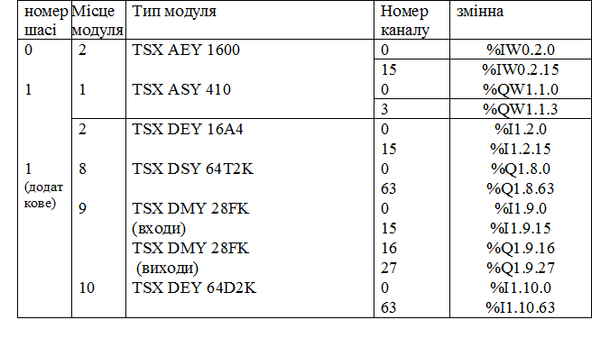
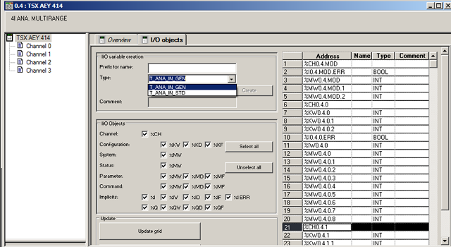
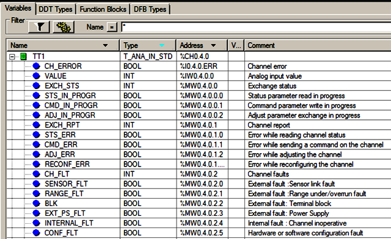

## 3.4. Робота з даними

### 3.4.1. Типи даних

Прикладна програма користувача може оперувати даними звертаючись до них наступним чином:

- за адресою (тільки для локалізованих даних);

- по імені змінної;

- через екземпляр функціонального блоку;

У будь якому випадку у прикладній програмі UNITY операції з даними проводяться чітко згідно їх типу. Тип даних визначає структуру, формат, набір атрибутів та визначених операцій над цими даними. Всі типи даних UNITY можна поділити на чотири різні категорії:

- EDT (Elementary Data Type) – елементарні типи даних ; 

- DDT (Derived Data Type) – похідні типи даних;

- EFB (Elementary Function Block) – елементарні функціональні блоки;

- DFB (Derived Function Block) – похідні функціональні блоки.

Функціональні блоки EFB та DFB розглянуті в главі 3.5, тут зупинимось на елементарних та похідних типах даних. 

У UNITY представлені наступні елементарні типи даних\ (EDT\): BOOL, EBOOL, INT, DINT, UINT, UDINT, BYTE, WORD, DWORD, REAL, TIME, DATE, TIME_OF_DAY, DATE_AND_TIME, STRING, STRING[n]. Їх характеристика наведені у табл. 3.1. 

У бібліотеці UNITY PRO є ряд функцій та функціональних блоків, які працюють з типами даних формату BCD. Формат BCD\ (Binary Coded Decimal, двійково-десятковий формат) призначений для збереження числових даних у наступному вигляді: кожна цифра (0…9) зберігається в 4-х бітному форматі. Наприклад, число 2450 буде зберігатися у вигляді 0010_0100_0101_0000, де 0010(2), 0100(4), 0101(5), 0000(0) – відповідно представлення кожної цифри. 

Таблиця.3.1. Характеристика деяких елементарних типів даних (EDT).

| Тип   | Призначення                                           | кількість біт, формат                                        | Діапазон значень                                             | форми відображення літеральної константи                     |
| ----- | ----------------------------------------------------- | ------------------------------------------------------------ | ------------------------------------------------------------ | ------------------------------------------------------------ |
| BOOL  | булевий                                               | 8                                                            | TRUE/FALSE                                                   | TRUE або 1, FALSE або 0                                      |
| EBOOL | булевий з можливістю форсування та визначення фронтів | 8                                                            | TRUE/FALSE                                                   | TRUE або 1, FALSE або 0\                                     |
| INT   | ціле, числові операції                                | 16,  16-й біт - знак                                         | -32768...32767                                               | десяткова, двійкова (2#), вісімкова(8#), шіcнадцяткова(16#),  наприклад: 3 – десяткова; 2#\0000_0000_0000_0011 - двійкова; 8#\000003 - вісімкова; 16#\0003 - шіснадцяткова. |
| DINT  | подвійне ціле, числові операції                       | 32,  31-й біт - знак                                         | -2147483648 … 2147483647                                     | десяткова, двійкова (2#), вісімкова(8#), шіcнадцяткова(16#)  |
| UINT  | беззнакове ціле, числові операції                     | 16                                                           | 0... 65535                                                   | десяткова, двійкова (2#), вісімкова(8#), шіcнадцяткова(16#), наприклад: |
| UDINT | беззнакове подвійне ціле, числові операції            | 32                                                           | 0 … 4294967295                                               | десяткова, двійкова (2#), вісімкова(8#), шіcнадцяткова(16#)  |
| WORD  | слово, побітові операції                              | 16                                                           | 16#0…16#FFFF                                                 | двійкова (2#), вісімкова(8#), шіcнадцяткова(16#)             |
| DWORD | подвійне слово, побітові операції                     | 32                                                           | 16#0 … 16#FFFF_FFFF                                          | двійкова (2#), вісімкова(8#), шіcнадцяткова(16#)             |
| REAL  | реальне, число з плаваючою комою                      | 32,  31-й біт – знак,  8 біт ескпонен-ційна,  23 біт - мантіса | Нормальні значення: 3.4028235e+38… 1.1754944e-38,  -0…0,  1.1754944e-38… 3.4028235e+38 | 0.456 аналогічно -1.32e12 1.0E+6 аналогічно 1000000   Не гарантований результат DEN\:  -1.1754944e-38 … 1.1754944e-38   Нескінченність: < 3.4028234e+38 –\INF\ >+3.4028234e+38 +\INF\   QNAN\ та SNAN\ – невірний формат числа |
| TIME  | беззнакове подвійне ціле, робота з часом              | 32, зберігає значення в мілісекун-дах                        | 0...4294967295 мс, або T#0MS...T#49D_17H_2M_47S_295MS        | Часова константа T\#\,  де D – дні, H – години, M – хвилини, S – секунди, MS – мілісекунди, Наприклад: T#16S_500MS – 16,5 c |

У UNITY PRO є три типи даних, які мають формат BCD: DATE, Time Of Date, Date and Time (табл.3.2).

Таблиця 3.2. Характеристика елементарних типів даних в форматі BCD.

| Тип                 | Призначення                           | кількість біт, формат | Діапазон значень                                             | форми відображення константи                                 |
| ------------------- | ------------------------------------- | --------------------- | ------------------------------------------------------------ | ------------------------------------------------------------ |
| DATE\ (\D\)\        | робота з астрономічною датою          | 32, BCD               | Year [1990…2099]  Month [01…12]   Day [01…31]                | D#<Year>-<Month>-<Day>\ Year - рік Month - місяць Day - день D\#1990-01-01 |
| TIME OF DAY (TOD)\  | робота з часом доби                   | 32, BCD               | Hour [00,23]   Minute [00,59]   Second [00,59]               | TOD#<Hour>:<Minutes>:<Seconds>\ Hour - Години Minute - Хвилини Second - Секунди TOD\#00:00:00 |
| DATE and TIME (DT)\ | робота з астрономічною датою та часом | 64, BCD               | Year [1990,2099]  Month [01,12]   Day [01,31]   Minute [00,59]   Second [00,59] | DT#<Year>-<Month>-<Day>-<Hour>:<Minutes>:<Seconds>\ Year - рік Month - місяць  Day - день Minute - хвилини Second -  секунди DT\#1990-01-01-00:00:00 |

 Похідні типи даних (DDT\) – це складені типи даних, на базі елементарних типів. Це можуть бути масиви та структури, як вже визначені в UNITY та доступні через бібліотеку, так і визначені користувачем в процесі створення проекту. Змінні на основі структурних типів даних будемо називати структурними змінними. У UNITY PRO можна створювати та використовувати структурні типи даних користувача (див. параграф 3.4.3) 

Особливими структурними типами даних являються IODDT\ (Input Output Derived Data Types). З кожним каналом ПЛК зв’язане не тільки отримане значення каналу, а і додаткова інформація (параметричні дані, стан та код помилки, тощо). Ця інформація доступна через спеціальні комірки областей %I, %IW, %Q, %QW, %MW та %KW, наявність та адреси яких сильно залежать від типу модулю та каналу. Для зручності користування цими даними якраз і існують бібліотечні типи IODDT. Змінні цього типу обов’язково повинні бути локалізованими згідно правил, описаних в параграфі 3.4.6.  

### 3.4.2. Змінні 

UNITY PRO дає можливість оперувати даними звертаючись до них по імені або за адресою (пряма адресація). 

Змінні створюються у середовищі UNITY PRO у розділі проекту "Variables & FB instances". Всі змінні, описані в даному розділі, являються глобальними, тобто доступні з любої частини проекту.

При створенні змінної визначається як мінімум її ім’я та тип. Ім’я повинно бути унікальним, містити символи латинського алфавіту, не містити службові символи та пробіли. Тип вибирається з доступних в UNITY PRO елементарних та похідних типів даних. 

Змінні мають багато властивостей. У табличному редакторі даних (Data Editor) по замовченню доступні тільки найбільш вживані властивості, інші можна добавити через контекстне меню редактору, вибравши команду Customize Column. У будь якому випадку, всі властивості змінних доступні через їх контекстне меню, при виборі команди Data Properties (рис.3.8). 

Для кожної змінної можна вказати початкове значення, тобто її значення при ініціалізації (властивість Value\). Значення ініціалізації записується в змінну при холодному старті (поняття "холодний старт" розкрито в главі 4.1). Якщо значення не вказане – воно буде вважатися нульовим. 

Властивість Save=TRUE вказує на те, що при холодному старті ПЛК, змінна повинна залишитися в тому ж стані, що і перед відключенням живлення, тобто не ініціалізуватися значенням Value. Слід звернути увагу на те, що значення змінної записується в зону збережених даних (Save Data) в момент вимкнення живлення ПЛК. 

Встановивши властивість RW program=FALSE, змінна перетворюється в константу, яка буде доступна в програмі користувача тільки для читання. Якщо змінна прив’язана до області %KW, то дана властивість завжди буде рівною FALSE.



Рис.3.8. Приклади змінних в UNITY PRO (ліворуч) та вікно властивостей змінної (праворуч)

Серед властивостей змінної доступна адреса розміщення даних (Address\). Якщо при визначенні змінної, у властивості Address вказати комірку пам’яті, то змінна буде локалізованою\. У іншому випадку, змінна буде нелокалізована, отже адреса розміщення її буде невідомою, тобто до даних можна буде звертатися тільки через ім’я змінної.        

Кількість та тип виділених комірок пам’яті для змінної залежить від її типу. Так, наприклад, змінні типу WORD та INT займають одне слово (2 байти пам’яті), тому до них можна прив’язати по одній комірці з області %MW, %IW, %QW, %SW або %KW. Типи даних DWORD, DINT, REAL, TIME займають два слова, тому при локалізації розміщуються в двох суміжних комірках області %MW або %KW, однак комірки областей %IW, %QW, %SW при цьому недоступні для прив’язки.

Для змінних типу BOOL можна виділити один біт комірки з області %MW або %KW, вказавши номер комірки та біт. Наприклад, на рис.3.8 змінна Bool3 прив’язана до 7-го біту комірки %MW200. Якщо біт не вказувати, то змінна BOOL займає один байт комірки %MW: на рис.3.8 змінна Bool1 займає молодший байт.

Змінні типу EBOOL можуть бути локалізовані тільки в області %M, %I та %Q. 

До змінних типу WORD, INT та BYTE можна звертатися по бітам. Для цього після назви змінної через крапку вказується номер біта. Наприклад для звернення до 13-го біта змінної Int1 (див. рис.3.8) необхідно записати: Int1.13. 

Масиви (Array\) вибираються з визначенням типу елементів, а також початкового та кінцевого індексу. Наприклад, на рис.3.8 масив Array1 об 'явлений як "ARRAY[0..1] OF INT", тобто з 2-х елементів, починаючи з 0-го; масив Array2 об'явлений як "ARRAY[5..6] OF INT", тобто з 2-х елементів, починаючи з 5-го. При локалізації масиву, вказується тільки адреса початкової комірки, всі інші комірки прив’язуються автоматично починаючи зі вказаної. Кількість зайнятих комірок залежить від типу та кількості елементів масиву. 

Звернення до елементів масиву проводиться через квадратні дужки. Так наприклад для звернення до 0-го елементу масиву Array1 (рис.3.8) необхідно написати: Array1[0] . Слід звернути увагу, що номер елементу масиву не вказує на кількість елементів в ньому, оскільки нижня межа може бути не 0-ю. 

Структурні змінні\ DDT можуть включати поля\ різного типу (в тому числі і масиви або інші структурні типи). Для звернення до елементу структурної змінної (поля\), вказують спочатку назву змінної, а потім через крапку – поле змінної. Наприклад, звернення до поля LS1 структурної змінної Dozator1 відбувається наступним чином: Dozator1.LS1. 

При локалізації структурної змінної, так само як для масиву, вказують тільки адресу початкової комірки, всі інші комірки прив’язуються автоматично починаючи зі вказаної. Кількість зайнятих комірок залежить від типу та кількості полів змінної. Наприклад на рис.3.8, для змінної Dozator1 вказується початкова комірка %MW250. Таким чином поля LS1 та LS2 зайняли відповідно молодший та старший байт слова %MW250, поле T – дві комірки %MW251 та %MW252, поле P – дві комірки %MW253 та %MW254. 

Слід зазначити, що створені, але не використані в програмі користувача змінні все одно займають пам’ять. У редакторі даних UNITY PRO є можливість видалення невикористаних змінних через контекстне меню командою Purge Unused Variables.

Змінні можна експортувати та імпортувати. Підтримуються різні формати файлів, які можна використати для переносу між проектами UNITY PRO, або в проекти HMI/SCADA-програм, чи іншого типу програм. Команди експорту та імпорту доступні в контекстному меню виділених даних, або розділів Variables & FB Instances.  

### 3.4.3. Структурні типи даних користувача 

Структурні типи даних користувача\ ( відносяться до DDT) створюються в розділі проекту Derived Data Types. Структурному типу дається ім’я, а також створюються поля. При створенні типу, він знаходиться в режимі конструкції, що відображається на піктограмі імені типу (рис.3.9 зверху). Після створення всіх потрібних полів, необхідно викликати команду Build->Analyze для перевірки вірності структури та внесення змін в проект. При відсутності помилок, піктограма "конструктор" зникає (рис.3.9 знизу). 



Рис.3.9. Створення структурного типу користувача DDT: вверху – до команди Analyze, внизу - після  

Структурні змінні створюються аналогічно до змінних елементарних типів даних (рис.3.10). Дозволено також створювати масиви на основі структурного типу DDT. 



Рис.3.10. Структурні змінні.      

### 3.4.4. Області внутрішніх даних (%M та %MW) і констант (%KW)

Кожний процесорний модуль M340 або TSX Premium має локалізовані області глобальних даних %M, %MW та %KW, до комірок яких можна прив’язати змінну або звернутися безпосередньо за адресою (топологічною адресою). Крім цього, для кожного каналу вводу/виводу ПЛК доступні свої області %MW та %KW, які розглядаються в параграфі 3.4.6 

Область даних %M призначена для збереження проміжних результатів типу EBOOL. Область %MW складається з 16-бітних комірок, які призначені для збереження проміжних результатів інших типів, включаючи BOOL. Області %M та %MW незалежні, тобто їхні комірки не перекриваються. Враховуючи, що внутрішні змінні не потребують локалізації (прив’язки до конкретних комірок пам’яті), ці області потрібні тільки в ряді випадків:

-   для доступу до даних по мережі, коли необхідно чітко знати розміщення цих даних;

-   для виділення області даних комунікаційним каналам; 

-   для сумісності з імпортованими проектами PL7 PRO;

-   для зручності роботи з перетворенням даних;

-   для зручності роботи з фронтами (EBOOL);  

Область %KW призначена для розміщення констант. Безпосередньо задавати значення в цю область неможна, вона використовується тільки при локалізації змінних, які автоматично стають при цьому константами (властивість RW=FALSE). 

Кожна комірка має свій номер. Наприклад %M0 – нульова комірка в області %M, %MW100 – сота комірка в області %MW, %KW34 – 34-та комірка в області констант. Розмір областей %M, %MW та %KW, тобто кількість комірок в кожній області, задається при конфігуруванні процесорного модуля (див. парграфи 2.1.2 та 2.2.3).

Комірки області %M завжди обнуляються при холодному старті. Значення комірок області %MW ініціалізуються при холодному старті тільки при виставленні опції "Initialize %MWi on cold start" в конфігураційному вікні процесорного модулю. Якщо до комірки прив’язана якась змінна, значення ініціалізації задається властивістю Value цієї змінної, якщо ні – значення ініціалізації буде нульовим (про холодний старт див. главу 4.1).  

У програмі користувача можливе пряме звернення до комірок %M аналогічно як до змінних типу EBOOL. Наприклад, у програмі ST:

```pascal
%M40:=TRUE; (*пряме звернення до комірки*)

(*робота з таблицями (%M20..%M23)<-(%M40..%M43)*)
%M20:4:=%M40:4;
%MW100.0:=%M50;

(*звернення по індексу %M[65+%MW1]:=TRUE*)
%M65[%MW1]:=TRUE; 
```

Зверніть увагу, що при зверненні до декількох комірок як до масиву (таблиці\ комірок) використовується синтаксис: 

```pascal
ADDRi:n
```

де ADDRi – топологічна адреса початкової комірки (наприклад %M10, %MW21, %SW50), n – кількість комірок. 

Для дозволу роботи з таблицями (масивами) комірок необхідно виставити опцію: "Tools->Project Settings->Variables->Directly Represented array variables" 

До комірок %MW та %KW теж можна звернутися безпосередньо. При прямій роботі з %MW та %KW, UNITY PRO інтерпретує їх як тип INT, тому правила використання будуть такі самі як і для змінних даного типу. Аналогічно можна звернутися також до біта у локалізованій області пам’яті. Наприклад запис %MW100.4 означає, що йде звернення до 4-го біта комірки %MW100. Продемонструємо декілька випадків на прикладі програми ST:

```pascal
%MW100:=%MW200 + a_int;
%MW0:5:=%MW10:5;
%MW30.0:=a_bool;
%MW30.1:=%M40;
(*звернення по індексу %MW[16+a_int]:=10*)
%MW16[a_int]:=10;
```

У контролері TSX Premium (у М340 не підтримується) до комірок області %MW та %KW можна також звертатися як до даних типів DINT та REAL. При цьому синтаксис запису буде наступний:

-   %MDi – звернення до значення типу DINT, яке займає дві комірки: %MWi(молодше слово) та %MWi+1(старше слово);

-   %MFi - звернення до значення типу REAL, яке займає дві комірки: %MWi(молодше слово) та %MWi+1(старше слово);

-   %KDi – звернення до значення типу DINT, яке займає дві комірки: %KWi(молодше слово) та %KWi+1(старше слово);

-   %KFi - звернення до значення типу REAL, яке займає дві комірки: %KWi(молодше слово) та %KWi+1(старше слово);

Продемонструємо декілька випадків на прикладі програми ST:

```pascal
(*змінна %MF18 займає комірки %MW18 та %MW19*)
%MF18:=4.5;
(*після виконання буде: %MW20=16#AABB %MW21=16#4566*)
%MD20:=16#4566_AABB;
a_real:=%KF16;
%MD22:4:=%KD100:4;
(*звернення по індексу %MW[200+%MW20]:=4.4*)
%MF200[%MW20]:=4.4;
```

### 3.4.5. Області системних даних (%S та %SW)

У областях %S(системні біти) та %SW (системні слова) знаходиться інформація про стан контролеру. Комірки пам’яті даних областей адресуються номером починаючи з 0. Кожна комірка має своє призначення, і може бути доступна для читання, а деякі і для запису. 

До комірок %S та %SW можна прив’язати змінні, або звертися безпосередньо. З комірками області %S UNITY працює як зі змінними типу BOOL. Робота з комірками %SW подібна до роботи з %MW, наприклад:

```pascal
a_int:=%SW0;
%S0:=%MW401.0;
%M200:=%S1;
%MW402:4:=%SW50:4;
a_bool:=%SW10.0;
%MD210:=%SD18; 
```

Призначення більшості комірок пам’яті системних даних однакове для всіх ПЛК (M340/Premium/Quantum), однак деякі з них можуть відрізнятися. Інформація про призначення системних бітів і слів доступна в довідниковій системі UNITY PRO, нижче розглянемо тільки деякі з них.

Таблиця 3.3. Призначення деяких системних бітів.

| Адреса    | Призначення                                                  | Примітка                     |
| --------- | ------------------------------------------------------------ | ---------------------------- |
| %S0       | Холодний старт: виставляється в 1 при холодному старті, скидається в 0 в кінці першого циклу | див. розділ 4                |
| %S1       | Теплий рестарт: виставляється в 1 при теплому рестарті, скидається в 0 в кінці першого циклу | див. розділ 4                |
| %S4       | бітовий меандр Timp=10 мс,   | див. пояснення під таблицею  |
| %S5       | бітовий меандр Timp=100 мс                                   | див. пояснення під таблицею  |
| %S6       | бітовий меандр Timp=1 с                                      | див. пояснення під таблицею  |
| %S7       | бітовий меандр Timp=1 хв                                     | див. пояснення під таблицею  |
| %S10      | помилка I/O: в нормальному режимі =1, при помилці каналу на будь якому модулі ПЛК скидається в 0, одночасно вмикається індикатор I/O на процесорному модулі | див. розділ 4                |
| %S11      | спрацювання сторожового таймеру: в нормальному режимі =0, виставляється в 1 при спрацюванні сторожового таймеру | див. розділ 4                |
| %S12      | =1, коли ПЛК в режимі RUN                                    |                              |
| %S13      | перший цикл виконання Задачі MAST: виставляється в 1 в режимі RUN на першому циклі MAST (включаючи холодний старт, теплий рестарт, запуск користувачем), скидається в 0 в кінці першого циклу |                              |
| %S15      | переповнення при операції з величинами типу STRING: в нормальному режимі=0, виставляється в 1 при різній розмірності строкових змінних при присвоєнні. Повинно скинутись в 0 програмою користувача. Якщо %S78=1 ПЛК при %S15=1 переходить в режим HALT |                              |
| %S18      | переповнення при арифметичній операції: в нормальному режимі=0, виставляється в 1 при переповненні (результат виходить за визначені типом межі), при діленні на 0, при від’ємному підкореневому виразі. Повинно скинутись в 0 програмою користувача. Якщо %S78=1 ПЛК при %S18=1 переходить в режим HALT | див. параграф 3.6.2          |
| %S19      | виставляється в 1 при перевищенні періоду Задачі MAST, скидається в 0 програмою користувача | див. параграф 3.3.1          |
| %S20      | переповнення індексу: в нормальному режимі=0, виставляється в 1 при переповненні індексу при зверненні до масиву або таблиці (<0, або більше номера існуючого об’єкту). Повинно скинутись в 0 програмою користувача. Якщо %S78=1 ПЛК при %S20=1 переходить в режим HALT |                              |
| %S21      | перший цикл виконання Задач MAST, FAST, Aux: виставляється в 1 на першому циклі Задачі в режимі RUN (включаючи холодний старт, теплий рестарт, запуск користувачем), скидається в 0 в кінці першого циклу Задачі; існує окремий біт %S21 для кожної Задачі |                              |
| %S40-%S47 | помилка I/O на шасі (%S40 – 0-вому, %S47 – 7-мому): в нормальному режимі =1, при помилці I/O на модулі в шасі виставляється в 0 | тільки читання див. розділ 4 |
| %S50      | відновити годинник реального часу ПЛК:  -    в нормальному режимі =0: змінні %SW50 - %SW53 відновлюються системою відповідно до годинника реального часу; -    при 1: змінні %SW50 - %SW53 не змінюються системою, можуть бути змінені оператором; -    перехід 1->0: годинник реального часу відновлюється змінними %SW50 - %SW53 | див. %SW50- %SW53 з таб.3.4  |
| %S76      | =1, якщо діагностичний буфер активовано                      | тільки читання див. розділ 4 |
| %S77      | =1, якщо діагностичний буфер повний                          | тільки читання див. розділ 4 |
| %S78      | зупинитись при помилці розрахунків: в нормальному режимі =0, користувач може виставити в 1 щоб при помилках розрахунків (%S15, %S18, %S20) ПЛК переходив в режим HALT |                              |

 Бітовий меандр – це почергове слідування значень "0"(FALSE) та "1"(TRUE) з однаковою тривалістю кожного рівня. Так, наприклад, %S4 буде змінювати своє значення кожні Timp/2, тобто 5 мс буде TRUE , наступні 5 мс – FALSE і т.д.

Таблиця 3.4. Призначення деяких системних слів.

| Адреса               | Призначення                                                  | Примітка                                                     |
| -------------------- | ------------------------------------------------------------ | ------------------------------------------------------------ |
| %SW0                 | Період виклику Задачі MAST: при холодному старті присвоюється виставленому в конфігурації, може бути змінений програмою користувача в діапазоні 1-255 мс; | див. главу 3.3.1                                             |
| %SW1                 | Період виклику Задачі FAST: при холодному старті присвоюється виставленому в конфігурації, може бути змінений програмою користувача в діапазоні 1-255 мс; | див. главу 3.3.1                                             |
| %SW8                 | деактивація стадії опитування входів для Задачі: в нормальному режимі =0, може бути змінено програмою користувача %SW8.0=1 – деактивація опитування входів для Задачі MAST, %SW8.1=1 – деактивація опитування входів для Задачі FAST | див. главу 3.3.1                                             |
| %SW9                 | деактивація стадії запису виходів для Задачі: в нормальному режимі =0, може бути змінено програмою користувача %SW9.0=1 – деактивація запису виходів для Задачі MAST, %SW9.1=1 – деактивація запису виходів для Задачі FAST | див. главу 3.3.1                                             |
| %SW10                | перший цикл після холодного старту: %SW10.0=0 – перше виконання циклу MAST; %SW10.1=0 – перше виконання циклу FAST; в кінці циклів біти виставляються в 1 | див. главу 3.3.1                                             |
| %SW17                | помилка результату операції з плаваючою комою, при помилці виставляється в 1 один з бітів | див. главу 3.6.2                                             |
| %SD18 (%SW18, %SW19) | лічильник часу з базою 100 мс; коли ПЛК включений (навіть в режимах STOP і HALT), лічильник збільшується на 1 кожні 100 мс; може бути змінений програмою користувача, скидається при ініціалізації; |                                                              |
| %SD20 (%SW20, %SW21) | лічильник часу з базою 1 мс; коли ПЛК включений (навіть в режимах STOP і HALT), лічильник збільшується на 1 кожну 1 мс (для ряду ПЛК на 5 кожні 5 мс); не може бути змінений програмою користувача; скидається при ініціалізації або при холодному старті; |                                                              |
| %SW30                | час виконання попереднього циклу MAST, в мілісекундах        |                                                              |
| %SW31                | максимальний час виконання циклу MAST, в мілісекундах        |                                                              |
| %SW32                | мінімальний час виконання циклу MAST, в мілісекундах         |                                                              |
| %SW33-%SW35          | аналогічно %SW30-%SW32 тільки для Задачі FAST                |                                                              |
| %SW49-%SW53          | реальний час ПЛК в форматі BCD: %SW49 – день тижня, %SW50 – секунди (16#SS00), %SW51 – години та хвилини (16#HHMM), %SW52 – місяць і день (16#MMDD), %SW53 – рік (16#YYYY); можна відновити з програми користувача, використавши %S50 | тип BCD - див. главу 3.4.1,  установка - див. %S50 з таб.3.3 |
| %SW54-%SW58          | час останньої зупинки ПЛК в форматі BCD: %SW58 – день тижня, %SW54 – секунди (16#SS00), %SW55 – години та хвилини (16#HHMM), %SW56 – місяць і день (16#MMDD), %SW57 – рік (16#YYYY) | тип BCD - див. главу 3.4.1,  установка - див. %S50 з таб.3.3 |

### 3.4.6. Дані каналів вводу/виводу та змінні IODDT

Задачі MAST та FAST починаються зі зчитування даних з вхідних каналів ПЛК а закінчуються записом даних у вихідні канали. Процес зчитування та запису проходить автоматично, тобто неявно для користувача. Прив’язка каналів до Задач проводиться при конфігурації апаратної частини ПЛК (див. розділ 2). 

Інформація про стан та значення вхідних каналів контролера знаходиться у комірках %I та %IW, а значення вихідних – у комірках %Q та %QW. Кожна комірка з даних областей пам’яті відповідає за конкретний канал, в залежності від розміщення модуля у шасі та номеру каналу (так звана географічна адресація\). Тобто топологічна адреса розміщення даних, які відповідають за значення каналу, визначається: номером шасі, на якому розташований модуль, розміщенням модуля у шасі та каналом на модулі. Таким чином:

- %Ir.m.c – адреса відповідає за дискретний вхід на шасі з номером r, модулі на посадочному місці m, каналу с. 

- %IWr.m.c - адреса відповідає за аналоговий вхід на шасі з номером r, модулі на посадочному місці m, каналу с. 

- %Qr.m.c – адреса відповідає за дискретний вихід на шасі з номером r, модулі на посадочному місці m, каналу с. 

- %QWr.m.c – адреса відповідає за аналоговий вихід на шасі з номером r, модулі на посадочному місці m, каналу с. 

На рис.3.11 показаний приклад конфігурації для контролера М340, а в таб.3.5 приклади топологічних адрес відповідно до цієї конфігурації. Для модулів з однотипними каналами (тільки входи або тільки виходи) номер каналу співпадає з порядковим номером входу або виходу (якщо рахувати з 0). Для дискретних змішаних модулів, перші 16 каналів (0-15) виділяються під входи, а виходи починають адресуватися з 16-го. Навіть якщо у змішаному модулі тільки 8 входів (як на рис.3.11), адресація дискретних виходів все одно починається з 16-го. Для аналогових змішаних модулів AMM 0600, перші 4-ри канали (0-3) виділяються під входи, а виходи починають нумеруватися з 4-го.  



Рис.3.11. Приклад конфігурації М340 

Таблиця 3.5. Приклади топологічних адрес, які відповідають за значення каналів воду/виводу для М340.



На рис.3.12 показаний приклад конфігурації для контролера TSX Premium, а в таб.3.6 приклади топологічних адрес відповідно до цієї конфігурації. Слід звернути увагу на адресацію модулів в додатковому шасі. 



Рис.3.12. Приклади конфігурації TSX Premium 

Таблиця 3.6. Приклади топологічних адрес, які відповідають за значення каналів воду/виводу для TSX Premium.

 

З кожним каналом вводу/виводу ПЛК зв’язане не тільки значення сигналу, а і додаткова інформація про параметричні дані, стан та код помилки, тощо. Всі дані, які зв’язані з каналом, доступні в спеціальних комірках, адреса яких чітко зв’язана з номером каналу. Крім %I, %IW, %Q та %QW це можуть бути комірки %MW(включно %MD та %MF) та %KW (включно %KD та %KF). При цьому адреса всіх комірок буде включати номер шасі (r), номер модуля(m) та номер каналу (с): r.m.c. У UNITY PRO всі асоційовані з каналом дані називаються об’єктами вводу/виводу (I/O Objects\). 

Призначення кожного об’єкту залежить від типу каналу. Таким чином набір доступних об’єктів вводу/виводу буде залежати від конфігурації ПЛК. Для того щоб користувач міг подивитися перелік всіх доступних об’єктів для модуля, в конфігураційному вікні цього модуля на вкладці I/O Objects (рис.3.13) вибираються всі об’єкти (Select All) після чого викликається команда відновлення списку (Update grid).



Рис.3.13. Вікно перегляду налаштування даних для каналів вводу/виводу 

Слід зазначити, що з будь яким каналом вводу/виводу, незалежно від його типу буде зв’язана комірка з адресою типу: %Ir.m.c.ERR (помилка I/O для каналу c модулю m шасі r), а з модулем - %Ir.m.MOD.ERR (помилка I/O модулю m на шасі r). Ці об’єкти використовуються при діагностиці (див. параграф 4.5.4). Наприклад, на рис.3.13 комірка %I0.4.MOD.ERR відповідає за помилку I/O для модуля TSX AEY414, який знаходиться на 4-му місці 0-го шасі. 

Для зручності користування об’єктами вводу/виводу існують бібліотечні типи IODDT. Тип IODDT, на основі якого створюється локалізована змінна, повинен відповідати типу каналу. Наприклад, для каналів модулю TSX AEY 414 можна використати IODDT типів T_ANA_IN_GEN або T_ANA_IN_STD, так як поля цих структур сумісні з наявними об’єктами для каналів. Для прив’язки структурних змінних до комірок каналу вказується спеціальний, асоційований з каналом об’єкт типу %CHr.m.c. 

Створити змінну IODDT можна безпосередньо з вікна I/O Objects (див. рис.3.13). Для цього в переліку об’єктів необхідно вибрати об’єкт типу %CH, для якого вибрати тип IODDT (Type) та ім’я (Prefix for name), після чого викликати команду Create. Наприклад, якщо для об’єкту %CH0.4.0 з рис.3.13 вибрати тип T_ANA_IN_STD, і задати ім’я "TT1" то в результаті появиться структурна змінна як на рис.3.14.

Слід зазначити, що об’єкти вводу/виводу типу %MW автоматично не оновлюються. Для їх оновлення необхідно викликати спеціальні функції явного обміну (Explicit Exchange). Детальніше інформація про структурні IODDT та явний обмін доступна в довідниковій системі UNITY PRO.



Рис.3.14. Приклади змінної типу IODDT