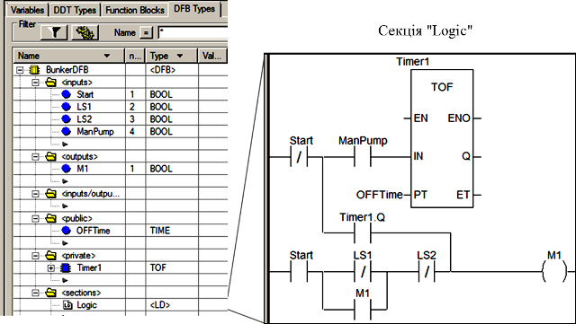
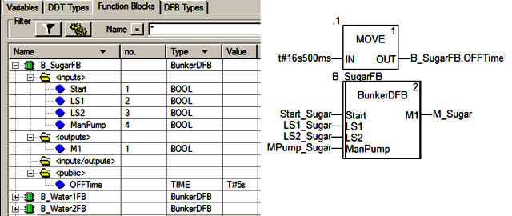

## 3.5.     Функції, процедури та функціональні блоки 

### 3.5.1.  Використання FFB

У програмі користувача на будь якій із мов програмування (FBD, LD, ST, IL або секції кроку SFC) можна використовувати різні типи програмних блоків, в які можна передавати фактичні параметри та отримувати на виході результати розрахунку. Можна користуватися як бібліотечними готовими блоками (функції, процедури, елементарні функціональні блоки) так і розробити власні (похідні функціональні блоки). Для зручності опису, прийнята загальна назва функцій, процедур та функціональних блоків – FFB (Function & Function Block).

Функція(Elementary Functions - EF) - бібліотечний програмний блок, який може мати декілька входів і тільки один вихід. Функція не має внутрішньої пам’яті, тобто вона не може між викликами "всередині себе" зберігати розраховані значення. Це значить, що вихід функції завжди однозначно залежить тільки від станів її входів. 

Процедура (Procedure) – бібліотечний програмний блок, який може мати декілька входів і декілька виходів. Крім наявності декількох виходів, відмінність процедур від функцій полягає в можливості використання параметрів типу VAR_IN_OUT (вхід/вихід). Параметри VAR_IN_OUT дозволяють передати в процедуру змінну або адресу комірки пам’яті, яку процедура може змінити (функція не може змінити змінну, яка прив’язана до виходу). Вхід VAR_IN_OUT завжди повинен бути прив’язаний до змінної.

Елементарний функціональний блок (Elementary Function Block, EFB) – готовий бібліотечний програмний блок, який має внутрішню пам’ять, тобто може зберігати проміжні розрахункові значення між викликами. Перед використанням функціонального блоку у програмі користувача, спочатку створюють екземпляр функціонального блоку (FB instance), якому дають унікальне ім’я. 

Перегляд, створення та видалення функціональних блоків в UNITY PRO виконується у розділі "Variables & FB Instances->Elementary FB Instances". Альтернативний спосіб створення екземпляру – вибір типу функціонального блоку з бібліотеки безпосередньо в програмі користувача. У цьому випадку, UNITY PRO запропонує створити екземпляр, перед його вставкою в програму. Екземпляр функціонального блоку буде вміщувати всі внутрішні дані, тобто його пам’ять. Дані для екземплярів функціональних блоків розміщуються в нелокалізованій області пам’яті, тому за адресою до них звернутися неможливо.

Слід мати на увазі, що вилучення екземпляру функціонального блоку з програми користувача видаляє тільки його виклик, а не сам екземпляр. Видалення екземпляру проводиться через розділ "Project Browser -> Variables & FB Instances". Аналогічно, як для змінних, видалення невикористаних екземплярів можна проводити через контекстне меню командою Purge Unused FB Instances.

 Функціональний блок користувача (похідний функціональний блок, Derived Function Block, DFB) – це функціональний блок, який розроблений користувачем засобами UNITY PRO. Спочатку в UNITY PRO у розділі проекту "Derived FB Types" розробляється DFB тип, на основі якого потім створюються екземпляри. Використання екземплярів DFB аналогічно як і EFB. Створення DFB типу розглянуте в главі 3.5.2 даного посібника. 

Виходи EFB та DFB є змінними екземпляру, тобто до них можна звертатись як до інших змінних. Для цього вказується ім’я екземпляру а потім через крапку назва виходу. Так наприклад запис "Timer1.Q" означає, що йде звернення до виходу Q екземпляру з іменем "Timer1".     

У бібліотеці типів UNITY (Types Library) доступна велика кількість функцій, процедур та елементарних функціональних блоків. Вони можуть бути використані в будь-якій із мов програмування. Так наприклад функція ADD призначена для додавання в мові FBD, однак її можна викликати і в ST, LD та IL, хоча для додавання там зручніше використовувати відповідний оператор "+". Найбільш загальні програмні блоки зведені у розділі стандартної бібліотеки (див. главу 3.6). Ряд блоків з бібліотеки управління, які використовуються при реалізації алгоритмів регулювання наведені у розділі 6. 

Усі функції, процедури і функціональні блоки мають неявні вхід EN та вихід ENO. Це дає можливість управляти їх виконанням. Тобто FFB буде виконуватися тільки у тому випадку, якщо на вході EN буде логічна одиниця. На виході ENO формується логічна одиниця у тому випадку, якщо FFB буде оброблений без помилок. Таким чином вхід EN можна використати для логічного управління виконанням FFB, а вихід ENO для контролю за виконанням. Використання EN та ENO особливо актуально в графічних мовах програмування LD та FBD, однак їх можна використати також в ST та IL.

### 3.5.2.  Створення функціональних блоків користувача (DFB) 

Часто виникають задачі, які передбачають обробку даних по однаковому алгоритму. Для того, щоб не повторювати однаковий код програми з різними даними декілька раз, є сенс викликати один і той саме код, однак з різними фактичними параметрами. По такому самому принципу реалізовані функції, процедури та функціональні блоки, які зберігаються в бібліотеці.   

При необхідності виклику частин програм декілька раз можна використати підпрограми (SR). Однак в UNITY PRO в підпрограми не можна безпосередньо передавати параметри, тобто вони завжди викликаються як частина коду. 

Для можливості передачі параметрів в частину програми, в багатьох програмних середовищах сучасних ПЛК існують функції та функціональні блоки користувача. У UNITY PRO не існує можливості створення функцій користувача, однак є можливість створення функціональних блоків користувача, які носять назву Derived Function Block (DFB). У принципі, якщо в DFB типі не описати змінні що організовують внутрішню пам’ять, то він може бути використаний як функція.

 Для використання функціональних блоків користувача в UNITY PRO, спочатку у розділі проекту Derived FB Types розробляється DFB тип (DFB Type), на основі якого потім створюються екземпляри. Екземпляри функціональних блоків користувача створюються та використовуються аналогічно EFB.

Процес створення DFB типу схожий на створення структурного DDT. При створенні вказується ім’я типу, описується інтерфейс та внутрішня структура типу (рис.3.15). Інтерфейс блоку (формальні параметри) описується входами (Inputs), виходами (Outputs) та входами/виходами (Inputs/Outputs), використання яких в програмі аналогічно як для елементарних функціональних блоків. На рис.3.15 показано створення DFB типу, для якого описані 4 вхідні формальні параметри (Start, LS1, LS2, ManPump) та 1 вихідний (M1). Порядок розміщення інтерфейсних параметрів вказується у властивості "no.".  

Програма функціонального блока описується в розділі Sections. Секції можуть бути створені з використанням мов LD, ST, IL або FBD. У секціях можна використовувати тільки входи, виходи, входи/виходи, локальні змінні або екземпляри та глобальні змінні функціонального блока, бібліотечні функції та процедури. Дозволяється також використовувати системні біти та слова. На рис.3.15 функціональний блок вміщує тільки одну програмну секцію – "Logic".

Крім інтерфейсної частини тип може вміщувати локальні дані, які розміщуються в розділі private. Локальні дані по суті є пам'яттю функціонального блока, яка інкапсульована в його екземпляр і не досяжна із зовнішньої програми. У прикладі на рис.3.15 в якості локальних даних використовується екземпляр таймера з іменем Timer1. Слід звернути увагу, що налаштування Timer1 і доступ до його полів можливий тільки з середини функціонального блоку, тобто з його програмних секцій.

Рис.3.15. Створення типу функціонального блоку користувача DFB.

Для можливості доступу до змінних функціонального блоку, не описуючи їх в інтерфейсі, ці змінні визначають як глобальні в розділі Public. У прикладі на рис.3.15 визначена глобальна змінна OFFTime, за допомогою якої індивідуально можна налаштувати таймер Timer1 в програмній секції функціонального блоку. При створенні екземпляру, значення глобальної змінної при ініціалізації можна прописати в поле Value. У програмі на рис.3.16,  під час ініціалізації блока, глобальна змінна OFFTime буде отримувати значення T#5s. До глобальної змінної блока в програмі можна також звернутися як до виходу блока, тобто через крапку (рис.3.16). 

 Рис.3.16. Створення екземплярів функціонального блоку користувача DFB та їх використання в програмі. 