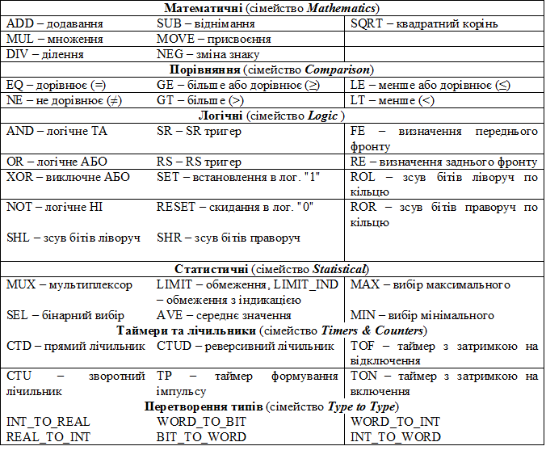

## 3.6. Стандартна бібліотека FFB

### 3.6.1. Огляд бібліотеки 

Стандартна бібліотека (Standard Lib або Base Lib) включає найбільш вживані FFB (рис.3.17). Для зручності пошуку в менеджері бібліотеки типів всі FFB об’єднані в сімейства. Ряд з них складають базу елементів FFB, без яких неможливо написати програму на мові FBD (математичні, порівняння, логічні, статистичні). Однак ці самі FFB можна використати і в інших мовах. Надалі в даному розділі розглядаються тільки найбільш популярні функції, процедури та функціональні блоки. Їх перелік зведений в таблицю 3.7.

Опис роботи інших FFB бібліотеки BaseLib можна знайти в довідниковій системі UNITY PRO. Зокрема функції сімейства Arrays призначені для роботи з масивами, Strings – з даними типу String, Date&Time – з датою та часом.       

Таблиця 3.7. Стандартна бібліотека (BaseLib, часткова вибірка)  

### 3.6.2. Математичні функції 

Математичні функції призначені для виконання таких базових операцій як додавання, віднімання, множення, ділення, присвоєння, а також тригонометричних, експоненційних та інших математичних функцій. Базові математичні операції в основному призначені для FBD, оскільки в інших мовах для цього використовуються відповідні оператори. 

Більшість функцій у бібліотеці представлені для різних типів даних таких як INT, DINT, UINT, UDINT та REAL. Так, наприклад, для додавання цілих чисел можна використати функцію ADD_INT, або універсальну функцію ADD. Тим не менше, використання універсальної (за типом даних) функції не дозволяє використовувати в якості її параметрів різні за типом дані. Надалі ми будемо розглядати тільки універсальні за типом даних функції.

Всі розглянуті у табл.3.7 математичні функції мають один вихід – результат виконання. Функції SUB (віднімання) та DIV(ділення) мають по два входи, функції ADD (додавання) та MUL (множення) можуть мати від 2-х до 32-х входів (вибирається після вставки), всі інші – один вхід. На рис.3.18 показаний приклад використання математичних функцій для реалізації залежностей:

​                            (3.1)               

Слід зазначити, що всі змінні, які використані в даному прикладі, мають однаковий тип. 

Функція NEG (зміна знаку) робить результат обробки функції ADD від’ємним, і записує значення на вихід, до якого прив’язана змінна Y. Таким чином реалізується друге присвоєння з виразу (3.1). У функції DIV (ділення), значення першого входу (результат ADD) ділиться на значення другого (значення змінної H), а результат записується в змінну X. Функція MOVE (присвоєння) записує значення входу (результат ADD) в змінну Z, яка прив’язана до виходу MOVE.  

  

     У процесі виконання математичних функцій, або математичних розрахунків в ST-виразах можливий вихід за діапазон вихідної змінної, тобто тип вихідної змінної може не вмістити результат операції. У цьому випадку системний біт %S18 стане рівним TRUE (див. главу 3.4.5). Для коректної роботи програми необхідно передбачити таку ситуацію і по можливості контролювати даний системний біт. Якщо необхідно врахувати результат операції, вхідні змінні функцій завідомо необхідно перетворити в інший тип (наприклад з INT в DINT), щоб вихідна змінна могла зберігати результат операції. Якщо, наприклад, на рис.3.18 змінні будуть типу INT, і їх значення буде A=5000, В=5000 та С≠0, то виклик функції MUL приведе до переповнення.  

Для операцій з плаваючою комою необхідно також контролювати стан вихідної змінної. Це можна зробити через системне слово %SW17. Для контролю за правильністю виконання арифметичних операцій у FFB також можна використовувати вихід ENO.

### 3.6.3. Функції порівняння 

Дані функції використовуються для порівняння двох або більше вхідних величин в мові FBD та LD (дозволяється їх використання і в інших мовах). Вихід OUT (булевого типу) є результатом порівняння. За допомогою функцій порівняння та входів EN зручно проводити управління виконання логікою програми. 

На рис.3.19 показаний приклад використання функцій порівняння для виконання логічного управління. 

При умові що A=B=C, змінній Y буде присвоєне значення 0. При умові, що D≥F, виконається присвоєння змінній Y значення суми D+F. 

Альтернативою функціям порівняння в FBD може бути ST-вираз, який повертає булевий результат. Так, наприклад, на рис.3.19 на вході IN2 блоку ".3" використовується результат порівняння A>B, а на вході IN3 – результат порівняння C=D.

### 3.5.4.  Логічні блоки 

Логічні функції AND, OR, XOR, NOT використовуються для логічних операцій переважно в мові FBD, так як у мові ST для цього використовуються однойменні оператори, а в LD – спеціальні графічні оператори (наприклад послідовне, паралельне з’єднання). Приклад використання даних функцій наведений на рис.3.20.

Функція AND (логічне ТА) дає на виході значення TRUE тільки в тому випадку, коли на усіх входах буде значення TRUE. Функція OR (логічне АБО) дає на виході значення TRUE в тому випадку, коди хоча б на одному вході буде значення TRUE. Функція XOR (логічне виключне АБО) дає на виході значення TRUE тільки в тому випадку, коли кількість входів зі значенням TRUE буде непарною. Функція NOT дає на виході інвертоване значення входу, у мові FBD її можна замінити знаком інверсії сигналу (див вихід блоку ".2" на рис.3.27). Функції AND, OR, XOR і NOT можуть бути використані і для побітових операцій з числовими змінними. 

Функції SET (встановити в TRUE) та RESET (скинути в FALSE) не мають входів (за винятком EN). При виклику функції SET, вихідний параметр виставляється у логічну одиницю (TRUE). Аналогічно, при виклику функції RESET вихідний параметр виставляється в логічний нуль. У програмі на рис.3.20 при виході OUT блоку ".6" рівним TRUE змінна Bool1 скидується в FALSE. У протилежному випадку, функція ".1" не виконується, оскільки на її вхід EN подається FALSE, тому стан змінної Bool1 залишається без змін. 

Функції FE та RE служать для виявлення відповідно заднього (зміна з TRUE в FALSE) та переднього (зміна з FALSE в TRUE) фронтів. У якості вхідного параметру використовується змінні типу EBOOL. У програмі на рис.3.20, при зміні значення змінної ebool2 з FALSE в TRUE, на один цикл Задачі, в якій виконується програма, на виході OUT функції ".2" сформується значення TRUE. У наступному циклі вихід OUT знову повернеться в FALSE до наступного переднього фронту зміни значення змінної ebool2.   

Функціональні блоки SR та RS є тригерами. Тобто, в момент появи на вході S значення TRUE, на виході встановлюється TRUE. При появі на вході R значення TRUE – на виході буде FALSE. Якщо на входах S та R будуть значення FALSE, то вихід не змінюється даним блоком. Блоки SR та RS тригерів відрізняються пріоритетністю входів S та R при одночасному поданні на них значень TRUE. У тригері RS пріоритетним є вхід R, а у SR, – вхід S. Нагадаємо, що функціональні блоки потребують створення екземплярів. У програмі на рис.3.20, при умові C>D на виході OUT функції ".2" сформується TRUE, що приведе до виставлення виходу "FBI_0.Q" та змінної Bool3 в значення TRUE. Після цього вихід "FBI_0.Q1" і змінна Bool3 залишиться в TRUE до тих пір, поки на вході R1 не появиться TRUE. 

Таким чином, в загальному випадку програма на рис.3.20 буде працювати наступним чином. Змінна Bool1 встановиться в TRUE в тому випадку, коли A≥B або C>D. В іншому випадку ніяких дій зі змінною Bool1 проводитись не буде. Змінна Bool3 виставиться в TRUE, коли C>D і встановиться у FALSE по передньому фронту змінної ebool2, навіть якщо C буде більше D, оскільки вхід R1 має вищий пріоритет. Однак, якщо у наступному циклі після виникнення TRUE в ebool2, C буде більше ніж D, умова фронту сигналу вже не буде працювати, тому Bool3 знову переведеться в TRUE. У разі виникнення переднього фронту у змінній ebool2 змінна B буде збільшуватися на значення 1.0. 

Функція SHL (зсув ліворуч) пересуває бітову комбінацію на вході IN на N позицій ліворуч, заповнюючи біти, які залишаються праворуч нулями. Наприклад наступна програма на мові ST дасть результат 2#0010_0000_1111_0000.  

a_word:=SHL (2#0001_0010_0000_1111, 4)

Функція SHR (зсув праворуч) працює аналогічно як функція SHL, тільки на зсув бітів праворуч, заповнюючи ліворуч позиції нулями. Наприклад наступна програма на мові ST дасть результат 2#0000_0001_0010_0000.  

a_word:=SHL (2#0001_0010_0000_1111, 4)

Функція ROL (зсув ліворуч по кільцю) пересуває бітову комбінацію на вході IN на N позицій ліворуч по кільцю. Тобто біти, які залишаються праворуч заповнюються крайніми зсунутими бітами. Наприклад наступна програма на мові ST дасть результат 2#0010_0000_1111_0001.  

a_word:=ROL (2#0001_0010_0000_1111, 4)

Функція ROR (зсув праворуч по кільцю) працює аналогічно як функція ROL, тільки на зсув бітів праворуч. Наприклад наступна програма на мові ST дасть результат 2#1111_0001_0010_0000.  

a_word:=ROR (2#0001_0010_0000_1111, 4)

​     

### 3.5.7.  Статистичні функції

Функції MIN та MAX призначені для запису на їх вихід відповідно мінімального та максимального значення серед всіх входів. Кількість входів може бути змінена до 32. Наприклад, у програмі на рис.3.21 використовується функція MAX – блок ".1", в якій вибрано 4 входи (IN1-IN4). 

Функція MUX є мультиплексором, вихід OUT якого перемикається на один із входів IN0-IN30, відповідно до номера, що подається на вхід K. Тобто якщо K=2 OUT:=IN2. 

Функція SEL(бінарний вибір) перемикає вихід на один із двох входів IN, в залежності від значення вхідного параметру G. Тобто OUT:=IN0 при G=FALSE, OUT:=IN1 при G=TRUE.  

 Функція AVE реалізує розрахунок середнє зваженого за формулою:

 

​                                                       (3.2)

де Ki – коефіцієнт i-го вхідного значення; Xi – і-те вхідне значення. 

Коефіцієнт і значення вхідного сигналу являються парою вхідних параметрів. Тобто три пари сигналів потребують шість входів (K_X1…K_X6). Непарні входи є коефіцієнтами, парні – значеннями сигналів. 

Функція LIMIT забезпечує обмеження вхідної величини IN по мінімуму (вхід MN) та по максимуму (вхід MX). Процедура LIMIT_IND працює аналогічно LIMIT однак має додаткові виходи Y_MAX та Y_MIN, який виставляється в TRUE при досягненні відповідно максимального та мінімального значень на вході. 

Приклад використання статистичних функцій в FBD наведені на рис.3.21. Для кращого розуміння приклад показаний як в режимі редагування так і в режимі виконання програми з анімацією, де для всіх вхідних та вихідних параметрів показані числові значення. На виході блоку ".4" формується зважене середнє 3-х сигналів (K_X2:=D, K_X4:=E, K_X8:=F) з коефіцієнтами (K_X1:=0.1, K_X3:=0.25, K_X5:=0.5). Блок ".1" вибирає максимальне значення серед 4-рьох входів (тобто OUT:=98.0), блок ".5" переключає вихід на перший вхід (тобто OUT:=IN1). Серед двох вхідних сигналів блоку ".2" вибирається 0-вий (OUT:=IN0), оскільки G=FALSE (для блока ".6" не справджується умова IN1<IN2). Блок ".7" обмежує по максимуму вхідну величину (MX=95), тому на виході OUT:=95, а на виходах MN_IND:=FALSE  та MX_IND:=TRUE.

 

​    

### 3.5.8.  Таймери та лічильники 

Таймери та лічильники в UNITY реалізовані у вигляді функціональних блоків, тому потребують попереднього створення екземплярів. 

Таймери TON, TOF та TP (рис.3.22) мають вхід IN – команда запуску таймеру, PT – часова уставка таймеру типу TIME, вихід таймера Q типу BOOL, та плинне значення таймеру ET типу TIME. 

Діаграми роботи даних таймерів показані на рис.3.23.

Таймер типу TON (з затримкою на включення) стартує по передньому фронту сигналу на вході таймера IN. Поточне значення таймера ET змінює своє значення від 0 ms до значення уставки PT, яка задається змінною або константою типу TIME. Вихід таймера Q змінюється на TRUE, коли поточне значення таймера ET стане дорівнювати уставці таймера PT і буде зберігати це значення до моменту, поки на вході таймера IN зберігається стан TRUE. Як тільки на вході IN з‘являється FALSE, таймер зупиняється, поточне значення ET скидається в значення 0 ms (навіть у тому випадку коли значення ET не досягло значення PT). Приклад використання таймеру типу TON  показаний на рис.3.25.

При роботі таймера типу TOF (з затримкою на відключення) плинне значення ET встановлюється в 0 ms по передньому фронту на вході IN (навіть у тому випадку коли таймер находиться у режимі відліку часу). При виникненні заднього фронту (TRUE->FALSE) на вході IN, таймер запускається. Поточне значення таймера ET змінює своє значення від 0 ms до значення уставки PT. Вихідне значення таймера Q переходить у TRUE по передньому фронту на вході IN і повертається у FALSE коли плинне значення ET досягне значення уставки PT.

Таймер типу ТР (імпульс) запускається по передньому фронту на вході IN. При цьому плинне значення ET змінюється з 0 ms до значення уставки PT. Вихідне значення таймера переходить в TRUE, коли таймер запускається, і повертається у FALSE, коли плинне значення досягне значення PT. Тобто таймер витримує імпульс заданої тривалості, навіть якщо на вході IN з’являється FALSE. Перезапуск таймера приводить до нового відліку часу імпульсу. 

Враховуючи, що таймери реалізовані як функціональні блоки, до виходів їх екземплярів можна звертатись як до змінних відповідного типу. Так, наприклад до виходу ET екземпляру таймеру з іменем FBI_0 (рис.3.22) можна звернутись через запис " FBI_0.ET".

 Лічильники доступні у вигляді 3-х функціональних блоків (рис.3.24): CTU, CTD, CTUD. 

Лічильник CTU (прямий) по передньому фронту сигналу на вході CU збільшує плинне значення CV на 1. На вході PV задається уставка. При досягненні плинного значення CV≥PV, виходу Q присвоюється TRUE. Команда подачі на вхід R=TRUE скидає плинне значення в нуль. 

Лічильник CTD (зворотній) по передньому фронту сигналу на вході CD зменшує на 1 плинне значення CV. На вході PV задається уставка. При досягненні плинного значення CV≤0, виходу Q присвоюється TRUE. При подачі на вхід LD=TRUE, в плинне значення записується значення уставки, тобто CV:=PV.

Лічильник CTUD (реверсивний), об’єднує в собі функції двох лічильників CTU та CTD. Входи CU та CD призначені відповідно для збільшення та зменшення плинного значення лічильника CV. При CV≥PV, вихід QU:=TRUE. При CV≤0, вихід QD:=TRUE. Якщо LD=TRUE, то CV:=PV. Якщо R=TRUE, то CV:=0.

Приклад використання лічильника CTUD та таймера TON в мові FBD показаний на рис.3.25. Вихід QU лічильника "CounterUD" виставиться в TRUE при досягненні CV заданої уставки (CV=20), це приведе до запису в змінну Y_bool значення TRUE і запуску таймеру Timer1. Через 2с 100 мс після запуску таймера плинне значення лічильника "CounterUD" скинеться в 0 (CounterUD.CV:=0). Слід звернути увагу на використання виходу EFB "Timer1.Q" в якості фактичного параметру на вході R блоку "CounterUD".

​      

### 3.5.9.  Функції перетворення типів

Функція INT_TO_REAL перетворює ціле значення в дійсне, а REAL_TO_INT – навпаки. Дані функції необхідні у випадках, коли над одними даними треба проводити як операції з цілочисельними змінними так і операції з плаваючою комою. На рис.3.26 показаний приклад, в якому змінну з аналогового входу 0.1.0 необхідно помножити на коефіцієнт A (дійсне число) після чого результат подати на аналоговий вихід 0.3.0. 

Враховуючи, що значення аналогових входів записується у цілочисельні змінні %IW, необхідно спочатку його перетворити в тип REAL (функція INT_TO_REAL), після чого помножити на А. Враховуючи, що значення аналогових виходів зберігається в цілочисельних змінних %QW, розрахований добуток попередньо перетворюється в цілочисельний формат (функція REAL_TO_INT).      

Функції INT_TO_WORD та WORD_TO_INT забезпечують перетворення відповідно цілочисельних даних INT в формат слова WORD та навпаки. Формат WORD використовується для побітових операцій над змінними. 

Процедура WORD_TO_BIT призначена для побітового представлення входу IN типу WORD. Виходи BIT0…BIT15 виставляються в TRUE або в FALSE відповідно до значення бітів у вхідному слові. Біти у слові рахуються від молодшого (0-й) до старшого (15-й). Функція BIT_TO_WORD – навпаки, по значенням входів BIT0…BIT15 формує вихідне значення OUT типу WORD. На рис.3.26 показаний приклад, де значення змінної %IW0.1.1 інтерпретується як набір бітів. Спочатку значення перетворюється в тип WORD (функція INT_TO_WORD), після чого значення 0-го біту записується в a_bool, 1-го – в b_bool, 7-го – в c_bool.   