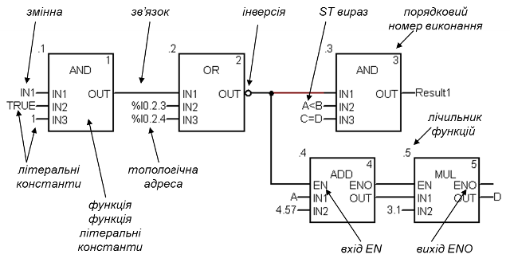
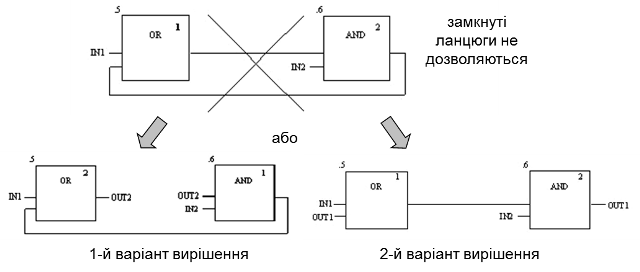
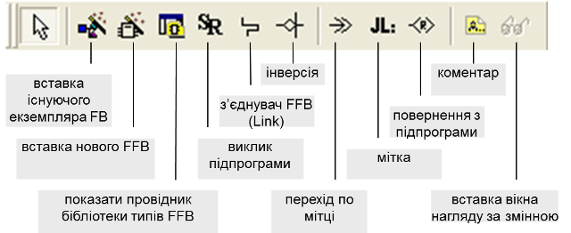

## 3.7. Програмування на мові FBD (Function Block Diagram)

### 3.7.1.  Основні правила програм на FBD

Мова ***FBD*** (Function Block Diagram) - графічна мова програмування високого рівня, яка дозволяє створювати програми, як набір функцій, процедур та функціональних блоків, входи та виходи яких зв’язані між собою інформаційними зв’язками. 

У загальному, FBD нагадує функціональну структуру, де кожна функція виконується з урахуванням роботи іншої функції. Загальний вигляд програми на мові FBD наведений на рис.3.27. Основними елементами програми є FFB (функції, процедури та функціональні блоки) та зв’язки, що поєднують ці елементи між собою. Графічно в редакторі FBD ці елементи зображені у вигляді прямокутників з входами і виходами. 

Рис.3.27. Приклад фрагменту програми на мові FBD

Входи FFB є вхідними формальними параметрами, а виходи – вихідними. У якості фактичних параметрів на входи можна подавати змінні, топологічну адресу, літеральні константи, результат записаного ST виразу або зв’язок з виходом іншого FFB.

Булеві та числові входи FFB можуть бути зв’язані з однотипними виходами інших FFB, організовуючи таким чином ***FBD*** ***ланцюги*** (Networks). У одній секції може бути декілька FBD ланцюгів. На рис.3.27 зображений тільки один ланцюг. Зв’язки забезпечують передачу розрахованих вихідних значень FFB, на прив’язані до них входи інших FFB. 

Один вихід FFB може бути зв’язаний з декількома входами FFB, формуючи таким чином розгалуження. Так, на рис.3.27 вихід *OUT* функції *OR (".2")*, з’єднаний одночасно з входом *IN1* функції *AND* та входом *EN* функції *ADD*. 

Один вхід безпосередньо можна зв’язати тільки з одним виходом іншого FFB. Типи входів та виходів повинні співпадати. Булеві входи та виходи можуть бути інвертовані, що позначається кружком.

У UNITY PRO не дозволяється використовувати зв’язки для параметрів FFB типу *STRING*. Також не дозволяється замкнення ланцюгів (зворотній зв’язок). Для вирішення задач з замкнутими ланцюгами використовуються проміжні змінні (рис.3.28).  

Рис.3.28. Приклад вирішення проблеми замкнутих ланцюгів

Кожний FFB в межах секції повинен мати унікальну назву. При встановленні в FBD секції функції або процедури, вони отримують унікальний в межах секції ідентифікатор – лічильник (див. рис.3.27). Елементарні та похідні функціональні блоки ідентифікуються іменем екземпляру.  

Кожний FFB має порядковий номер виконання, який встановлюється автоматично FBD редактором у залежності від: розміщення його в ланцюгу (найвищий пріоритет), взаємного розміщення ланцюгів в секції, взаємного розміщення прив’язаних входів та ін. Дозволяється явно змінювати послідовність виконання, якщо це не перечить послідовності у ланцюгу.

Для зміни послідовності виконання програми користувача програмним шляхом можна використовувати ***мітки*** (***Label***) та ***переходи по міткам*** (***Jump***). Мітку можна розмістити тільки з лівого краю. На перетині з міткою не повинно бути жодних з елементів чи зв’язків. 

Крім переходів по міткам можна викликати підпрограми, використовуючи спеціальний елемент "*SR*". Якщо підпрограма пишеться на FBD, то для дострокового її завершення використовується елемент повернення з підпрограми *<**R**>*.  

Вхід *EN* для FFB дає можливість управляти виконанням даного блока, а вихід ENO для контролю за виконанням. Так наприклад, у фрагменті програми, зображеному на рис.3.27, функції *ADD* (додавання) та *MUL* (множення) будуть виконуватися тільки в тому випадку, коли на виході функції *OR* буде логічний нуль (зверніть увагу на інверсію). Параметри *EN**/**ENO* є опціональними, і можуть бути показані/сховані у редакторі FBD.

### 3.7.2.  Редактор FBD

Вставка і з’єднання FFB в UNITY PRO проводиться через панель палітри інструментів (рис.3.29). Вставку функцій та процедур можна зробити шляхом виклику помічника вставки нового FFB (*FFB Input Assistant*), де можна вибрати елемент з бібліотеки або ввести його назву з клавіатури. Кількість входів для деяких функцій (наприклад *ADD*) змінюється шляхом їх "розтягування" мишею, "заціпивши" мишкою за нижній край функції в редакторі FBD.    

Вставка екземплярів функціональних блоків може проводитись через вибір існуючого по команді *Edit**->Data Selection*, або шляхом створення нового -  *Edit**->FFBInputAssistant*. Ці операції можна також проводити за допомогою провідника бібліотеки типів.    

З’єднання FFB проводиться з використанням команди *Link*, при цьому з’єднуються входи з виходами. При необхідності відгалуження, починати його необхідно з виходу FFB. Інверсію можна проводити як для входів так і для виходів FFB. З’єднання можна показувати через розірване посилання, для чого в контекстному меню з’єднання вибирається команда "*Show As Connector*". 

Рис.3.29. Палітра інструментів FBD

Коментар розміщується на задньому фоні елементів FFB. При необхідності багаторядкового вводу, в кінці рядка нажимають *CTRL+ENTER*.

Для активації/деактивації управляючих входів *EN* та контролюючого *ENO*, через контекстне меню FFB викликають вікно властивостей (*Properties*), в якому виставляють опцію "*Show EN/ENO*". 

Створення екземплярів функціональних блоків можливе двома шляхами: 

- через *Data Editor* (в провіднику проекту підрозділ *Elementary FB Instances*);

- "на льоту", при вставці його в секцію програми з бібліотеки типів.

Можливості редактору в онлайн режимі розглянуті в главі 4.2.