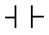

## 3.8. Програмування на мові LD (Ladder Diagram)

### 3.8.1. Основи LD

Мова LD (Ladder Diagram) представляє алгоритм вирішення задач логіко-командного управління у вигляді релейно-контактних схем (РКС). 

Потужні засоби редактору LD в UNITY PRO дають можливість використати її при реалізації не тільки релейно-контактних схем, а і будь-якого алгоритму управління. Зокрема доступність FFB з бібліотеки алгоритмів (таймерів, лічильників, блоків порівняння, обчислювальних блоків, ПІ/ПІД- регуляторів та інших) дозволяє вирішувати задачі великої складності. У середовищі UNITY PRO є можливість використання в LD фрагментів мови FBD, що робить цю мову ще гнучкішою, оскільки дозволяє поєднувати числові параметри FFB-зв’язками (FFB-link). Загальний вигляд програми на мові LD показаний на рис.3.30. 

Рис.3.30. Приклад фрагменту програми на мові LD

Основними елементами програми є контакти, котушки, зв’язки між ними (горизонтальні та вертикальні) та FFB. 

### 3.8.2.  Елементи дискретного управління

У таблиці 3.8 наведені базові елементи дискретного управління, які використовуються на сьогоднішній день в мові Ladder Diagram більшості ПЛК. 

Таблиця 3.8. Зображення графічних елементів для дискретного управління

| Назва елементу                                               | Зображення                        | Назва елементу                                               | Зображення                        |
| ------------------------------------------------------------ | --------------------------------- | ------------------------------------------------------------ | --------------------------------- |
| Нормально  відкритий контакт, якщо змінна в TRUE  контакт замикається |   | Нормально  закритий контакт, якщо змінна в TRUE  контакт розмикається |   |
| Контакт, що  замикається по передньому фронту на один цикл Задачі |   | Контакт, що  замикається по задньому фронту на один  цикл Задачі |  |
| Котушка на включення,  коли струм проходить - запис в змінну TRUE,  інакше FALSE |   | Котушка на відключення, коли струм  проходить - запис в змінну FALSE, інакше TRUE |   |
| Котушка на включення  з фіксацією, коли струм проходить - запис в змінну TRUE і запам‘ятовування стану |   | Котушка на відключення з фіксацією, коли струм проходить - запис в змінну  FALSE і запам‘ятовування стану |   |
| Котушка на включення  по передньому фронту на один цикл Задачі |   | Котушка на відключення  по задньому фронту на один цикл Задачі |   |
| Горизонтальна  лінія коротка                                 |  | Горизонтальна  лінія довга                                   |   |
|                                                              |                                   | Вертикальна  лінія                                           |   |
| Перейти на  сторінку, яка має мітку Label1                   |   | Виклик  підпрограми з назвою SR1                             |   |
| Вихід з  підпрограми                                         |   | Зупинити  виконання програми (HALT)                          |  |

Як видно з наведених зображень, при програмуванні на мові LD використовуються елементи, які зазвичай використовуються при складанні релейно-контактних схем. Але ці зображення слід розуміти ширше, як зображення логічних виразів. Наприклад, "нормально відкритий контакт" можна трактувати як вираз логічної умови –"якщо спрацював…" або "якщо виконалася умова…" або "якщо увімкнувся…" або "якщо спрацював датчик …." або "якщо змінна перейшла у стан логічної 1…". Так само, елемент "котушка на включення" можна розглядати як виконавчу частину логічного виразу – "тоді включити…" або "тоді виконати умову…" і т.ін.

У свою чергу, елемент “контакт, що закривається по передньому фронту” можна інтерпретувати як логічний вираз: “у момент включення ….” або “у момент зміни стану дискретної змінної з “0” на “1”. Тоді елемент “контакт, що замикається по задньому фронту” можна інтерпретувати як логічний вираз: “у момент відключення ….” або “у момент зміни стану дискретної змінної з “1” на “0”. 

Виконавчі елементи можна інтерпретувати наступним чином:

- “котушка на включення” - “тоді включити….”;

- “ котушка на відключення” - “тоді відключити….”;

- “котушка на включення з замиканням” – “тоді включити і запам‘ятати стан.”;

- “котушка на відключення з замиканням ” – “тоді відключити й запам‘ятати стан”

Але у зв‘язку з тим, що графічне представлення програми користувача на мові LD виглядає як релейно-контактна схема будемо вважати, що Контакти (Contact) та котушки (Coils) організовують ланцюги для протікання умовного струму (рис.3.30) між лівою шиною живлення (Left Power Rail) та правою шиною живлення (Right Power Rail). Тобто, коли контакт замкнений – через нього може протікати струм. Коли струм тече через котушку – вона спрацьовує. Надалі, саме в термінах протікання струму буде йти пояснення роботи LD. 

На контакти діють аргументи (змінні, константи або адреси). Ці аргументи будемо називати прив’язаними до контактів. На рис.3.31, в першому ланцюгу, до першого нормально-розімкненого контакту прив’язана змінна a_bool. Тобто, при умові a_bool=TRUE контакт замкнеться, а при a_bool=FALSE  – повернеться в нормальний стан, тобто розімкнеться. Нормально замкнений контакт, до якого прив’язана змінна %I0.1.0 розімкнеться, коли ця змінна перейде в TRUE і повернеться в замкнений стан, коли %I0.1.0=FALSE. 

Рис.3.31. Приклад використання контактів та котушок в LD

Слід зазначити, що в UNITY PRO в мові LD дозволяється в якості аргументу контакту використовувати логічний ST-вираз. Наприклад, на рис.3.31 у 3-му ланцюзі, до другого контакту прив’язана умова "a>1000". Тобто даний контакт замкнеться, коли ця умова виконається. Це розширення до стандарту IEC 61131, яка є альтернативою до блоку COMPARE.    

Котушки діють на ті змінні, до яких вони прив’язані (аргументи котушок). На рис.3.31 в комірку %Q0.2.1 буде записане значення TRUE в тому випадку, коли через котушку, до якого вона прив’язана протече струм. У комірку буде записаний FALSE тоді, коли струм через котушку проходити не буде.  

Послідовно підключені контакти пропустять через себе струм, тільки якщо вони обидва замкнені. На рис.3.31 в першому ланцюзі котушка включиться у тому випадку, коли обидва контакти будуть замкнені. Враховуючи, що контакти є нормально розімкнутими, вони замкнуться тоді, коли a_bool=TRUE та b_bool=TRUE. Включення котушки приведе до %Q0.2.1:=TRUE. У іншому випадку, якщо умовний струм не проходить (один з контактів розімкнутий), котушка розімкнеться, тобто %Q0.2.1:=FALSE.

При паралельно підключених контактах, достатньо замкнення одного з них, щоб через ланцюг пройшов струм. На рис.3.31 котушки, прив’язані до c_bool та %M30 замкнуться тоді, коли %M0=TRUE або %I0.1.0=FALSE. 

Котушки з фіксацією –(S)- та -(R)- спрацьовують тільки в одному напрямку, тобто без повернення в обезструмлений стан. Це значить, що при проходженні струму, котушка –(S)- буде записувати в прив’язану змінну TRUE, а котушка -(R)- - FALSE. Якщо струм не проходить через котушки з фіксацією, то змінні залишаються в тому положенні, що і були. На рис.3.31 d_bool:=TRUE, коли %M0=TRUE та a>1000. У іншому випадку зі змінною d_bool в даному ланцюгу не буде проводитись ніяких дій. Змінна повернеться в логічний 0 (d_bool:=FALSE) тільки тоді, коли %M1:=TRUE. Слід звернути увагу, що всі дії проводяться послідовно зверху-вниз, тому якщо струм потече через обидві котушки (S та R), d_bool буде в FALSE, тому що ланцюг з котушкою R є останнім.  

Контакти для «відлову» фронтів -|P|- та -|N|- призначені для пропуску струму тільки на один цикл Задачі відповідно по передньому фронту (момент зміни FALSE->TRUE) та задньому фронту сигналу (момент зміни TRUE->FALSE). Котушки –(P)- та -(N)- при проходженні через них струму змінюють значення прив’язаних змінних в TRUE тільки на один цикл Задачі.   

У UNITY дозволяється послідовно підключати котушки, що має той же ефект, що паралельне їх підключення, тобто одночасне їх спрацювання. Крім того, праворуч від котушок можуть розташовуватись контакти і компаратори. У цьому випадку стан цих контактів не впливає на лівосторонні котушки, однак стан лівосторонніх контактів впливають на всі котушки, які розміщені праворуч. У будь якому випадку, ланцюг повинен закінчуватися котушкою, оператором чи FFB.

Мова LD дозволяє організовувати умовні та безумовні переходи. Для цього використовується мітка (Label), яка являє собою символьне ім’я, та спеціальний елемент - перехід по мітці. Перехід по мітці відбувається тоді, коли на цей елемент подається струм. Мітка обов’язково повинна стояти в першій колонці, і в рядку з нею не повинно бути жодного елементу. На рис.3.30 по передньому фронту QX100 відбувається перехід по мітці з іменем "NEXT". 

Із Секції LD дозволяється виклик підпрограм. Для виклику підпрограм використовується спеціальна котушка –(С)- з прив’язаною назвою підпрограми. Коли через цю котушку проходить струм, підпрограма викликається. Після обробки підпрограми йде повернення в наступний ланцюг даної секції. Якщо підпрограма пишеться на LD, для дострокового її завершення використовується спеціальна котушка. 

### 3.8.3.  Робота з числовими змінними та FFB

Котушки та контакти використовуються тільки разом з булевими аргументами. Для роботи з числовими змінними використовуються компаратор  та оператор.

Компаратор (Compare Block) призначений для перевірки умови. В умові записується ST-вираз з використанням знаків порівняння (<, >, <=, >=, =, <>). Якщо ST-вираз повертає TRUE, компаратор замикає ланцюг (пропускає струм), інакше – ланцюг залишається розімкнений.

Оператор (Operate Block) призначений для виконання однієї інструкції, записаного в синтаксисі ST. Таким же чином можна також визивати функції та процедури, однак для цього краще використовувати явний виклик FFB.

У програмі на рис.3.32 за умови, що A_bool=TRUE і a<9000 - з кожним циклом змінна "a" буде збільшуватися на одиницю.  

Рис.3.32. Приклад використання компараторів та операторів в LD

У програмах LD можна використовувати ті самі елементи FFB, як і у мові FBD (рис.3.33). Нагадаємо, що бібліотека функцій та функціональних блоків UNITY є універсальною, тобто елементи FFB можна використовувати у будь яких мовах програмування.

Рис.3.33. Приклад використання елементів FFB

Елементи FFB повинні обов’язково мати зв’язок з лівою шиною живлення. Зв’язок може бути безпосереднім, через один з булевих входів, або через зв’язок з іншими FFB, контактами чи котушками. На рис.3.33 функція GT (більше), зв’язана з лівою шиною живлення через контакт. Екземпляр TON з іменем FBI_0 зв’язаний з лівою шиною живлення через функцію GT. У даній програмі, таймер запуститься в тому випадку, якщо a_bool=TRUE і %MW100>100, оскільки ці два елементи зв’язані послідовно. Вихід OUT підключений до входу IN блоку FBI_0, тому при виконанні умови таймер запуститься. 

Крім булевих зв’язків по правилам LD, можна також використовувати FFB-зв’язки по правилам FBD. Тому в редакторі LD, крім стандартних елементів LD на панелі присутні також елементи мови FBD. На рис.3.30 показаний приклад організації FFB-зв’язків.         

### 3.8.4.  Редактор LD

Для програмування на мові LD використовується спеціальний графічний редактор, у якому за допомогою графічних елементів розробляється програма користувача Робоча зона секції на LD, ділиться на клітинки: від 11 до 64 колонок та від 17 до 200 рядків. Кількість колонок визначається у властивостях проекту перед створенням секції, а кількість рядків можна змінити в будь який момент. Всі графічні елементи LD розміщуються в окремих клітинках. 

Програмування заключається у виборі графічних елементів, які відповідають тим чи іншим логічним елементам або функціональним блокам, розташуванні їх у робочих зонах сторінок і створення зв‘язків між ними у вигляді традиційних електричних ланцюгів. Вибір і нанесення графічних елементів у полі графічного редактора відбувається за допомогою активних кнопок, на яких нанесене графічне зображення вибраного елементу (рис.3.34).

Коментар розміщується на задньому фоні елементів, подібно до FBD. По замовченню в елементах FFB параметри EN та ENO активовані, однак через контекстне меню їх можна деактивувати. 

 Рис.3.34. Палітра елементів LD

Крім палітри елементів LD в редакторі доступна палітра FBD, для організації FFB зв’язків. 

Можливості редактору в онлайн режимі розглянуті в главі 4.2.

 