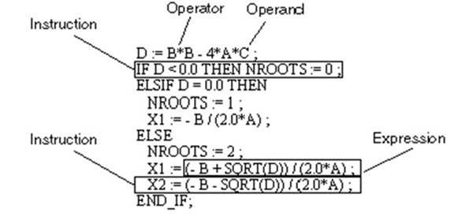

## 3.9. Програмування на мові ST (Structured Text)

### 3.9.1. Основи ST

Мова *ST* (*Structured Text*, структурований текст) – це текстова мова, яка подібна до PASCAL, C, BASIC і т.п. Програма на мові ST складається з інструкцій та викликів FFB (функцій, процедур, функціональних блоків) (рис.3.35). 



Рис.3.35. Приклад фрагменту програми на мові ST. 

Хоч мова ST не така наглядна як графічні мови FBD, LD та SFC, вона дуже гнучка і найбільше підходить для реалізації складної логіки, громіздких обчислень та операцій з циклами та масивами. Крім того, цій мові віддають перевагу програмісти, які добре володіють комп’ютерними текстовими процедурними мовами програмування. 

ST працює з *виразами* (*Expressions, ST-вирази*), які складаються з операторів та операндів, які повертають значення після виконання. *Оператори* (*Operator*) являються символами, які відображають операції, що повинні виконуватися. Оператори проводяться над *операндами* (*Operand*) – змінними, літеральними виразами, входами/виходами FFB і т.д.

Вирази повертають значення, *Інтсрукції* (*Instruction*) використовуються для присвоювання цих значень фактичним параметрам.

У ST можна використовувати коментарі. Коментар може бути вставлений у любе місце програми, кількість їх не обмежена. Коментар може включати до 256 символів і записуватись у декілька рядків. Коментар розташовується між знаками *( та )*. Довжина рядку інструкції обмежена 300 символами. Довжина секції ST обмежується тільки об’ємом пам’яті. 

Операндами можуть бути адреси, літерали, звичайні змінні, створені змінні, елементи створених змінних, виклик функції, вихід FFB. Слід зазначити, що на відміну від реалізацій ST в інших середовищах, в UNITY PRO немає можливості оголошувати змінні безпосередньо у коді програми. Всі змінні UNITY являються глобальними (за винятком *Private* в DFB) і створюються у розділі проекту "*Variables* *&* *FB* *instances*". 

Доступ до полів структурних змінних проводиться через крапку. Доступ до елементів масиву проводиться через індекс, який може бути константою, змінною або виразом що повертають значення типу *INT*, *UINT*, *DINT* або *UDINT*. Нижче наведені приклади з різними типами операторів. 

```pascal
%MW200 := 5;(*занести в комірку %MW200 значення 5 *)
(*2-му елементу масиву UnlocV1 присвоїти значення елементу масиву LocV1 з номером, який дорівнює значенню комірки %MW200*)
UnlocV1[2] := LocV1[%MW200];
(*присвоїти змінній LocV2 значення t#3s (3 секунди) *)
LocV2 := t#3s;
(*i-му елементу масиву var1, присвоїти значення 8, де i – змінна типу INT*)
var1[i] := 8 ; 
(*4-му елементу масиву, який є полем otto структурної змінної vat2 присвоїти значення змінної var3*)
var2.otto[4] := var3 ;
(*елементу масиву var4, з номером рівним 1+i+j*5 
  присвоїти значення 4 *)
var4[1+i+j*5] := 4 ;
```

Оператори є символами для арифметичних та логічних операцій, а також для редагування при викликах функцій. Оператори є узагальненими, тобто вони автоматично адаптуються під типи даних операндів. Це значить, що оператор "+" використовується однаково для всіх числових типів операндів.

Оператори виконуються в тій послідовності, що задається пріоритетом, тобто першими будуть оброблятися оператори з найвищим пріоритетом. У табл.3.9 наведений повний перелік операторів ST. У дужках вказаний пріоритет, де (1) – найвищий а (11) - найнижчий. 

*Таблиця 3.9* Оператори мови ST.

| Оператор | Значення та  пріоритет        | Опис та приклади                                             |
| -------- | ----------------------------- | ------------------------------------------------------------ |
|          |                               | загальні                                                     |
| ( )      | Використання дужок   (1)      | Використовуються для зміни послідовності виконання  операторів. Дозволені операнди: тільки вирази (Expression).      <br />Приклад: Якщо операнди *A, B, C* та *D* мають значення 1,2,3 та 4, то   *A+B-C*D* дає результат -9, а *(A+B-C)*D* дає результат 0. |
| FN ( )   | Обробка функцій (виклик) (2)  | Використовується для виклику FFB, де замість *FN* вказується назва функцій або екземпляру  функціонального блоку  Тип  операндів: будь-які |
|          |                               | арифметичні   типи операндів: INT, DINT, UINT,UDINT, REAL    |
| -        | заперечення (зміна знаку) (3) | Під час заперечення проходить інвертування знаку для  значення операнду.  <br />Приклад: Якщо *IN1=4*, тоді інструкція   нижче поверне *OUT=-4*  OUT:=-IN1 |
| `**`     | Зведення в степінь    (4)     | значення першого операнду (основа) зводиться в  степінь, яка рівна другому операнду (показник степеню)  Тип операндів:   REAL для основи та  INT,DINT,UINT,UDINT;   REAL для показника степеню     Приклад: в інструкції нижче<br /> `OUT = 625.0, якщо IN1 = 5.0 та IN2 = 4.0.  OUT := IN1  IN2; ` |
| `*`      | Множення  (5)                 | Приклад: в інструкції нижче *OUT* *= 20.0*, якщо *IN1 = 5.0* та *IN2 = 4.0*.  OUT := IN1 * IN2 ; |
| /        | Ділення  (5)                  | Приклад: У інструкції нижче OUT = 4.0, якщо IN1 = 20.0 та IN2 = 5.0.  OUT := IN1 / IN2 ; |
| MOD      | залишок від ділення  (5)      | значення першого операнду ділиться на значення  другого операнду і залишок від ділення відображається як результат      <br />Приклад: в наступній інструкції   <br />OUT := IN1  MOD IN2 ;  <br />*OUT = 1,* при *IN1 = 7*  та *IN2 = 2*  *OUT = 1,* при *IN1 = 7*  та *IN2 = -2*  *OUT = -1,* при *IN1 =  -7* та *IN2 = 2*  *OUT = -1,* при *IN1 =  -7* та *IN2 = -2* |
| +        | Додавання  (6)                | Приклад: в інструкції нижче *OUT = 9*, при *IN1 = 7* та *IN2 = 2*  OUT := IN1 + IN2 ; |
| -        | Віднімання  (6)               | Приклад: в інструкції нижче *OUT = 6*, при *IN1 = 10* та *IN2 = 4*.  OUT := IN1 - IN2 ; |
|          |                               | Порівняння  типи операндів: BOOL, EBOOL,BYTE,INT,DINT,UINT,UDINT,REAL,TIME,WORD, [DWORD, STRING,DT,DATE,TOD |
| <        | менше  (7)                    | Приклад: в інструкції нижче *OUT*=*TRUE*, якщо *IN1 < 0*, інакше *OUT= *FALSE OUT := IN1 < 10 ; |
| >        | більше  (7)                   | Приклад: в інструкції нижче *OUT*=*TRUE*, якщо *IN1 > 10*, інакше *OUT= *FALSE OUT := IN1 > 10 ; |
| <=       | менше або дорівнює  (7)       | Приклад: в інструкції нижче *OUT*=*TRUE*, якщо IN1 менше або рівне   10, інакше *OUT*=FALSE OUT := IN1 <= 10 ; |
| >=       | більше або дорівнює  (7)      | Приклад: в інструкції нижче *OUT* *=* *TRUE*, якщо *IN1* більше або рівне 10, інакше *OUT* *=* *FALSE*  OUT := IN1 >= 10 ; |
| =        | дорівнює (8)                  | Приклад: в інструкції нижче *OUT* *=* *TRUE*, якщо *IN1* рівне 10, а інакше *OUT* = *FALSE*  OUT := IN1 = 10 ; |
| <>       | не дорівнює  (8)              | Приклад: в інструкції нижче *OUT* *=* *TRUE*, якщо *IN1* не рівне 10, інакше *OUT* = *FALSE*  OUT := IN1 <> 10 ; |
|          |                               | Логічні  типи операндів: *BOOL,* *EBOOL, BYTE, WORD  або DWORD* |
| &        | логічне ТА  (9)               | Приклад: в інструкції  нижче *OUT = TRUE*, при *IN1, IN2* та *IN3 = TRUE*.  OUT := IN1  & IN2 & IN3 ;  альтернативний запис  OUT := IN1  AND IN2 AND IN3 ;     У випадку типів даних *BYTE, WORD* та *DWORD*, проводиться  побітова операція логічного множення |
| AND      |                               |                                                              |
| XOR      | логічне виключне АБО  (10)    | Приклад: в інструкції нижче *OUT* *=* *TRUE*, якщо *IN1* та *IN2* не рівні. Якщо *A* та *B* мають однаковий стан (обидва *TRUE* або *FALSE*), тоді *D* *=* *FALSE.*  OUT := IN1 XOR IN2 ;     <br />Якщо зв’язується більше двох операндів, результат  для непарної кількості *TRUE* буде *TRUE*, для парних – *FALSE*   <br />Приклад: в інструкції нижче   *OUT* *=* *TRUE*, якщо 1 або  3 операнда = *TRUE*.  OUT = *FALSE*,  якщо 0, 2 або 4 операнда = *TRUE*.  OUT := IN1  XOR IN2 XOR IN3 XOR IN4 ;     У випадку BYTE,  WORD та DWORD типів даних, проводиться  побітова операція логічного виключного АБО |
| NOT      | інвертування  (3)             | У випадку BYTE,  WORD та DWORD типів даних, проводиться  побітова операція інвертування     <br />Приклад: в інструкції нижче *OUT* *=2# 1111_0000_1100_1100*, якщо *IN1 = 0000_1111_0011_0011.*  OUT := NOT  IN1 ; |
| OR       | логічне АБО  (11)             | Приклад: в інструкції  нижче *OUT = TRUE*, якщо *IN1, IN2* або *IN3 = TRUE.*  OUT := IN1  OR IN2 OR IN3 ;   У випадку типів даних *BYTE,* *WORD* та *DWORD*, проводиться  побітова операція логічного додавання |

Інструкції – це команди мови ST. Всі інструкції розділяються крапкою з комою (";"). 

Одна з найбільш вживаних інструкцій є *присвоювання* (":="). Присвоювання складається з лівосторонньої змінної та правостороннього виразу, які обов’язково повинні мати однакові типи. 

```pascal
(*значення змінної B записується в змінну A, типи повинні співпадати, для похідних типів записуються значення всіх елементів змінної B у відповідні елементи змінної A *)
A := B ;
C := 25 ;(*записати в С значення 25*)
X := (A+B-C)*D ; (*записати в X результат виразу*)

(*викликати функцію MOD, результат записати в змінну B*)
B := MOD(C,A) ; 

(*Змінній A присвоюється значення виходу Q екземпляру функціонального блоку MY_TON, при цьому виклик екземпляру не проводиться *)
A := MY_TON.Q ;

X := Y := Z;(*декілька присвоювань*)
```


### 3.9.2. Організація розгалуження  

*Інструкції вибору* визначають які дії будуть виконані, якщо справдяться або не справдяться певні умови. Під дією розуміється одна або декілька інструкцій, які в свою чергу можуть мати вкладені інструкції (вибору, повторення та інші), якщо протилежне явно не вказане в синтаксисі. Опис інструкцій вибору приведений в таблиці 3.10. 

*Таблиця 3.10*. Інструкції вибору в ST

| Синтаксис в  ST та приклад                                   | Блок схема та  опис                                          |
| ------------------------------------------------------------ | ------------------------------------------------------------ |
| IF *Умова* THEN        *Дiя;*    END_IF;          IF A>B THEN (*якщо A>B тоді*)    C:=SIN(A) *  COS(B) ;    B:=C - A ;  END_IF ; | <br /> Дiя виконуються лише у випадку виконання Умови |
| IF *Умова* THEN       *Дiя2;*    ELSE       *Дiя1;*    END_IF;             IF A>B THEN (*якщо A>B тоді*)    C:=SIN(A) * COS(B) ;    B:=C - A ;  ELSE (*інакше*)    C:=A + B ;    B:=C * A ;  END_IF ; |  <br />Якщо виконується Умова,  то виконується Дiя2, iнакше  виконується Дiя1 |
| IF *Умова1* THEN    *Дiя1;*  ELSIF *Умова2* THEN    *Дiя2;*  ELSE     *Дiя3;*  END_IF; <br />IF A>B THEN (*якщо A>B тоді*)     (*вкладені інструкції*)     IF  B=C THEN       C:=SIN(A) * COS(B) ;     ELSE       B:=SUB(C,A) ;     END_IF  ;  (*інакше якщо  A=B *)  ELSIF A=B THEN     C:=ADD(A,B) ;     B:=MUL(C,A) ;  (*інакше*)  ELSE      C:=DIV(A,B) ;  END_IF ; | <br />Є ланцюг Умов  і Дій, які повинні виконуватись. Перегляд Умов виконується послідовно. Якщо  виконується перша Умова i, то  виконується Дiя i, подальший перегляд Умов закінчується, і програма переходить до виконання інструкцій,  які записані після слова END_IF.  Інакше перевiряється наступна умова Умова  (i+1) і т.д. Якщо не виконалась жодна умова, то виконуються команди, які  записані після інструкції ELSE (не  обов‘язкова). На кiлькiсть ELSIF обмежень не має, а команда ELSE може бути лише одна. |
| CASE *вираз-селектор* OF      *Значення1: Дiя1;*      *Значення2: Дiя2;*      *Значення3: Дiя3;*  ELSE    *Дія4;*  END_CASE ;            CASE a_selector OF    (* при 1 або 5*)      1,5: C:=sin(A)*cos(B);      2: B:=C-A; (* при 2 *)     (* від 6<=a_selector<=10  *)      6..10: C:=C*A;   ELSE (* в інших  випадках *)      B:=C*A;     C:=A*B;  END_CASE; |  <br />У умові  задається вираз-селектор, який обов’язково  повинен повертати результат типу INT. У залежності від значення (мітка)  виразу, виконується відповідна Дiя.  Якщо значення не знайдено, виконується дія записана після ELSE (не обов‘язкова). Мітка може  складатися з декількох значень, перерахованих через кому, або діапазону  значень. |

### 3.9.3.  Організація циклів 

*Інструкції повторення* забезпечують ітераційність виконання дії, в залежності від вибраних умов. Під дією розуміється одна або декілька інструкцій, які в свою чергу можуть мати вкладені інструкції (вибору, повторення та інші), якщо протилежне явно не вказане в синтаксисі. Опис інструкцій вибору приведений в таблиці 3.11.

 *Таблиця 3.11*Інструкції повторення в ST.

| Синтаксис в  ST та приклад                                   | Блок схема та  опис                                          |
| ------------------------------------------------------------ | ------------------------------------------------------------ |
| WHILE *Умова* DO     *Дiя*;    END_WHILE;             x := 1;  WHILE x <=  100 DO      x := x + 4;  END_WHILE ;  (* в кінці циклу  x=101 *) |   <br />Дiя виконується поки виконується Умова.  Як тільки Умова перестає  виконуватись виконання Дії та  циклу завершується. Якщо перший раз умова не виконується, то дія теж не виконується.    Виконання циклу може бути перервана інструкцією EXIT. |
| REPEAT          *Дія*;    UNTIL *Умова*     END_REPEAT;             x := -1;  REPEAT    x := x + 2;    UNTIL  x >= 101  END_REPEAT ;  (* в кінці циклу x=101 *) |   <br />Дiя виконується до моменту виконання Умови.  Як тільки Умова виконається - цикл  завершується. Дiя в серединi циклу виконуються принаймні один раз.   Виконання циклу може бути перервана інструкцією EXIT. |
| Синтаксис з  кроком рівним s  <br />FOR *i:=* *k* TO *n* BY *s*  DO        *Дiї;*    END_FOR;     Синтаксис з  кроком рівним 1  FOR *i:=* *k* TO *n* DO        *Дiї;*    END_FOR;       <br />де:  i – управляюча змінна (лічильник циклу) типу INT або DINT;  k – початкове знач. типу INT або DINT;   n – кінцеве знач. типу INT або DINT  s – інкремент (крок) типу INT або DINT       (* крок<0 : Зворотній цикл *)  FOR i:= 10 TO 1 BY -1 DO    C:= C * COS(B) ;   END_FOR ;  (* цикл  виконається 10 разів*) |  <br />Дiя виконується до тих пiр, поки лічильник   циклу i не пройде значення вiд k до n з кроком s. Коли лічильник стає більшим (при прямому циклі,  при зворотному - навпаки меншим), ніж  його кінцеве значення виконуються команди, які слідують за ключовим словом END_FOR.  Індекс  інкрементується автоматично на  величину кроку s. Якщо крок не вказується, то він  береться рівним 1.  Виконання  циклу може бути перервана інструкцією EXIT. |

 

### 3.9.4.  Виклик підпрограм та FFB 

Синтаксис інструкцій вибору та повторення дозволяє організувати роботу алгоритму будь-якої складності. Однак для сумісності з програмами PL7 та Concept, а також для створення програм з використанням умовних та безумовних переходів, в UNITY PRO є можливість використовувати підпрограми та мітки з переходами. Для виклику підпрограм в ST вказується її назва і пусті дужки.  

```pascal
SubroutineName () ;
```

Нагадаємо, що підпрограми можуть бути написані на одній з 4-х мов (LD, ST, IL, FBD). Якщо секція підпрограми написана на мові ST, то для дострокового її завершення використовують інструкцію *RETURN*. ця ж сама інструкція використовується для дострокового завершення коду у функціональному блоці DFB.

Для організації переходів в межах секції використовуються *мітки* (*Label*). Мітка це символьне, унікальне в межах секції, позначення позиції переходу, яка:

-  складається максимум з 32-х символів;

-  іменування міток повинно задовольняти загальним правилам іменування

-  відділяється від інших інструкцій символом двокрапка (":") після назви мітки;

-  може стояти тільки на початку рядка;

По замовченню в UNITY PRO для мови ST мітки заборонені, тому їх треба активувати у властивостях проекту. Перехід по мітці відбувається інструкцією *JMP*. 

```pascal
IF var1 THEN
	JMP START1;
…
…
START1: ...
```

У мові ST доступні всі бібліотечні функції, процедури та функціональні блоки. Для функцій, в якості вхідних фактичних параметрів використовуються змінні, адреси, константи або ST-вирази. Результат функції (вихід) може бути записаний або в змінну, або в комірку пам‘яті з вказаною адресою. Тип даних фактичних параметрів повинен відповідати типу даних формальних параметрів. 

Фактичні параметри елементарних типів даних, а також *STRING* можна не задавати. У цьому випадку вони приймуть значення по замовченню (якщо такі визначені) або 0. Виключенням є параметри *VAR_IN_OUT*, які необхідно обов’язково вказувати. 

Існують два способи виклику функцій: формальний і неформальний виклик (рис.3.36). 


Рис.3.36. Формальний та неформальний виклик функцій в ST. 

При *формальному виклику* вказуються формальні параметри і відповідні їм фактичні параметри. Формальний виклик має такі особливості:

-     кожному вхідному параметру через оператор ":=" присвоюється значення фактичного параметру; 

-     порядок перерахунку параметрів немає значення;

-     це єдиний спосіб використати неявні параметри *EN* та *ENO*, наприклад:

(*в цьому виклику алгоритм LIMIT буде оброблений тільки при a=TRUE, у змінну var2 буде записаний результат успішності обробки функції *)

```pascal
out:=LIMIT (EN:=a, MN:=0, IN:=var1, MX:=5, ENO=>var2) ;
```

-     при виклику можна вказувати тільки потрібні параметри, наприклад:  

```pascal
(*в цьому виклику відсутній параметр MX *)
out:=LIMIT (MN:=0, IN:=var1) ; 
```

 При *неформальному виклику* фактичні параметри в функції вказуються в порядку їх слідування. Неформальний виклик має такі особливості:

-     порядок перерахунку фактичних параметрів повинен співпадати з порядком формальних;

-     неявні параметри *EN* та *ENO* використовувати не можна;

-     якщо немає необхідності у вказівці якогось параметру - ставиться пропуск, за винятком останнього параметру, наприклад:

```pascal
(*в цьому виклику відсутній параметр MN *)
out:=LIMIT ( ,var1, 5 + var1) ;
(*в цьому виклику відсутній параметр MX *)
out:=LIMIT (0 ,var1) ;
```

Виклик функції дозволяє включати виклик наступних (вкладених) функцій. Глибина вкладеності необмежена. Виключенням є виклик вкладених функцій, що повертають в якості результату масив (*ANY_ARRAY*). Приклад вкладеного виклику:

```pascal
(*в цьому виклику результат виклику функції MUL записується у вхід IN функції LIMIT *)
out:=LIMIT (MN:=4, IN:=MUL(IN1:=var1, IN2:=var2), MX:=5) ;
```

Оскільки процедури можуть мати декілька вихідних параметрів, синтаксис їх виклику дещо відрізняється. Так, наприклад виклик процедури *SERVO_INT* формальним і неформальним способом буде мати вигляд як на рис.3.37. 

Порівняно з функціями, виклик процедур має такі особливості:

-     вихідні параметри при виклику процедури перераховуються в дужках разом з вхідними;

-     в формальному виклику прив’язка фактичних параметрів вихідним формальним параметрам проводиться через оператор "=>";

-     прив’язка змінних до параметрів типу *VAR_IN_OUT* є обов’язковою.


 Рис.3.37. Формальний та неформальний виклик процедур в ST

Нагадаємо, що функціональні блоки (EFB/DFB) мають пам’ять, тому перед їх використанням в UNITY PRO створюються екземпляри функціональних блоків. Основні правила виклику функціональних блоків такі самі, як і виклик процедур, однак є деякі особливості:

-     при виклику вказується не назва функціонального блоку, а потрібного екземпляру;

-     навіть якщо всі параметри функціонального блока вказані при його створенні, необхідно його визивати, щоб проходила обробка внутрішнього алгоритму;

-     до виходів і глобальних змінних екземпляру функціонального блоку можна звертатись як до полів структурних змінних (через крапку); 

Використання функціональних блоків в ST продемонструємо в порівнянні з програмою FBD (рис.3.38), взятою з параграфу 3.6.6. У прикладі використані два екземпляри функціональних блоків: типу *CTUD* (екземпляр *CounterUD*) та *TON*(екземпляр *Timer1*). *CounterUD* викликається формально, а *Timer1* неформально. 

У обох випадках, при виклику опущені параметри: для *CounterUD* – *QD* та *CV*, для *Timer1* – *Q* та *ET*. Як бачимо, на рис.3.38 в FBD ці параметри теж не підключені. На вхід *R* екземпляру *CounterUD* подається значення виходу Q екземпляру *Timer1*. Аналогічно на вхід *IN* (він іде перший в списку формальних параметрів) екземпляру *Timer1* подається значення виходу *QU* екземпляру CounterUD.   


Рис.3.38. Використання функціональних блоків в ST порівняно з FBD 

Ще раз слід звернути увагу на те, що функціональний блок обробляється тільки при його виклику. Для прикладу розглянемо ситуацію, коли після натискання кнопки "Пуск", яка підключена на вхід *%I0.4.1*, необхідно запустити таймер на 10 с, після чого повинне спрацювати реле запуску двигуна, яке підключене до виходу *%Q0.5.0*. Для цього можна створити екземпляр *timer1* типу *TON*, в параметрах ініціалізації якого для *IN=TRUE*, *PT=t#10s*. Таким чином викликавши таймер, той відразу запуститься. Розглянемо наступний код ST:  

```pascal
IF %I0.4.1 THEN timer1(); END_IF;
%Q0.5.0:=timer1.Q;
```

Як тільки спрацює *%I0.4.1* – таймер запуститься. Якщо вхід *%I0.4.1* буде включеним протягом більше ніж 10 с, вихід *Q* таймера спрацює, а отже спрацює і *%Q0.5.0*. Якщо ж *%I0.4.1*, після спрацювання через 5 с, скинеться в *FALSE*, то почекавши ще 5 с, можна побачити, що *%Q0.5.0* не спрацює. Хоч команда на скидання не приходила (*IN* залишається рівним *TRUE*), однак функціональний блок *timer1* не обробляється. 

Якщо через, скажімо, 10 с після цього *%I0.4.1* знову переведеться в *TRUE*, то вихід *%Q0.5.0* відразу перейде в *TRUE*. Це пов’язано з тим, що розрахунок виходів *ET* і *Q* проводиться під час обробки, на основі внутрішнього стану та входу *IN*. Оскільки на вході *IN* завжди *TRUE*, то при наступному виклику проводиться перерахунок з попереднього виклику, тобто 15 секунд назад. Таким чином *ET* буде рівним 5 (перший інтервал старту) + 5 (пауза очікування) + 10 (пауза до повторного старту)=20 с. Слід зазначити, що повторний перезапуск в такому синтаксисі буде також неможливим. 

Правильні варіанти рішення цієї задачі можуть бути наступними:

```pascal
timer1(%I0.4.1);
%Q0.5.0:=timer1.Q;
```

або

```pascal
timer1(%I0.4.1, t#10s, %Q0.5.0);
```

### 3.9.5.  Редактор ST 

Редактор ST – це текстовий редактор з підсвічуванням синтаксису. Редактор дозволяє вставляти екземпляри, допомагає вставляти готові програмні структури. На рис.3.39 показана панель з палітрою елементів редактору ST.  


Рис.3.39. Палітра елементів редактора ST 

Можливості редактору в онлайн режимі розглянуті в главі 4.2.