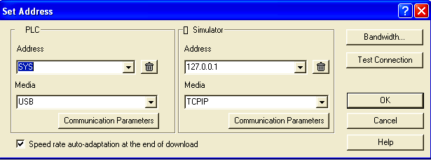
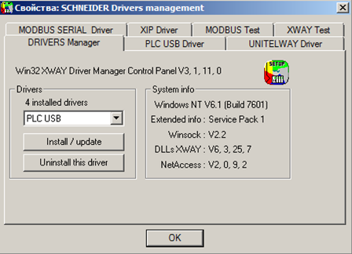
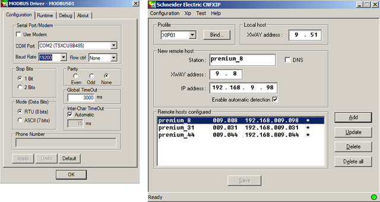
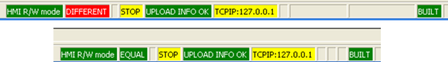
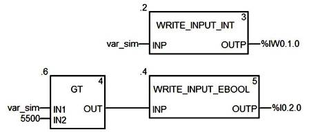

## 4.2. Робота UNITY PRO в режимі онлайн

### 4.2.1. Налаштування зв’язку

UNITY PRO по відношенню до ПЛК може знаходитись в 2-х режимах: 

-     *offline*: в цьому режимі відсутній зв’язок середовища UNITY PRO з ПЛК, всі зміни в проекті відображаються тільки в файлі проекту на ПК; 

-     *online*: в цьому режимі відбувається обмін між UNITY PRO та ПЛК. 

Перехід в режим *online* відбувається через команду в меню *PLC->Connect*. При цьому, UNITY PRO з’єднається з тим ПЛК, адреса якого прописана у вікні налаштування зв’язку UNITY PRO. Вікно налаштування адрес ПЛК та імітатора ПЛК викликається в меню "*PLC->Set Address…"* (рис.4.1).

При необхідності роботи з імітатором ПЛК, перед з’єднанням необхідно вибрати пункт *PLC->Simulation Mode*, а для роботи з фізичним ПЛК – *PLC->Standard Mode*.

Рис.4.1. Вікно налаштування адреси ПЛК та імітатора

UNITY PRO може з’єднатися з ПЛК використовуючи різні драйвери для зв’язку, які поставляються разом з UNITY PRO. Ряд драйверів встановлюються в систему по замовченню разом з UNITY PRO, інші необхідно встановлювати з дистрибутива самостійно. Налаштування цих драйверів проводиться за допомогою спеціальної утиліти *Drivers* *Management*, яку можна запустити з меню Windows "Пуск":   

*Schneider Electric -> Communication Drivers -> Drivers Management*  

Утиліту *Drivers* *Management* можна також запустити з вікна Set Address (див.рис.4.1):

*вікно* *PLC->Communication Parameters->Driver Settings*

Слід зазначити, що драйвери які використовує UNITY PRO для з’єднання з ПЛК можуть використовувати також інші програми Schneider Electric, наприклад OFS (OPC Factory Server), Vijeo Designer, PL7 PRO, Twido Suite і багато інших.

Вікно утиліти *Drivers* *Management*  показано на рис.4.2. Кожний драйвер налаштовується в окремому вікні, які доступні по вкладкам. У більшості випадків для з’єднання UNITY PRO з ПЛК нічого змінювати в конфігурації драйверів не потрібно. Нижче зупинимося тільки на найбільш популярних настройках, які часто необхідно вказувати для з’єднання UNITY PRO з ПЛК. 

Усі драйвери умовно діляться на дві групи: драйвери MODBUS і драйвери XWAY. Драйвери MODBUS доступні в декількох варіантах: 

-     *Modbus* *Serial* (MODBUS01, MODBUS02…): для зв’язку з ПЛК M340 та Quantum через інтегровані в CPU або комунікаційні модулі послідовні порти RS232/RS485;

-     *TCP/IP*: для зв’язку з усіма типами ПЛК Modicon, через Modbus/TCP як правило через інтегровані в CPU або комунікаційні модулі порти Ethernet;

-     *USB* *(PLC* *USB)*: для зв’язку з ПЛК М340 та деякими потужними Quantum та Premium через інтегрований в CPU інтерфейс USB;

-     *Modbus+:* для зв’язку тільки з ПЛК Quantum. 

Рис.4.2. Вікно утиліти *Drivers Management* 

Драйвери XWAY використовуються тільки для зв’язку з TSX Premium і теж доступні в декількох варіантах:

-     *UNITELWAY* (UNTLW01): для зв’язку як правило через інтегрований порт TER/AUX, використовуючи один з адаптерів TCX PCX1031, TSX PCX 3031 або TSX C USB 485;

-     *XIP*: для зв’язку через Ethernet (протокол UNITE XWAY на TCP/IP);

-     *ETHWAY*:  для зв’язку через Ethernet (протокол UNITE XWAY на Ethernet);

-     *PCIWAY*: для зв’язку з ПЛК Atrium через PCI-шину ПК; 

-     *FIP*: для зв’язку через FIPWAY/FIPIO; 

Таким чином, в залежності від використовуваного драйверу, необхідно у *Drivers* *Management* налаштувати ті чи інші параметри. Для драйверу *Modbus* *Serial* в необхідно вказати номер COM-порту комп’ютера, та його налаштування (наприклад *Baud* *Rate* - бітова швидкість, *Parity*-паритет, див.рис.4.3.). Для драйверів Modbus TCP/IP та USB нічого налаштовувати не потрібно. 

Для драйверу UNITELWAY необхідно вказати тільки як правило номер COM-порту комп’ютера. Слід зазначити, що кабель-адаптер перетворювач (TCX PCX1031, TSX PCX 3031 або TSX C USB 485) при з’єднані з ПЛК повинен знаходитись в режимах "*2* *TER* *DIRECT*" або "*0* *TER* *MULTI*".

Для драйверу XIP необхідно налаштувати власну XWAY-адресу (Local Host) в форматі "*Network.Station*", та адреси ПЛК, з якими необхідно з’єднуватися (див.рис.4.3). Для кожного ПЛК обов’язково треба задати пару значень: *XWAY* *address:* *Network.Station* та відповідний йому *IP* *address*. Слід зазначити, що номер мережі (*Network*) у ПК і ПЛК повинен співпадати. На рис.4.3 драйвер XIP комп’ютера з UNITY PRO має локальну XWAY-адресу рівною "*9.51*", а ПЛК з назвою "*premium_8"* має XWAY-адресу рівною "*9.9*" з IP-адресою рівною 192.168.009.098.

Рис.4.3. Налаштування драйверів зв’язку: Modbus Serial (ліворуч), XIP (праворуч)

Після налаштування драйверу, зв’язок з ПЛК можна перевірити на вкладці "XWAY test" або "MODBUS test".

Для різних драйверів зв’язку у вікні налаштування адреси ПЛК та імітатора задається різний формат адреси (див. рис.4.1). Нижче наведемо найбільш вживані:

Таблиця 4.1. *Приклади адрес ПЛК.*

| Вибраний драйвер        | формат адреси                  | приклад                                                      |
| ----------------------- | ------------------------------ | ------------------------------------------------------------ |
| USB                     | SYS                            | SYS                                                          |
| UNTLW01                 | SYS                            | SYS                                                          |
| MODBUS01                | адреса Slave                   | 1                                                            |
| TCPIP                   | IP-адреса                      | 192.168.9.44                                                 |
| TCPIP   (для Simulator) | IP-адреса ПК з  імітатором ПЛК | 192.168.9.1 – імітатор на іншому ПК  127.0.0.1 –  імітатор на тому ж ПК що і UNITY PRO |
| XIP                     | {Network.Sation}SYS            | {9.8}SYS                                                     |

 

### 4.2.2.  Можливості UNITY PRO в режимі онлайн

ПЛК дозволяє з’єднуватися з ним в *режимі програмування* (режим роботи *Programming* *Mode*) або в *режимі перегляду* (*Monitoring* *Mode*). Режим з’єднання визначається в опціях середовища *Tools->Options->Connection*. У режимі програмування з ПЛК може з’єднатися тільки один термінал програмування UNITY PRO. У обох режимах доступні можливості перегляду та зміни значення змінних та комірок локалізованої області з використанням анімаційних таблиць та операторських екранів. Значення нелокалізованих змінних доступні тільки у підрежимі *Equal*. Режим *Programming* *Mode* дозволяє також змінювати програму в ПЛК. 

Для створення виконавчого проекту в UNITY PRO проводиться компіляція. Можливі два варіанти компіляції:

-    Build->*Build Changes*: ця команда приводить до компіляції тільки змінених частин проекту;

-    Build->*Rebuild All Project*: ця команда приводить до повної перекомпіляції проекту.  

Результат компіляції висвічується у вікні *Output Window*. Якщо при компіляції є помилки, то в даному вікні з’явиться їх перелік. Зробивши подвійний клік по повідомленню помилки, можна визначити її джерело. Перевірити синтаксичні помилки в проекті можна також командою Build->*Analyze*.   

Виконавчий проект, який являється результатом компіляції, зберігається разом з файлом проекту на диску комп’ютера. У режимі онлайн виконавчий проект можна завантажити в ПЛК командою  *PLC->Transfer Project to PLC*.  Завантаження нового проекту в ПЛК приводить до його зупинки та ініціалізації!

Завантаження проекту в ПЛК можливе тільки у випадку якщо конфігурація апаратного забезпечення процесорного модуля відповідає дійсній (той же CPU, та ж версія OS UNITY).

Середовище UNITY PRO дає можливість зміни частини виконавчого проекту в ПЛК не зупиняючи його роботу. Це дуже важливо, коли необхідно змінити логіку виконання програм на працюючому обладнанні. Для можливості часткової зміни програми в ПЛК необхідно щоб виконавчі проекти в ПЛК і в середовищі UNITY PRO були ідентичними. У режимі онлайн ідентичність проекту сигналізується в панелі статусу зеленим індикатором *EQUAL*, а якщо проекти відрізняються – червоним *DIFFERENT* (рис.4.4). 

Рис.4.4. Вигляд панелі статусу в режимі *DIFFERENT* (зверху) та *EQUAL* (знизу). 

Таким чином зміни в проекті намагаються проводити в режимі *EQUAL*, шляхом часткової компіляції. Користувач робить всі зміни в проекті (змінює код, добавляє змінну, тощо), потім в режимі *online (тільки EQUAL)* викликає команду *Build Changes*, що приводить до модифікації виконавчого проекту в UNITY PRO та в ПЛК. Для модифікації програми в ПЛК без його зупинки, часткова компіляція проводиться тільки в режимі онлайн! 

Слід розуміти, що виконавчий проект являється скомпільованим кодом, який не можна вивантажити з ПЛК і модифікувати середовищем UNITY PRO! Окрім виконавчого проекту в ПЛК можна завантажити інші проектні дані. Для того щоб мати таку можливість, ці дані теж необхідно завантажити в ПЛК. Проектні дані, які зберігаються в ПЛК разом з виконавчим проектом називають *Upload* *Information*. Слід зазначити, що дані *Upload* *Information* не приймають участь в роботі ПЛК, це по суті сховище даних. Крім вихідних кодів та конфігурації в *Upload* *Information* можна включати (або виключати) коментарі для змінних та анімаційні таблиці. Налаштування проводиться в настройках проекту: 

*Tools->Project* *Settings->General->PLC* *embedded* *data* 

По замовченню опція *Upload* *Information* включена, а *Upload* *Information* *Management* *=* *Automatic*. Це значить, що проектні дані будуть автоматично завантажуватися в ПЛК при кожній зміні виконавчого проекту. Якщо ж проектних даних в ПЛК немає, в панелі статусу в режимі онлайн буде відображатися "*No* *upload* *info*". Вивантажити проектні дані з ПЛК в середовище UNITY PRO в режимі онлайн можна командою *PLC->Transfer Proect from PLC*.  

Для управління роботою ПЛК використовуються команди: PLC->*RUN* (запуск на виконання), PLC->*STOP* (зупинка), PLC->*Init* (ініціалізація ПЛК тільки в режимі *HALT*). 

### 4.2.3.  Імітатор ПЛК

У середовищі UNITY PRO є можливість використання *імітатора* (*Simulator*) ПЛК, що дозволяє налагодити роботу програми без наявного апаратного забезпечення. Імітатор інсталюється автоматично разом з середовищем UNITY PRO. Він працює як звичайний контролер, використовуючи ресурси комп'ютера та операційної системи. У вікні панелі імітатора можна зробити його гарячий та холодний рестарт, подивитися стан індикаторів процесорного модуля. 

Імітатор UNITY PRO має певні обмеження. Він не забезпечує виконання жорстких умов реального часу, не підтримує ряд функцій (зокрема комунікаційних), і не відтворює апаратні сигнали вводу/виводу та не дає можливість їх змінити/форсувати. Однак, змінювати значення %I та %IW можна програмним шляхом, за допомогою спеціалізованих функцій, які розглянуті в нижче.

Серед значних переваг імітатора UNITY порівняно з подібними програмами інших конкуруючих брендів, є можливість доступу до його даних, з використанням протоколу Modbus/TCP. Це дає не тільки можливість налагодження програми UNITY PRO, а і проекту SCADA, якщо вона підтримує даний протокол. Тобто значну частину програмного забезпечення можна налагодити ще до наявного апаратного забезпечення.    

При необхідності роботи з імітатором ПЛК, перед з’єднанням необхідно вибрати пункт *PLC->Simulation Mode*. При підключенні до імітатору на тому ж ПК де знаходиться UNITY PRO, в полі адреси (див.рис.4.1) вказується "127.0.0.1". Можливе з’єднання з імітатором ПЛК на іншому комп’ютері, для цього вказується його IP-адреса. 

Слід зазначити, що програма-імітатор використовує типовий 502-й TCP-порт Modbus Серверу. Тому даний порт повинен бути відкритим (дозволеним брандмауерами) і не використовуватись іншими прикладними програмами.    

 При команді *PLC->Connect*, якщо імітатор не запущений, він запускається автоматично. Стан імітатору відображається на панелі статусу Windows і видимий в процесах як файл sim.exe. 

Для зміни в імітаторі ПЛК значень дискретних та аналогових вхідних сигналів (%I, %IW) програмним шляхом використовуються відповідно функції *WRITE_INPUT_EBOOL* та *WRITE_INPUT_INT*, які входять до бібліотеки *IO* *Management*. На входи цих функцій подаються необхідні значення, а на виходах вказуються адреси *%I*(для *WRITE_INPUT_EBOOL*) та *%IW* (для *WRITE_INPUT_INT*), або локалізовані змінні, які до цих адрес прив’язані.

На рис.4.5 показаний приклад використання даних функцій. Слід зазначити, що такий спосіб імітації хоч і складніший у використанні, аніж пряма зміна в імітаторі ПЛК, однак дає можливість імітувати об’єкт управління самостійною програмою.

Рис.4.5. Приклад використання WRITE_INPUT_INT та WRITE_INPUT_EBOOL

Функції *WRITE_INPUT_EBOOL* та *WRITE_INPUT_INT* можна також використовувати і для зміни значень входів реального ПЛК. 