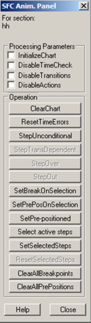
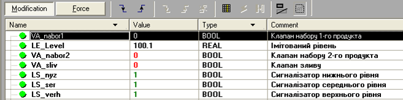
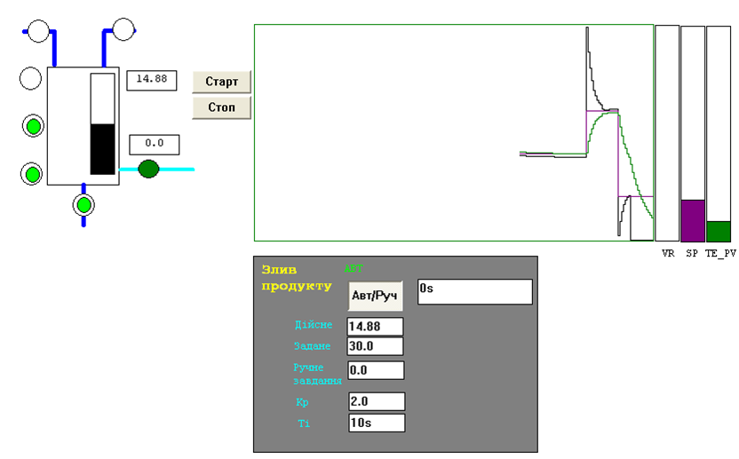
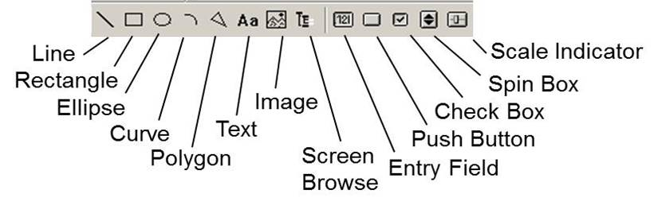

## 4.3. Налагодження програми користувача

### 4.3.1.  Використання анімаційних засобів редакторів 

Компільовані секції програм в режимі *online* по замовченню відображаються в анімаційному вигляді. Включення та виключення анімації проводиться через команди головного меню *Services->Animation*.

У редакторах всіх мов програмування можна задіяти засоби відлагодження *Debug*, які дають можливість визначати точки зупинки виконання програми користувача (*BreakPoint*), та покрокового виконання її секцій. Зверніть увагу, що точка переривання призупиняє виконання Задачі, в якій вона використана! 

Засоби *WatchPoint* дають можливість відображати стан змінних в потрібному місці програми. Слід зазначити, що по замовченню, у всіх засобах відображення показані значення змінних у кінці Задачі MAST. Утиліта *Inspect Window* дає можливість відображення стану потрібних змінних у "зручному" місці секції. 

У анімаційному режимі всі дискретні змінні підсвічуються зеленим в стані лог. "1" та червоним в стані лог. "0". Всі інші типи змінних підсвічуються жовтим кольором. У графічних мовах (LD, FBD, SFC) контакти та з’єднувальні лінії, по яким "проходить сигнал або струм" підсвічуються зеленим, а по яким "не проходить" – червоним. Таким чином, наприклад в LD можна визначити де "обірвався" логічний ланцюжок. 

У секціях графічних мов програмування, показуються числові значення аргументів функцій та функціональних блоків. У текстових мовах (ST, IL) числові значення змінних підсвічуються при наведені мишкою. У анімаційному режимі, в контекстному меню блоків доступні додаткові команди, зокрема на зміну значення змінних. 

Редактор SFC додаткові можливості управління виконанням кроків (див. параграф 3.10.7). Для цього необхідно активувати спеціальну панель управління, при відкритій секції SFC в режимі онлайн: *Services* *->Animation* *Panel->Show* *Animation* *Panel*. Зовнішній вигляд панелі зображений на рис.4.6, а призначення команд вказане в таблиці 4.2. 

Рис.4.6. Панель управління SFC

Таблиця 4.2. *Команди панелі управління* *SFC.*

|                          | Область  параметрів (Parameters): параметри  виставляються опціями |
| ------------------------ | ------------------------------------------------------------ |
| Initialize Chart         | Для відкритої SFC секції:   - при активації опції - відключаються активні кроки;  - при деактивації опції - активується перший  крок |
| Disable Time Check       | опція виставляється для відключення перевірки часу  виконання кроків |
| Disable Transitions      | опція виставляється для переходу в режим деактивації  переходів (заморозки), при якому маркер в SFC  управляється командами *Step* *Trans* *Dependent,* *Step* *Over* *і* *Step* *Out* |
| Disable Actions          | всі дії деактивуються                                        |
|                          | **Область дій (Operation): команди запускаються кнопками**   |
| Clear Chart              | деактивувати активні кроки                                   |
| Reset Time Errors        | скинути біти контролю помилок *tminErr,* *tmaxErr*           |
| Step Unconditional       | перейти на наступний крок, незалежно від виконання  умови переходу. Команда не спрацьовує,   поки час виконання менше часу затримки для кроку. |
| Step Trans Dependent     | активна в режимі деактивації переходів (заморозки):  якщо спрацьовує умова переходу, перейти на наступний  крок; секцію залишити в режимі заморозки незалежно від результату переходу; |
| Step Over                | активна в режимі деактивації переходів (заморозки):   виконувати секцію в нормальному режимі (не  заморозки) до спрацювання умови переходу, після чого перейти на наступний  крок і знову активувати режим заморозки; |
| Step Out                 | активна в режимі деактивації переходів (заморозки) і  при відкритій макросекції:   виконувати секцію в нормальному режимі (не  заморозки) до виходу з макросекції, після чого знову перейти в режим  заморозки |
| Set Break On Selection   | встановити точки переривання на виділені кроки               |
| Set Pre Pos On Selection | встановити мітки на виділені кроки для забезпечення  переходу командою Set Pre-positioned |
| Set Pre-positioned       | перейти на кроки, які помічені командою Set Pre Pos On Selection |
| Select active steps      | виділити в редакторі активні кроки                           |
| Set Selected Steps       | активувати виділені кроки (передати їм маркер)               |
| Reset Selected Steps     | деактивувати виділені кроки (тільки при активному  мультимаркері) |
| Clear All Breakpoints    | видалити всі точки переривання                               |
| Clear All Pre-Positions  | видалити всі мітки переходу, встановлені командою Set Pre Pos On Selection |

 

### 4.2.2.  Використання анімаційних таблиць 

Традиційним способом відображення та зміни значень змінних у середовищі програмування ПЛК є табличний. У UNITY PRO такі таблиці називаються *Анімаційними таблицями* (*Animation Tables*). Їх можна створити в контекстному меню розділу *Animation Tables* в *Project Browser*, або в контекстному меню виділеної частини програми через команду *Initialize Animation Tables* (рис.4.7). 

Рис.4.7. Анімаційна таблиця. 

Анімаційні таблиці UNITY PRO дають можливість продивлятися стан потрібних змінних в зручному форматі (10-ковий, 16-ковий, 2-ковий та символьний) та їх модифікувати. Для можливості зміни змінних в анімаційній таблиці, необхідно активувати режим *Modification* (рис.4.7). Зміна формату відображення вибирається через контекстне меню.

Анімаційні таблиці можна зберігати в проекті, а також при необхідності в ПЛК (задається опціями проекту *Upload* *Information*). 

### 4.2.3.  Використання операторських екранів 

*Операторські екрани* (*Operator Screens*) в UNITY PRO дають можливість відображати та змінювати значення змінних за допомогою анімованих графічних елементів. Функціональність операторських екранів наближена до функціональності графічних операторських панелей, що дає дуже потужний і зручний механізм для налагодження програми (рис.4.8). Однак слід зазначити, що операторські екрани не призначені для використання їх операторами на виробництві, а тільки для програміста або наладчика установки з ПЛК. 

Рис.4.8. Приклад операторського екрану UNITY PRO

Операторські екрани UNITY PRO дозволяють:

-     створювати багато-екранний графічний людино-машинний інтерфейс з можливістю швидкого перемикання між екранами за допомогою кнопок;

-     рисувати векторні графічні елементи у вигляді різних геометричних фігур (круг, еліпс, прямокутник, лінія, крива, полігон) та імпортувати растрову графіку; 

-     відображати текст;

-     показувати значення змінних: 

o  зміною відображення будь якого графічного елементу;

o  у числовому вигляді різного формату (10-ковий, 16-ковий, 2-ковий, символьний);

o  у строковому вигляді;

o  у вигляді стовпчикової діаграми;

o  у вигляді тренду (самописцю);  

-     змінювати значення змінних за допомогою елементів управління (Control):

o  кнопок та перемикачів;

o  повзунків різного зображення;

o  елементів вводу значень змінних з клавіатури.

-     об’єднувати елементи в групи (об’єкти) та збереження їх в бібліотеці UNITY PRO; використовувати існуючі об’єкти з бібліотеки Operator Screen Library.   

Створюються екрани в розділі проекту *Operator Screens* (рис.4.9). Для можливості зміни значень в операторських екранах необхідно викликати команду *Services -> Enable Variable Modification*.

Рис.4.9. Панель графічних елементів операторських екранів UNITY PRO

Всі графічні елементи, які можуть бути розміщені на екранах умовно діляться на 4-ри групи: 

-     *стандартні елементи*: лінія (Line), прямокутник (Rectangle), еліпс (Ellipse), крива (Curve), ломана (Polygone), текст (Text);

-     *зображення* (Image): растрові файли з розширенням BMP або JPG.

-     *елементи управління* (Command): кнопка (Push Button), прапорець (Check Box), поле вводу (Entry Field), лічильник (Spin Box), кнопка переходу між екранами (Screen Browse), повзунок (Scale Indicator); 

-     *згруповані елементи* в один об’єкт. 

Властивості графічних елементів доступні в їх контекстному меню. Тут зупинимося коротко тільки на основних властивостях. Для всіх елементів є доступна вкладка *Animation*, в якій вказується змінна (поле *Variable*), в залежності від якої буде анімуватися (змінювати своє зображення) даний елемент. Для елементів управління доступна також вкладка *Control*, де вказується змінна (поле *Variable*), яку буде змінювати оператор через цей елемент. Інші вкладки і властивості залежать від конкретного елемента. У табл. 4.3 показані основні типи анімацій та команд, які можна зробити за допомогою графічних елементів. 

*Таблиця 4.3*. Анімації та дії, які доступні в елементах операторських екранів

| Анімація або  команда                                       | Елемент для  якого доступна  анімація/команда | Налаштування                                                 |
| ----------------------------------------------------------- | --------------------------------------------- | ------------------------------------------------------------ |
| показати/сховати елемент в залежності від булевої  змінної  | будь який елемент                             | У полі *Animation->Variable* вказується змінна або адреса типу BOOL/EBOOL, а у *Display* *Condition* вибирається опція:   *BIT=0*, якщо елемент повинен бути видимий тільки при 0,    *BIT=1*, якщо елемент повинен бути видимий при 1 |
| показати/сховати елемент в залежності від  числової змінної | будь який елемент                             | У полі *Animation->Variable* вказується змінна або адреса числового  типу, в *Display* *Condition* (умова видимості) вибирається опція з умовою  видимості |
| відобразити числове значення                                | текст (Text)                                  | У полі *Animation->Variable* вказується змінна або адреса числового типу, на вкладці *Animation Type* вибирається опція *Value* та формат  відображення |
| стовпчикова діаграма                                        | Прямокутник (Rectangle)                       | У полі *Animation->Variable* вказується змінна або адреса числового типу, на  вкладці *Animation* *Type* вибирається  опція *Bar* *Chart*, через  кнопку ">" вихід в додаткове вікно налаштування, в якому  вибирається тип діаграми, межі зміни, межі нормального значення, межі та  колір аварійних значень |
| трендова діаграма, самописець                               | Прямокутник (Rectangle)                       | У полі *Animation->Variable* вказується змінна або адреса числового типу, на  вкладці *Animation* *Type* вибирається  опція *TrendDiagram*, через кнопку ">" вихід в додаткове  вікно налаштування, в якому вибираються межі діаграми, колір, періодичність  оновлення, кількість точок на графіку; зробивши фон прямокутника прозорим  можна наложити трендові діаграми один на одного, зробивши ефект декількох  пір’їв на одному графіку |
| змінити значення булевої змінної                            | кнопка (Push Button), прапорець (Check  Box)  | У полі *Control->Variable* вказується  змінна або адреса типу *BOOL/EBOOL*; для *Push Button* можна виставити опцію *With  Latching*, щоб кнопка  працювала з фіксацією |
| записати числову константу в змінну                         | кнопка (Push Button),                         | У полі *Control->Variable* вказується змінна або адреса числового типу, в  полі *Control->Value* вказується  значення константи |
| ввести значення числової змінної                            | поле вводу (Entry Field)                      | У полі *Control->Variable* вказується змінна або адреса числового типу, на цій  же вкладці вказуються межі для значення, що вводиться |
| змінити значення повзунком                                  | повзунок (Scale Indicator)                    | У полі *Control->Variable* вказується змінна або адреса числового типу, на цій  же вкладці вказуються межі для значення та тип повзунка:  горизонтальний/вертикальний |
| збільшити/зменшити значення на 1                            | лічильник (Spin Box)                          | У полі *Control->Variable* вказується змінна або адреса числового типу, на цій  же вкладці вказуються межі для значення та тип повзунка:  горизонтальний/вертикальний |
| перейти на іншу сторінку                                    | кнопка переходу між екранами (Screen Browse)  | У полі *ScreenBrowse->Value* вказується  номер сторінки, куди необхідно перейти |

 