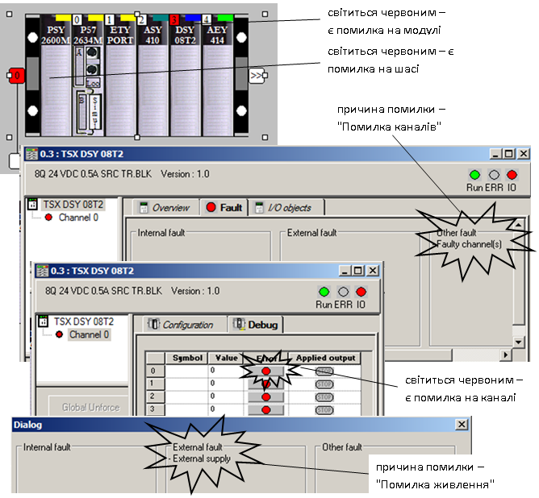
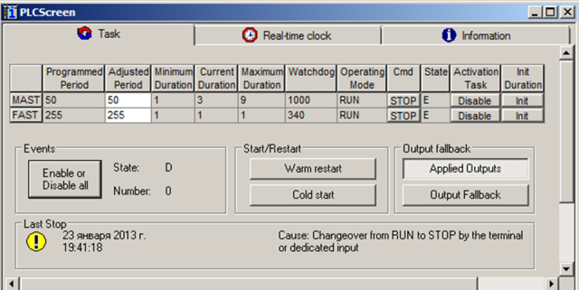
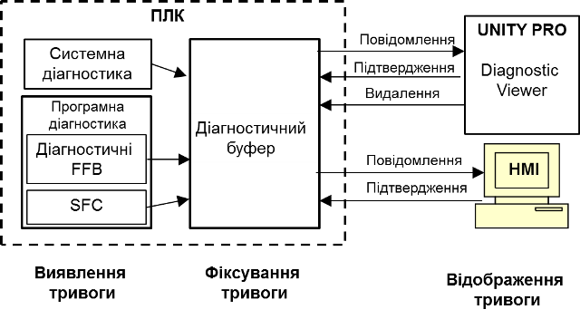
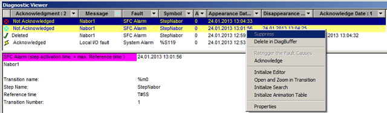
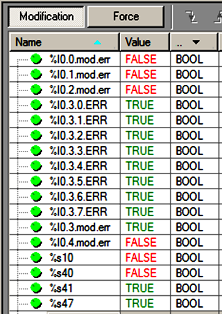
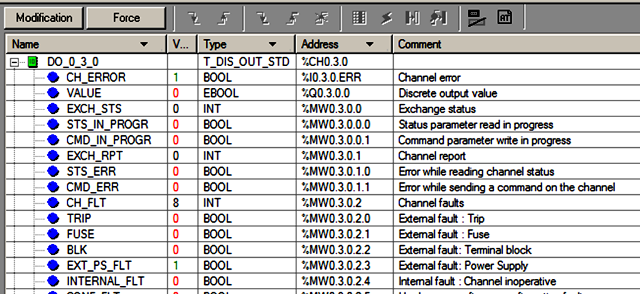

## 4.5. Діагностика роботи ПЛК

### 4.5.1.  Загальні принципи діагностики роботи ПЛК

Засоби ПЛК та UNITY PRO дають можливість діагностувати роботу ПЛК та технологічного процесу. Огляд засобів UNITY PRO для діагностики технологічного процесу виходить за рамки даного посібника. У даному розділі розглянуті тільки програмні та апаратні засоби для діагностики роботи самого ПЛК.

Діагностика роботи ПЛК – це вияв факту несправності в процесі функціонування ПЛК та ідентифікація причини несправності. Надалі несправність будемо називати *помилкою*. 

У загальному, діагностичні засоби ПЛК та UNITY PRO можна умовно поділити на три групи:

-     апаратні засоби діагностики ПЛК: індикаторні лампи, аварійні реле та кнопки, які знаходяться на модулях ПЛК;

-     діагностичні засоби середовища UNITY PRO: діагностичні вікна середовища в режимі онлайн;

-     програмні засоби діагностики: об’єкти UNITY (змінні, комірки пам’яті) та діагностичні FFB.     

Всі наведені засоби взаємопов’язані і можуть використовуватися як окремо, так і в комплексі.

Усі помилки умовно можна поділити на три групи:

-     не блокуючі помилки:  ті які не приводять до зупинки ПЛК;

-     блокуючі помилки: ті які приводять до аварійної зупинки ПЛК (до режиму HALT);

-     помилки операційної системи: ті які приводять до відмови роботи OS UNITY

*Не блокуючі помилки* зв’язані з неправильною роботою каналів вводу/виводу. Як правило ці помилки не являються небезпечними для всієї системи, тому не приводять до аварійної зупинки ПЛК. Однак, якщо помилка, зв’язана з відмовою, або некоректною роботою каналу повинна привести до зупинки ПЛК, можна скористатися програмною діагностикою (див. параграф 4.5.4) та інструкцією або функцією *HALT*. Помилки каналів вводу/виводу відображаються індикаторами *I/O* на панелях модулів, діагностичних вікнах UNITY PRO та в об’єктах UNITY. 

*Блокуючі помилки* виникають від неправильної роботи програми користувача, тому операційна система блокує роботу програми, переводячи ПЛК в режим *HALT*. Ці помилки можуть бути зв’язані з неправильною організацією циклів і переходів (приводить до спрацювання сторожового таймеру), з помилками SFC, з некоректними результатами розрахунків (при *%S78=1*), або з програмним викликом інструкції або функції *HALT*. У режимі *HALT* на панелі модуля CPU мигає індикаторна лампа *ERR*. Також помилка відображається в діагностичних вікнах UNITY PRO та в об’єктах UNITY. 

*Помилки операційної системи* приводять до відмови роботи ПЛК. У цьому режимі не функціонує (або ненормально функціонує) операційна система OS UNITY. Це може бути пов’язано з апаратними помилками процесорного модулю або шасі. У цій ситуації стан індикаторних ламп може бути різним, окрім індикатору *ERR* на модулі CPU, він буде світитися. Враховуючи, що OS UNITY в цьому режимі не функціонує, з’єднатися з UNITY PRO немає можливості.

### 4.5.2.  Апаратні засоби діагностики ПЛК

Усі модулі ПЛК Modicon М340 та TSX Premium мають дисплейний блок (панель) для діагностики їх роботи. 

У таблиці 4.4 наведений перелік станів деяких індикаторів на панелі процесорних модулів ПЛК M340 та TSX Premium. 

Таблиця 4.4. *Стан деяких індикаторів панелей процесорних модулів* *M340* *та* *TSX* *Premium.*

| Індикатор          | Світиться                                                    | Мигає                                                        | Не світиться                                            | Примітка               |
| ------------------ | ------------------------------------------------------------ | ------------------------------------------------------------ | ------------------------------------------------------- | ---------------------- |
| RUN (зелений)      | ПЛК в  режимі RUN                                            | ПЛК в  режимі STOP або HALT                                  | ПЛК не  містить виконавчого проекту                     |                        |
| ERR (червоний)     | Виявлена  помилка операційної системи                        | ПЛК не  містить виконавчого проекту або в режимі HALT або  помилка  карти пам’яті (тільки в TSX Premium) | немає  помилок операційної системи                      |                        |
| I/O (червоний)     | помилка  на одному з каналів вводу/виводу ПЛК                | помилка  X BUS (тільки в TSX Premium)                        | немає  помилок зв’язаних з каналами                     |                        |
| CARDERR (червоний) | відсутня SD карта, або має невірний формат,  або містить виконавчий проект, відмінний від завантаженого в пам’ять ПЛК |                                                              | формат  SD карти коректний, виконавчі проекти ідентичні | тільки  в М340         |
| TER (жовтий)       |                                                              | йде  обмін через порт TER/AUX, інтенсивність мигання вказує  на інтенсивність обміну | немає  обміну через порт TER/AUX                        | тільки  в TSX  Premium |
| SER  COM (жовтий)  |                                                              | йде  обмін через послідовний порт                            | немає  обміну через послідовний порт                    | тільки  в М340         |

Кожний дискретний модуль має дисплейний блок, на якому розташовані індикатори стану модуля: *RUN* (зелений), *ERR* i *I/O* (червоний), а також індикатори з позначенням номерів каналів входів-виходів. Кількість цих індикаторів відповідає кількості каналів модуля. Максимальна кількість таких індикаторів – 32. Якщо модуль розрахований на більшу кількість каналів (64), то у нижній частині дисплею розташована кнопка переключення на іншу групу з 32 каналів. При цьому у верхній частині дисплея загорається індикатор "+32". Індикатори каналів висвітлюються при спрацьовуванні відповідного каналу. 

У нормальному стані модуля крім індикаторів стану каналів повинен горіти тільки індикатор *RUN*. Висвітлення індикаторів *ERR* або сигналізує про виявлення системою самодіагностики відмови модуля, а *I/O* – помилку окремих його каналів. 

Як і модулі дискретних входів/виходів, модулі аналогових каналів мають дисплейний блок із розташованими на ньому трьома індикаторними лампами *RUN*, *ERR* i *I/O*, які відображають режим роботи модуля і можливі несправності.

Додаткову інформацію про стан індикаторів модулів M340 та TSX Premium можна отримати у довідниковій системі UNITY PRO.

### 4.5.3.  Діагностичні засоби середовища UNITY PRO

Середовище UNITY PRO в режимі онлайн надає користувачу можливість подивитися стан ПЛК та провести додаткову діагностику, недоступну з індикаторних панелей. Слід зазначити, що всі діагностичні можливості середовища UNITY PRO базуються на об’єктах UNITY, а отже доступні і програмі користувача в режимі її виконання. Винятком є вияв блокуючих помилок та їх причин, так як в цьому випадку програма користувача не виконується (режим *HALT*). 

Ряд діагностичних засобів вже розглядалися в посібнику, зокрема індикатори панелі статусу. Інші діагностичні засоби (вікна) середовища UNITY PRO можна поділити на дві групи: діагностичні екрани та утиліта *DiagnosticViewer*.    

*Діагностичні екрани* (*diagnostic* *screens*) доступні в розділі проекту *Configuration*. У онлайн режимі вікно конфігурації ПЛК відображає стан всіх модулів ПЛК. На рис.4.31 показаний приклад діагностичних екранів для виявлення помилки. Прокоментуємо послідовність виявлення несправності.



Рис.4.31. Приклад діагностичних екранів для модуля дискретних виходів

У даному прикладі індикатор *I/O* світиться на процесорному модулі та на модулі *TSX* *DSY* *08T2*, який знаходиться на 3-му посадочному місці 0-го шасі. У діагностичному екрані конфігурації видно, що 0-ве шасі світиться червоним, отже на ньому є помилка зв’язана з каналами вводу/виводу. Модуль дискретних виходів теж позначений червоним. Подвійний клік по модулю приведе до виклику діагностичного екрану модулю, в якому крім стану індикаторів на вкладці *Fault* доступна причина помилки. Враховуючи що дана помилка пов’язана з каналами ("*Faulty* *channel(s)*"), відкриваємо діагностичні екрани каналів на вкладці "*Debug*". Клік по каналу відкриє його діагностичний екран, де відобразиться помилка каналу. У даному випадку це помилка живлення виходів. Якби опцію "*Supply* *Monitoring*" відключили при конфігуруванні модуля, тоді б помилка не виникала.

З діагностичного екрану процесорного модуля (вкладка *Animation*) можна отримати інформацію про стан Задач, час виконання останнього циклу і максимальний та мінімальний час виконання Задач, причину останньої зупинки ПЛК а також запустити деякі команди: холодний старт, теплий рестарт, переведення виходів в безпечний стан, активація/деактивація Задач (рис.4.32). Крім того, екран дає можливість налаштувати годинник реального часу ПЛК (вкладка *Real-Time* *Clock*).    



Рис.4.32. Діагностичний екран для процесорного модуля 

 Утиліта UNITY PRO *Diagnostic* *Viewer* призначена для роботи з діагностичним буфером ПЛК. *Діагностичний буфер* ПЛК (*Diagnostics* *Buffer*) призначений для збереження списку повідомлень в пам’яті ПЛК. Його функції аналогічні функціям списку тривог в засобах SCADA/HMI, тому надалі всі повідомлення будемо називати також тривогами. Тривоги в діагностичному буфері можуть потребувати підтвердження (квітування) оператором. Так чином тривоги в діагностичному буфері будуть зберігатися до тих пір поки триває причина їх виникнення і не буде підтвердження оператору. 

Діагностичний буфер може наповнюватися (див. рис 4.33):

-  системними повідомленнями; для цього в настройках проекту необхідно виставити відповідну опцію (*Tools->Project settings->General->PLC Diagnostics->System Diagnostics*);

-  програмними повідомленнями: діагностичними FFB та діагностичними повідомленнями SFC; для активування програмної діагностики необхідно в настройках проекту виставити відповідну опцію (*Tools->Project settings->General->PLC Diagnostics->Application Diagnostics*); 



Рис.4.33.Робота з діагностичним буфером

Діагностичний буфер можна переглядати і підтверджувати тривоги вбудованою в UNITY PRO утилітою *Diagnostic* *Viewer* або засобами HMI, такими як операторські екрани XBT Magelis, або Веб сторінки ПЛК. Утиліта *Diagnostic* *Viewer* крім цього дає оператору можливість видалити повідомлення з буферу. Загальний вигляд *Diagnostic* *Viewer* показаний на рис.4.34, викликається він через меню *Tools-> Diagnostic* *Viewer*. Детальну інформацію про роботу та налаштування *Diagnostic* *Viewer* можна отримати з довідникової системи UNITY PRO.



Рис.4.34.Загальний вигляд *Diagnostic Viewer*

 

### 4.5.4.  Програмні засоби діагностики

OS UNITY дозволяє програмно обробляти помилки ПЛК. Слід нагадати, що програмно можна обробити тільки неблокуючі помилки, так як при інших типах помилок програма користувача не виконується. Для програмної обробки помилок можуть бути використані різні об’єкти UNITY:

-     системні біти і слова - для виявлення факту помилки;

-     дані каналів вводу/виводу (об’єкти вводу/виводу) - для виявлення факту і причини помилки;

-     діагностичні FFB - для роботи з діагностичним буфером.

Системні біти і слова використовуються для діагностики роботи ПЛК в цілому. Перелік деяких системних бітів і слів наведений в параграфі 3.4.5. Об’єкти вводу/виводу (див. параграф 3.4.6) дають можливість виявити номер модулю та каналу, на якому присутня помилка, а також причину помилки.  Діагностичні FFB дозволяють записувати/видаляти в діагностичний буфер помилки зв’язані з тривогами в технологічному процесі. 



Рис.4.35.Фрагмент анімаційної таблиці діагностики каналів 

Для прикладу розглянемо ситуацію, яка показана на рис.4.31. Наявність помилки вводу/виводу на процесорі (горить індикатор I/O) відображається також на системному біті *%S10,* який буде рівним *FALSE*. Системний біт *%S40* дорівнює *FALSE,* що значить наявність помилки I/O на шасі з номером 0. Враховуючи що інших шасі в даному випадку немає, помилки на них теж відсутні, тому біти *%S41-%S47* залишаються в стані *TRUE*. Стан наведених системних бітів для даної ситуації показаний на рис.4.35. 

Для виявлення модулю (-лів) з помилкою вводу/виводу, необхідно перевірити стан комірок *%Ir.m.MOD.ERR*. У даному прикладі у нас є 5 модулів: 1 модуль живлення, 1 процесорний модуль, 3 модуля вводу/виводу. Однак діагностика модуля живлення засобами UNITY PRO не проводиться, а процесорний модуль займає 0-ву і 1-у позицію на шасі. У даному випадку 0-ву позицію умовно займає сам CPU (*P572634M*) а 1-шу - інтегрований комунікаційний порт Ethernet (*ETY* *PORT*). Таким чином, необхідно перевірити 5-ть комірок типу *%Ir.m.MOD.ERR*:  

*%I0.0.MOD.ERR* – для CPU TSX P572634M;

*%I0.1.MOD.ERR* – для комунікаційного порту Ethernet;

*%I0.2.MOD.ERR* – для TSX ASY410;

*%I0.3.MOD.ERR* – для TSX DSY08T2;

*%I0.4.MOD.ERR* – для TSX AEY414;

Слід розуміти, що модуль CPU теж має канали вводу/виводу (0 - порт TER/AUX, 1 – порт PCMCIA) тому його теж треба діагностувати на наявність неблокуючих помилок. Так само і помилки комунікаційного порту Ethernet будуть відображатися в комірці *%I0.1.MOD.ERR*. У даній ситуації помилка знаходиться на модулі TSX DSY08T2 (див.рис.4.31), тому значення комірки *%I0.3.MOD.ERR* буде рівним *TRUE*, а інших - *FALSE.* Крім того, всі комірки *%I0.1.0.ERR…%I0.1.7.ERR*  будуть теж рівними *TRUE,* так як відповідно до рис.4.31 всі канали дають помилку вводу/виводу. Загальна картина значень об’єктів вводу/виводу показана на рис.4.35 в анімаційній таблиці. 

 Для отримання додаткової інформації про причину помилки, використовуються інші об’єкти вводу/виводу. Для цього зручно скористатися *IODDT* на основі вибраного каналу, створення яких розглянуте у параграфі 3.4.6. У даному випадку для каналу модуля TSX DSY08T2 необхідно вибрати тип *T_DIS_OUT_STD*. Перелік та значення полів такої змінної для каналу *%CH0.3.0* з назвою "*DO_0_3_0"* показаний на рис.4.36. Однак ряд полів змінної, тобто ряд об’єктів вводу/виводу, а саме комірки з області *%MW*, не оновлюються автоматично значенням стану з каналу. Для оновлення треба запустити функцію *READ_STS*. Розгляд правил виклику функції виходить за рамки даного посібника. У загальному випадку на мові *ST* цей виклик мав би наступний вигляд: 

```pascal
READ_STS(DO_0_3_0);
```

Після виклику функції, та перевірки повернення результату, змінна *DO_0_3_0* матиме вигляд як на рис.4.36. Поле *EXT_PS_FLT=TRUE*, це значить, що виявлена помилка зв’язана з проблемою живлення каналу. Аналогічну помилку показав діагностичний екран каналу з рис.4.31.  



Рис.4.36.Фрагмент анімаційної таблиці з відображенням стану змінної IODDT 

Програмна обробка помилок може крім виявлення помилки забезпечити певні операції з аварійного захисту, переключення в резерв, зупинки (*HALT*) тощо. Можна також передати діагностичну інформацію на засоби SCADA/HMI використовуючи звичайні змінні або діагностичний буфер.  

У параграфі 4.5.3 наведені принципи роботи з діагностичним буфером. Один із варіантів застосування діагностичного буферу – використання його в якості списку тривог. Тобто в діагностичний буфер можна заносити не тільки системні помилки, а і інші повідомлення, які зв’язані з характером протікання технологічного процесу. Для управління повідомленнями в діагностичному буфері використовуються FFB з бібліотеки *Diagnostics*. Розгляд цієї бібліотеки виходить за рамки даного посібника, для детальнішої інформації звертайтесь до довідникової системи UNITY PRO. 

## Контрольні запитання до розділу 

1.   У яких режимах може знаходитись працюючий ПЛК?Чим ці режими відрізняються і як відбувається перехід між режимами?

2.   Розкажіть про випадки, в яких відбувається холодний старт. Які стадії проходить ПЛК при холодному старті?

3.   Розкажіть про випадки, в яких відбувається теплий рестарт. Які стадії проходить ПЛК при теплому рестарті?

4.   Розкажіть про режими *offline* та *online*. Чи можливо перейти в *online* режим, якщо виконавчі проекти в ПЛК та в UNITY PRO відрізняються?

5.   Яким чином задається адреса того ПЛК (імітатора ПЛК) з яким необхідно з’єднатися? 

6.   Як вказати в середовищі Unity PRO, з чим саме необхідно провести з’єднання: з імітатором ПЛК чи з реальним ПЛК?

7.   Де настроюються драйвери для з’єднання з ПЛК? Які драйвери протоколів використовують для зв’язку з М340 а які для TSX Premium? 

8.   Які можливості надає UNITY PRO в режимі *онлайн*?

9.   У якому режимі необхідно з’єднатися з ПЛК, щоб мати можливість змінити програму (виконавчий проект)? 

10.            Скільки терміналів Unity PRO можна підключити в режимі програмування? Чи можна підключати декілька терміналів Unity PRO в режимі *Monitoring*?

11.            Розкажіть про режими *EQUAL* та *DIFFERENT*. Чи можна частково змінити програму в ПЛК в режимі *DIFFERENT*?

12.            Чим відрізняються команди *Build Changes* та *Rebuild All*? Коли неможливо зробити часткову компіляцію? До чого приводить завантаження *всього* виконавчого проекту в ПЛК?

13.            Яким чином в UNITY PRO можна перевірити синтаксичні помилки в програмі? 

14.            Які команди доступні для управління операційним режимом ПЛК в режимі *онлайн*?

15.            Які опції проекту необхідно включити, щоб завантажити вихідні проектні дані в ПЛК, з можливістю їх подальшого вивантаження? 

16.            Навіщо потрібен імітатор ПЛК UNITY? Які можливості він дає, та які обмеження має в порівнянні з реальним контролером?

17.            Чи можливо зробити з’єднання з імітатором ПЛК, який завантажений на іншому комп’ютері?

18.            Яким чином можна змінювати вхідні змінні (прив’язані до *%I/%IW*) ПЛК або імітатору програмним шляхом?

19.            Якими засобами можна скористатися для перевірки роботи програми користувача в ПЛК?

20.            У якій частині циклу ПЛК по замовченню відображаються змінні у засобах відображення змінних Unity PRO? Яким чином можна змінити точку (місце) перегляду змінних?

21.            Якими засобами можна скористатися для покрокового виконання програми?

22.            Назвіть основні анімаційні засоби та засоби зміни значень змінних в редакторах програм користувача.

23.            Назвіть основні можливості анімаційних таблиць. Яким чином можна зберегти анімаційні таблиці в проекті?

24.            Назвіть основні можливості операторських екранів. 

25.            Які основні етапи можна виділити при налагодженні програми користувача?

26.            Навіщо потрібні імітатори об’єктів, як вони можуть бути реалізовані? Що таке програмний імітатор?

27.            Яким чином можна включити програму імітації в структуру програми користувача? Назвіть переваги та недоліки кожного з підходів.

28.            Яким чином можна зробити генератор випадкових чисел? Як на базі генератору випадкових чисел можна зробити імітацію шумів для сигналу? 

29.            Розкажіть як зв’язане моделювання динаміки з рішенням диференційних рівнянь? Розкажіть про вирішення диференційних рівнянь явним методом *Ейлера*.

30.            Яким чином можна імітувати рівень рідини в ємності? Які особливості треба врахувати при імітації рівня в залежності від форми ємності і яким чином можна це врахувати?

31.            Які загальні підходи прийняті при побудові імітаційних моделей? Розкажіть про призначення входу ініціалізації та масштабу часу. Як можна прискорити роботі імітаційної моделі згідно цього підходу?

32.            Розкажіть про загальні підходи при імітації температури. Яким чином зв’язані теплові та матеріальні баланси теплообмінників?

33.            Яким чином можна реалізувати аперіодичну ланку (1-го порядку)?

34.            Яким чином можна реалізувати транспортне запізнення?

35.            Які особливості роботи регулюючих органів та виконавчих механізмів бажано враховувати при побудові їх імітаційної моделі? Розкажіть про варіант реалізації імітатора клапану, запропонований в посібнику.

36.            Як на роботу ПЛК впливають різні типи помилок? Наведіть приклади неблокуючих, блокуючих помилок та помилок операційної системи.

37.            Наведіть основні засоби діагностики які присутні в ПЛК M340 та TSX Premium.

38.            Поясніть яким чином по індикаторним панелям модулів ПЛК можна визначити режим його роботи та виявити факт та причину помилок.

39.            Поясніть яким чином, використовуючи діагностичні засоби середовища UNITY PRO можна визначити режим роботи ПЛК та виявити факт та причину помилок.

40.            Розкажіть про принципи роботи з діагностичним буфером ПЛК та про функції вбудованої в UNITY PRO утиліти *Diagnostic* *Viewer*.

41.            Поясніть яким чином, використовуючи програму користувача, можна визначити факт та причину неблокуючих помилок.