# 5. Приклади реалізації алгоритмів управління

## 5.1. Приклади задач на формування, використання та підрахунок імпульсів

### 5.1.1.  Генерація імпульсів тривалістю 1 цикл із заданою періодичністю 

Завдання. 

Розробити програму для генерації імпульсів з заданою періодичністю та тривалістю 1 цикл (рис.5.1.).

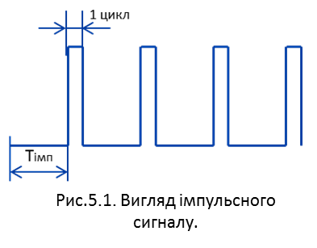

Рис.5.1. Вигляд імпульсного сигналу

 Рішення 1. З використанням таймера.  

Один з простих способів реалізації даної задачі – використати таймер *TON*, який перезапускає сам себе. У мові FBD це має вигляд, як на рис.5.2.

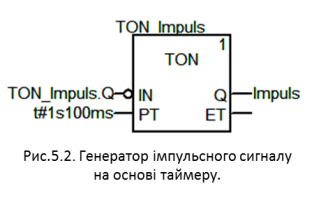

Рис.5.2. Генератор імпульсного сигналу на основі таймеру

При першому циклі контролера таймер *TON_Impuls* не запущений і вихід його *TON_Impuls.Q=FALSE*. Оскільки вихід таймера приходить як інвертований сигнал на його вхід, то на тому ж циклі таймер запуститься і буде в цьому стані до тих пір, поки вихід таймера не стане *TON_Impuls.Q=TRUE*. Вихід спрацює тоді, коли плинне значення таймеру досягне уставки, тобто *TON_Impuls.ET>=TON_Impuls.PT*. Спрацювавши, вихід таймера на наступному циклі скине його, так як його інвертований сигнал подається на вхід *IN*. Скидання таймера приведе до скидання виходу *Q*, що знову приведе до запуску таймера на наступний цикл після скидання. Таким чином вихід *Q* протримається один цикл і буде з’являтися кожні *Тімп=1s100ms*. 

Рішення 2. З використанням системних бітових меандрів. 

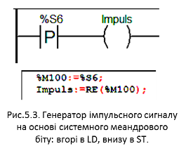

Рис.5.3. Генератор імпульсного сигналу на основі системного меандрового біту: вгорі в LD, внизу в ST

Якщо задана періодичність імпульсів попадає в набір системних – 10 мс, 100 мс, 1 с або 1 хв, можна скористатися системними бітовими меандрами. Бітовий меандр – це почергове слідування значень "0"(FALSE) та "1"(TRUE) з однаковою тривалістю кожного рівня. У операційній системі ПЛК (OS UNITY) вбудовані чотири бітових меандри, доступних через системні біти *%S*:

*%S4 –* 10 мс *(5 мс - TRUE, 5 мс - FALSE);*

*%S5 – 100 мс;*

*%S6 –* 1 с;

*%S7 –* 1 хв.

Імпульс, тривалістю один цикл, з періодичністю у 1 секунду, можна сформувати по передньому чи задньому фронту системного біта *%S6*. На мові LD це може мати вигляд, як на рис.5.3 (вгорі).

У мові ST (рис.5.3 (внизу)) можна використовувати функції *RE* та *FE*, однак перед ними треба робити переприсвоювання у проміжну змінну типу *EBOOL*, так як змінні в комірках *%S* мають тип *BOOL*, з яким дані функції не працюють. 

Системні бітові меандри можна використовувати і для генерації імпульсів з іншою періодичністю, яка кратна їх періодичності. Наприклад, якщо потрібно згенерувати імпульс з періодичністю 1 с 100 мс, можна використати програму яка зображена на рис.5.4. 

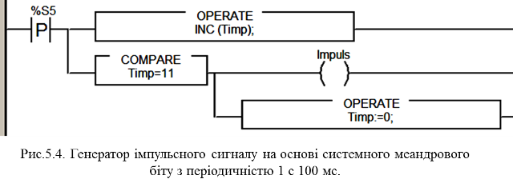

Рис.5.4. Генератор імпульсного сигналу на основі системного меандрового біту з періодичністю 1 с 100 мс

Для цієї програми використовується змінна *Timp* типу *INT*, яка зберігає плинне значення імпульсу в 100 мілісекундній базі. Кожні 100 мс ця змінна збільшується на 1 (для цього використовується процедура *INC*). Коли *Timp* буде рівною 11, тобто через 1 с 100 мс, змінна *Impuls*=*TRUE* а змінна *Timp*=0. На наступний цикл *Impuls=FALSE.* 

Ще одним із варіантів генерування імпульсів є використання блоку SAMPLETM, який описаний в параграфі 6.2.2.

### 5.1.2.  Генерація імпульсів з заданими періодичністю і тривалістю 

Завдання. 

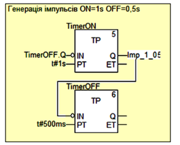

Рис.5.5. Генератор імпульсів з заданими періодичністю і тривалістю

Розробити програму для генерації імпульсів з періодичністю 1 с 500 мс і тривалістю 1 с.

Рішення *.* 

Генератор імпульсів може бути реалізований двома таймерами: *TimerON* – генерує імпульс на включення, а *TimerOFF* – на виключення (рис.5.5). При певних корекціях програми можна обійтись одним таймером, однак для навчального прикладу ми навмисно використали два. 

Обидва таймери мають тип ТР, тобто при запуску (*IN=TRUE*) вони витримують імпульс заданої на вході PT тривалості. На першому циклі роботи ПЛК, до виконання цієї частини програми обидва таймери будуть вимкнені, і на виході видавати *Q=FALSE*. При обробці першого таймеру *TimerON*, він запуститься інвертованим сигналом *TimerOFF.Q*, так як він дорівнює *FALSE*. Відразу, згідно діаграмі таймеру *ТР* спрацює вихід *TimerON.Q*, запираючи в свою чергу таймер *TimerOFF* через інвертований сигнал. Після витриманого часу *PT=t#1s*, імпульс закінчується, тобто вихід *TimerON.Q=FALSE*, що в свою чергу приводить до старту *TimerOFF*, який своїм виходом скидає *TimerON*. По закінченню часу *TP=t#500ms*, скинеться вихід 2-го таймеру (*TimerOFF.Q=FALSE*), що приведе до запуску 1-го таймеру. 

Таким чином два таймери будуть один одного перезапускати. Вихід одного з таймерів використовується як імпульсний сигнал *Imp_1_05*, тобто періодичність його спрацювання буде 1 с 100 мс, а тривалість – 1 с. 

### 5.1.3.  Лічильник мотогодин 

Завдання. 

Розробити програму для підрахунку кількості відпрацьованого двигуном годин (мотогодин). У якості змінної, яка відповідає за стан роботи двигуна використовується *M1_RUN* (типи *BOOL/EBOOL*). Змінна *M1_MTHR_RST* (типи *BOOL/EBOOL*) являється командою на обнулення лічильника мотогодин. 

Рішення 1. Вихідне значення - мотогодини. 

Перед тим, як вирішити задачу, визначимося з типом змінної, яка зберігає кількість напрацьованих мотогодин. Якщо це буде *INT*, максимальна кількість мотогодин буде 32767 годин (біля 3-х років неперервної роботи), *UINT* – 65535 годин (біля 7-ми років неперервної роботи), *DINT* – 2147483648 годин (245 тис. років) а *UDINT* – 4294967295 (500 тис. років). Можливо INT *буде* достатньо, однак для лічильників такого типу є сенс використовувати беззнакові типи, так як вони не можуть бути від’ємними. Тому є два варіанти – *UINT* або *UDINT*.

Для підрахунку мотогодин будемо використовувати лічильник. Однак рахувати будемо не години, а хвилини, так як при підрахунку годин, в момент перекодування годинного меандру двигун може не працювати і вмикатися на 20 хвилин в момент відключеного імпульсу. Це все приведе до великих розбіжностей. Проблему можна вирішити і іншим способом, але в даній задачі ми використаємо хвилинний системний меандр, який доступний в комірці *%S7* (30 с = *TRUE*, 30 с = *FALSE*) і лічильник *CTU_UDINT*. Тип лічильника вибираємо *UDINT*, так як лічильник *UINT* з максимальним значенням 65535 хвилин (45 діб) явно замалий для підрахунку. 

Враховуючи, що вихід лічильника має тип *UDINT*, змінну яка вміщує значення мотогодин *M1_MTHR* є сенс теж визначити як *UDINT*. Таким чином програма має вигляд як на рис.5.6.

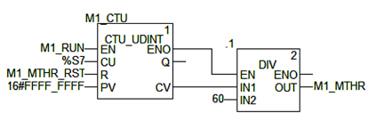

Рис.5.6. Програма для підрахунку мотогодин: рішення 1

Уставка *PV* лічильнику *M1_CTU* ("лічильнику мотохвилин") виставляється максимально можливою. Розрахунок мотогодин проводиться звичайним діленням плинного значення лічильника (хвилини) на 60. Підрахунок імпульсів *%S7* проводиться тільки при працюючому двигуні, так як *M1_RUN* визначає стан виконання блоків через вхід *EN*.

При команді *M1_MTHR_RST* плинне значення лічильника обнуляється. Однак в даній програмі скидання можливе тільки при працюючому двигуні. Для можливості скидання лічильника в будь який момент, можна на вхід *EN* блоку *M1_CTU* подати значення результату логічної операції: *M1_RUN OR M1_MTHR_RST*. 

Рішення 2. Вихідне значення – хвилини, години, доби . 

Це рішення можливо не має такої практичної цінності, як попереднє, однак може допомогти в кращому розумінні роботи програмних лічильників. У даному варіанті необхідно отримувати час напрацювання двигуна в 3-х окремих значеннях: доби, години та хвилини. Для збереження цих значень достатньо розміру типу *UINT*. Хоч для хвилин і годин згодився б і *BYTE*, лічильників з виходом такого типу в *UNITY* немає, але в ньому і немає необхідності. Таким чином, для підрахунку "мотохвилин", "мотогодин" та "мотодіб" використаємо три лічильника типу *CTU_UINT*. Програма має вигляд як на рис.5.7.

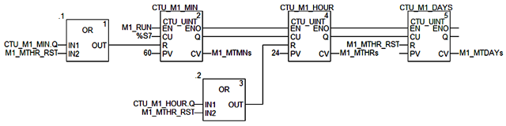

Рис.5.7. Програма для підрахунку мотогодин: рішення 2

Як і в першому варіанті рішення, лічильник *CTU_M1_MIN* в момент роботи двигуна (*M1_RUN=TRUE*) підраховує імпульси хвилинного меандру *%S7*. Плинне значення виводиться в змінну *M1_MTMNs* (тип *UINT*). Уставка для лічильника  *CTU_M1_MIN* дорівнює 60. Це значить, що при досягненні 60 хвилин, на виході Q цього лічильника сформується логічна "1" (*CTU_M1_MIN.Q=TRUE*), яка збільшить на 1 значення лічильника *CTU_M1_HOUR*, тобто прибавить 1 годину до *M1_MTHRs* (тип *UINT*). Вихід *CTU_M1_MIN.Q* протримається один цикл Задачі, так як на наступному циклі він же обнулить лічильник через вхід *R*, "проскочивши" через функцію *OR*. 

Робота лічильників *CTU_M1_HOUR* та *CTU_M1_DAYS* проходить по тому ж принципу. Тобто через 24 години спрацює вихід *CTU_M1_HOUR.Q*, збільшуючи тим самим лічильник діб і скидуючи свій лічильник на наступному циклі.

При команді *M1_MTHR_RST* плинні значення всіх лічильників обнуляються. Однак як і в попередньому прикладі, в даній програмі скидання можливе тільки під час роботи двигуна. Для можливості скидання лічильників в будь який момент, можна на вхід *EN* лічильників подати значення результату логічної операції: *M1_RUN* *OR* *M1_MTHR_RST*.     

### 5.1.4.  Аварійна сигналізація. 

Завдання. 

Розробити програму для аварійної світлової та звукової сигналізації, при наступних умовах. Стан Тривоги (Аварійного попередження) описується діаграмою, зображеною на рис.5.8, де стани означають:

1)  *Alarm OFF* – немає активної та непідтвердженої тривоги (Alarm);

2)  *Alarm ON Not Ack* – є активна непідтверджена тривога;

3)  *Alarm ON Ack* – є активна тривога, але оператор її не підтвердив (не квітував,  *NOT Acknowledge*)

4)  *Alarm OFF Not Ack* – активних тривог немає, але оператор не зробив підтвердження останньої тривоги.

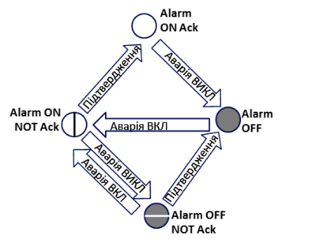

Рис.5.8. Діаграма станів тривоги

Тривога переходить зі стану в стан по 2-м типам подій:

-     виникнення або пропадання аварійного сигналу;

-     команда підтвердження тривоги оператором (квітування тривоги, Acknowledge)

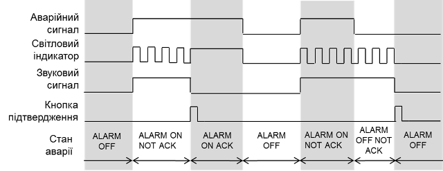 

Світловий індикатор може знаходитись у 3-х станах (рис.5.9):

-     не горить, при *Alarm OFF*, тобто немає активних тривог;

-     мигає, *Alarm ON Not ACK* або *Alarm OFF Not Ack*, тобто коли є непідтвердженні тривоги;

-     горить, при *Alarm ON Ack*, тобто коли є активні тривоги але вони підтвердженні оператором;

Звуковий сигнал може бути у 2-х станах:

-     включений, при наявності непідтверджених тривог;

-     виключений, коли немає непідтверджених тривог;

Рис.5.9. Діаграма роботи світлової та звукової сигналізації

Рішення 1. LD. 

У якості аварійного сигналу будемо використовувати змінну *Alarm*, кнопки підтвердження - *cmdAck*, вихід на звукову сигналізацію – *AlarmSong*, на світловий індикатор – *AlarmLamp*. Один із варіантів програми на мові LD приведений на рис.5.10.

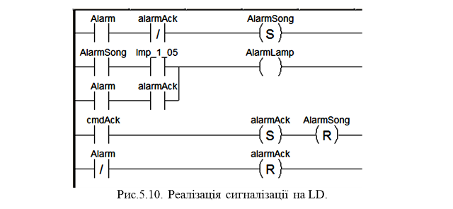

Рис.5.10. Реалізація сигналізації на LD

У програмі використана змінна *Imp_1_05*, яка включається на 1 секунду з періодичністю 1.5 с. Програма для генерації такого імпульсу наведена в прикладі з параграфу 5.1.2. Замість змінної *Imp_1_05* можна використати системний меандр *%S6*. Враховуючи, що кнопка квітування аварії *cmdAck* є без фіксації, у програмі використана проміжна змінна *alarmAck*. 

При активації аварійного сигналу включається AlarmSong. Котушка з фіксацією *-(S)-* не дасть відключитися звуковій сигналізації, навіть якщо аварійний сигнал пропаде. Але якщо квітування відбулося (*alarmAck=TRUE*) – вмикати звукову сигналізацію повторно не потрібно, цим пояснюється нормально замкнутий контакт в розриві.

Працюючий *AlarmSong* говорить про стан "*Alarm ON NOT Ack*" або "*Alarm OFF Not ACK*". У цьому стані світловий індикатор *AlarmLamp* повинен мигати. Це реалізується послідовно з’єднаними контактами *AlarmSong* та *Imp_1_05*. У стані "*Alarm* *ON* *Ack*" індикатор повинен горіти, що забезпечується паралельно підключеним ланцюгом з послідовними контактами *Alarm* та *alarmAck*. 

При натисненні кнопки *cmdAck*, стан квітування зберігається в *alarmAck* одночасно зі зкидуванням звукового сигналу. Обнуляється стан квітування тільки при переході в стан "*Alarm* *OFF*".  

 

Рішення 2. ST. 

У якості аварійного сигналу будемо використовувати змінну *Alarm*, кнопки підтвердження - *cmdAck*, вихід на звукову сигналізацію – *AlarmSong*, на світловий індикатор – *AlarmLamp*. Один із варіантів програми на ST приведений на рис.5.11.

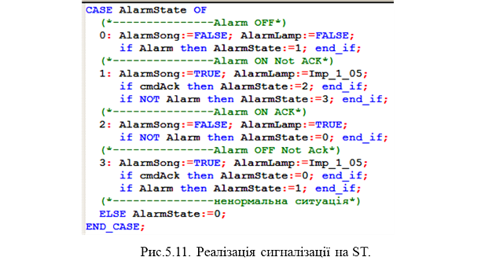 

Рис.5.11. Реалізація сигналізації на ST

Це рішення базується на використанні автоматного підходу. Для визначення кожного стану тривоги, зображеного на рис.5.8, виділена змінна *AlarmState*, яка приймає наступні значення:

*0 - Alarm OFF* 

*1 - Alarm ON Not Ack* 

*2 - Alarm ON Ack* 

*3 - Alarm OFF Not Ack* 

*інші значення* – невизначений стан 

Для визначення стану тривоги використовується програмна структура *CASE*. На кожному із станів визначення значення *AlarmSong* та *AlarmAlamp*, а також умови переходу в інший стан.

 