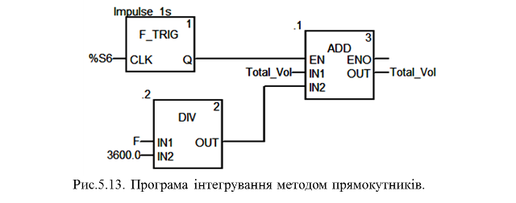
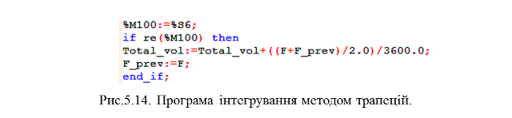
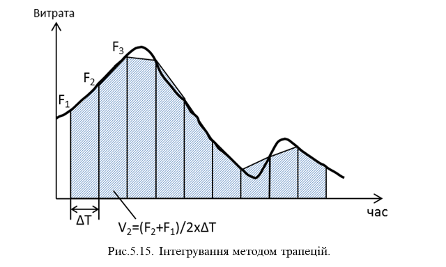
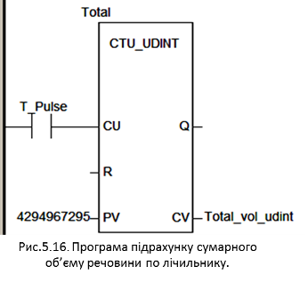
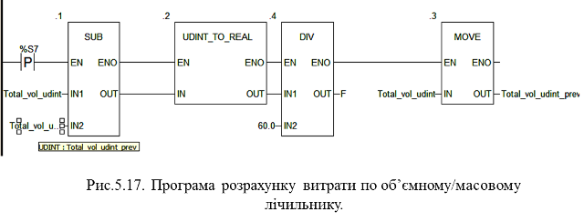

## 5.2. Приклади задач на роботу з витратомірами та лічильниками речовини

Перед тим як приступити до вирішення задач з даної глави, слід згадати деякі визначення.

*Об’ємна витрата* – це об’єм речовини, пройденої через задану площу перерізу потоку за одиницю часу (наприклад л/хв. або м3/годину). *Масова витрата* – маса речовини, пройденої через задану площу перерізу потоку за одиницю часу (наприклад кг/с, кг/год). Для вимірювання витрати використовуються *витратоміри*. Сумарний об’єм (або масу) речовини, що пройшла за певний час через задану площу перерізу потоку, вимірюють *лічильниками*. 

Таким чином витратоміри вимірюють миттєве значення витрати за одиницю часу з метою оцінки швидкості потоку, а лічильники – сумарну, для визначення кількості пройденої речовини. 

Сучасні витратоміри оснащені функціями інтегрування, а лічильники – функціями визначення витрати. Однак інколи обходяться одним або іншим без вбудованих функцій. Розглянемо дві задачі – отримання сумарної кількості речовини по показам витратоміра, і навпаки – отримання миттєвої витрати по лічильнику. 

### 5.2.1. Інтегрування загального об’єму по показам витратоміра 

**Завдання**. 

Розробити програму для інтегрування загального об’єму пройденої речовини по значенню витратоміра. 

**Рішення1. Метод прямокутників**. 

Якщо витрата *F* вимірюється в л/хв, то це відповідає проходженню F/60 літрів за кожну секунду. У загальному випадку, якщо показання витратоміра зчитуються через кожні *delta_t* секунд, то за час *delta_t* через дану ділянку пройде *delta_t*F/60* літрів. Це типова задача інтегрування по часу методом прямокутників. Графічна інтерпретація методу показана на рис.5.12.

Рис.5.12. Інтегрування методом прямокутників

Тобто на кожному перерахунку, через певні інтервали часу, до загальної суми (сумарний об’єм) добавляється *delta_t*F/60* при вимірюванні витратоміром в л/хв., або *delta_t*F/3600* при вимірюванні витратоміром л/год:

​                    Total_vol:=Total_vol+delta_t\*F/3600                (5.1)

При фіксованій *delta_t=1с*, вимірюванні витрати *F* в літрах/годину, програма на FBD для розрахунку загального об’єму буде мати вигляд як на рис.5.13.

Рис.5.13. Програма інтегрування методом прямокутників

Сумарний об’єм перераховується один раз в секунду, для чого використовується бітовий 1-секундний меандр *%S6* та функціональний блок *F_TRIG* для відлову заднього фронту. Таким чином, через кожну секунду буде викликатися блок *ADD*, і до *TotalVol* буде добавлятися *F/3600* (ділення використовується по тій причині, що *F* вимірюється в літрах/годину).

Якщо використовується швидкий АЦП, і потрібний точний перерахунок, виклик можна проводити частіше. Крім того, можна використовувати метод трапецій, який являється більш точним.

**Рішення2. Метод трапецій**. 

Графічна інтерпретація інтегрування методом трапецій показана на рис.5.15.

У даному випадку використовується середнє значення між плинним (*F*) і попереднім значенням миттєвої витрати (*Fprev*):

​             *Total_vol:=Total_vol+delta_t*((F+Fprev)/2)/3600*           (5.2)

Даний варіант реалізуємо на ST (рис.5.14).

Рис.5.14. Програма інтегрування методом трапецій

Слід зазначити, що при розрахунку кількості речовини по показам витратоміру потрібно враховувати, що із-за похибки витратоміра і всього каналу вимірювання може виявитися, що сумарний об’єм за певний час (наприклад добу) значно відрізняється від істинного. Тому для точних підрахунків кількості речовини потрібно використовувати лічильники, а не витратоміри.

Рис.5.15. Інтегрування методом трапецій

### 5.2.2.  Інтегрування за сигналом з лічильника 

**Завдання**. 

Рис.5.16. Програма підрахунку сумарного об’єму речовини по лічильнику

Розробити програму для інтегрування загального об’єму пройденої речовини по імпульсам лічильника: 1 імпульс = 1 літр. 

**Рішення*.*** 

Для збереження сумарного об’єму речовини краще всього використовувати змінну *UDINT* (*0-4294967295*). При видачі об’ємним лічильником імпульсу з кожним пройденим літром, програмний лічильник зможе накопичити *4294967295* літрів. Для підрахунку простіше всього використати блок типу *CTU_UDINT*. Програма на LD в цьому випадку буде мати вигляд як на рис.5.16.

Слід нагадати, що максимальна тривалість циклу Задачі, в якій необхідно підраховувати такі імпульси повинна бути по крайній мірі в 2 рази менше, ніж мінімальна тривалість імпульсу, інакше ПЛК просто не буде встигати відловлювати імпульси. Якщо ж частота імпульсів дуже велика – прийдеться використовувати апаратні лічильні модулі.

### 5.2.3.  Розрахунок витрати за показами лічильника 

***Завдання***. 

Розробити програму розрахунку середньої витрати за показами лічильника з імпульсним виходом. 

**Рішення*.*** 

Якщо використовується лічильник з імпульсним виходом, а потрібно порахувати середнє значення витрати за певний період, можна сумарний об’єм за цей період поділити на тривалість періоду:

​                 *F=(Total_vol-Total_vol_prev)/delta_t*                  (5.3)

Слід врахувати, що при дуже малих *delta_t* точність розрахунку буде дуже низькою, а при великих – інерційність буде дуже високою. Так, наприклад, якщо витрата змінюється 0-10 л/с, то лічильник може видавати імпульс через кожні 0.1 секунди (якщо налаштований на 1 імпульс/1л). Якщо при цьому *delta_t*=1 с, то дискретність значення буде 1/11 літра (0,1,2…10л). Якщо *delta_t* збільшити хоча б до 1-ї хвилини, то дискретність вже буде 1/60 літра, однак періодичність виклику не дасть можливості використовувати його в процесі регулювання. Таким чином розраховану витрату можна використовувати тільки для контролю. 

При *delta_t= 60* с, *Total_vol* в літрах а витрату *F* потрібно рахувати в л/год, то 

​                 *F=(Total_vol-Total_vol_prev)/60*                       (5.4)

На мові LD програма може мати вигляд, як на рис.5.17.

Рис.5.17. Програма розрахунку витрати по об’ємному/масовому лічильнику