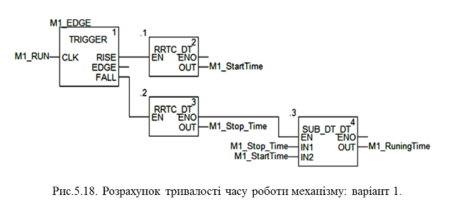
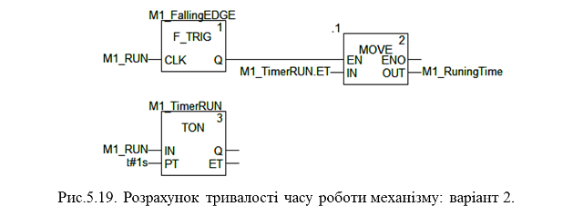

## 5.3. Приклади роботи з годинником реального часу та зі змінними часових типів

Завдання. Розрахунок тривалості часу неперервної роботи механізму

Розробити програму розрахунку тривалості часу неперервної роботи механізму до його останнього вимикання. 

Змінна *M1_RUN* (*BOOL*) відповідає за роботу двигуна *M1* (стан контактів з пускача). Необхідно в момент зупинки двигуна отримати значення часу його роботи.

Рішення1. На основі функцій реального часу*.* 

У цьому прикладі використаємо функції:

-     *RRTC_DT*, яка повертає з ПЛК значення реального часу в форматі типу *DT (Date and Time)*;

-     *SUB_DT_DT*, яка розраховує різницю змінних типу *DT* і повертає значення часу в форматі *TIME*.

Варіант рішення показаний на рис.5.18. У момент пуску запам’ятовується значення реального часу у змінній *M1_StartTime* (тип *DT*). У момент зупинки запам’ятовується значення реального часу у змінній *M1_StopTime* (тип *DT*) а також розраховується різниця між часом пуску та зупинки за допомогою функції *SUB_DT_DT*. Результат різниці отримуємо в змінній M1_RuningTime типу TIME.

Для відлову фронтів використовується функціональний блок *TRIGGER*: вихід *RISE* спрацьовує на один цикл по переході *FALSE->TRUE*, а вихід *FALL* – на один цикл, по переході *TRUE->FALSE*. При використанні *M1_RUN* типу *EBOOL* замість *BOOL*, для відлову фронтів можна користуватися функціями *RE* та *FE*. 

Рис.5.18. Розрахунок тривалості часу роботи механізму: варіант 1

Слід нагадати, що вхід *EN* активує/деактивує виконання функцій та функціональних блоків. Крім того слід відмітити, що максимальне значення у змінних типу *TIME - T#49D_17H_2M_47S_295MS* (49 діб 17 годин). Якщо двигун може робити більше, *SUB_DT_DT* буде оброблений з помилкою, а системний біт *%S18* (*OVERFLOW*) стане рівним *TRUE*.

Даний варіант рішення може бути використаний, коли крім тривалості роботи механізму, треба ще визначати час його останньої зупинки і запуску. У іншому випадку є сенс використовувати друге рішення на основі таймеру. 

Рішення2. На основі таймеру*.* 

Це рішення менш ресурсоємне і більш просте. Воно базується на таймері, який стартує при включенні *M1_RUN* і працює, поки *M1_RUN=TRUE* (рис.5.19). Уставка таймеру дорівнює 30 днів (можливий максимум 49 діб 17 годин). По задньому фронту сигналу *M1_RUN*(зупинка двигуна) вихід таймеру *ET* (плинне значення) записується в *M1_RuningTime*. Якщо двигун може працювати неперервно більше ніж 49 діб 17 годин такий підхід не годиться. 

Для відлову заднього фронту використовується функціональний блок типу *F_TRIG*. При використанні *M1_RUN* типу *EBOOL* замість *BOOL*, для відлову заднього фронту можна скористатися функцією *FE*. 

Рис.5.19. Розрахунок тривалості часу роботи механізму: варіант 2

 