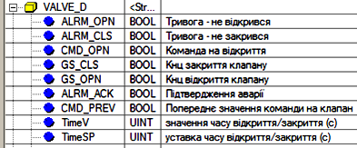
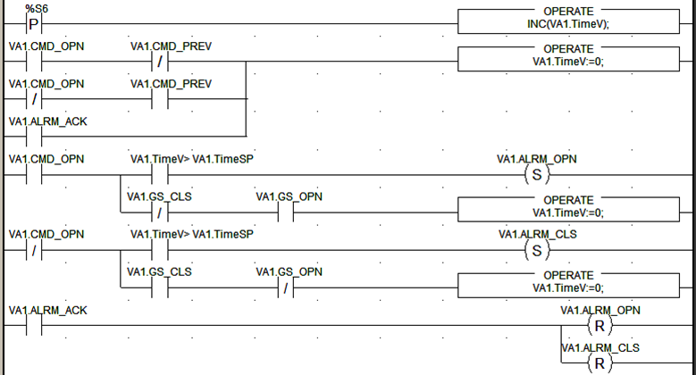
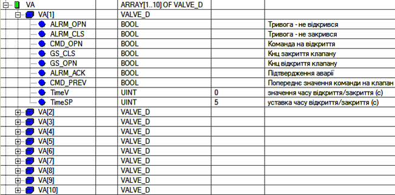
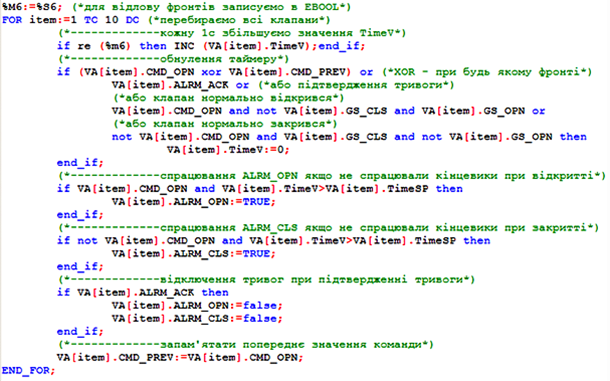

## 5.4. Приклади роботи зі структурами, масивами та циклами

Завдання. Діагностика роботи виконавчих механізмів.

Розробити програму для діагностики роботи виконавчих механізмів з датчиками кінцевого положення штока/заслінки. 

Виконавчі механізми (ВМ) управляються сигналами з ПЛК одним дискретним виходом (*TRUE*=відкрити, *FALSE*=закрити). Для зворотного зв’язку по положенню на ПЛК приходить стан 2-х датчиків кінцевого положення штоків: датчик повного відкриття і датчик повного закриття. Якщо після команди відкриття через заданий час не спрацює кінцевий датчик повного відкриття, або включений датчик повного закриття, то повинен спрацювати біт тривоги відкриття. Те ж саме стосується закриття: якщо після відключення команди відкриття через заданий час не спрацював кінцевий датчик закриття, або включений датчик відкриття – повинен спрацювати біт тривоги закриття. Біти тривоги скидаються при активному біті підтвердження тривоги (квітування). Заданий допустимий час закриття і відкриття однакові.  

Загальні підходи до рішення*.* 

Якщо подібних виконавчих механізмів в програмі повинно бути багато – є сенс розробляти для них структурний тип, на основі якого створювати масив змінних, а потім їх обробляти в одній підпрограмі з використанням циклів. Другий спосіб – створити похідний функціональний блок користувача (DFB) з готовою логікою обробки. Другий спосіб може бути переважаючим, якщо кожна змінна повинна мати унікальне ім’я, або компоненти структури являються незалежними змінними. Тут вирішимо задачу першим способом.  

Для такого типу задач може бути зручним створення структурного типу даних користувача (DDT). Створимо DDT з ім’ям *VALVE_D* (рис.5.20):

Рис.5.20. Структура DDT VALVE_D

Рішення1.Індивідуальна обробка*.* 

Для одиничного випадку діагностики ВМ, тобто без роботи з масивами, або у випадку використання коду програми в DFB, можна використати мову LD, так як для цієї задачі вона добре підходить. Створюємо змінну *VA1* з типом *VALVE_D*, і в поле значення для *TimeSP* прописуємо *TimeSP=5*, тим самим задаємо максимальний час відкриття/закриття рівним 5 секунд.

Нижче наведена програма на LD (рс.5.21). Зверніть увагу, що в програмі взагалі не використовуються таймери. Замість них, використовується системний біт *%S6* (секундний меандр), по передньому фронту якого збільшується на 1 (процедура *INC*) значення плинного часу *TimeV*. Враховуючи, що це значення зберігається для кожної змінної клапана, цей підхід менш ресурсоємний.

Рис.5.21. Програма діагностики роботи виконавчих механізмів 

Плинне значення *TimeV* завжди збільшується, а при нормальній комбінації станців кінцевих датчиків і команди на клапан – обнуляється. Наприклад, при відкритті клапану (*CMD_OPN=TRUE*), при *TimeV>TimeSP* спрацьовує *ALRM_OPN*. Відключення біту *ALRM_OPN* пройде в момент команди квітування (*ALRM_ACK=TRUE*). Аналогічно працює програма контролю закриття.

Значення *TimeV* обнуляється при спрацюванні/відключенні відповідних кінцевих датчиків, а також при зміні напрямку відкриття<->закриття. Останнє потрібно для запобігання спрацьовування обидвох тривог при спрацюванні хоча б однієї з них. Для відлову моменту початку закриття і відкриття потрібно відловити фронти змінної *ALRM_OPN*. 

У програмі фронти відловлюються наступним підходом: використовується змінна *CMD_PREV* для зберігання попереднього значення команди і порівнюється плинне і попереднє значення. Комбінація різних станів *CMD_PREV* та *CMD_OPN* відловить один з фронтів. Нагадаємо, що в LD є спеціальні контакти -|P|- та -|N|-, якими теж можна було б скористатися.

Рішення2. Групова обробка*.* 

Для групової діагностики ВМ по приведеному вище алгоритму є сенс із елементів типу *VALVE_D* створити масив, який потім обробляти з використанням циклів. Тобто кожний елемент масиву буде відповідати за певний ВМ. У прикладі використовуються 10 ВМ, тому масив буде мати вигляд як на рис.5.22.

Рис.5.22. Масив елементів типу VALVE_D

Для кожного елементу масиву задаються свої значення уставок *TimeSP*. Для обробки даних масиву використовується цикл в мові ST (рис.5.23).

 

Рис.5.23. Програма роботи діагностики виконавчих механізмів з використанням масивів

Наведений лістинг програми в основному повторює логіку програми, написану на LD, дещо стиснуту для економії ресурсів. Однак є деякі особливості. У сучасних Modicon змінні в комірках *%S* являються типу *BOOL*, хоч в ранніх версіях вони були *EBOOL*. Однак функції *RE* та *FE*, які призначені для відлова фронтів працюють тільки зі змінними типу *EBOOL*. Тому на початку програми йде переприсвоєння *%S6* в комірку *%M6* (типу *EBOOL)*. Адреса комірки вибрана довільно і замість неї можна скористатися нелокалізованою змінною типу *EBOOL*.

Наступною особливістю є використання функції *XOR* для відлову відмінності попереднього та плинного значення команд на клапан, що значить передній або задній фронт сигналу. 

Все інше – аналогічне попередньому прикладу. Неважко зрозуміти, що об’єм такої програми не залежить від кількості виконавчих механізмів. Однак слід відмітити, що налагоджувати код  з використанням циклів важче, ніж без них, особливо коли немає можливості вставляти точки зупинки, які приводять до зупинки програми. Тому бажано налагодити програму на одному циклі (як в прикладі з одним клапаном) а потім "обгорнути" її інструкціями циклу. 