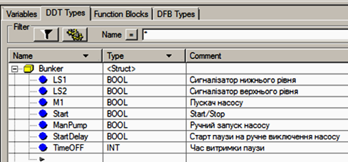
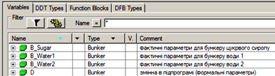
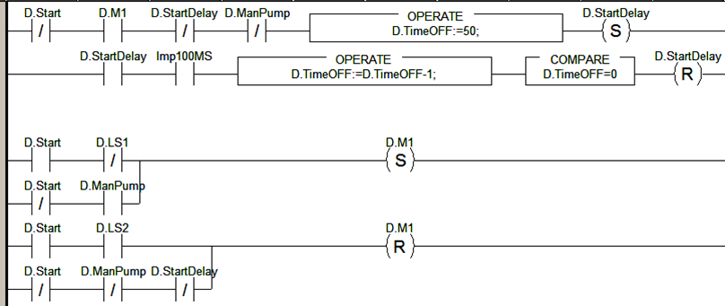
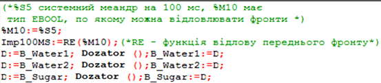
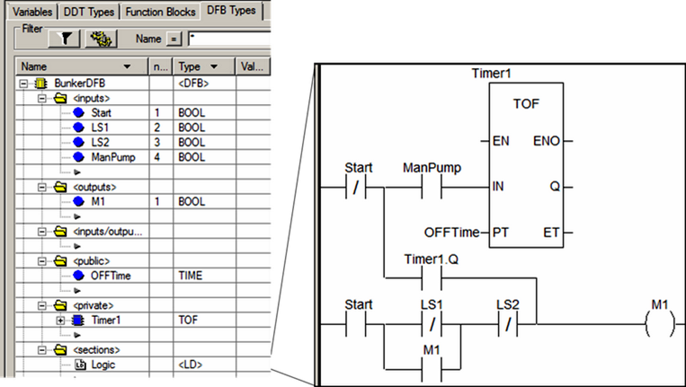
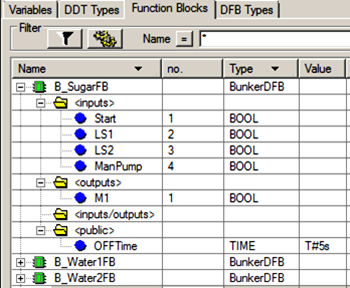
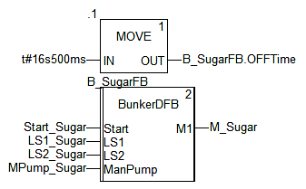

## 5.5. Приклади роботи з підпрограмами та функціональними блоками користувача

Завдання. Управління однотипними бункерами.

Розробити програму для управління трьома бункерами: один – цукрового сиропу, два – води (рис.5.24). 

Рис.5.24. Функціональна схема бункерів 

Робота кожного бункеру описується наступним алгоритмом. У бункерах необхідно підтримувати заданий межами рівень рідини за допомогою насосів *М1*.

 При вибраному режимі *START*, насос *М1* повинен:

-     вмикатися при відключенні сигналізатора *LS1* (нижня межа);

-     вимикатися при спрацюванні сигналізатору *LS2* (верхня межа);

Тобто в бункері повинна постійно знаходитись рідина в межах розміщення сигналізаторів рівнів. 

При вибраному режимі  *STOP*, насос *М1*:

-     вмикається при нажиманні оператором кнопки *ManPump*;

-     вимикається через 5 с по відключенні кнопки.

Загальні підходи до рішення*.* 

Самий простий спосіб вирішення задачі – написати програму для одного бункеру, наприклад як в главі 1.11 і розмножити методом копіювання ще на два бункера. Крім простоти, перевагою даного підходу являється можливість індивідуального підходу до алгоритму управління кожним бункером, а також відносна простота налагодження. Однак якщо індивідуального підходу не потребується, а кількість бункерів буде набагато більше, наприклад десятки, то виникає ряд недоліків в такому підході:

-     при необхідності зміни програми, це потрібно буде робити в кожній копії;

-     величина програми збільшується пропорційно кількості копій; 

Враховуючи однотипність бункерів та однаковий алгоритм управління, є сенс зменшити програму одним із наступних способів:

-     використовуючи підпрограми;

-     використовуючи масиви і цикли: тобто всі змінні закласти в масив з кількістю елементів, яка дорівнює кількості бункерів, а програму обробки вставити в тіло циклу;

Рішення1. З використанням підпрограм *.* 

*SR* (підпрограми) очевидно залишились в UNITY PRO для сумісності зі старими прикладними програмами PL7, при їх конвертуванні в нові версії UNITY PRO. Без них обійтись можна, використовуючи більш зручний механізм DFB. Тим не менше в цьому рішенні ми скористаємося *SR* а також структурами користувача DDT. Нагадаємо, що підпрограми UNITY PRO не можуть приймати фактичних параметрів при виклику. Однак реалізація виклику функцій/процедур з передачею параметрів все одно на нижньому рівні реалізуються приблизно наступним способом: 

-     в стек поміщуються потрібні параметри процедури/функції;

-     запускається потрібна процедура/функція, код якої використовує значення стека;

-     по закінченню процедури або раніше, йде повернення в основну програму, з розміщенням в стек параметрів які повертаються;

Ми можемо скористатися цим же принципом. Однак замість стека ми будемо використовувати яку-небудь виділену область пам’яті. Щоб робити з нею як з єдиним цілим, зручно скористуватися структурними змінними. 

Таким чином послідовність роботи програми буде наступною:

-     в структурну змінну записується потрібні значення вхідних параметрів;

-     запускається підпрограма, код якої використовує значення структурної змінної;

-     по закінченню підпрограми йде повернення в основну програму, де значення вихідних параметрів зчитується  зі структурної змінної;

Створюємо структурний тип користувача DDT "*Bunker*" (рис.5.25).

Рис.5.25. Структурний тип користувача "Bunker"

Всі поля крім останніх двох відповідають за однойменні змінні в задачі з глави 1.11. Призначення полів *StartDelay* та *TimeOFF* описане нижче. Далі необхідно створити 4-ри структурних змінних типу *Bunker* (рис.5.26). 

Рис.5.26. Структурний тип користувача "Bunker"

*D* – змінна, яка використовується в підпрограмі як формальний параметр;

*B_Sugar, B_Water1, B_Water2* - змінні, які використовуються як фактичні параметри.

Основу підпрограми з назвою "*Dozator*" містить код, який приведений в главі 1.11, як альтернативний варіант програми на LD. Однак програму прийшлося дещо модифікувати, а саме:

-     звичайні змінні замінені на структурні по причинам, які описані раніше по тексту;

-     замість таймерів використовується підрахунок імпульсів;

Таймер в підпрограмах використовувати дозволяється, але це завжди буде один і той саме екземпляр на всі виклики, а потрібно щоб таймери працювали незалежно один від одного. Тому таймери *TON* в підпрограмі замінені лічильником імпульсів, які надалі в тексті називаються таймерами. Ці таймери характеризуються наступними значеннями:

- *TimeOFF* – показує зворотній відлік в масштабі 100 мс;

- *StartDelay* – сигналізує про пуск таймеру;

 

Рис.5.27. Структурний тип користувача "Bunker"

Розглянемо роботу програми. У режимі *Start* все працює аналогічно як в альтернативному варіанті рішення задачі у главі 1.11. У режимі Stop (-|/|- *D.Start*) включення *D.M1* проводиться нажиманням кнопки *D.ManPump*, а відключення - по відключенню *D.ManPump* і коли зупиниться таймер *D.StartDelay=FALSE*, алгоритм роботи якого описаний далі.

У режимі *Stop*, і при включеному двигуні *D.M1*, і відключеній кнопці ручного запуску насосу (-|/|- *D.ManPump*), і не запущеному таймері (-|/|- *D.StartDelay*), що відповідає ситуації відпускання кнопки ручного запуску насосу, - час зворотного відліку встановлюється у початкову точку *D.TimeOFF:=50*, і виставляється в *TRUE* змінна *D.StartDelay* (таймер запущений). 

​      Під час роботи таймеру (-| |- *D.StartDelay*), при кожному спрацюванні імпульса *Imp100ms*, змінна *D.TimeOFF* зменшується на 1. Таким чином швидкість зменшення *D.TimeOFF* буде залежати від періодичності спрацювання *Imp100ms*. У основній програмі необхідно забезпечити, щоб *Imp100ms* спрацьовував через кожні 100 мс рівно на один цикл. При цих же умовах перевіряється чи досяг таймер своєї межі, і якщо так - *D.StartDelay* скидається, що значить закінчення роботи таймеру. 

Основну програму запишемо на мові ST (рис.5.28).

Рис.5.28. Основна програма 

Перші два рядки забезпечують генерацію імпульсів *Imp100ms* тривалістю в один цикл і періодичністю 100 мс. Інші три – викликають підпрограму *Dozator*, передаючи туди фактичні параметри шляхом присвоєння змінній *D* (яка слугує формальним параметром) значення потрібних змінних. Після виклику підпрограми, проходить зворотне присвоєння вихідних параметрів

Рішення2. З використанням DFB 

Використання DFB дає більш зручний механізм, ніж використання підпрограм. Створимо похідний тип функціонального блока користувача (DFB Type) з іменем *BunkerDFB*. (рис.5.29) 

Рис.5.29. Похідний тип користувача *BunkerDFB*

Як видно з рис.5.29 секція *Logic* практично не відрізняється від 1-го варіанту реалізації LD у главі 1.11. Єдиною відмінністю є прив’язка уставки таймеру *Timer1.PT* до змінної *OFFTime*, яка визначена в розділі глобальних мінних функціонального блока. Цього не було в постановці задачі, ми його ввели для максимального розкриття гнучкості використання DFB. Таким чином, екземпляри DFB можна налаштувати на конкретний час затримки в режимі *Stop*. 

У змінних проекту достатньо задати три екземпляри DFB, та викликати їх в програмі, прив’язавши входи і виходи блоків до потрібних фактичних параметрів. (рис.5.30).

Рис.5.30. Екземпляри функціональних блоків типу *BunkerDFB*

Частина програми для обробки бункеру з цукровим сиропом показана на рис.5.31. У блоці *".1*" виставляється час відключення *OFF_Time* функціонального блоку *B_SugarFB*. 

Рис.5.31. Виклик *BunkerDFB* для обробки бункеру з цукровим сиропом

 