## 5.6. Приклади створення та використання кусочно-лінійних функцій.

За допомогою кусочно-лінійних функцій можна організувати програмний задавач (формування завдання в залежності від часу), задавач співвідношень *X/Y*, реалізувати кусочно-лінійну апроксимацію нелінійної функції і т.д. Кусочно-лінійна функція визначена в діапазоні всіх дійсних чисел наступною залежністю:

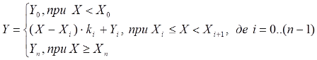   (5.5)

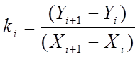(5.6) 

Графічний вигляд кусочно-лінійної функції показаний на рис. 5.32.

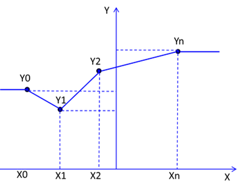

Рис.5.32. Кусочно-лінійна функція

У бібліотеці *ControlLIB* є функціональний блок *LOOKUP_TABLE1*, який реалізовує кусочно-лінійну функцію (див. параграф 6.3.3). Нижче розглянемо написання власного DFB для цих цілей. 

### 5.6.1.  Реалізація кусочно-лінійної функції 

Завдання. 

Розробити DFB для реалізації кусочно-лінійної функції. 

Рішення. 

Координати точок *Xi* і *Yi* у всьому діапазоні будемо задавати 2-ма масивами типу *REAL*. Враховуючи, що кількість точок залежить від задачі, в якій буде задіяний даний блок, масив повинен бути динамічним. У DFB параметри *INPUTS,* *OUTPUTS* та *INOUT* можуть бути визначені як *ANY_ARRAY_xxx* (де *xxx* тип масиву) – динамічний масив, що дозволяє прив’язувати до них фактичні параметри з довільним розміром масиву. Ми скористуємося цією функціональністю. Таким чином інтерфейс типу DFB блока з іменем *PWL_FN* має вигляд як на рис.5.33.

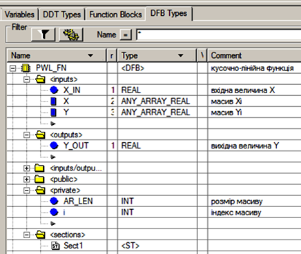

Рис.5.33. Опис DFB-типу PWL_FN 

*X_IN* та *Y_OUT* – відповідно вхід та вихід функції. Масиви *X* та *Y* задають координати вузлів функції. Для роботи DFB визначені внутрішні змінні (*private*) *i* - для задання індексу масиву та *AR_LEN* для визначення довжини масиву. Без останньої можна б було обійтись, але використаємо для наглядності прикладу. 

Програмну секцію є сенс написати на мовах ST або IL, так як використовуються масиви, для обробки яких потрібні цикли (рис.5.34).

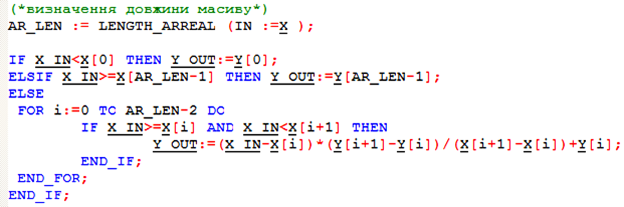

Рис.5.34. Програмна секція DFB-типу *PWL_FN* 

На початку секції визначається довжина масиву за допомогою функції LENGTH_ARREAL, єдиним аргументом якої є один із масивів. Слід відзначити, що:

-     масиви *X* та *Y* обов’язково повинні бути одного разміру;

-     елементи *X* повинні рости з ростом індексу в масиві; 

-     незалежно від того, з якого індексу починається фактичний параметри для *X* та *Y*, в програмній секції DFB масиви завжди будуть починатися з 0;

-     для роботи з динамічними масивами їх необхідно явно дозволити (*Tools->Project* *Settings->Variables->AllowDynamicArray*);

Далі в програмі, в залежності від значень *X_IN* розраховується *Y_OUT*. 

### 5.6.2.  Програма розрахунку об’єму рідини в резервуарі неправильної форми за датчиком рівня 

Завдання. 

Розробити програму для розрахунку об’єму рідини в резервуарі неправильної форми за датчиком рівня. 

Основна концепція*.*

Об’єм рідини в резервуарі правильної форми можна визначити по рівню, підставивши його в формулу розрахунку об’єму. Найбільш простий випадок – це резервуари з незмінним перерізом по вертикалі (наприклад циліндричної форми), що дозволяє доволі просто масштабувати значення з датчика рівня, помноживши його на коефіцієнт. Однак для резервуарів з неправильною формою розрахувати об’єм по рівню доволі проблематично.

Один із способів – це експериментально визначити залежність об’єму від рівня. Для цього на етапі налагодження системи, на нелінійній ділянці (або по всій висоті) резервуара знімається характеристика *V(L)*, де *V* – об’єм рідини, *L* – рівень. Спосіб визначення об’єму і тип датчика рівня в даному випадку не має значення, головне – це отримати кусочно-лінійну апроксимацію залежності з тією точністю, яка потрібна згідно умови задачі. Далі в програмі реалізувати обернену задачу – по заданій характеристиці *V(L)* визначати об’єм по рівню.

Рішення. 

Скористуємось функціональним блоком типу *PWL_FN* з попереднього параграфу. По отриманим точкам *V(L)*, наприклад 6 точок, задаємо два масиви *V(0..5)* та *L(0..5).*  При визначенні масиву можна відразу задати значення елементів при ініціалізації. Далі їх можна змінювати, наприклад в конфігураційних екранах HMI/SCADA. Змінні та програма наведені на рис. 5.35. 

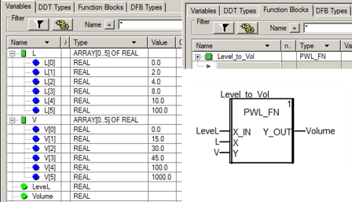

Рис.5.35. Використання DFB-типу PWL_FN при розрахунку об’єму

 

### 5.6.3.  Програмний задатчик 

Завдання. 

Розробити тип функціонального блоку користувача для програмного задатчика.

Основна концепція*.*

У системах з програмним управлінням, регулятор повинен підтримувати значення, задане кусочно-лінійною залежністю від часу. Наприклад залежність може задаватися наступним графіком (рис.5.36).

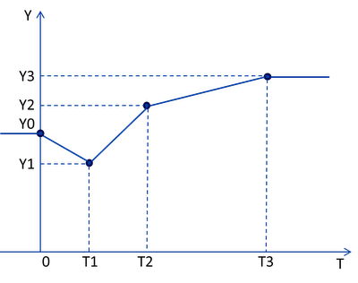

Рис.5.36. Діаграма для програмного задатчика

​     Такий регулятор крім блока, який реалізує один із законів регулювання (наприклад *П, ПІ або ПІД*), повинен вміщувати блок програмного задатчика (далі по тексту ПРЗ), як показано на рис.5.37.

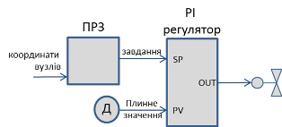

Рис.5.37. Структура регулятору з програмним задатчиком

У UNITY PRO для реалізації функціоналу ПРЗ можна використати бібліотечний блок *LOOKUP_TABLE1,* приклад використання якого показаний в параграфі 6.8.2. Тут розглянемо два варіанти з використанням функціональних блоків користувача.

  Рішення1. З використанням спеціально розробленого DFB.  

Конкретизуємо задачу: необхідно створити тип функціонального блоку, який буде на основі заданих координат 4-х вузлів графіка залежності розраховувати *Y=f(T)*. Даний тип назвемо *PRZ3*. На рис.5.38 представлений виклик екземпляру блоку *PRZ1* та інтерфейс блоку. 

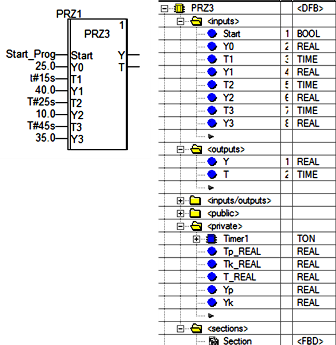

Рис.5.38. Структура DFB-типу PRZ3 та приклад його використання

Вхід *Start* – використовується для запуску внутрішнього таймеру, по якому проводиться розрахунок вихідного значення. При *Start=FALSE* значення виходу *Y* буде дорівнювати значенню ініціалізації *Y0*. Входи *T1,Y1* *і* *T2,Y2* *і* *T3,Y3* – це задані координати відповідних вузлів. Крім розрахункового значення на вихід *PRZ3* також подається значення внутрішнього таймеру. 

Для роботи блоку потрібен таймер, тому в розділі *Private* включений екземпляр типу *TON* з іменем *Timer1*. 

На рисс.5.39-5.40 показана програмна секція блоку *PRZ3*. Ідея заключається в розрахунку значення виходу на кожній ділянці між вузлами. На ділянці *T≤T0* (до старту) значення *Y=Y0*, а на ділянці *T≥T3* - значення *Y=Y3*. Розрахункових ділянок всього три: *0..T1, T1..T2, T2..T3*. У межах цих ділянок вихідне значення розраховується за формулою:

​                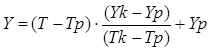  (5.7)

де *Tp,* *Yp* – координати вузла початку ділянки; *Tk,* *Yk* – координати вузла кінця ділянки. 

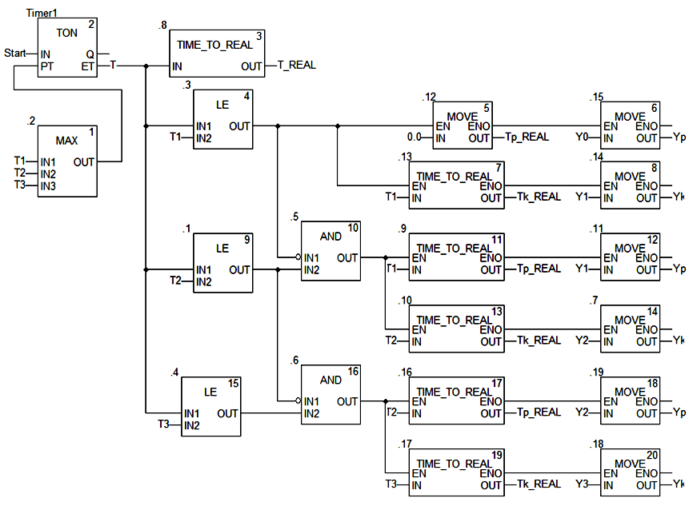

Рис.5.39. Програма DFB-типу *PRZ3*

Тобто, програма визначає на якій ділянці вона знаходиться, і присвоює *Tp,Yp* *та* *Tk,Yk* значення відповідних координат. Враховуючи, що координати *T1,Т2,T3* мають тип *TIME*, їх попередньо необхідно перетворити в тип *REAL*, так як такий тип у виходу *Y.* Таким чином розділ блоку *Private* включає змінні *Tp_REAL,* *Tk_REAL* *и* *T_REAL*. 

У блоці враховується, що кількість вузлів може бути менше ніж 4-ри. У цьому випадку вузли з 0-ю міткою часу не враховуються. Для цього на вхід внутрішнього таймеру *Timer1* в якості уставки подається максимальне значення серед *T1,T2,T3*. 

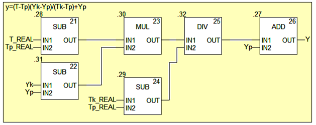

Рис.5.40. Програма DFB-типу *PRZ3* (продовження)

Вихід таймеру *ET* подається на вхід блоку, а також перетворюється в значення типу *REAL*. Далі визначається ділянка, порівнюючи плинне значення таймеру з часовими координатами вузлів. Для запобігання роботи незадіяних вузлів використовується умова спрацювання попередньої уставки по *AND*. На кожній із ділянок відбувається переприсвоєння кінцевих точок. На рис.5.40 показана розрахункова формула на кожній із ділянок.

Рішення2. З використанням блоку *PWL_FN.*

У цьому варіанті використаємо функціональний блок з реалізацією універсальної кусочно-лінійної функції з параграфу 5.6.1. Для цього створюємо два масиви: *Т* – для координат вузлів по часу і *Y* – для координат вузлів по значенням. Програма буде мати вигляд як на рис.5.41.

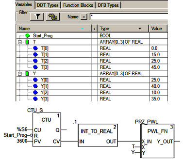

Рис.5.41. Використання *PWL_FN* для формування програмного задатчика

Лічильник *CTU_S* формує значення часу в секундах від початку спрацювання *Start_Prog*.  Для цього на вхід *CU* подаються імпульси системного секундного меандру *%S6*. При *Start_Prog=FALSE*, лічильник обнуляється (*CV=0*). Уставка  *PV=3600* взята довільно, головне щоб була більше *>=45*, так як це остання точка по осі часу (*T[3]=45.0*). Функція *INT_TO_REAL* використовується тільки тому, що *PWL_FN* працює з типом *REAL*. Вихід *PWL_FN* і буде значенням ПРЗ.

Перевагою даного підходу порівняно з минулим заключається в його універсальності та компактності. У параграфі 6.8.2 показаний приклад використання в якості ПРЗ функціонального блоку *LOOKUP_TABLE1.*