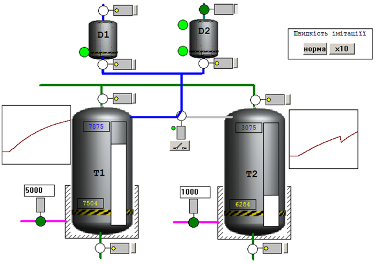
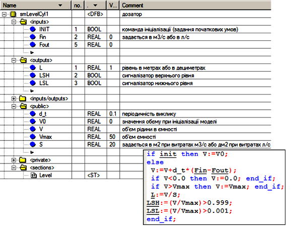
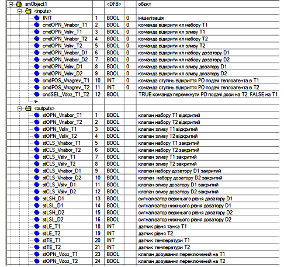
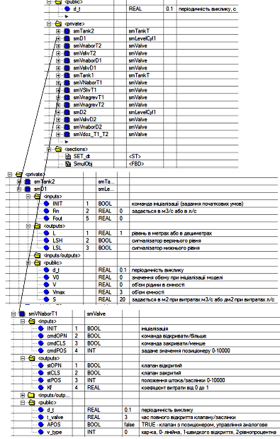
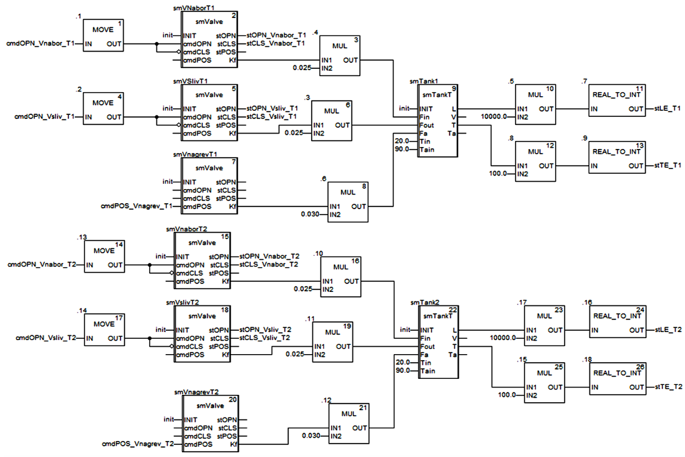
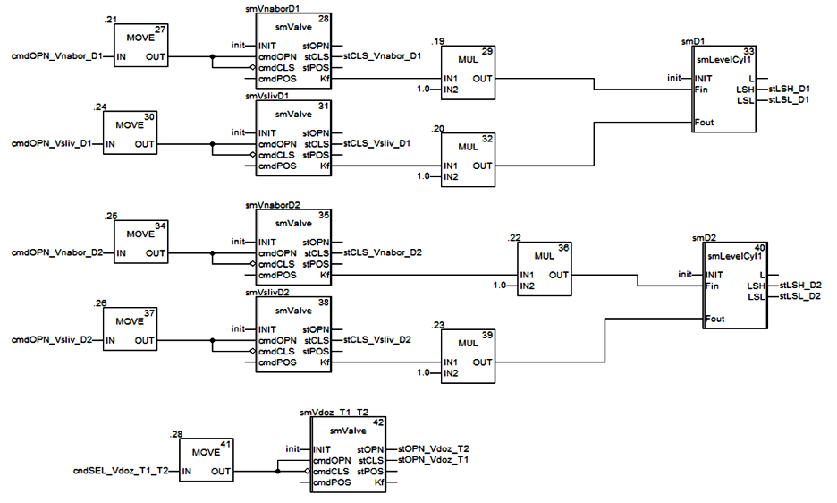
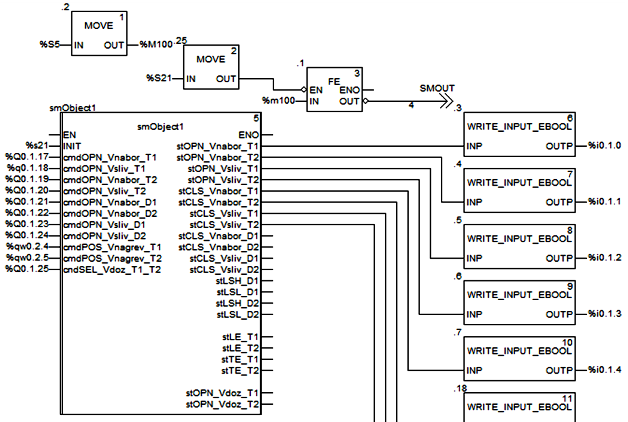

## 5.8. Приклад імітаційної моделі

**Завдання. Імітаційна модель установки з 2-ма танками та дозаторами**

Розробити DFB-блок для реалізації імітаційної моделі установки, опис якої наведений нижче, та показати приклад використання цього DFB блоку.

Установка складається з наступних елементів (рис.5.42):

-  танки Т1 та Т2, в яких готовляться продукти за різними рецептами; танки обв’язані наступними засобами КВПіА:

  - запірні клапани набору та зливу, кожний з датчиками кінцевого положення "закритий" та "відкритий";

  - регулюючий клапан (0-100%) подачі теплоагента у теплообмінний кожух танку (далі по тексту клапан нагрівання);

  - датчик рівня (0-100%) в танку;

  - датчик температури в танку (0-100°С); 

- дозатори (мірні ємності) D1 та D2, які забезпечують подачу дози компоненту; дозатори обв’язані наступними засобами КВПіА:

  - сигналізатор нижнього і верхнього рівнів;

  - запірні клапани набору та зливу, кожний з датчиками кінцевого положення "закритий";

- 3-ходовий клапан перемикання трубопроводу подачі з дозаторів на танки T1 та T2; в нормальному стані положення "на Т1"; має датчики кінцевого положення "Т1" та "Т2".

Модель необхідно розробити з урахуванням наступних припущень:

- ємність і кожух танків і дозаторів – це об’єкти з зосередженими параметрами;
- густини на входах і виходах кожуха і ємності танків та дозатора однакові;
- танки мають ідеальну теплову ізоляцію, тому втратами теплоти в навколишнє середовище можна знехтувати;
- теплова ємність конструкції мала, тому можна знехтувати нею;
- площина теплообміну залежить від ступені заповнення танків;
- кожух танків завжди заповнений рідиною;
- об’єм дозаторів вважається дуже малим порівняно з об’ємом танків, тому можна вважати що витрата з дозаторів не впливає на температуру та об’єм рідини в танку;
- всі ємності являються циліндричними;
- всі виконавчі механізми разом з регулюючими органами мають лінійні витратні характеристики;
- довжиною трубопроводів можна знехтувати;
- характеристики обладнання та речовин наведені в табл. 5.1.

 

Таблиця 5.1. Характеристики обладнання та речовин.

| танки Т1,  Т2                           | Об’єм ємності                               | 1 м3     |
| --------------------------------------- | ------------------------------------------- | -------- |
| Об’єм кожуха                            | 0.05 м3                                     |          |
| Поперечний переріз  ємності             | 1 м2                                        |          |
| Повна поверхня  теплообміну кожуха      | 10 м2                                       |          |
| Коефіцієнт  теплопередачі кожуха        | 2 кВт/(м2°С)                                |          |
| Висота кожуха                           | 1 м                                         |          |
| дозатор D1                              | Об’єм ємності                               | 3 л      |
| Поперечний переріз  ємності             | 20 дм2                                      |          |
| дозатор D2                              | Об’єм ємності                               | 2 л      |
| Поперечний переріз  ємності             | 20 дм2                                      |          |
| рідина                                  | Діапазон витрат рідини  в Т1,  Т2           | 0-25 л/с |
| температура рідини на  вході Т1, Т2     | 20 °С                                       |          |
| густина рідини                          | 1000 кгм3                                   |          |
| теплоємність рідини                     | 4.19 кДж/(кгК)                              |          |
| теплоагент                              | Діапазон витрат теплоагента  в кожух Т1, Т2 | 0-30 л/с |
| температура теплоносія  на вході Т1, Т2 | 90 °С                                       |          |
| густина теплоносія                      | 1000 кгм3                                   |          |
| теплоємність теплоносія                 | 4.19 кДж/(кгК)                              |          |
| компонент дозатора                      | Діапазон витрат  компоента в/з дозатора     | 0-1 л/с  |
| клапан набору Т1                        | час повного відкриття  клапану/заслінки     | 3 с      |
| клапан набору Т2, клапани зливу Т1, Т2  | час повного відкриття  клапану/заслінки     | 4 с      |
| клапани набору та зливу  D1,D2          | час повного відкриття  клапану/заслінки     | 1 c      |

Примітка. Всі наведені характеристики взяті тільки для прикладу і не мають зв’язку з реальним обладнанням.   

**Рішення.** 

Основна концепція. Згідно прийнятого підходу в главі 4.4, імітаційна модель буде являти собою програму, яка використовує стандартні функціональні блоки моделей елементів об’єкту. У даному випадку це будуть 2 ємності дозаторів, які можна змоделювати подібно до об’єкта в параграфі 4.4.5, 2 ємності з теплообмінним кожухом (див. параграф 4.4.6), 8 клапанів з різними настройками (див. параграф 4.4.10). У загальному задача може бути зведена до такої послідовності:

1) корекція імітаційних моделей компонентів (при необхідності); 

2) визначення інтерфейсу DFB імітаційної моделі об’єкту;

3) визначення внутрішніх та глобальних даних DFB імітаційної моделі об’єкту;

4) написання програмної секції DFB імітаційної моделі об’єкту;

5) написання програми та її налагодження для перевірки імітаційної моделі об’єкта. 

Корекція імітаційних моделей компонентів. Враховуючи велику кількість входів/виходів імітаційної моделі ємності в параграфі 4.4.5, спростимо цю модель. Для цього створимо DFB тип smLevelCyl1, структура та програма якого показана на рис.5.43. Крім зменшення кількості вхідних та вихідних потоків, модель має два додаткові виходи для сигналізаторів рівнів: LSH – верхнього, і LSL – нижнього. 

 

Всі інші імітаційні блоки з глави 4.4 використовуються без змін.

Визначення інтерфейсу DFB імітаційної моделі об’єкту. Вхідними параметрами блоку є значення на виконавчі механізми (рис.5.44): для запірних регулюючих органів (РО) - типу BOOL, для регулюючих клапанів - типу INT в діапазоні 0-10000. Вихідними параметрами блоку є стан датчиків: для дискретних - типу BOOL, аналогових  - типу INT в діапазоні 0-10000.

Згідно прийнятого в посібнику підході до імітаційного моделювання, блок повинен включати вхід INIT, через який ініціалізується модель, приймаючи початкові значення.    

Визначення внутрішніх та глобальних даних DFB імітаційної моделі об’єкту. 

Для кожного елементу імітаційної моделі створюється окремий екземпляр DFB, який інкапсулюється в середині екземпляру DFB загальної моделі. Таким чином, для кожного клапану, дозаторів та танків створюється свій екземпляр конкретного типу (рис.5.45). Саме тут визначаються їх глобальні параметри згідно таблиці 5.1. Нагадаємо, що локальні параметри DFB в тому числі і екземпляри функціональних блоків недосяжні для доступу з боку зовнішньої програми. Однак тип DFB блоків повинен бути визначений в проекті. 

Крім екземплярів функціональних блоків, DFB також включає глобальну змінну d_t, призначення якої не відрізняється від прийнятих в інших моделях.    

Написання програмної секції DFB імітаційної моделі об’єкту. DFB включає дві програмні секції (див. рис.5.45): SimulObj, яка реалізовує безпосередньо модель (див. рис.5.47-5.48); SET_dt, яка забезпечує переприсвоювання загального для моделі масштабу часу (періодичності виклику) всім елементам моделі тобто екземплярам блоків (див. рис.5.46). 

Програма реалізації моделі показана на рисс.5.47-5.48. Хоч розрахунки в моделі проводяться в основному з типами REAL, вхідні і вихідні дані повинні бути INT, оскільки передбачається, що модель буде задіяна по 1-му або 2-му варіанту (див. параграф 4.4.2). 

FBD секція складається з 5 ланцюгів:

- імітаційна модель роботи танку Т1 та обв’язаних клапанів;

- імітаційна модель роботи танку Т2 та обв’язаних клапанів;

- імітаційна модель роботи дозатору D1 та обв’язаних клапанів;

- імітаційна модель роботи дозатору D2 та обв’язаних клапанів;

- імітаційна модель роботи 3-х ходового клапану переключення подачі дози на Т1 та Т2; 

У центрі перших двох FBD-ланцюгів (рис.5.47) знаходяться по одному екземпляру DFB типу smTankT, який описаний в параграфі 4.4.6. Ці екземпляри реалізують імітаційні моделі безпосередньо танків. Параметри Tin (температура вхідної рідини) та Tain (температура теплоагента на вході кожуха) задані згідно таблиці 5.1. При необхідності визначення їх, як змінних параметрів (збурення або управління), ці входи можна вивести в зовнішній інтерфейс блоку, або в глобальні параметри блоку. У даній задачі параметри були прийнятими константами навмисно для спрощення моделі. 

Значення входів Fin (вхідна витрата рідини), Fout(вихідна витрата рідини) та Fa(витрата теплоагента) розраховуються по стану відповідних клапанів. Модель усіх клапанів в програмі реалізовані з використанням екземплярів DFB-типу smValve, який описаний в параграфі 4.4.10. Вихід клапану Kf (коефіцієнт витрати, від 0-1) попередньо перемножується на потрібний масштабний коефіцієнт відповідно до діапазону витрат, заданого в таблиці 5.1. Слід звернути увагу, що для запірних клапанів значення глобального параметру APOS повинно бути FALSE, а для регулюючих - TRUE. Усі запірні клапани управляються одним сигналом – на відкриття, який подається з входу інтерфейсу блоку на вхід cmdOPN, тому на cmdCLS подається його інверсна копія. Виходи stOPN та stCLS екземплярів клапанів набору та зливу, подаються на відповідні виходи інтерфейсу блоку для імітації роботи датчиків кінцевого положення штоку. 

     

Робота наступних двох FBD-ланцюгів працює подібним чином (рис.5.48). У центрі ланцюга використовуються блоки типу smLevelCyl1, який описаний вище. Конструктивні параметри задаються в дециметрах, а витратні – в літрах. Клапани набору та зливу мають тільки датчики положення "закритий". 

Імітація роботи 3-х ходового клапану заключається тільки в часових характеристиках спрацювання датчиків кінцевого положення, оскільки зроблені припущення для моделі дозволяють не враховувати вплив витрати з дозаторів на об’єм рідини в танках. 

Написання програми та її налагодження для перевірки імітаційної моделі об’єкта. Для перевірки роботи імітаційної моделі необхідно створити екземпляр DFB блоку, який потім викликати в програмі з прив’язкою до потрібних фактичних параметрів (рис.5.49). У якості входів можна використати вихідні змінні або адреси типу %Q та %QW. Виходи не можна безпосередньо прив’язати до %I та %IW, так як ці адреси доступні тільки для читання. Однак для запису в ці комірки можна використати функції WRITE_INPUT_EBOOL та WRITE_INPUT_INT, які описані в параграфі 4.2.3. На рис.5.49 показаний тільки фрагмент програми, інші виходи використовуються аналогічно.  

Ініціалізація моделі проходить по умові %S21=TRUE. %S21 – це системний біт, який переводиться в TRUE на першому циклі Задачі, і скидується на наступному циклі (див. параграф 3.4.5). Таким чином для ініціалізації моделі достатньо перезапустити Задачу в ПЛК (STOP, RUN). 

Для періодичного виклику моделі використана зв’язка %S5->%M100->FE-> JUMP. %S5 системний меандр, який змінюється з періодичністю 100 мс. Комірка %M100 використана для можливості відлову фронтів. Таким чином по задньому фронту %M100, тобто кожні 100 мс на один цикл на виході FE буде формуватися TRUE. Інвертований сигнал на виході FE буде відправляти програму на виконання по мітці SMOUT (знаходиться нижче блоку імітації, на рис. не показана) завжди, окрім моменту спрацювання заднього фронту. Таким чином, блок smObject1 буде викликатися 1 раз в 100 мс а також в момент спрацювання %S21, тобто на 1-му циклі Задачі.    

Один із зручних способів перевірки моделі – це використання операторського екрану, як наприклад на рис.5.42. Окрім індикаторів датчиків та елементів управління виконавчими механізмами (кнопок, полів для вводу) можна вивести команди на зміну значення масштабу часу, тобто глобального параметру d_t, який впливає на швидкість імітації. У прикладі до кнопки "х10" прикріплена команда запису уставки smObject1.d_t:=1.0, що вказує на масштаб часу 1 с. Враховуючи що фактична періодичність виклику при цьому не змінюється (100 мс), модель буде працювати в 10 раз швидше ніж в реальному часі. 