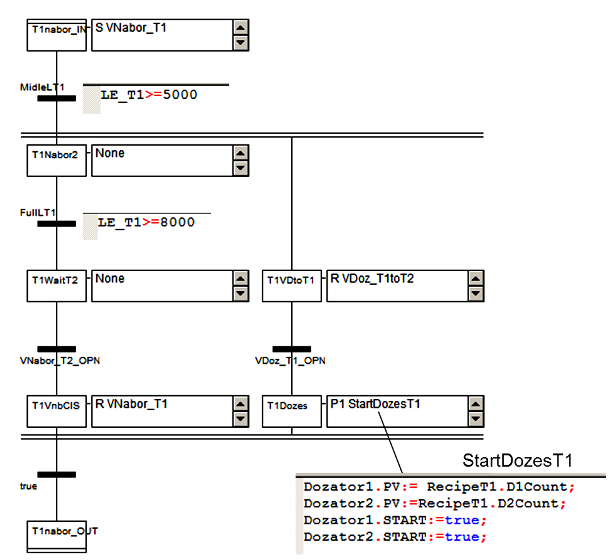

## 5.5. Приклад використання мови SFC

**Завдання**. **Програма управління танком**

**Елементи установки.** Створити проект з ПЛК М340, для реалізації програми управління установкою, що складається з наступних елементів (рис.5.59):

-  танки *Т1* та *Т2*, в яких готовляться продукти за різними рецептами; танки обв’язані наступними засобами КВПіА:

·     запірні клапани набору та зливу, кожний з датчиками кінцевого положення "закритий" та "відкритий";

·     регулюючий клапан (0-100%) подачі теплоагента у теплообмінний кожух танку (далі по тексту клапан нагрівання);

·     датчик рівня (0-100%) в танку;

·     датчик температури в танку (0-100°С); 

-  дозатори (мірні ємності) *D1* та *D2*, які забезпечують подачу дози компоненту; дозатори обв’язані наступними засобами КВПіА:

·     сигналізатор нижнього і верхнього рівнів;

·     запірні клапани набору та зливу, кожний з датчиками кінцевого положення "закритий";

-  3-ходовий клапан перемикання трубопроводу подачі з дозаторів на танки *T1* та *T2*; в нормальному стані положення "на Т1"; має датчики кінцевого положення "*Т1*" та "*Т2*".

Рис.5.59. Операторський екран для контролю та управління за процесом приготування продукту

**Опис алгоритму задач управління установкою.** Управління дозаторами та танками повинно бути розв’язане одне від одного (але координоване), оскільки дозатори можуть бути використані в інших процесах. Дозатори в стані очікування завжди повинні бути наповнені. 

Управління процесом приготування повинно відбуватися за таким алгоритмом:

1)  У початковому стані (старті ПЛК) клапани набору та зливу танків *Т1* та *Т2* повинні бути закритими. Закритість клапанів контролюється кінцевими датчиками положення. Після цього система управління приготуванням продукту переходить в стан готовності.

2)  Оператор повинен задати рецепт продукту для приготування в *Т1* та *Т2*. Рецепт включає наступні поля:

a.   кількість доз компоненту з *D1*;

b.   кількість доз компоненту з *D2*;

c.   температуру попереднього нагрівання;

d.   час витримки;

3)  Після натискання оператором кнопки "Пуск" відкривається клапан набору танку *Т1.*

4)  Після досягнення рівня 50% паралельно з набором включається дозування компонентів *D1* та *D2* відповідно до рецепту. 

5)  При досягненні рівня 80%, відкривається клапан набору танку *Т2*.

*6)*  Коли клапан набору *Т2* повністю відкрився (по датчику положення "відкритий"), клапан набору *Т1* закривається, і паралельно з приготуванням продукту в *Т1* йде наповнення і приготування продукту в танку *Т2.*

7)  При досягненні рівня 50% в *Т2* паралельно з набором включається дозування компонентів *D1* та *D2* відповідно до рецепту. Якщо дозатор в цей час використовується при дозуванні *Т1*, необхідно дочекатися закінчення роботи дозаторів.

8)  При досягненні рівня 80%, закривається клапан набору танку *Т2*.

9)  Після закриття клапану набору в танку *Т1* (в наступних пунктах для *Т2* аналогічно) і закінченні дозування, відкривається повністю клапан подачі теплоагента; 

10)   Рідина в танках повинна нагрітися до вказаного в рецепті значення, після чого клапан залишається відкритий на 10% протягом вказаного в рецепті часу;

11)   Після витримки відкривається клапан зливу і рідина зливається з танку;

12)   Через 5с після досягнення рівня менше 1% клапан зливу закривається;

13)   Коли обидва танки *Т1* та *Т2* порожні, система переходить в початковий стан.

У будь який момент часу система повинна мати можливість переходу в початковий стан.

**Рішення**. 

**Апаратна конфігурація та змінні вводу/виводу.** 

Рис.5.60. Конфігурація ПЛК М340 до задачі

Відповідно до поставленої задачі, необхідно 15 дискретних входів, 9 дискретних виходів, 4 аналогові входи і 2 аналогові виходи. Один з варіантів вибору апаратної конфігурації показаний на рис.5.60.  

Для прив’язки до входів та виходів можна створити локалізовані змінні, які показані на рис.5.61. Також створені 2 змінні: *Pusk* для запуску процесу, і *InitSFC* для можливості переводу системи в початковий стан.  

  **Загальні принципи роботи програми.** Для реалізації даної задачі використовуються 4-ри секції (рис.5.62): "*D1*" і "*D2*" (на мові SFC) для управління дозаторами, "*Production*" (на мові SFC) для управління приготуванням продукту, та "*CTRL_SFC*" (на мові LD) для ініціалізації мереж SFC в цих секціях (скидання кроків і перехід на початковий крок). Секція "*Simulation*" призначена тільки для імітації об’єкта і є необов’язковою. 

 

Рис.5.61. Вхідні, вихідні змінні та змінні управління  

**Управління дозаторами.** Дозатори управляються незалежними автоматами станів, які реалізовані через секції *D1*та *D2*. Вони ідентичні по своїй структурі і відрізняються тільки використовуваними змінними. Для формування завдання (кількість доз), його запуску та виконання використовуються структурні змінні *Dozator1* та *Dozator2* заздалегідь створеного типу *Dozator* (рис.5.63). 

При ініціалізації мережі SFC (рис.5.62) закривається клапан *VSliv_D1*, та на один цикл (специфікатор Р) запускається секція *Dinit1*, де обнулюються поля *START* та *PV* структурної змінної управління дозуванням *Dozator**1*. Коли клапан зливу закривається, що сигналізується його датчиком кінцевого положення, - відкривається клапан *VNabor_D1*. Клапан набору буде до тих пір відкритий, поки крок *D1_Nabor* активний (специфікатор N), тобто поки не спрацює сигналізатор верхнього рівня *LSH_D1*. Після спрацювання датчика кінцевого положення закриття клапану набору, програма переходить до кроку *D1Ready*. На цьому кроці програма очікує команду дозування *Dozator1.START*, яка повинна надійти (змінитися в *TRUE*) з іншої частини програми. 

Рис.5.62. Структура задачі MAST та Секція "D1" для управління дозатором D1  

Процес роботи дозування заключається у відпрацюванні заданої кількості вивантажень дози, що підраховується змінною-лічильником *Dozator1.CV*. Тому при *Dozator1.START=TRUE*, протягом одного циклу активності *D1Sliv* відбувається збільшення значення *Dozator1.CV* на 1. Крок буде активний а клапан *Vsliv_D1* буде відкритий до тих пір, поки не відключиться сигналізатор нижнього рівня, що сигналізує про порожність дозатору. 

Крок *D1VSlvCLS* буде активний до тих пір, поки не спрацює датчик кінцевого положення закриття клапану зливу (*VSliv_D1_Cls)*. На останньому циклі активності кроку запускається секція *D1Count*, в якій при досягненні кількості доз рівній уставці, скидається команда *Dozator1.START* і обнулюється плинне значення лічильника. Слід зазначити, що після останньої вивантаженої дози, дозатор все одно набирається, що задовольняє умовам задачі.

Рис.5.63. Структурні типи та змінні проекту

**Управління приготуванням продукту.** Секція управління приготуванням продукту "*Production*" побудована з використанням макрокроків (рис.5.64). При ініціалізації мережі SFC проходить закривання всіх клапанів танків *Т1* та *Т2*. Ініціалізація закінчується при спрацюванні датчиків положення "закрито" клапанів набору та зливу. 

Для одночасності процесів приготування продуктів в танках *Т1* та *Т2* використане паралельне відгалуження. Кожна з гілок після ініціалізації переходить в стан готовності (кроки *T1Ready* та *T2Ready*):

-            для танку *Т1* це очікування кнопки *Pusk*;

-  для танку *Т2* це закінчення набору *Т1*, що сигналізується активністю кроку *T1WaitT2* (*T1WaitT2.x=TRUE*).  

Кожна з паралельних гілок ідентичні одна одній, за винятком певних особливостей, що стосуються координації їх роботи. Тому розглянемо тільки гілку для управління танком *Т1* і особливості гілки *Т2*. Гілка управління *Т1* включає 3 макрокроки, які відповідають за певний етап роботи: *T1Nabor* – за набір і дозування, *T1Nagrev* – за нагрівання і витримку, *T1Sliv* – за вигрузку продукту. 

Рис.5.64. Секція "*Production*" для управління виробництвом продукції 

Макросекція кроку *T1Nabor* показана на рис. 5.65. Вхідний крок макросекції активує відкриття клапану *VNabor_T1*, специфікатор *S* вказує на те, що після деактивації кроку, клапан повинен залишитись відкритим. Після наповнення 50% (умова в секції *MidleLT1*: *LE_T1>=5000*) мережа SFC знову ділиться на 2 паралельні гілки: ліва гілка для повного наповнення танку, права – для дозування.

 Таке розгалуження дає можливість вчасно закрити клапан набору, навіть якщо дозування ще не закінчилось. 

Рис.5.65. Макросекція "*T1Nabor*"

Після наповнення рівня до 80%, ліва гілка переходить до кроку *T1WaitT2*, активність якого (*T1WaitT2.x=TRUE*) сигналізує гілці управління танком Т2, що необхідно відкривати клапан набору танку *Т2* (рис.5.64, перехід *T1WaitT2.x*). Після спрацювання датчика положення "відкрито" клапану набору танку *Т2* *VNabor_T2_OPN*, закривається клапан набору *Т1* (*R VNabor_T1*).

Перший крок правої гілки *T1VDtoT1* перемикає 3-х ходовий клапан в положення дозування в танк *Т1* (*VDoz_T1toT2=FALSE*). Після спрацювання датчика положення запускається процес дозування шляхом задання кількості доз для *D1* і *D2* згідно рецепту, і запуску дозаторів шляхом подання команди *START* (див. рис. 5.65).

Після початку дозування, якщо команда закриття на клапан набору відправлена, тобто коли активні кроки *T1VnbCls* і *T1Dozes*, йде вихід з макросекції.

Умовою переходу до макрокроку *T1Nagrev* (рис.5.64) є спрацювання датчика кінцевого положення "закрито" клапану набору *Т1*.

Для *Т2*, макросекція набору має аналогічну структуру, за винятком відсутності кроку очікування відкриття сусіднього танку і присутності кроку очікування закінчення дозування (рис.5.66). Таким чином програма набору танку *Т2* перед дозуванням буде чекати поки дозатор не відпрацює всі замовлені для нього дози, тобто поки *Dozator1.START* та *Dozator2.START* не стануть рівними *FALSE*.    

Рис.5.66. Макросекція "*T2Nabor*"

Макросекція нагрівання (рис.5.67) починається з відкриття клапану нагрівання на 100%. Специфікатор *Р1* вказує на те, що дія виконається один раз, при активації кроку. При досягненні заданої в рецепті температури, крок *T1Vytrym* отримує маркер. При активації кроку клапан нагрівання прикривається до 10%, при деактивації (специфікатор *Р0*), клапан закривається повністю. Сам крок залишається активним протягом заданого в рецепті часу, тобто поки не спрацює умова переходу задана в секції *DelCompleteT1*: *T1Vytrym.t>=RecipeT1.Delay*, де *t* – час активності кроку. Після виходу з макросекції нагрівання, маркер автоматично переходить до макрокроку вигрузки *T1Sliv* (див. рис.5.68), так як умова переходу завжди *TRUE*.

 

Рис.5.67. Макросекція "T1Nagrev"

Макросекція *T1Sliv*, починається з відкриття клапану зливу (рис.5.70).

Рис.5.68. Макросекція "T1Sliv"

При досягненні рівня в танку *Т1* менше ніж 1% (100 в діапазоні *0-10000*), активується крок витримки *PauseT1*, яка потрібна для повного випорожнення танку. Час затримки досягається за рахунок налаштування мінімального часу активності кроку *Delay*=*T#5s*. Умова переходу *TRUE*, відразу пропускає маркер на крок *T1VSlivClose,* в якому відбувається закриття клапану зливу. Після спрацювання датчика "закритий" клапану зливу *Т1*, і активності останнього кроку в гілці управління *Т2* маркер покидає макросекцію, з’єднується з маркером з паралельної гілки і переходить на крок ініціалізації (рис.5.64) . 

Рис.5.69. Секція CTRL_SFC для ініціалізації SFC

**Секція ініціалізації мереж SFC.** Для запобігання "зависання" маркеру на певному кроці при нештатній ситуації, в програмі передбачена секція ініціалізації мереж SFC під назвою "*CTRL_SFC*". Секція написана на мові LD (рис. 5.69) і виконується на кожному циклі Задачі MAST, незалежно від активності кроків SFC. При спрацюванні змінної-команди *InitSFC*=*TRUE* (див. на рис.5.59 кнопка "ІніціалізКроків") через виклики системної функції *INITCHART* ініціалізуються всі мережі SFC секцій *Production*, *D1* та *D2*:

-  при переході *InitSFC* з *FALSE->TRUE* скидає (деактивує) всі кроки;

-  при переході *InitSFC* з *TRUE -> FALSE* ініціалізує мережі SFC, тобто активує початковий крок. 

Функція *INITCHART* розглянута в параграфі 3.10.7. 

**Перевірка роботи програми.** Для перевірки роботи програми можна скористатися секцією імітації, яка описана у главі