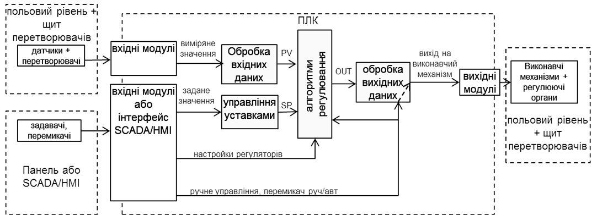
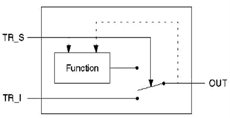
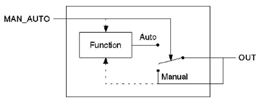
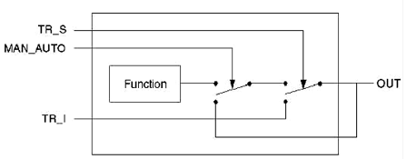

## 6.1. Загальні принципи використання бібліотечних FFB для побудови контурів регулювання 

### 6.1.1. Структура контурів регулювання 

У даному розділі розглядаються принципи побудови контурів регулювання з використанням бібліотечних FFB UNITY PRO. Слід нагадати, що крім бібліотечних функцій, у вищих версіях процесорних модулів TSX Premium доступні вбудовані контури регулювання (канали Loop Control), програмне налагоджування яких виконується шляхом конфігурування. Користувач заповнює попередньо сконфігуровані схеми контурів управління вказуючи зв‘язок їх з вхідними і вихідними величинами і вказуючи режими їх роботи. Робота з вбудованими в процесорний модуль контурами регулювання виходить за рамки даного посібника. 

На рис.6.1 показана узагальнена функціональна структура контурів регулювання з використанням ПЛК. 

Бібліотеки UNITY PRO нараховують велику кількість блоків для реалізації наведених на рис.6.1 функцій. Частина з них присутні у бібліотеці для сумісності з проектами, які конвертуються з середовищ CONCEPT та PL7. Це такі сімейства блоків:

- CLC_INT бібліотеки Base Lib (PID_INT, PWM_INT, SERVO_INT);

- CLC бібліотеки Obsolete Lib (PI1, PID1, PIDP1 та інші);

- CLC PRO бібліотеки Obsolete Lib (PI, PID, PID_P, PIP, PPI, PWM та інші).

Сімейства бібліотеки Obsolete Lib  не рекомендується використовувати у новостворюваних проектах UNITY PRO. Процедури сімейства CLC_INT бібліотеки StandardLib реалізовують цілочисельне регулювання аналогічне тому, яке використовувалось в PL7 PRO. Ці блоки розглянуті в главі 6.7.

Більшість з наведених на рис.6.1 функцій реалізуються з використанням елементів FFB бібліотеки "Control Library", яка поставляється разом з UNITY PRO. Використанню FFB з цієї бібліотеки якраз і присвячений даний розділ.   

У центрі контурів регулювання знаходиться регулятор (алгоритми регулювання), який в UNITY PRO може бути реалізований через один із доступних функціональних блоків із сімейства "Controller": PI_B (ПІ-регулятор), PIDFF (ПІД-регулятор), STEP2 (2-позиційний регулятор), STEP3 (з-позиційний регулятор). Окрім самих регуляторів додатково з цього ж сімейства можуть бути використані блоки AUTOTUNE (автонастройка), IMC (коректор моделі), SAMPLETM (диспетчер виклику функціональних блоків). Ряд з цих функціональних блоків розглянуті в главі 6.2. 

Значення регульованої величини, яке поступає з датчиків на програмний регулятор, попередньо повинен бути оброблений. Це зв’язано з тим, що всі реалізації регуляторів сімейства "Controller" оперують зі значеннями типу REAL, а оцифроване значення з аналогових вхідних модулів має тип INT (в діапазоні 0-10000). Крім того вимірювальне значення може бути зашумлене та потребувати додаткової обробки. Для обробки вхідних даних контурів управління можуть бути використані блоки сімейств "Conditioning", "Measurement" та "Mathematics", які розглядаються в главі 6.3.

Контури регулювання повинні мати можливість працювати в ручному режимі, при цьому повинна бути забезпечена безударність переходу. Крім того, для деяких типів виконавчих механізмів необхідне додаткове перетворення сигналу. Для такого типу перетворення вихідного сигналу регуляторів призначені блоки сімейства "Output Processing", які розглянуті в главі 6.4.

Для формування та управління уставками регуляторів можна скористатися FFB сімейства "Setpoint management", які розглянуті в главі 6.5.

На будь якому з етапів перетворення та алгоритмічної обробки даних можуть знадобитися блоки додаткової обробки з сімейства "Conditioning", які розглянуті в главі 6.6. 

### 6.1.2.  Режим слідкування (Tracking) 

Багато функціональних блоків бібліотеки управління підтримують управління операційним режимом. Доступні такі режими:

- Tracking (режим слідкування);

- Manual/Automatic (ручний/автомат) 

Слідкування дає можливість переводити функціональний блок в стан управління його виходом із зовні (рис.6.2).

 

Управління режимом проводиться сигналом TR_S (TRacking Switch). У нормальному режимі\ (TR_S = 0) значення виходу функціонального блоку OUT визначається закладеним в нього алгоритмом (Function). У режимі слідкування\ (Tracking\, TR_S = 1) вихід OUT дорівнює значенню входу TR_I (TRacking Input).

 Для забезпечення безударності переходу між режимами, внутрішній алгоритм відслідковує значення виходу. Тобто в момент переходу з режиму Tracking в нормальний режим, вихід алгоритму буде дорівнювати входу TR_I. 

Режим Tracking може бути використаний в наступних ситуаціях:

1) ініціалізація функціонального блоку в початковій фазі функціонування, тобто при першому виконанню блоку;

2) режим слідкування функціонального блоку в дубльованому ПЛК (в системах Hot Standby TSX Premium/Quantum), для гарантування безударності запуску резервного контролеру;

3) безпосереднє управління виходом функціонального блоку, тобто коли вихід блоку повинен визначатися зовнішнім алгоритмом.   

### 6.1.3.  Режими Ручний/Автомат (Manual/Automatic) 

Вибраний режим ручний/автомат визначається значенням входу MAN_AUTO (рис.6.3). У автоматичному режимі (MAN_AUTO=1) вихід функціонального блоку OUT дорівнює виходу внутрішнього алгоритму (Function).

У ручному режимі (MAN_AUTO=1) вихід OUT не залежить від розрахункового значення закладеного алгоритмом, і може бути змінена ззовні (наприклад засобами HMI). 

Для забезпечення безударності переходу між режимами, внутрішній алгоритм відслідковує значення виходу. Тобто, при переході з режиму з Manual в Auto, вихід алгоритму буде дорівнювати останньому значенню виходу.

Якщо функціональний блок підтримує обидва типи операційних режимів Tracking і Manual/Automatic, режим Tracking має вищий пріоритет (рис.6.4). Це значить, що в режимі Tracking вихід OUT буде дорівнювати TR_I незалежно від стану  MAN_AUTO. 

### 6.1.4.  Періодичність виклику FFB та контроль за помилками

Багато функціональних блоків зав’язані на часових інтервалах між викликами, наприклад для розрахунку інтегральної та диференційної складової в ПІД-регуляторі. У багатьох ПЛК для правильної роботи таких блоків необхідно викликати їх періодично. У UNITY PRO функціональні блоки бібліотеки управління ControlLIB розраховують ці інтервали автоматично, що дає можливість викликати їх без забезпечення періодичності. Тим не менше, в деяких випадках бажано задати періодичність виклику, наприклад:

- оптимізація часу виконання циклів, розподіливши виклик операцій регулювання між різними циклами;

- покращення якості управління в контурах з серводвигунами, для зменшення частоти обробки блоку SERVO;

- мінімізація навантаження на виконавчі механізми (збільшення періодичності виклику – зменшення частоти зміни положення);

Для управління періодичністю виклику функціональних блоків можна використати EFB типу SAMPLETM (див. параграф 6.2.2), вихід якого може управляти входом EN потрібного функціонального блоку управління.

Контроль виконання багатьох FFB бібліотеки проводиться шляхом аналізу вихідного слова STATUS. Призначення перших 8-ми біт цього слова (0..7) однакові для всіх функціональних блоків, призначення інших 8-ми (8..15) залежить від функціонального блоку.

Таблиця 6.1.

|           |                                                              |
| --------- | ------------------------------------------------------------ |
| Bit 0 = 1 | Помилка  при розрахунку значення з плаваючою комою (наприклад отримання квадратного  кореня з від’ємного значення) |
| Bit 1 = 1 | Недозволене  значення було записане у вхідне значення з плаваючою комою із за того, що:  значення не являється з плаваючою комою; значення являється нескінченністю |
| Bit 2 = 1 | Ділення  на 0 при розрахунку з плаваючою комою               |
| Bit 3 = 1 | Переповнення  пам’яті при розрахунку з плаваючою комою       |
| Bit 4 = 1 | Вхідне  значення виходить за діапазон; використовується значення обмежене блоком |
| Bit 5 = 1 | Основний  вихід функціонального блоку досяг нижньої межі     |
| Bit 6 = 1 | Основний  вихід функціонального блоку досяг верхньої межі    |
| Bit 7 = 1 | Верхня  та нижня межі однакові                               |

