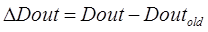

## 6.2. Реалізація законів регулювання (сімейство Controller)

### 6.2.1. Огляд блоків сімейства Controller. 

Нагадаємо, що в UNITY PRO для реалізації алгоритмів регулювання пропонується використовувати бібліотеку *ControlLib*, зокрема блоки сімейств *Controller,* *Output* *Processing,* *Setpoint* *Management*. У таблиці 6.2 наведений перелік функціональних блоків сімейства Controller .

Таблиця 6.2. Функціональні блоки сімейства Controller

| Назва типу EFB | Призначення                                                  |
| -------------- | ------------------------------------------------------------ |
| *SAMPLETM*     | управління періодичністю виклику  відносно початкового циклу |
| *PI_B*         | ПІ-регулятор                                                 |
| *PIDFF*        | ПІД-регулятор                                                |
| *STEP2*        | двохпозиційний регулятор                                     |
| *STEP3*        | трьохпозиційний регулятор                                    |
| *AUTOTUNE*     | блок автонастройки *PI_B* та *PIDFF*                         |
| *IMC*          | коректор моделі                                              |

### 6.2.2. SAMPLETM 

Всі блоки бібліотеки *Control* *Lib*, алгоритм яких передбачає використання часових інтервалів (наприклад для інтегрування або диференціювання), розраховують ці інтервали як різницю між плинним та попереднім часом виклику блоку. Це значить, що їх можна викликати аперіодично. Однак алгоритми регулювання потребують значні часові ресурси, що займає значну частину часу Задачі(*Task*), в якій вони викликаються. З іншого боку, більшість задач регулювання не потребують частої обробки, а отже їх контури можуть оброблятися рідше, ніж кожний цикл. Таким чином для оптимізації роботи програми контролера рекомендується обробляти контури періодично, і зсунутими у часі відносно один одного. 

Так, наприклад, при наявності 10-ти контурів регулювання, можна викликати зв’язані в контурі блоки з періодичністю 100 мс, але зсунуті один відносно одного на один цикл. Тобто через кожні 100 мс, протягом 10 циклів будуть оброблені всі контури. Періодичний виклик зі зсувом по часу можна забезпечити функціональним блоком *SAMPLETM*.

Функціональний блок *SAMPLETM* з періодичністю, яка визначається вхідним параметром *INTERVAL*, на один цикл Задачі виставляє в значення *TRUE* вихід *Q*. Вхідний параметр *DELSCANS* визначає зміщення в циклах запуску внутрішнього таймеру блоку відносно першого циклу контролеру (після холодного старту).

На рис.6.5 показаний приклад використання 2-х екземплярів *SAMPLETM*, виходи *Q* яких з періодичністю однієї секунди будуть виставлятися на один цикл в *TRUE*. Включення цих виходів буде зміщене на один цикл один відносно одного. 

Рис.6.5. Використання 2-х екземплярів SAMPLETM зі зсувом на один цикл відносно      

### 6.2.3.  ПІ регулятор PI_B 

Функціональний блок *PI_B* реалізовує ПІ алгоритм регулювання (6.1). 

             (6.1)

Функціональна схема ПІ-регулятора зображена на рис.6.6. Параметри *PI_B* наведені в таблиці табл.6.3. Як видно з рис.6.6, в алгоритмі спочатку розраховується розузгодження (*DEV=PV-SP*), яке пройшовши через блок нечутливості (з зоною *dband*), використовується для розрахунку інтегральної складової (налаштовується *ti*) та пропорційної складової (налаштовується *kp*). Задане значення *SP* обмежується по мінімуму (*pv_inf*) та по максимуму (*pv_sup*). Якщо необхідно управляти ВМ в зворотному напрямку (команда *rev_dir=TRUE*), розраховане значення інвертується (змінює знак).

Рис.6.6. Функціональна схема ПІ-регулятора PI_B

У автоматичному режимі (*MAN_AUTO=TRUE*) розраховане значення, пройшовши через блоки *Tracking* та *Limiter* подається на вихід *OUT*. В ручному режимі (*MAN_AUTO=TRUE*) вихід *PI_B* регулюється ззовні функціонального блока. 

Режим *Tracking* (слідкування) використовується для прямого регулювання *OUT* зовнішнім алгоритмом (див. параграф 6.1.2). У нормальному режимі *TR_S* повинен бути *FALSE*, тобто *Tracking* вимкнений. 

Параметрами *out_inf* та *out_sup* налаштовуються обмеження відповідно по мінімуму та максимуму вихідної величини (при *en_rcpy=TRUE* обмеження не діють).          

Функціональний блок *PI_B* може працювати в режим ПІ та П регулятора. Виставивши параметр *ti=0s*, блок *PI_B* переключається в режим П-регулювання. У режимі ПІ регулювання блок розраховує вихід *OUT* по інкрементальному розрахунку, а в П режимі регулювання – по абсолютному. Режими абсолютного та інкрементального розрахунку розглянуті в параграфі 6.2.5 

 У П режимі регулювання (режим абсолютного розрахунку) вихідне значення розраховується за формулою:

​                                        (6.2)

Параметр *outbias* потрібен для того, щоб в П режимі регулятора задати зміщення початкової точки (при нульовому розузгодженні). Тобто, в залежності від знака розузгодження, вихід на виконавчий механізм буде зміщуватися в меншу або більшу сторону відносно *outbias*. Значення цього параметру як правило близький до *50%*.  

Всі команди, плинні, задані та вихідні значення доступні як параметри функціонального блоку. Налаштування алгоритму проводиться через структурний параметр *PARA* типу *Para_PI_B*, поля якого описані в таб.6.4.   

На рис.6.7 показаний приклад використання функціонального блоку *PI_B* для регулювання температури в контурі з умовною назвою TIC1. Для періодичного виклику ПІ-регулятору використовується функціональний блок типу *SAMPLETM*. Настройка регулятора проводиться через структурну змінну *TIC1_PARA*, яка попередньо створюється на базі типу *Para_PI_B*. 

Приклади програми з *PI_B* наведені також в главі 6.8.   

*Таблиця* *6.3* Параметри функціонального блока *PI_B*.

|            |                                                              | Вхідні параметри                                             |
| ---------- | ------------------------------------------------------------ | ------------------------------------------------------------ |
| *PV*       | *REAL*                                                       | значення  вимірювальної величини (плинне значення)           |
| *SP*       | *REAL*                                                       | задане  значення (уставка)                                   |
| *RCPY*     | *REAL*                                                       | копія  значення регульованого виходу як база для інкрементального розрахунку  (наприклад стан виконавчого механізму) |
| *MAN_AUTO* | *BOOL*                                                       | Режим  роботи ПІ-регулятора:  1 :  Автоматичний режим  0 :  Ручний режим |
| *PARA*     | *[Para_PI_B](mk:@MSITStore:C:Program FilesSchneider ElectricUnity ProPunithelp1033clclib.chm::/clclib_D-SG-0011247.htm#D-SG-0011247.24)* | Параметри  регулятора (див. таб.6.4)                         |
| *TR_I*     | *REAL*                                                       | Вхід слідкування/ініціалізації (*Tracking)*                  |
| *TR_S*     | *BOOL*                                                       | Команда  на включення режиму слідкування/ініціалізації (1: Включити вхід *TR_I*) |
|            |                                                              | **Вхідні/вихідні параметри**                                 |
| *OUT*      | *REAL*                                                       | абсолютне  значення виходу регулятору (в ручному режимі може змінюватися з зовні PI_B) |
|            |                                                              | **Вихідні параметри**                                        |
| *OUTD*     | *REAL*                                                       | інкрементальне  значення виходу регулятору (див. праграф 6.2.5) |
| *MA_O*     | *BOOL*                                                       | Поточний  режим виконання регулятора  1: Автоматичний режим  0: інший режим (ручний або режим слідкування) |
| *DEV*      | *REAL*                                                       | Значення  розузгодження (*PV* *- SP*)                        |
| *STATUS*   | *WORD*                                                       | Слово  статусу (використовується для контролю за помилками виконання *PI_B*) |

*Таблиця* *6.4.*  Опис структурного типу *Para_PI_B*  .

| *id*      | *UINT* | Використовується для  алгоритму автопідстройки (*AUTOTUNING*) |
| --------- | ------ | ------------------------------------------------------------ |
| *pv_inf*  | *REAL* | обмеження по мінімуму  вхідної величини завдання             |
| *pv_sup*  | *REAL* | обмеження по максимуму  вхідної величини завдання            |
| *out_inf* | *REAL* | обмеження по мінімуму  вихідної величини блоку               |
| *out_sup* | *REAL* | обмеження по максимуму  вихідної величини блоку              |
| *rev_dir* | *BOOL* | 0: пряма робота регулятору (*SP-PV*)  1: зворотна робота регулятору (*PV-SP*) |
| *en_rcpy* | *BOOL* | 1: використати вхід *RCPY*                                   |
| *kp*      | *REAL* | Коефіцієнт  пропорційності                                   |
| *ti*      | *TIME* | Час інтегрування                                             |
| *dband*   | *REAL* | Зона нечутливості                                            |
| *outbias* | *REAL* | зміщення виходу  регулятора в П-режимі функціонування (при *ti=0s*) |

Рис.6.7. Приклад використання функціонального блоку *PI_B*: зверху – фрагмент програми, знизу – опис змінних в редакторі Data Editor

### 6.2.4.  ПІД регулятор PIDFF 

Функціональний блок *PIDFF* реалізовує ПІД алгоритм регулювання та має ряд додаткових функції. Функціональна схема регулятора наведена на рис.6.8. Параметри *PID_FF* наведені в таблиці табл.6.5, приклад виклику на рис.6.10. Нижче наведемо особливості регулятора.  

Рис.6.8 Функціональна схема ПІД-регулятора PIDFF

Функціональний блок *PID_FF* реалізовує ПІД алгоритм регулювання з двома типами структури: *змішаною структурою (mix_par* *=* *FALSE*) та *паралельною структурою (mix_par* *=* *TRUE)*. Формула для розрахунку виходу регулятору зі змішаною (mixed) структурою наведена в (6.3). 

​                                  (6.3)

Розрахунок виходу регулятора з паралельною (*parallel*) структурою наведений в (6.4) . 

​                              (6.4)

У формулах (6.3) та (6.4)  - коефіцієнт пропорційності, ti - час інтегрування, td - час диференціювання,  kd - коефіцієнт диференціювання, dev = (PV-SP) - розузгодження,  - коефіцієнт масштабування, який розраховується за формулою

                     (6.5)

Формули (6.3) та (6.4) справедливі тільки для певних режимів роботи *PIDFF*.

У змішаній структурі *(mix_par* *=* *FALSE*) коефіцієнти підсилення *K* інтегральної та диференційної складової (рис.6.8) будуть рівними коефіцієнту пропорційності *K=kp*. У паралельній структурі *(mix_par* *=* *TRUE*)  коефіцієнти підсилення розраховуються за формулою 

                   (6.6).

При включеній інтегральній складовій ti>0, вхід для пропорційної складової розраховується за формулою:

​                           (6.7)

де ovs_att - ваговий коефіцієнт (від 0 до 1), який призначений для запобігання перерегулювання при зміні завдання. 

При ovs_att=0, розузгодження для пропорційної складової рахується за класичними формулами (6.3) або (6.4). При ovs_att=1 зміна завдання ніяк не впливає на розрахунок пропорційної складової, оскільки на вхід її подається тільки виміряне значення. Тобто в цьому режимі розузгодження використовується тільки в інтегральній та диференційній (при *pv_dev=TRUE*) складових. Значення в діапазоні 0-1 вказує наскільки пропорційна складова регулятору буде чутливою до зміни завдання.     

Регулятор має диференційну складову (*Derivate* *action*) яка може працювати як по розузгодженню (при *pv_dev*=*TRUE*) так і по плинному значенню (при *pv_dev*=*FALSE*). Аналогічно до попередньої настройки, режим роботи *pv_dev*=FALSE, виключає реакцію диференційної складової на зміну завдання. Слід також звернути увагу, що інтегральна складова в формулах (6.3) та (6.4) включає додатковий фільтр 1-го порядку, який налаштовується параметром *kd*.  

На відміну від *PI_B*, блоки нечутливості для *dev* та *DEV_WGH* окрім зони нечутливості (*dband*) мають настройку *gain_kp*, яка вказує на коефіцієнт підсилення(послаблення) розузгодження, коли його значення знаходиться в цій зоні. При *gain_kp=0* блок нечутливості працює аналогічно як в *PI_B*. Статичні характеристики блоку при інших значеннях *gain_kp* показані на рис.6.9.

Ланка упередження (*Feed Forward*) дає можливість включити в контур управління сигнал упередження по збуренню, тим самим покращити динамічні характеристики процесу регулювання. Сигнал упередження масштабується відповідно до формули:

​             (6.8)

Формули 6.3 та 6.4 наведені в спрощеному вигляді для розуміння суті роботи ПІД регулятора. Функціональний блок *PIDFF* може працювати в режим ПІД/ПІ або П/ПД регулятора, що впливає на особливості розрахунків. У параграфі 6.2.5 розглянуті дійсні розрахункові формули, які використовуються в залежності від настройок *PIDFF*. Крім визначених в главі 6.1 режимів *Manual/Automatic* та *Tracking*, *PIDFF* може працювати в таких режимах:

-     режим абсолютного розрахунку (П/ПД-регулювання);

-     інкрементальний алгоритм ПІД-регулювання та І-регулювання;

Ці режими розглянуті в параграфі 6.2.5.

Приклад виклику екземпляру *PIDFF* показаний на рис.6.10. 

Рис.6.9 Настройка зони нечутливості

Рис.6.10. Приклад виклику екземпляру "*PIDFF_Instance*" типу *PIDFF* в секції на мові FBD

*Таблиця* *6.5* Параметри функціонального блока *PIDFF*.

|            |              | Вхідні  параметри                                            |
| ---------- | ------------ | ------------------------------------------------------------ |
| *PV*       | *REAL*       | значення вимірювальної  величини (плинне значення)           |
| *SP*       | *REAL*       | задане значення  (уставка)                                   |
| *FF*       | *REAL*       | сигнал упередження                                           |
| *RCPY*     | *REAL*       | копія значення  регульованого виходу як база для інкрементального розрахунку (наприклад стан  виконавчого механізму) |
| *MAN_AUTO* | *BOOL*       | Режим роботи  регулятора:  1 : Автоматичний режим  0 : Ручний режим |
| *PARA*     | Para_PIDFF   | Параметри регулятора  (див. таб.6.6)                         |
| *TR_I*     | *REAL*       | Вхід слідкування/ініціалізації                               |
| *TR_S*     | *BOOL*       | Команда на включення  режиму слідкування/ініціалізації (1: Включити вхід *TR_I*) |
|            |              | **Вхідні/вихідні  параметри**                                |
| *OUT*      | *REAL*       | абсолютне значення  виходу регулятору                        |
|            |              | **Вихідні  параметри**                                       |
| *OUTD*     | *REAL*       | інкрементальне значення  виходу регулятору (див. праграф 6.2.5) |
| *MA_O*     | *BOOL*       | Поточний режим  виконання регулятора  1: Автоматичний режим  0: інший режим (ручний або режим слідкування) |
| *INFO*     | *Info_PIDFF* | інформація про стан  роботи *PIDFF* (див. таб.6.7)           |
| *STATUS*   | *WORD*       | Слово статусу  (використовується для контролю за помилками виконання *PIDFF*) |

*Таблиця* 6.6. Опис структурного типу *Para_PIDFF*.

| *id*       | *UINT* | Використовується для  алгоритму автопідстройки (*AUTOTUNING*) |
| ---------- | ------ | ------------------------------------------------------------ |
| *pv_inf*   | *REAL* | обмеження по мінімуму  вхідної величини завдання             |
| *pv_sup*   | *REAL* | обмеження по максимуму  вхідної величини завдання            |
| *out_inf*  | *REAL* | обмеження по мінімуму  вихідної величини блоку               |
| *out_sup*  | *REAL* | обмеження по максимуму  вихідної величини блоку              |
| *rev_dir*  | *BOOL* | 0: пряма робота регулятору (*SP-PV*)  1: зворотна робота регулятору (*PV-SP*) |
| *mix_par*  | *BOOL* | 1: регулятор з паралельною структурою   0: регулятор зі змішаною структурою |
| *aw_type*  | *BOOL* | 1: активація безударного режиму антинасичення                |
| *en_rcpy*  | *BOOL* | 1: використати вхід *RCPY*                                   |
| *kp*       | *REAL* | Коефіцієнт пропорційності                                    |
| *ti*       | *TIME* | Час інтегрування                                             |
| *td*       | *TIME* | Час диференціювання                                          |
| *kd*       | *REAL* | Коефіцієнт фільтрації  диференційної складової               |
| *pv_dev*   | *BOOL* | Режим розрахунку  диференційної складової:   1: по розузгодженню (*dev*)   0: по плинному значенню  (*PV*) |
| *bump*     | *BOOL* | 1: відсутність  безударності при переході в автоматичний режим  0: активація  безударності переходу в автоматичний режим |
| *dband*    | *REAL* | Зона нечутливості                                            |
| *gain_kp*  | *REAL* | коефіцієнт  підсилення(послаблення) розузгодження в зоні нечутливості |
| *ovs_att*  | *REAL* | значення вагового коефіцієнта  (від 0 до 1), що призначений для запобігання перерегулювання при зміні  завдання |
| *outbias*  | *REAL* | зміщення виходу  регулятора в П/ПД-режимі функціонування (при *ti=0s*) |
| *out_min*  | *REAL* | нижня межа для виходу  регулятору                            |
| *out_max*  | *REAL* | верхня межа для виходу регулятору                            |
| *outrate*  | *REAL* | обмеження по швидкості  зміни на виході одиниць/сек (≥0)     |
| *ff_inf*   | *REAL* | нижня межа значення *FF*                                     |
| *ff_sup*   | *REAL* | верхня межа значення *FF*                                    |
| *otff_inf* | *REAL* | нижня межа значення *out_ff*                                 |
| *otff_sup* | *REAL* | верхня межа значення *out_ff*                                |

*Таблиця* 6.7. Опис структурного типу Info_PIDFF  .

| *dev*    | REAL | розузгодження (*PV-SP*) |
| -------- | ---- | ----------------------- |
| *out_ff* | REAL | значення упередження    |

 

### 6.2.5.  Режими абсолютного та інкрементального розрахунку роботи *PI_B*/*PIDFF* 

Виставивши параметр *ti=0s*, в структурі *PIDFF* та *PI_B* відключається інтегральна складова. У цьому випадку регулятор працює в режимі П або ПД (тільки *PIDFF*) регулятора, тобто *абсолютного розрахунку*. У цьому режимі вихід *PIDFF* розраховується за формулою:

​                             (6.9)

​                                          (6.10)

​                                            (6.11)

де Pout - вихід пропорційної складової, Dout - вихід диференційної складової регулятора (тільки для *PIDFF*), які розраховуються по (6.10) та (6.11); OUTold - значення виходу на попередньому виклику блоку;OUTD - інкрементальне значення виходу, тобто різниця значень виходу між викликами; limiter - обмежувач виходу (див. рис.6.8); out_ff - сигнал упередження (тільки для *PIDFF*), що розраховується за (6.6). 

Значення Pout в (6.9) для *PI_B* та *PIDFF* розраховується за формулою:

​                                         (6.12)

Значення Dout в (6.9) для *PIDFF* розраховується за формулою:

​             (6.13)

де всі змінні з індексом *old* – це значення, що розраховані на попередньому виклику кроку; *dt* – час між викликами блоку; при *pv_dev*=*FALSE* - в (6.13) замість значення *dev* використовується плинне значення вимірювальної величини *PV*; особливості розрахунку *K* дані в параграфі 6.2.4.

У формулах (6.12) і (6.13) sense - визначає знак (див. *Reverse Direct* на рис.6.8): 

- при rev_dir=TRUE, sense = +1,

- при rev_dir=FALSE, sense =-1

При *ti>0s*, блоки *PI_B* та *PIDFF* працюють в режимі інкрементального розрахунку. Враховуючи наявність інтегральної складової, вихід OUT цих блоків розраховується як сума його значення на попередньому виклику та приросту на плинному кроці OUTD. Для *PIDFF* можливі два варіанти роботи алгоритмів:

- нормальний інкрементальний алгоритм (*aw_type =* *FALSE*);

- безударний інкрементальний алгоритм з антинасиченням (*aw_type =* *TRUE*); 

У режимі використання *нормального інкрементального алгоритму* (*ti>0s,* *aw_type =* *FALSE*) виходи розраховуються за формулами: 

​                             (6.14)

​                      (6.15)

​                                                  (6.16)

де  - прирости пропорційної, інтегральної та диференційної складової регулятора, які розраховуються за формулами (6.17)-(6.19); OUTold - значення виходу на попередньому виклику;  RCPY - копія значення регульованого виходу (дійсний стан виконавчого механізму); - приріст упереджувального сигналу, який розраховується за формулою (6.20). У режимі *І-*регулятору, тобто при *kp=0*, приріст пропорційної та диференційної складової в (6.14) не враховуються. Для блоку *PI_B* складові  та дорівнюють нулю.

​                   (6.17)

​                                       (6.18)

​                                        (6.19)

​                                 (6.20)

де всі змінні з індексом *old* – це значення, що розраховані на попередньому виклику кроку; *dt* – час між викликами блоку; ti - час інтегрування; Dout - вихід пропорційної складової, який розраховується за формулою (6.13); outff - сигнал упередження, що розраховується за формулою (6.8).

Антинасичення в такому алгоритмі досягається за рахунок використання інкрементальної форми та заборони інтегрування (6.16). Тобто "накопичення" інтеграла по своїй суті зберігається в самій змінній *OUT*, а заборона інтегрування - це обмеження величинами *out_min* та *out_max*. Крім того, така форма дає можливість безударного переходу з режиму ручний в автомат і навпаки, так як *OUT* використовується також як ручний вихід. Однак в такому режимі роботи короткочасні раптові зміни розузгодження (за рахунок, наприклад, диференційної складової) можуть привести до покидання зони насичення, тоді як вихід "класичного" ПІД регулятору продовжував би знаходитись в ній. Це може негативно відобразитися на процесі регулювання, тому альтернативою може бути використання безударного інкрементального алгоритму з антинасиченням, в якому може працювати блок *PIDFF*. 

У режимі використання *безударного інкрементального алгоритму з антинасиченням* (*ti>0s,* *aw_type =* *TRUE*),  розрахунок виходу блоку *PIDFF* ведеться за формулами:

​                    (6.21)

​                                         (6.22)

​                                             (6.23)

де всі змінні з індексом *old* – це значення, що розраховані на попередньому виклику алгоритму; - прирости пропорційної, інтегральної та диференційної складових регулятора, які розраховуються за формулами (6.17)-(6.19); - приріст сигналу упередження, який розраховується за формулою (6.20); - коригуюче значення, яке розраховується за формулою:

​                 (6.24)

У цьому режимі, вихід регулятора зберігається в змінній OUTc без обмеження по мінімуму та максимуму, що не обмежує інтегральну складову. Антинасичення досягається ослабленням інтегральної складової шляхом подачі коригуючого сигналу .     

### 6.2.6.  Двохпозиційний регулятор *STEP2* 

Функціональний блок *STEP2* реалізує 2-х позиційний закон регулювання з заданими порогами відхилення. Функціональна схема регулятору показана на рис.6.11, графік залежності виходу від входів – на рис.6.12, приклад виклику - на рис.6.13. 

 

Рис.6.11 Функціональна схема 2-х позиційного регулятора STEP2

Рис.6.12 Графік залежності виходу *OUT* від розузгодження *DEV* 

Рис.6.13 Приклад використання функціонального блоку *STEP**2*

*Таблиця* *6.8*  Параметри функціонального блока *STEP2.*

|            |            | Вхідні  параметри                                            |
| ---------- | ---------- | ------------------------------------------------------------ |
| *PV*       | *REAL*     | значення вимірювальної  величини (плинне значення)           |
| *SP*       | *REAL*     | задане значення  (уставка)                                   |
| *MAN_AUTO* | *BOOL*     | Режим роботи  регулятора:  1 : Автоматичний режим  0 : Режим зупинки |
| *PARA*     | Para_STEP2 | Параметри регулятора  (див. таб.6.9)                         |
|            |            | **Вихідні  параметри**                                       |
| *OUT*      | *BOOL*     | значення виходу  регулятору                                  |
| *MA_O*     | *BOOL*     | Поточний режим  виконання регулятора  1: Автоматичний режим  0: Режим зупинки |
| *DEV*      | *REAL*     | Значення розузгодження (*PV* *- SP*)                         |
| *STATUS*   | *WORD*     | Слово статусу                                                |

Таблиця 6.9.  Опис структурного типу *Para_STEP2* *.*

| *dev_ll* | *REAL* | нижній поріг відхилення  від заданої величини *(≥0*)  |
| -------- | ------ | ----------------------------------------------------- |
| *dev_hl* | *REAL* | верхній поріг  відхилення від заданої величини *(≤0*) |
| *pv_inf* | *REAL* | обмеження по мінімуму  вхідної величини завдання      |
| *pv_sup* | *REAL* | обмеження по максимуму  вхідної величини завдання     |

### 6.2.7.  Трьохпозиційний регулятор *STEP3* 

Функціональний блок *STEP3* реалізує 3-х позиційний закон регулювання з заданими порогами відхилення та гістерезисом. Функціональна структура регулятору показана на рис.6.14, графік залежності виходу від входів – на рис.6.15, приклад виклику - на рис.6.16. 

 

Рис.6.14 Функціональна схема 3-х позиційного регулятора *STEP**3*

 

Рис.6.15. Графік залежності виходів *OUT_POS* і *OUT_NEG* від розузгодження *DEV* 

Рис.6.16 Приклад використання функціонального блоку *STEP3*

*Таблиця* *6.10* Параметри функціонального блока *STEP3*.

|            |              | Вхідні  параметри                                            |
| ---------- | ------------ | ------------------------------------------------------------ |
| *PV*       | *REAL*       | значення вимірювальної  величини (плинне значення)           |
| *SP*       | *REAL*       | задане значення  (уставка)                                   |
| *MAN_AUTO* | *BOOL*       | Режим роботи  регулятора:  1 : Автоматичний режим  0 : Режим зупинки |
| *PARA*     | *PARA_STEP3* | Параметри регулятора  (див. таб.6.11)                        |
|            |              | **Вихідні  параметри**                                       |
| *OUT_NEG*  | *BOOL*       | значення виходу  регулятору для від’ємного розузгодження     |
| *OUT_POS*  | *BOOL*       | значення виходу  регулятору для додатного розузгодження      |
| *MA_O*     | *BOOL*       | Поточний режим  виконання регулятора  1: Автоматичний режим  0: Режим зупинки |
| *DEV*      | *REAL*       | Значення розузгодження (*PV* *- SP*)                         |
| *STATUS*   | *WORD*       | Слово статусу                                                |

*Таблиця* 6.11. Опис структурного типу *Para_STEP3* .

| *dev_ll* | *REAL* | нижній поріг відхилення  від заданої величини (≥0)  |
| -------- | ------ | --------------------------------------------------- |
| *dev_hl* | *REAL* | верхній поріг  відхилення від заданої величини (≤0) |
| *hys*    | *REAL* | гістерезис                                          |
| *pv_inf* | *REAL* | обмеження по мінімуму  вхідної величини завдання    |
| *pv_sup* | *REAL* | обмеження по максимуму  вхідної величини завдання   |