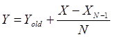
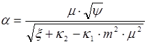
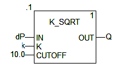
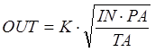
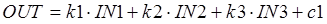

## 6.3. Обробка вхідних даних контурів регулювання.

### 6.3.1. Гістерезис HYST (сімейство Measurement)  

Функціональний блок HYST реалізує гістерезис. Приклад виклику блоку та діаграма його роботи показані на рис.6.17 

 

Таблиця 6.12. Параметри функціонального блока HYST.

| Вхідні  параметри      |                              |                                     |
| ---------------------- | ---------------------------- | ----------------------------------- |
| X                      | INT, DINT, UINT, UDINT, REAL | вхідне значення                     |
| HIGH                   | INT, DINT, UINT, UDINT, REAL | нижня межа                          |
| LOW                    | INT, DINT, UINT, UDINT, REAL | верхня межа                         |
| **Вихідні  параметри** |                              |                                     |
| IND                    | BOOL                         | індикатор досяжності  верхньої межі |

### 6.3.2. Індикатор меж INDLIM (сімейство Measurement) 

Функціональний блок INDLIM призначений для відслідковування переходу вхідного значення через визначені межі. На рис.6.18 показана діаграма роботи блоку, а на рис.6.19 – приклад виклику.

Таблиця 6.13. Параметри функціонального блока INDLIM.

| Вхідні параметри      |                               |                                        |
| --------------------- | ----------------------------- | -------------------------------------- |
| X                     | INT, DINT, UINT,  UDINT, REAL | Вхідна  змінна                         |
| MX_HIGH               | INT, DINT, UINT,  UDINT, REAL | Максимальна  верхня межа               |
| MX_LOW                | INT, DINT, UINT,  UDINT, REAL | Максимальна  нижня межа                |
| MN_LOW                | INT, DINT, UINT,  UDINT, REAL | Мінімальна  нижня межа                 |
| MN_HIGH               | INT, DINT, UINT,  UDINT, REAL | Мінімальна  верхня межа                |
| **Вихідні параметри** |                               |                                        |
| MX_IND                | BOOL                          | Відображення  досягнення верхньої межі |
| MN_IND                | BOOL                          | Відображення  досягнення нижньої межі  |

### 6.3.3. Кусочно-лінійна інтерполяція LOOKUP_TABLE1 (сімейство Measurement) 

Процедура LOOKUP_TABLE1 використовується для кусочно-лінійної інтерполяції. У залежності від входу X та заданої вузловими точками залежності XiYi (2 значення на кожну точку) формується вихід Y. Кількість вузлових точок варіюється до 15, кожна задається парою значень XiYij: перша для X (непарні номера j), друга для Y(парні номера j). Таким чином процедура може мати до 30+1 входів. 

Аналітична залежність X від Y та заданих вузлових точок показана в (6.25)

​                      (6.25)

Приклад програми з використанням LOOKUP_TABLE1 наведений в параграфі 6.8.2 

 

Таблиця 6.14. Параметри процедури LOOKUP_TABLE1.

| Вхідні  параметри      |      |                             |
| ---------------------- | ---- | --------------------------- |
| X                      | REAL | Вхідна змінна               |
| XiYi1                  | REAL | координата  X1.             |
| XiYi2                  | REAL | координата  Y1.             |
| XiYi(n-1)              | REAL | координата  X n/2; n=max 30 |
| XiYi(n)                | REAL | координата  Y n/2; n=max 30 |
| **Вихідні  параметри** |      |                             |
| Y                      | REAL | Вихідна змінна              |
| QXHI                   | BOOL | Індикація  X > Xm           |
| QXLO                   | BOOL | Індикація  X < X1           |

### 6.3.4. Зона нечутливості DEAD_ZONE (сімейство Measurement) 

Функція DEAD_ZONE забезпечує послаблення сигналу з коефіцієнтом GAIN в межах зони нечутливості, заданої діпазоном [-DZ;DZ] (рис.6.22).

 (6.26)

 

Таблиця 6.15. Параметри функції DEAD_ZONE.

| Вхідні  параметри      |      |                                         |
| ---------------------- | ---- | --------------------------------------- |
| X                      | REAL | Вхідна змінна                           |
| DZ                     | REAL | Половинне значення зони  нечутливості   |
| GAIN                   | REAL | Коефіцієнт послаблення  значення в зоні |
| **Вихідні  параметри** |      |                                         |
| Y                      | REAL | Вихідна змінна                          |

### 6.3.5. Запис змінної SAH (сімейство Measurement)

Функціональний блок SAH по передньому фронті CLK запам’ятовує на виході OUT значення входу IN. При першому виклику блоку OUT=PV. 

Таблиця 6.16. Параметри блоку SAH.

| Вхідні  параметри      |      |                         |
| ---------------------- | ---- | ----------------------- |
| IN                     | ANY  | Вхідне значення         |
| CLK                    | BOOL | Вхід тактового сигналу  |
| PV                     | ANY  | Задане значення уставки |
| **Вихідні  параметри** |      |                         |
| OUT                    | ANY  | Вихідне значення        |

### 6.3.6. Фільтр ковзного середнього AVGMV (сімейство Measurement)

Функціональний блок AVGMV реалізовує алгоритм розрахунку фільтру ковзного середнього по формулі (6.27). 

​               або                     (6.27)

де N – кількість значень в буфері (ширина вікна), X – вхідне не фільтроване значення, Y – середнє вихідне (фільтроване) значення, Yold - значення виходу на попередньому виклику.  

 

Таблиця 6.17. Параметри блоку AVGMV.

| Вхідні  параметри      |      |                                                              |
| ---------------------- | ---- | ------------------------------------------------------------ |
| MAN                    | BOOL | 0 = Автоматичний режим;    1 = Ручний режим                  |
| X                      | REAL | Вхід                                                         |
| N                      | INT  | Ширина вікна (кількість значень в буфері; максимум 50)       |
| YMAN                   | REAL | Ручне значення                                               |
| **Вихідні  параметри** |      |                                                              |
| Y                      | REAL | Середнє значення                                             |
| RDY                    | BOOL | 1 = буфер заповнений (готовий);  0 = буфер не заповнений (не готовий) |

При ініціалізації функціонального блоку буфер скидується. З кожним викликом буфер наповнюється новими значеннями. Поки кількість значень в буфері не буде рівним N, буфер не буде готовий  (RDY=FALSE) і фільтр працює з неповним буфером. Коли буфер заповниться (RDY=TRUE) блок буде видавати коректне відфільтроване значення.   

### 6.3.7. Фільтр ковзного середнього з коректором AVGMV_K (сімейство Measurement) 

Функціональний блок AVGMV_K реалізовує алгоритм розрахунку фільтру ковзного середнього з коректором К по формулі (6.28).

​                                        (6.28)

де X – вхідне не фільтроване значення, Y – середнє вихідне (фільтроване) значення, Yold - значення виходу на попередньому виклику, K - коректор. 

Таблиця 6.18. Параметри блоку AVGMV_K.

| Вхідні  параметри      |      |                                            |
| ---------------------- | ---- | ------------------------------------------ |
| MAN                    | BOOL | 0 = Автоматичний режим;   1 = Ручний режим |
| X                      | REAL | Вхід                                       |
| K                      | INT  | Коректор (макс 10000)                      |
| YMAN                   | REAL | Ручне значення                             |
| **Вихідні  параметри** |      |                                            |
| Y                      | REAL | Середнє значення                           |

### 6.3.8. Розрахунок витрати по перепаду тиску K_SQRT (сімейство Mathematics) та MFLOW (сімейство Conditioning) 

Об’ємна витрата може бути розрахована за наступними залежностями:

​                                    (6.29)

де Q-об’ємна витрата (м3/год), d – діаметр отвору (мм), p -густина (кг/м3), (p1-p2) – перепад тиску на звужуючому пристрої (кгс/м2), Е – коефіцієнт розширення (для рідин=1), a- коефіцієнт витрати який розраховується за формулою

                 (6.30)

Коефіцієнти розраховуються (підбираються) в залежності від середовища та типу звужуючого пристрою. Таким чином формулу для розрахунку можна записати:

​                                              (6.31)

де dP=P1-P2, К – ваговий коефіцієнт. Ваговий коефіцієнт К можна розрахувати або підібрати при відомих витратах на етапі налагодження. 

У UNITY PRO для реалізації розрахункової формули 6.31 можна скористатися функцією SQRT (вилучення квадратного кореню), однак для цієї цілі зручніше використовувати спеціалізовану функцію K_SQRT або функціональний блок MFLOW. 

Функція K_SQRT знаходиться в бібліотеці Control Library сімейства Mathematics. Приклад використання функції показаний на рис.6.26. Функція повертає: 

          (6.32)

Таким чином, крім вагового коефіцієнта К, функція враховує нижню межу вхідного значення CUTOFF. Тобто, якщо перепад тиску на вході є від’ємним або менше нижньої межі, то функція повертає 0, в той час як SQRT повернув би -1.#NAN, а це в свою чергу спрощує використання цієї функції для даної задачі.

Густина газів залежить від температури та тиску. Для врахування цих параметрів, треба їх ввести в розрахункову формулу для масової витрати:

​                                            (6.33) 

Функціональний блок MFLOW сімейства Conditioning, призначений для розрахунку масової витрати газів з урахуванням їх температури та тиску згідно формули (6.34):

​                                           (6.34)

 де PA-абсолютний тиск газу, TA – абсолютна температура в градусах Кельвіна.

Приклад використання функціонального блоку MFLOW показаний на рис.6.27. Вхід IN, вихід OUT та коефіцієнт К мають той же зміст, що і в попередньому варіанті. Параметри роботи блоку задаються на вході PARA. 

Вхід PRES – це тиск, який може задаватися як в абсолютних одиницях так і відносно атмосферного. У випадку відносного тиску (PARA.pr_pa=FALSE), абсолютний тиск розраховується за формулою 

​                             PA=PRES+pu                          (6.35)

де pu задається в тій же структурі PARA.

Вхід TEMP, це температура, яка може задаватися в градусах Цельсія (PARA.tc_tf=FALSE) або Фаренгейта (PARA.tc_tf=TRUE). У блоці розраховується абсолютна температура TA в градусах Кельвіна.

Корекція по тиску активується параметром PARA.en_pres=TRUE, по температурі - PARA.en_temp=TRUE. Якщо PARA.en_sqrt=FALSE то добуток буде розраховуватись без квадратного кореня.

### 6.3.9.  Зважене множення/ділення MULDIV_W (сімейство Mathematics)

Функція MULDIV_W розраховує вихідне значення за формулою (6.36):

                        (6.36)

Таблиця 6.19. Параметри блоку MULDIV_W

| Вхідні  параметри      |                |                      |
| ---------------------- | -------------- | -------------------- |
| IN1                    | REAL           | вхід1                |
| IN2                    | REAL           | вхід2                |
| IN3                    | REAL           | вхід3                |
| PARA                   | Para_MULDIV_W] | Параметри            |
| **Вихідні  параметри** |                |                      |
| OUT                    | REAL           | Результат розрахунку |

Таблиця 6.20. Опис структурного типу Para_MULDIV_W

| Поле | Тип  | Пояснення  |
| ---- | ---- | ---------- |
| k    | REAL | коефіцієнт |
| c1   | REAL | коефіцієнт |
| c2   | REAL | коефіцієнт |
| c3   | REAL | коефіцієнт |
| c4   | REAL | коефіцієнт |

### 6.3.10. Зважена сума SUM_W (сімейство Mathematics).

Функція SUM_W розраховує вихідне значення за формулою (6.36):

               (6.37)

Таблиця 6.21. Параметри блоку SUM_W

| Вхідні  параметри      |            |                      |
| ---------------------- | ---------- | -------------------- |
| IN1                    | REAL       | вхід1                |
| IN2                    | REAL       | вхід2                |
| IN3                    | REAL       | вхід3                |
| PARA                   | Para_SUM_W | Параметри            |
| **Вихідні  параметри** |            |                      |
| OUT                    | REAL       | Результат розрахунку |

Таблиця 6.22. Опис структурного типу Para_SUM_W

| Поле | Тип  | Пояснення  |
| ---- | ---- | ---------- |
| k1   | REAL | коефіцієнт |
| k2   | REAL | коефіцієнт |
| k3   | REAL | коефіцієнт |
| c1   | REAL | коефіцієнт |

 