## 6.4. Обробка вихідних даних контурів регулювання (*сімейство* *Output Processing*)

### 6.4.1.  Блок управління реверсивним двигуном (*SERVO*)

Функціональний блок *SERVO* призначений для реалізації управляючих дій з регуляторів *PI_B*/*PIDFF* або інших блоків з використанням виконавчих механізмів типу реверсивного двигуна (серводвигун, наприклад *МЕО*). Для управляння серводвигунами використовуються два виходи - *RAISE* ("більше") та *LOWER* ("менше"), на яких сигнал формується в залежності від значення входу *IN* (або *INPD*) та налаштування блоку (рис.6.28). У таблиці 6.23 показані параметри блоку *SERVO*.  

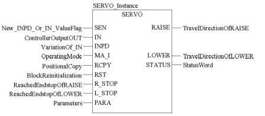

Рис.6.28. Виклик функціонального блоку *SERVO*

*Таблиця* *6.23*  Параметри блоку *SERVO*

|          |            | Вхідні  параметри                                            |
| -------- | ---------- | ------------------------------------------------------------ |
| *SEN*    | *BOOL*     | 1 : є нові значення на входах *INPD* або *IN*   0 : немає нових значень на входах *INPD* або *IN* |
| *IN*     | *REAL*     | значення з абсолютного  виходу блоку управління *OUT* (0 до 100%) |
| *INPD*   | *REAL*     | значення з  інкрементального  виходу блоку управління *OUTD* (-100% до 100%) |
| *MA_I*   | *BOOL*     | значення операційного  режиму блоку регулятору  до якого підключений *SERVO* (вихід  *MA_O*)   1 : Автоматичний режим   0 : інший режим (ручний або слідкування) |
| *RCPY*   | *REAL*     | Зворотній зв’язок по  позиції ВМ (0 до100%)                  |
| *RST*    | *BOOL*     | 1 : Ініціалізація функціонального блоку (відключення виходів та обнуління внутрішнього  статусу блоку) |
| *R_STOP* | *BOOL*     | кінцева позиція  "відкритий" (досягнутий  поріг по *RAISE*)  |
| *L_STOP* | *BOOL*     | кінцева позиція  "закритий" (досягнутий поріг по *LOWER*)    |
| *PARA*   | Para_SERVO | Параметри (див. таб 6.24)                                    |
|          |            | **Вихідні  параметри**                                       |
| *RAISE*  | *BOOL*     | Вихід  "більше" ("відкрити")                                 |
| *LOWER*  | *BOOL*     | Вихід "менше"  ("закрити")                                   |
| *STATUS* | *WORD*     | Слово статусу                                                |

*Таблиця* *6.24*. Опис структурного типу Para_SERVO

|            |        |                                                              |
| ---------- | ------ | ------------------------------------------------------------ |
| *en_rcpy*  | *BOOL* | 1 : Використовується зворотній зв’язок по позиції ВМ (включити *RCPY*) |
| *rcpy_rev* | *BOOL* | 1 : Інвертувати *RCPY* (0 – це 100%, 100 – це 0%)  0 : Не інвертувати *RCPY* |
| *t_motor*  | *TIME* | час повного відкриття  регулюючого органу                    |
| *t_mini*   | *TIME* | мінімальна довжина  імпульсу                                 |

Функціональний блок може використовуватись як з сигналом зворотного зв’язку по положенню виконавчого механізму (*RCPY*) так і без нього.

При використанні сигналу зворотного зв’язку (*en_rcpy* *=* *TRUE*), в якості управляючого входу *SERVO* треба використовувати вхід *IN*, який повинен бути зв’язаний з абсолютним виходом *OUT* регулятору *PI_B/PIDFF*. Для кожного нового значення виходу *OUT*, який формує регулятор, функціональний блок *SERVO* генерує дискретний вихід *RAISE* або *LOWER* з довжиною імпульсу пропорційною різниці *IN-RCPY*. При необхідності, вхід *RCPY* можна інвертувати (*rcpy_rev=1*), тобто коли показник положення регулюючого органу показує не процент відкриття, а процент закриття. Приклад діаграми роботи *SERVO* зі зворотним зв’язком по положенню ВМ показаний на рис. 6.29. 

Якщо зворотний сигнал по положенню ВМ не використовується (*en_rcpy* *=* *FALSE*) то в якості управляючого входу *SERVO*, треба використовувати вхід *INPD*, який повинен бути зв’язаний з виходом *OUTD* регулятору *PI_B/PIDFF*. Для кожного нового значення виходу *OUTD* регулятору, блок *SERVO* генерує дискретний вихід *RAISE* або *LOWER* з довжиною імпульсу пропорційною *INPD*. Приклад діаграми роботи *SERVO* без зворотного зв’язку по положенню ВМ показаний на рис. 6.30.

Для правильного функціонування операційного режиму, вхід *MA_I* блоку *SERVO* повинен бути з’єднаний з виходом *MA_O* блоку регулятору.  

Для формування імпульсу з тривалістю, пропорційною величині управляючого сигналу, необхідно вказати час повного відкриття регулюючого органу (*t_motor*). Тобто, наприклад, при формуванні на вході *INPD* значення *100%*, блок *SERVO* сформує імпульс на виході *RAISE* рівним значенню *t_motor*. А при *INPD* рівним -10%, *SERVO* сформує імпульс на виході *LOWER* рівним значенню *t_motor/10*. 

Для зменшення навантаження на двигун, тобто збільшення його терміну служби, задається мінімальний час імпульсу (*t_mini*). Якщо тривалість розрахованого імпульсу менша ніж *t_mini*, імпульс формуватися не буде, однак він буде врахований на наступних циклах.

Для точності регулювання, блок *SERVO* повинен викликатися з кожним циклом Задачі. Однак весь контур регулювання може оброблятися з меншою частотою, наприклад при використанні *SAMPLETM* (див. параграф 6.2.2). Для того щоб вказати блоку *SERVO* що регулятор *PI_B/PIDFF* оброблений і сформовані нові значення (особливо це стосується виходу *OUTD* регулятору), і його вихід *OUT/OUTD* а отже і вхід *SERVO* *IN/INPD* отримав нові значення, на вхід *SEN* подається *TRUE*. Таким чином, якщо в контурі для задавання періодичності обробки використовується блок *SAMPLETM*, то його вихід підключається паралельно до входів *EN* блоків *PI_B/PIDFF* і до входу *SEN* блоку *SERVO*. 

У ручному режимі (*MA_I=FALSE*) блок *SERVO* обробляє входи *IN/INPD* в кожному циклі незалежно від значення входу *SEN*, що треба враховувати при написанні програми. Тобто при ручній зміні виходу *OUT* регулятору, він автоматично розрахує *OUTD* (див. параграф 6.2.5), який протримається на виході аж до наступного виклику регулятору. За цей час, зв’язаний з цим виходом вхід *INPD* блоку *SERVO,* буде оброблений декілька (*n*) раз, що затягне імпульс в *n* раз довше, ніж потрібно. Для подолання цієї проблеми, в ручному режимі після кожного виклику регулятору необхідно обнулювати змінну, прив’язану до *OUTD* та *INPD* (див. приклад в параграфі 6.8.3)    

При використанні сигналу зворотного зв’язку (*en_rcpy* *=* *TRUE*) у ручному режимі блок *SERVO* буде видавати команди "більше" та "менше" на виконавчий механізм доти, поки входи *RCPY* та *IN* не будуть рівними. Це може негативно сказатися на процесі а також на роботі приводу та регулюючого органу. Варіант вирішення цієї проблеми показаний в прикладі з параграфу 6.8.3.  

При досягненні крайнього положення регулюючим органом, тобто коли *R_STOP=TRUE* або *L_STOP=TRUE*, відповідний вихід виставляється в логічний нуль (*RAISE=FALSE* або *LOWER=FALSE*) незалежно від значення *IN* або *INPD*. 

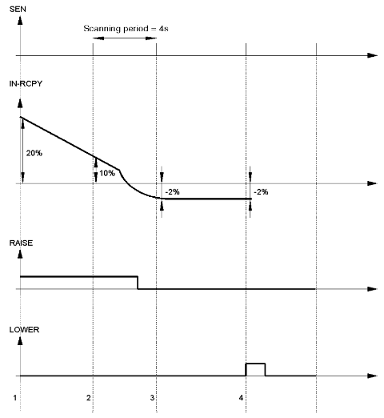

Рис.6.29. Приклад діаграми роботи блоку SERVO зі зворотним зв’язком по положенню ВМ

Розглянемо роботу *SERVO* в режимі використання зворотного зв’язку по положенню, тобто при *en_rcpy=TRUE* (рис.6.29). У цьому прикладі використовуються такі настройки: *t_motor=t#25s*, *t_mini=t#1s*, періодичність виклику основного регулятору (періодичність активації *SEN*) - 4s. Контур працює в автоматичному режимі (*MA_I=TRUE*). На діаграмі цифрами мітками позначені наступні ситуації.

1.   При початковому скануванні контуру значення (*IN-RCPY*)=+20% : на виході *RAISE* генерується імпульс тривалістю 5s (=20% від 25s);

2.   При наступному скануванні контур значення (*IN-RCPY*)=+10%: на виході *RAISE=TRUE* залишається ще протягом 2.5s (=10% від 25s); одна секунда, яка залишилась від попереднього разу вже не враховується;

3.   На 3-му циклі сканування контуру (*IN-RCPY*)= -2%: це відповідає імпульсу 0.5s на виході *LOWER*, однак оскільки це менше ніж *t_mini*, то вихід *LOWER=FALSE*; тривалість 0.5s для *LOWER* залишається збереженим до наступного циклу перерахунку;

На 4-му циклі сканування контуру (*IN-RCPY*)= -2%: це відповідає імпульсу 0.5s на виході *LOWER*, враховуючи попередній імпульс 0.5s, загальна тривалість імпульсу 1s, тобто на виході *LOWER=TRUE* протягом одної секунди.     

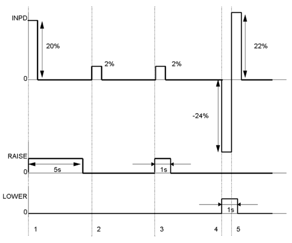

Рис.6.30. Приклад діаграми роботи блоку SERVO без зворотного зв’язку по положенню ВМ

Розглянемо роботу *SERVO* без використання зворотного зв’язку по положенню, тобто при *en_rcpy=FALSE* (рис.6.30). У цьому прикладі використовуються такі настройки*:* *t_motor=t#25s*, *t_mini=t#1s*, контур працює в ручному режимі (*MA_I=FALSE*). На діаграмі цифрами мітками позначені наступні ситуації.

1.   При *INPD=+20%:* на виході *RAISE* генерується імпульс тривалістю 5s (=20% від 25s);

2.   При появі значення *INPD*=+2%: це відповідає імпульсу 0.5s на виході *RAISE*, однак оскільки це менше ніж t_mini, то вихід *RAISE* *=FALSE*; тривалість 0.5s для *RAISE* залишається збереженим до наступного перерахунку;

3.   При появі значення *INPD=+2%:* це відповідає імпульсу 0.5s на виході *RAISE*, враховуючи попередній імпульс 0.5s, загальна тривалість імпульсу 1s, тобто на виході *RAISE=TRUE* протягом одної секунди;

4.   При появі значення *INPD=* *-24%:* це відповідає імпульсу 6s на виході *LOWER*;

5.   Перед закінченням наступної секунди наступна модифікація *INPD=+22%:* загальна модифікація = -24%+22%=-2%, це менше ніж мінімальний імпульс (4%), тому вихід *LOWER=FALSE*.      

Приклад використання блоку *SERVO* показаний в параграфі 6.8.3.

### 6.4.2.  Управління виконавчими механізмами з використанням широтно-імпульсного перетворення *PWM1*

Функціональний блок *PWM1* призначений для перетворення числового значення на вході блоку *IN* в 2 дискретні сигнали *OUT_POS* та *OUT_NEG* з певною шириною та частотою імпульсу (рис.6.31). 

*Ініціалізація блоку обов’язково повинна проводитись при першому циклі ПЛК!*

Весь час ділиться на періоди з тривалістю *t_period* (рис.6.32). У залежності від значення входу *IN*, на кожному періоді формується сигнал *OUT_POS* (при *IN>0*) або *OUT_MIN* (при *OUT<0*) з тривалістю *T_on*. Залежність *T_on* від значення *IN* описується формулами (6.38)-(6.39), та графічно показана на рис.6.33. 

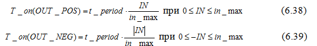

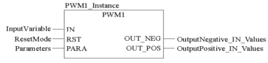

Рис.6.31. Приклад виклику блоку PWM1

У таблиці 6.25 та 6.26 наведені параметри блоку PWM1.  

*Таблиця* *6.25* Параметри блоку PWM1

|           |             | Вхідні  параметри                 |      |
| --------- | ----------- | --------------------------------- | ---- |
| *IN*      | *REAL*      | Вхідна змінна                     |      |
| *RST*     | *BOOL*      | 1 = Скинути  блок                 |      |
| *PARA*    | *Para_PWM1* | Параметри                         |      |
|           |             | **Вихідні  параметри**            |      |
| *OUT_NEG* | *BOOL*      | Вихід для від’ємного  значення IN |      |
| *OUT_POS* | *BOOL*      | Вихід для додатного  значення IN  |      |
|           |             |                                   |      |

*Таблиця* *6.26* Опис структурного типу Para_PWM1

|            |        |                                                   |
| ---------- | ------ | ------------------------------------------------- |
| *t_period* | *TIME* | Довжина (тривалість) періоду                      |
| *t_min*    | *TIME* | Мінімальний час  імпульсу                         |
| *in_max*   | *REAL* | обмеження по максимуму  (по модулю) значення *IN* |

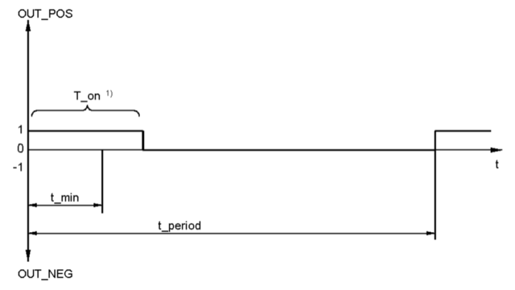

Рис.6.32. Діаграма зміни виходів блоку *PWM1*

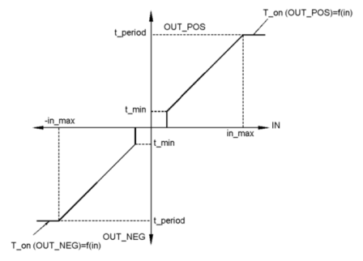

Рис.6.33. Статична характеристика *t_period(IN)* для *PWM1*

Параметр *t_min* вказує мінімальну тривалість імпульсу. Тобто якщо розрахований час *T_on* за (6.38) та (6.39) буде менше часу *t_min*, то імпульс на даному періоді формуватися не буде.

При команді *RST=1* всі виходи блоку скидаються в *FALSE*, а блок починає відраховувати час з моменту, коли *RST=0*.

Якщо блок *PWM1* обробляє вихід регуляторів *PI_B/PIDFF*, то рекомендується *t_period* виставляти рівним часу виклику блоку регулятору. Це гарантує, що кожний новий сигнал на ВМ з регулятора буде оброблений блоком *PWM1*. Час періоду виклику самого *PWM1* рекомендується виставляти як мінімум в 10 раз менше ніж час періоду *t_period*.    

Блок *PWM1* може використовуватися для управління двигуном, швидкість якого керується шириною імпульсу *OUT_POS* в один бік, і *OUT_NEG* в інший бік. Іншим прикладом виконавчого механізму є *ТЕН* (трубчатий електронагрівач), однак при цьому буде використовуватись тільки вихід *OUT_POS*. 

 Приклад діаграми роботи *PWM1* з настройками *t_period=t#4s, t_min=t#0.5s, in_max=10* показаний на рис.6.34.

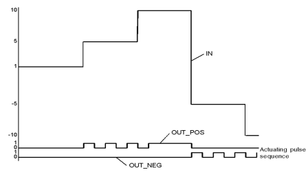

Рис.6.34. Приклад діаграми роботи PWM1

### 6.4.3.  Блок ручного управління *MS*

Функціональні блоки регуляторів, в тому числі *PI_B/PIDFF*, мають вбудовані засоби переключення їх в ручний режим, з забезпеченням безперебійності. Нижче наведені випадки, для яких може знадобитися використання блоку ручного управління *MS*:

-    для управління аналоговими виходами, які управляються НЕ через алгоритми зі зворотним зв’язком (не за відхиленням);

-    для управління аналоговими виходами, які в ручному і в автоматичному режимах формуються окремими блоками (наприклад при каскадному регулюванні, переключенні між алгоритмами);

-    для управління серводвигунами в ручному режимі без використання регуляторів *PI_B/PIDFF*; 

На рис.6.35 показана функціональна схема блоку *MS*, на рис.6.36 – приклад виклику блоку в FBD.

Вихід *OUT* в автоматичному режимі формується як сума входів *IN* та *outbias*, якщо зміщення активоване (*use_bias=TRUE*). У ручному режимі вихід міняється безпосередньо. У обидвох режимах абсолютне значення *OUT* обмежується по мінімуму і максимуму, а інкрементальне *OUTD* – не обмежується. 

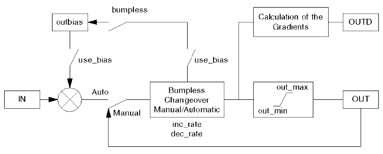

Рис.6.35.Функціональна схема блоку *MS*

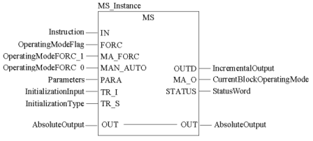

Рис.6.36.Приклад виклику блоку *MS*

*Таблиця* *6.27* Параметри блоку *MS*

|            |         | Вхідні  параметри                                            |
| ---------- | ------- | ------------------------------------------------------------ |
| *IN*       | *REAL*  | Значення змінної в  автоматичному режимі                     |
| *FORC*     | *BOOL*  | 1:Режим ручний/автомат визначається входом *MA_FORC*   0: Режим ручний/автомат визначається входом *MAN_AUTO* |
| *MA_FORC*  | *BOOL*  | Режим ручний/автомат  для *FORC* *= 1*  1: Автоматичний режим   0: Ручний режим |
| *MAN_AUTO* | *BOOL*  | Режим  ручний/автмат для *FORC* *= 0*   1:  Автоматичний режим  0: Ручний режим |
| *PARA*     | Para_MS | Параметр                                                     |
| *TR_I*     | *REAL*  | Вхід ініціалізації                                           |
| *TR_S*     | *BOOL*  | Команда на включення  ініціалізації (1: Включити вхід ініціалізації) |
|            |         | Вхідні/вихідні  параметри                                    |
| *OUT*      | *REAL*  | абсолютне значення  виходу                                   |
|            |         | **Вихідні  параметри**                                       |
| *OUTD*     | *REAL*  | інкрементальне значення  виходу: різниця між вихідною величиною в плинному і попередньому циклах  перерахунку *OUTD* |
| *MA_O*     | *BOOL*  | Плинний режим роботи  регулятору (0: Ручний, 1: Автоматичний) |
| *STATUS*   | *WORD*  | Слово статусу                                                |

*Таблиця* *6.28.* Опис структурного типу [Para_MS](mk:@MSITStore:C:Program FilesSchneider ElectricUnityProPunithelp1033clclib.chm::/clclib_D-SG-0011328.htm#D-SG-0011328.22)

| *out_min*  | *REAL* | нижня межа для виходу  регулятору                            |
| ---------- | ------ | ------------------------------------------------------------ |
| *out_max*  | *REAL* | верхня межа для виходу  регулятору                           |
| *inc_rate* | *REAL* | Швидкість наростання  значення сигналу при переключенні руч./авт. (одиниць на секунду) |
| *dec_rate* | *REAL* | Швидкість спадання значення сигналу при переключенні руч./авт.  (одиниць на  секунду) |
| *outbias*  | *REAL* | значення зміщення                                            |
| *use_bias* | *BOOL* | 1: Активувати зміщення                                       |
| *bumpless* | *BOOL* | 1: активувати безударність переходу руч/авт                  |

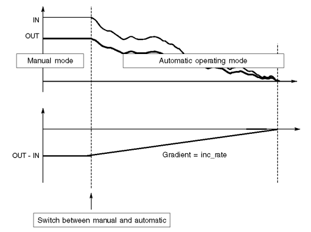

Рис.6.37.Діаграма роботи безударного переходу руч./авт. в *MS*

Для реалізації безударності переходу з ручного в автоматичний режим (*bumpless=TRUE*) використовуються лінійні переходи з обмеженням по швидкості, які настроюються параметрами *inc_rate* та *dec_rate*. Таким чином, в момент переходу в автоматичний режим, різниця між IN та OUT буде зменшуватися відповідно до заданої швидкості (рис.6.37).

Рис.6.38.Діаграма роботи безударного переходу руч./авт. зі зміщенням в *MS*

Якщо активований параметр *outbias* (зміщення) тобто *use_bias=TRUE*, то безударність досягається за рахунок використання нового перерахованого значення зміщення (рис.6.38). 

Безударний перехід є сенс активувати тоді, коли вхід *IN* підключений до регуляторів або інших блоків, в яких не реалізований безударний перехід. Приклад використання блоку *MS* показаний в параграфі 6.8.2.