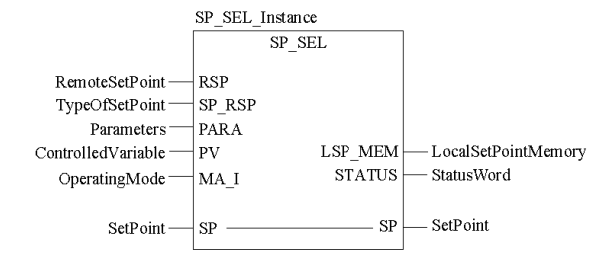
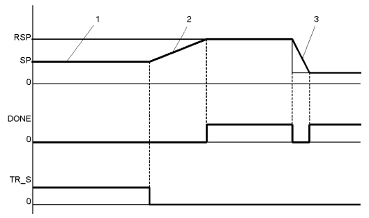
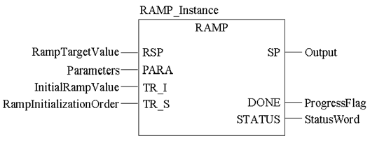
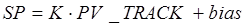
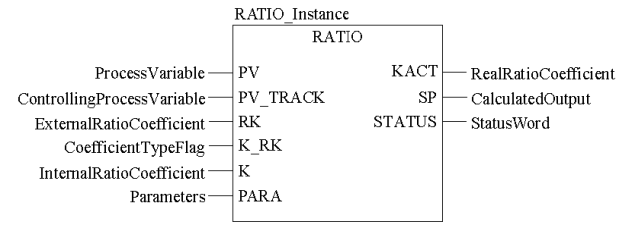
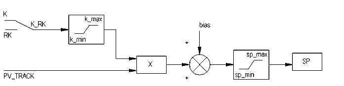

## 6.5. Організація управління уставками (сімейство *Setpoint* *Management*)

### 6.5.1.  Перемикач уставок *SP_SEL*

Функціональний блок призначений для переключення уставки (заданого значення *SP*) для регуляторів *PI_B/PIDFF* або аналогічних (див. рис.6.39). У локальному режимі (*local* *mode*, коли *SP_RSP=FALSE*) уставка змінюється безпосередньо через вхід/вихід *SP*, який повинен бути підключений до однойменного входу регулятору. У дистанційному режимі (*remote* *mode*, коли *SP_RSP=TRUE*) уставка змінюється через вхід *RSP*.

Функціональний блок має наступні властивості:

1)  переключення між уставками в безударному режимі;

2)  операції з уставками проводяться навіть в ручному режимі;

3)  проводиться обмеження уставки по верхній і нижній межі;

При переключенні уставки з локального режиму в дистанційний, безударність забезпечується за рахунок плавної зміни виходу з швидкістю, заданою параметром *rate*. 

Приклад використання *SP_SEL* показаний в параграфі 6.8.2. 

Рис.6.39. Приклад виклику блоку *SP_SEL*

*Таблиця* *6.29*. Параметри блоку *SP_SEL*

|           |             | Вхідні  параметри                                            |
| --------- | ----------- | ------------------------------------------------------------ |
| *RSP*     | *REAL*      | Дистанційна уставка                                          |
| *SP_RSP*  | *BOOL*      | Вибір уставки  1 : Дистанційна уставка   0 : Локальна уставка |
| *PARA*    | Para_SP_SEL | Параметри                                                    |
| *PV*      | *REAL*      | Плинне значення змінної  управління                          |
| *MA_I*    | *BOOL*      | Операційний режим  регулятору, до якого під’єднаний перемикач  1 : Автоматичний режим   0 : Ручний режим |
|           |             | **Вхідні/вихідні  параметри**                                |
| *SP*      | *REAL*      | Уставка регулятору                                           |
|           |             | **Вихідні  параметри**                                       |
| *LSP_MEM* | *REAL*      | Локальна уставка в  пам’яті                                  |
| *STATUS*  | *WORD*      | Слово статусу                                                |

*Таблиця* *6.30* Опис структурного типу Para_SP_SEL

|          |        |                                                              |
| -------- | ------ | ------------------------------------------------------------ |
| *sp_min* | *REAL* | Обмеження по мінімуму  уставки                               |
| *sp_max* | *REAL* | Обмеження по максимуму  уставки                              |
| *bump*   | *BOOL* | У процесі зміни уставки  локальної/дстанційної  1 : вихід *SP* форсується значенням *LSP_MEM*   0: безударний перехід |
| *track*  | *BOOL* | 1 : значення *SP* копіюється зі входу PV (тільки  в локальному режимі) |
| *rate*   | *REAL* | швидкість  збільшення SP протягом зімни локальне/дистанційне в  одиницю/секунду (≥0) |

### 6.5.2.  Зміна уставки з постійною швидкістю (*RAMP*)

Функціональний блок *RAMP* забезпечує плавну зміну виходу *SP* від попереднього значення до значення входу *RSP* (див. рис.6.40)*.* Швидкість зміни налаштовується двома параметрами з *Para_RAMP*: на збільшення – *inc_rate*, на зменшення - *dec_rate*. Рівність *SP=RSP* сигналізується виходом *DONE*. 

Блок *RAMP* може бути використаний для плавної зміни завдання або виходу регулятору, створеного користувачем. 

Рис.6.40. Приклад виклику блоку RAMP

Рис.6.41. Приклад виклику блоку RAMP

*Таблиця* *6.31*. Параметри блоку *RAMP*

|          |           | Вхідні  параметри             |
| -------- | --------- | ----------------------------- |
| *RSP*    | *REAL*    | Задане значення уставки       |
| *PARA*   | Para_RAMP | Параметри                     |
| *TR_I*   | *REAL*    | Значення ініціалізації        |
| *TR_S*   | *BOOL*    | 1 – включити  ініціалізацію   |
|          |           | **Вихідні  параметри**        |
| *SP*     | *REAL*    | Вихідна уставка               |
| *DONE*   | *BOOL*    | 1: значення досягнуло уставки |
| *STATUS* | *WORD*    | Слово стану                   |

*Таблиця* *6.32*   Опис структурного типу Para_RAMP

| *inc_rate* | *REAL* | Швидкість нарощування в  одиницях/секунду (≥0) |
| ---------- | ------ | ---------------------------------------------- |
| *dec_rate* | *REAL* | Швидкість спаду в  одиницях/секунду(≥0)        |

### 6.5.3.  Задатчик співвідношення (*RATIO*) 

Функціональний блок *RATIO* забезпечує розрахунок завдання на виході за формулою: 

​                                       (6.40)

де *PV_TRACK* *–* значення змінної, відносно якої розраховується завдання; *bias* – зміщення. 

Рис.6.42. Приклад виклику блоку *RATIO*

*Таблиця* *6.33* Параметри блоку RATIO

|            |            | Вхідні  параметри                                            |
| ---------- | ---------- | ------------------------------------------------------------ |
| *PV*       | *REAL*     | Значення вимірювальної  величини, що подається на регулятор (тільки для розрахунку *KACT*) |
| *PV_TRACK* | *REAL*     | значення змінної,  відносно якої розраховується завдання     |
| *RK*       | *REAL*     | дистанційний коефіцієнт  співвідношення                      |
| *K_RK*     | *BOOL*     | Вибір джерела для  коефіцієнта:  "1":  коефіцієнт задається дистанційно  входом *RK*   "0": локальний коефіцієнт, задається входом *K* |
| *K*        | *REAL*     | локальний коефіцієнт  співвідношення                         |
| *PARA*     | Para_RATIO | Пареметри                                                    |
|            |            | **Вихідні  параметри**                                       |
| *KACT*     | *REAL*     | Реальний коефіцієнт  співвідношення                          |
| *SP*       | *REAL*     | Розраховане завдання                                         |
| *STATUS*   | *WORD*     | Слово стану                                                  |

*Таблиця* *6.34* Опис структурного типу Para_RATIO

|          |        |                                                |
| -------- | ------ | ---------------------------------------------- |
| *k_min*  | *REAL* | обмеження по мінімуму *K* та *RK*              |
| *k_max*  | *REAL* | обмеження по максимуму *K* та *RK*             |
| *sp_min* | *REAL* | обмеження по мінімуму  для розрахованого *SP*  |
| *sp_max* | *REAL* | обмеження по максимуму  для розрахованого *SP* |
| *bias*   | *REAL* | Зміщення                                       |

Функціональний блок може бути використаний при слідкуючому регулюванні (наприклад регулятор співвідношення) для формування завдання регуляторам *PI_B/PIDFF*.

Крім реалізації лінійної залежності, блок має додаткові можливості (рис.6.43):

-     дистанційну зміну коефіцієнту *K* або *RK*;

-     обмеження по мінімуму та максимуму для *K* або *RK;*

-     обмеження по мінімуму та максимуму для розрахованого *SP*;

-     розрахунок реального коефіцієнта: *KACT=(PV-bias)/PV_TRACK*; 

Рис.6.43. Функціональна схема RATIO