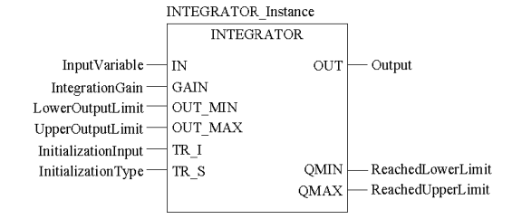

## 6.6. Блоки додаткової обробки

### 6.6.1. *SCALING* (сімейство *Conditioning*) 

Даний функціональний блок призначений для масштабування числових величин. Він реалізовує лінійну залежність вихідної величини (*OUT*) від вхідної (*IN*) за формулою: 

​                   (6.41)

 Графічно залежність виходу *OUT* від входу *IN* показана на рис.6.44. Мінімальні та максимальні вхідні (*in_min*, *in_max*) та вихідні (*out_min*, *out_max*) величини, відносно яких проводиться масштабування, задаються у вхідному параметрі *PARA* типу *Para_SCALING*. Тип даних *Para_SCALING* включає 4-ри поля типу *REAL* для завдання вхідних та вихідних меж, а також одне поле "*clip*" типу *BOOL* для визначення необхідності обмеження вихідної величини (див. рис.6.44).  

Рис.6.44. Залежність масштабованого вихідного значення (*OUT*) від вхідного (*IN*) при обмеженні на вихідний сигнал (зліва, *Clip*=1) та без обмеження (праворуч, *Clip*=0) для блока *SCALING*

Функціонування блоку продемонструємо на прикладі масштабування вхідного аналогового сигналу від датчика температури з діапазоном *0-150ºС*, який підключений до *%IW0.1.1*. Результат масштабування необхідно записати в змінну *T1_R.* 

По замовченню, при опитуванні, сигнали від універсальних аналогових вхідних модулів перетворюються в діапазон *0-10000*. Тобто вхідні межі будуть 0-10000, а вихідні 0-150. Для параметрів масштабування створюємо змінну *T_PARA* типу *Para_SCALING*, властивості *VALUE* для полів заповнюємо відповідно до рис.6.45 (зверху). Присвоїмо поле *clip:=TRUE* для обмеження по мінімуму та максимуму вихідної (масштабованої величини). 

Вигляд програми користувача на FBD показаний на рис.6.45 (внизу). Створюється екземпляр функціонального блоку *SCALE_T1* типу *SCALING*. Попередньо *%IW0.1.1* перетворюється в тип *REAL*, відповідно до типу параметру *IN* функціонального блоку *SCALING*. Вихідний параметр *STATUS* потрібен для контролю за помилками, в прикладі не використовується.      

Рис.6.45. Приклад використання функціонального блока SCALING для масштабування аналогового вхідного сигналу: зверху – опис структурної змінної T_PARA типу Para_SCALING, знизу – приклад програми на FBD

Аналогічним чином можна проводити масштабування вихідної величини.

### 6.6.2.  Ланка транспортного запізнювання *DTIME* (сімейство *Conditioning*)

 Функціональний блок *DTIME* призначений для реалізації ланки чистого (транспортного) запізнювання між входом *IN* та виходом *OUT*. Час запізнювання визначається значенням T_DELAY*(*рис.6.46*)*

 

Рис.6.46. Діаграма роботи DTIME

Рис.6.47. Приклад виклику блоку DTIME

*Таблиця* *6.35*  Параметри блоку DTIME

|           |        | Вхідні  параметри                                            |
| --------- | ------ | ------------------------------------------------------------ |
| *IN*      | *REAL* | Вхідне числове значення                                      |
| *T_DELAY* | *TIME* | Час запізнення                                               |
| *TR_I*    | *REAL* | Вхід ініціалізації                                           |
| *TR_S*    | *BOOL* | Команда ініціалізації                                        |
|           |        | **Вихідні  параметри**                                       |
| *OUT*     | *REAL* | Вихідне значення                                             |
| *BUFFER*  | ANY    | Пам'ять для збереження  значень (завжди повинен бути підключений до змінної) |
| *STATUS*  | *WORD* | Слово стану                                                  |

Для розміщення даних транспортного запізнення між входом і виходом використовується змінна, яка підключається до виходу *BUFFER*. Ця змінна має тип *ANY*, враховуючи що розмір буфер може бути різним. Однак в більшості випадків розмір буфера буде більше ніж *REAL*, оскільки кількість значень в буфері буде більше 1-го. Тому в якості змінної рекомендується використовувати масив типу *REAL*. Наприклад, масив *ARRAY* *[0..10]* *of* *REAL* може вміщувати до 11 елементів. 

Максимальна величина затримки розраховується за формулою: 

​                                           (6.42)

де n - кількість значень, які можуть бути збережені в *BUFFER*, T_PERIOD - інтервал виклику функціонального блоку

### 6.6.3.  Блок інтегрування *INTEGRATOR* (сімейство *Conditioning*) 

Функціональний блок *INTEGRATOR* призначений для реалізації числового інтегрування за формулою:

​                                   (6.43)

де змінні з індексами *old* – значення на попередньому виклику, *dt* – інтервал між викликами блоку. 

*Даний блок повинен обов’язково викликатися на першому циклі ПЛК!* 

Рис.6.48. Приклад виклику блоку INTEGRATOR

*Таблиця* *6.36* Параметри блоку *INTEGRATOR*

| Вхідні  параметри  |        |                                                |
| ------------------ | ------ | ---------------------------------------------- |
| *IN*               | *REAL* | Вхідна змінна                                  |
| *GAIN*             | *REAL* | Коефіцієнт інтегрування                        |
| *OUT_MIN*          | *REAL* | Нижня межа                                     |
| *OUT_MAX*          | *REAL* | Верхня межа                                    |
| *TR_I*             | *REAL* | Вхід ініціалізації  (слідкування)              |
| *TR_S*             | *BOOL* | 1 = режим слідкування   0 = автоматичний режим |
| Вихідні  параметри |        |                                                |
| *OUT*              | *REAL* | Вихід                                          |
| *QMIN*             | *BOOL* | 1 = значення виходу досягнуло нижньої межі     |
| *QMAX*             | *BOOL* | 1 = значення виходу досягнуло верхньої межі    |

 

### 6.6.4.  Аперіодична ланка *LAG_FILTER* (сімейство *Conditioning*)

Функціональний блок *LAG_FILTER* призначений для реалізації аперіодичної ланки (1-го порядку), де вихід розраховується за формулою:

​                    (6.44)

де змінні з індексами *old* – значення на попередньому виклику, *dt* – інтервал між викликами блоку, інші параметри наведені в таблиці 6.37.

*Даний блок повинен обов’язково викликатися на першому циклі ПЛК.* 

Рис.6.49. Приклад виклику блоку *LAG_FILTER* та діаграма його роботи

*Таблиця* *6.37* Параметри блоку LAG_FILTER

|        |        | Вхідні  параметри                              |
| ------ | ------ | ---------------------------------------------- |
| *IN*   | *REAL* | Вхідне значення                                |
| *GAIN* | *REAL* | Коефіцієнт підсилення                          |
| *LAG*  | *TIME* | Стала часу                                     |
| *TR_I* | *REAL* | Вхід ініціалізації  (слідкування)              |
| *TR_S* | *BOOL* | 1 = режим слідкування   0 = автоматичний режим |
|        |        | **Вихідні  параметри**                         |
| *OUT*  | *REAL* | Вихід                                          |

 