## 6.7. Цілочисельне регулювання (сімейство *CLC_INT*)

### 6.7.1. Огляд процедур цілочисельного регулювання 

Процедури UNITY PRO для цілочисельного регулювання *PID_INT,* *PWM_INT* та *SERVO_INT* аналогічні функціям *PID*, *PWM* та *SERVO*, які використовувалися в PL7 PRO при програмуванні попередніх версій TSX Premium та TSX Micro. Дані процедури як правило використовують тільки для сумісності з конвертованими проектами з PL7, однак використання їх в нових проектах UNITY PRO також дозволяється. Альтернативою процедурам цілочисельного регулювання є більш потужні функціональні блоки бібліотеки управління, які наведені вище. 

Структурна схема можливих варіантів контуру з цілочисельним ПІД-регулятором представлена на рис.6.50.

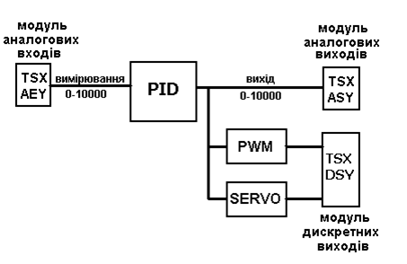

Рис.6.50. Структурна схема варіантів реалізації контуру з ПІД-регулятором 

До структурної схеми можуть входити три процедури:

-     блок ПІД-регулятора (процедура *PID_INT*);

-     блок широтно-імпульсного перетворення (*PWM_INT*);

-     блок управління реверсивним двигуном (*SERVO_INT*).

При використанні аналогового виконавчого механізму, цілочисельний вихід блока ПІД подається на аналоговий вихід контролера. Якщо використовується електричний виконавчий механізм з постійною швидкістю обертання (наприклад виконавчий механізм типу МЕО) або крокові двигуни, цілочиселний вихід *PID_INT* за допомогою процедур *PWM_INT* або *SERVO_INT* перетворюється у послідовність імпульсів, які подаються на дискретні виходи. Для правильного функціонування процедур *PID_INT,* *PWM_INT* та *SERVO_INT* Задача, в якій вони викликаються повинна виконуватись у періодичному режимі! 

### 6.7.2.  Процедура *PID_INT*

Процедура *PID_INT* призначена для реалізації цілочисленьного ПІД-регулятора. Внутрішня структура процедури показана на рис.6.51, приклад виклику в програмі на мові FBD на рис.6.52, параметри PARA в таблиці 6.38. Слід звернути увагу на те, що цілочисельне регулювання базується на цілочисельній арифметиці, отже всі вхідні та вихідні значення являються типами *INT*, *BOOL* та *DINT*. Для кращого розуміння можна представити що регулювання відбувається у відсоткових діапазонах, де 0% - це 0, а 100% - це 10000. 

Задане значення *SP* (*Setpoint*), яке подається на вхід регулятора, попередньо обмежується в діапазоні 0-10000 (0-100%).  У середині процедури розраховується розузгодження *ε=SP-PV*, де *PV* (*Process* *value*) – вимірювальна величина. Розузгодження поступає на блок *PID*, де безпосередньо реалізований сам алгоритм ПІД-регулятора. 

Настройки регулятора проводиться через параметри: *КP* – коефіцієнт пропорційності, *ТI* – постійна часу інтегрування, *TD* – постійна часу диференціювання. Диференційна складова може працювати в режимі диференціювання, розузгодження або вимірювальної величини. Вибір режиму проводиться параметром *PV_DEV*. 

Вихід регулятора обмежується значеннями *OUT_MIN* та *OUT_MAX*, які теж є параметрами настройки регулятора. Після обмежувача виходу (*Limiter*) в автоматичному режимі (*AUTO=1*), це значення поступає на вихід *OUTР*. У ручному режимі роботи регулятора (*AUTO=0*), значення виходу береться зі входу *OUT_MAN* (ручне завдання). 

Для безударності переходу з автоматичного у ручний режим, в ручному режимі вихід блоку *PID* (див. рис.6.51) повторює значення *OUT_MAN*. Включення/виключення безударного режиму проводиться через параметр *NO_BUMP*.

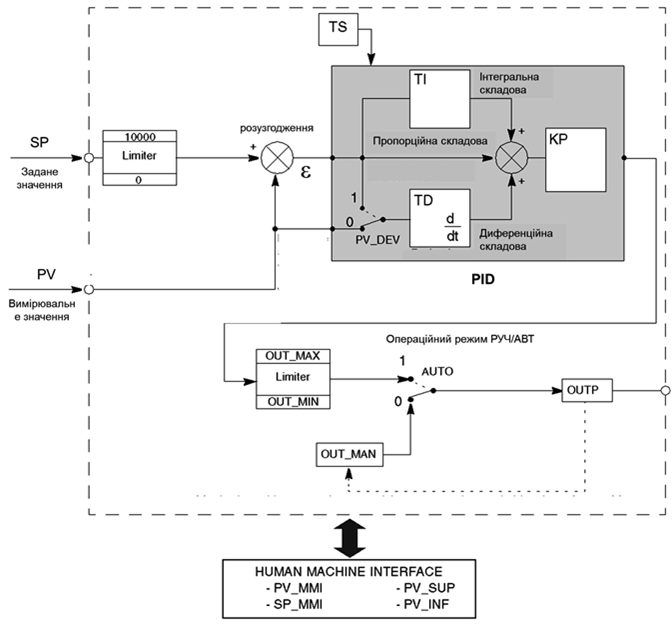

Рис.6.51. Внутрішня структура процедури PID_INT

Розрахунок виходу блоку *PID* залежить від настройок *KP,* *TI,* *TD* та режиму *PV_DEV*. Якщо *TI>0* та *TD>0*, вихід розраховується за формулами:

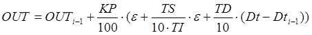    (6.45)

при цьому в залежності від вибраного режиму диференціювання:

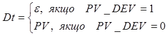        (6.46)

Індекс "*i-1*" в формулі (6.45) означає, що береться значення з попереднього виклику процедури. Коефіцієнти в процедурі *PID_INT* є цілочисельними значеннями, тому задаються наступним чином: 

-    *KP* в 0.01, тобто якщо необхідно задати коефіцієнт пропорційності 1.56, тоді *KP=156*;

-    *TI* в 0.1 с, тобто якщо необхідно задати 100 с, то *TI* *=1000*;

-    *TD* в 0.1 с, тобто якщо необхідно задати 120 с, то *TD* *=1200*;

За допомогою параметра *TS* задається періодичність обробки процедури *PID_INT* в 0.01 с. Тобто ПІД регулятор може бути викликаний один раз на декілька циклів, що може заощадити часові ресурси процесора. Слід зазначити, що дійсна періодичність обробки буде кратною періоду Задачі. 

Якщо *TI=0* та *TD=0*, регулятор працює в П-режимі, тобто без інтегральної та диференційної складової. Можливий також варіант, коли *TI=0*, а *TD>0*, тобто регулятор працює в режимі ПД. Розрахунок виходу регулятору в П-режимі буде проводитись по формулі:

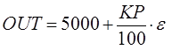                   (6.47)

 Значення 5000 береться з розрахунку, що нормальне положення виконавчого механізму є 50% від діапазону. 

Використання даної процедури в контролерах TSX Micro, передбачало можливість настройки регуляторів в операторських панелях CCX-17. Тому для них в *PID_INT* були виділені спеціальні настройки. Враховуючи, дуже малу ймовірність використання знятих з виробництва CCX-17 з новими ПЛК Modicon, ці настройки коментувати не будемо.

На рис.6.52 показаний програмний інтерфейс процедури. Входи *TAG* (назва контуру) та *UNIT*(одиниці вимірювання) типу *STRING* використовуються для сумісності з старими панелями CCX-17 і можуть бути не задіяні. 

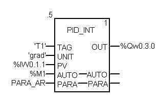

Рис.6.52. Приклад виклику процедури PID_INT в FBD

З усіх змінних та параметрів процедури в інтерфейс явно виведені тільки *PV* (вимірювальна величина), *AUTO* (перемикач руч/авт) та *OUT*(вихід регулятору). Всі інші параметри задаються через масив *PARA* типу *INT*, який завжди має довжину 43 елементи. У прикладі рис.6.52 фактичним параметром *PARA* є змінна-масив *PARA_AR*, об’явлений як *ARRAY[0..42]* *of* *INT*. Крім параметрів регулятора, масив використовується для збереження проміжних результатів розрахунку, наприклад значення *OUTi-1* з (3.3).   

*Таблиця 6.38* Таблиця параметрів (*PARA*) процедури *PID_INT*

| Елемент масиву         | Позначення  | Призначення                                             |
| ---------------------- | ----------- | ------------------------------------------------------- |
| *PARA[0]*              | *SP*        | Значення завдання  (0-10000)                            |
| *PARA[1]*              | *OUT_MAN*   | Значення вихідної  величини у ручному режимі (0-10000)  |
| *PARA[2]*              | *KP*        | Коеф. пропорційності (в  0.1 долях) (-10000<*KP*<10000) |
| *PARA[3]*              | *TI*        | Пост.часу інт. (в 0.1 c) (0-20000)                      |
| *PARA[4]*              | *TD*        | Пост.часу диф. (в 0.1  c)  (0-20000)                    |
| *PARA[5]*              | *TS*        | Дискретність обробки (  в 0.01 c) (1-32000)             |
| *PARA[6]*              | *OUT_MAX*   | Обмеження виходу по  максимуму (0-10000)                |
| *PARA[7]*              | *OUT_MIN*   | Обмеження виходу по  мінімуму (0-10000)                 |
| *PARA[8].0*            | *PV_DEV*    | вибір режиму  диференціювання: *0-PV, 1-* *SP-PV*       |
| *PARA[8].4*            | *NO_BUMP*   | ВКЛ/ВИКЛ режиму  безударності: 0-ВИКЛ, 1-ВКЛ            |
| *PARA[8].8*            | *DEVAL_MMI* | заборона використання  ММІ                              |
| *PARA[9]-*  *PARA[16]* | _MMI*       | параметри тільки для  операторських панелей CCX-17      |
| *PARA[18]-* *PARA[42]* |             | дані для збереження  проміжних результатів              |

### 6.7.3.  Процедура *SERVO_INT*

Коли у якості виконавчого механізму використовуються реверсивні двигуни з постійною швидкістю обертання (типу МЕК, МЕО), які управляються двома дискретними сигналами "більше" та "менше", вихід з аналогового ПІД-регулятора (*OUT* *PID_INT*) необхідно обробити процедурою *SERVO_INT* (рис.6.53).

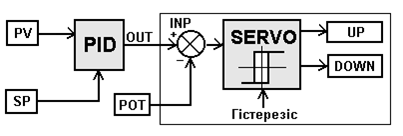

Рис.6.53. Структура контуру управління ВМ типу МЕО/МЕК

Процедура *SERVO_INT* завжди використовується разом з *PID_INT*, та зчитує її внутрішні дані. Тому, крім виходу *OUT* з *PID_INT* використовується також таблиця параметрів *PARA*. Приклад використання процедури *SERVO_INT* разом з *PID_INT* показаний на рис.6.54. 

Вихід *OUT* з *PID_INT* подається на вхід *INP* процедури *SERVO_INT*. У вхідному параметрі *POT* (типу *INT*) зберігається значення сигналу від датчика положення виконавчого механізму (сигнал зворотного зв‘язку). Якщо зворотній зв’язок не використовується, на віх *POT* подають -10000. 

Вихід *UP* відповідає сигналу “більше”, а *DOWN* – "менше”. На вхід *PID* завжди подається той самий масив, який використовується в якості фактичного параметра *PARA* регулятора *PID_INT*. *PARA* – масив параметрів процедури *SERVO_INT* із 9 елементів типу *INT*.

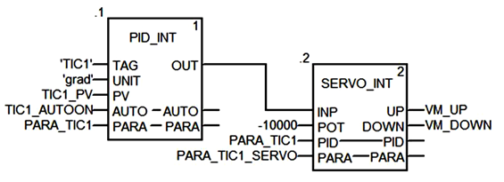

Рис.6.54. Приклад виклику процедури *SERVO**_**INT* разом з *PID**_**INT* без зворотного зв’язку по положенню *РО*  

Таблиця 6.39. Таблиця параметрів (*PARA*) процедури *SERVO_INT*

| Елемент масиву        | Позначення | Призначення                                           |
| --------------------- | ---------- | ----------------------------------------------------- |
| *PARA[0]*             | *T_MOTOR*  | Час повного відкриття  регулюючого органу  (в 0.01 c) |
| *PARA[1]*             | *T_MINI*   | Мінімальна тривалість  імпульсу (в 0.01 c)            |
| *PARA[2]*             | *HYST*     | Значення гістерезису  (0-10000)                       |
| *PARA[3]-*  *PARA[8]* |            | дані для збереження  проміжних результатів            |

Для правильної роботи *SERVO_INT*, необхідно вказати час переміщення регулюючого органу з однієї крайньої позиції (наприклад "закритий") в іншу крайню позицію ("відкритий"). Цей час задається в 0.01 с, тобто час повного ходу 25с записується як *T_MOTOR:=2500*. Крім того задається мінімальний час імпульсу *T_MINI* теж в 0.01 с. 

У випадку відсутності зворотного зв’язку по положенню регулюючого органу, *SERVO_INT* буде працювати наступним чином. Алгоритм отримує на вході відхилення виходу *PID* (з *PARA* алгоритму *PID_INT*) і перетворює його в період імпульсу згідно формули:

T_IMP = OUT * T_MOTOR/1000* мс,        (6.48) 

Необхідний для цієї процедури час добавляється до періоду, що залишився від попередніх циклів. Тобто те, що не було "спожито" в робочому циклі, зберігається для наступних циклів. 

Припустимо, що *T_MOTOR=2500* (25 с), а *T_MINI=1000* (1 с). Тоді роботу процедури можна описати діаграмою, яка зображена на рис.6.55. 

На діаграмі цифрами-мітками позначені наступні ситуації:

1 – відхилення виходу *PID_INT=+20%:* враховуючи, що повний хід *РО* є 25 с, сформується імпульс на виході UP протягом 5 с;

2 – відхилення виходу від попереднього значення *PID_INT=+2%,* що відповідає імпульсу 0.5 с: цей імпульс менше ніж *T_MINI* (=1 c), тому не впливає на виходи;

3 – з’являється ще одне відхилення на +2%: процедура добавляє це відхилення до попереднього (яке відповідає відхиленню, менше мінімального значення), що відповідає загальному додатному відхиленню на +4%, і імпульсу тривалістю 1 с на виході UP;

4 – з’являється відхилення на -24%: це відповідає імпульсу тривалістю 6 с на виході DOWN;

5 – перед закінченням наступної секунди інше відхилення на +22% повертає систему знову до глобального відхилення на 2% < відхилення *T_MINI* (4%): процедура закінчує виконання мінімального імпульсу *DOWN* тривалістю в 1 с.    

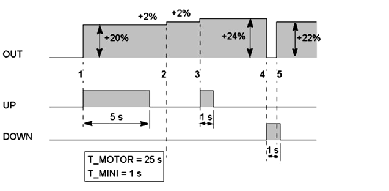

Рис.6.55. Приклад роботи процедури *SERVO**_**INT* без зворотного зв’язку по положенню регулюючого органу  

### 6.7.4.  Процедура *PWM_INT* 

Якщо у якості виконавчого механізму використовується кроковий двигун або трубчатий електронагрівач (ТЕН), то після процедури *PID_INT* використовується блок широтно-імпульсного модулятора *PWM_INT*, структура якого наведена на рис.6.56.

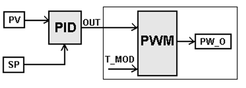

Рис.6.56. Структура контуру управління з широтно-імпульсною модуляцією

Приклад використання показаний на рис.6.57. Параметр *INP* – вхід блоку, на який подається вихід регулятора *PID_INT; PW_O* – дискретний модульований вихід; *PARA* – масив параметрів типу *INT* із 5 елементів:

Таблиця 6.40 Таблиця параметрів (*PARA*) процедури *PWM_INT*

| Елемент масиву        | Позначення | Призначення                                |
| --------------------- | ---------- | ------------------------------------------ |
| *PARA[0]*             | *T_MOD*    | Період модуляції  (в 0.01 c) (0-32767)     |
| *PARA[1]-*  *PARA[4]* |            | дані для збереження  проміжних результатів |

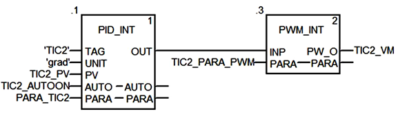

Рис.6.57. Приклад виклику процедури PWM_INT разом з PID_INT 

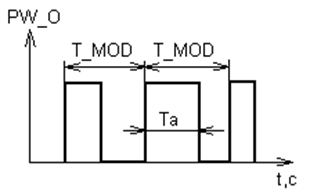

Рис.6.58  Широтно-імпульсна модуляція

Першим параметром цієї таблиці є слово, в якому зберігається значення періоду модуляції *T_MOD*. Період модуляції повинен бути меншим або дорівнювати періоду дискретизації ПІД-регулятора (*TS)*. *T_MOD* може змінюватись у межах від 0 до 32767 і вимірюється у 0,01 секунди. Тривалість імпульсу залежить від значення вхідної величини *INP* і періоду модуляції *T_MOD*:

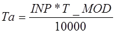    (6.49)