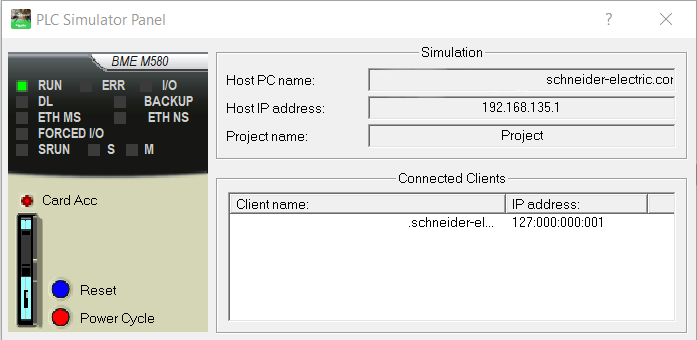
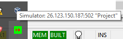
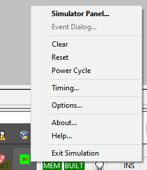
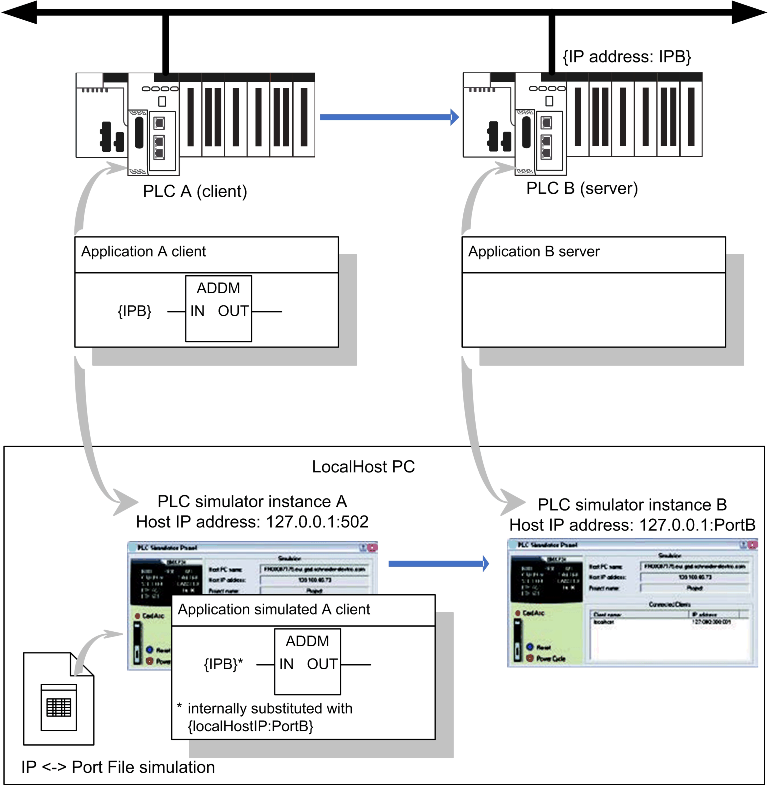
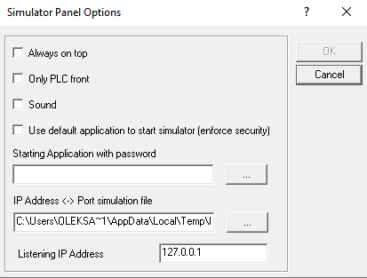
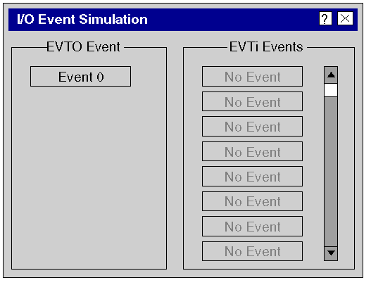
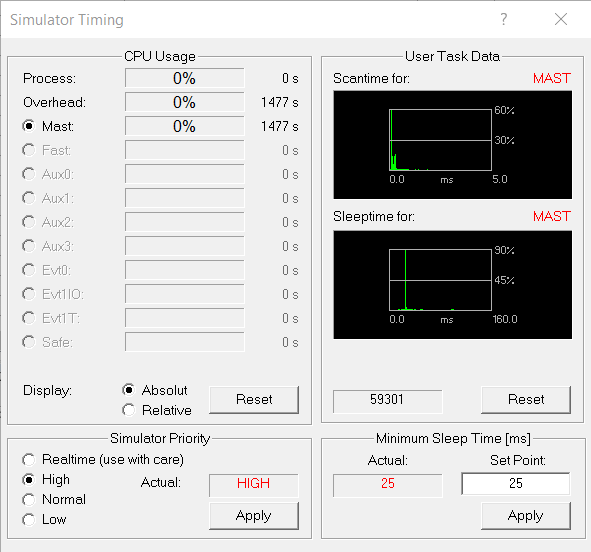
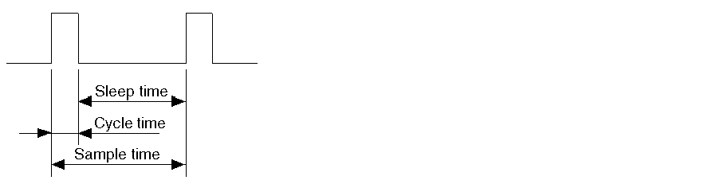

# PLC Simulator

PLC Simulator дозволяє імітувати роботу контролера. Використання Breakpoints, Stepping та функції GoTo дає змогу тестувати програму в симульованому контролері.

PLC Simulator постачається перед розгортанням фізичного контролера лише для цілей тестування. Він не замінює фізичний контролер, і застосунок, що ґрунтується виключно на симуляції, не може використовуватися у виробничому середовищі без фізичного тестування та введення цього застосунку в експлуатацію. Також не можна використовувати PLC Simulator як віртуальний контролер.

Діалогове вікно Simulator надає такі відомості:

- тип симульованого контролера
- стан симульованого контролера
- назву завантаженого проєкту
- IP-адресу та DNS-ім’я хост-комп’ютера для PLC Simulator
- IP-адреси та DNS-імена підключених клієнтських ПК
- діалогове вікно для симуляції IO-подій
- кнопку Reset для симуляції холодного запуску
- кнопку Power Cycle для симуляції теплого запуску
- контекстне меню (права кнопка миші) для керування PLC Simulator




Символ PLC Simulator, що відображається на панелі завдань, пропонує такі функції:

- відображення стану симульованого контролера
- QuickInfo (підказки) показує IP-адресу хост-комп’ютера для PLC Simulator, номер порту, що використовується, і назву завантаженого проєкту
- контекстне меню (права кнопка миші) для керування PLC Simulator





Стан роботи контролера (за кольором іконки)

| Колір    | Опис                    |
| -------- | ----------------------- |
| зелений  | нормальна робота        |
| жовтий   | контролер у стані HALT  |
| червоний | контролер у стані ERROR |

Рамка навколо іконки показує активний режим налагодження

| Колір | Опис                                                         |
| ----- | ------------------------------------------------------------ |
| синій | Активний режим налагодження, наприклад, у проєкті встановлено принаймні одну точку зупинки або є хоча б одне користувацьке завдання в режимі налагодження. |

Внутрішній символ показує стан контролера (NOCONF, IDLE, STOPPED, RUN)

| Символ                                                       | Стан симульованого контролера | Опис                                                         |
| ------------------------------------------------------------ | ----------------------------- | ------------------------------------------------------------ |
|  | NOCONF (без конфігурації)     | Немає завантаженого користувацького проєкту, або завантажений проєкт є недійсним чи видалений командою Clear. |
|  | IDLE                          | Проєкт, завантажений у контролер, не запущений або скинутий кнопкою Reset. |
|  | STOPPED                       | Жоден проєкт не виконується.                                 |
|  | RUN                           | Виконується проєкт з принаймні однією задачою                |

Колір внутрішнього символу показує стан з’єднання

| Приклад                                                      | Колір    | Опис                                     |
| ------------------------------------------------------------ | -------- | ---------------------------------------- |
|  | чорний   | Немає підключеного TCP/IP-клієнта.       |
|  | червоний | Принаймні один TCP/IP-клієнт підключено. |

Стан помилок

| Символ                                                       | Стан симульованого контролера | Опис                                                         |
| ------------------------------------------------------------ | ----------------------------- | ------------------------------------------------------------ |
|  | HALT                          | У проєкті виникла помилка. Симульований контролер необхідно повторно ініціалізувати або скинути за допомогою кнопки Reset. |
|  | ERROR                         | У проєкті виявлено невиправну помилку. Це означає, що зв’язок більше неможливий. Симульований контролер необхідно скинути за допомогою кнопки Reset. |

Наведені нижче символи відображають внутрішні виняткові стани. Відновлення з цих станів неможливе, тому PLC Simulator потрібно закрити та перезапустити.

| Символ                                                       | Стан симульованого контролера | Опис                                                         |
| ------------------------------------------------------------ | ----------------------------- | ------------------------------------------------------------ |
|  | POWER OFF                     | Виникла внутрішня помилка під час симуляції скидання контролера або циклу живлення. |
|  | INIT                          | Виникла внутрішня помилка під час ініціалізації PLC Simulator. |
|  | UNKNOWN                       | PLC Simulator перейшов у невизначений стан.                  |

За допомогою команди `Clear` можна видалити поточний завантажений проєкт із пам’яті симулятора та перевести симульований PLC (і симулятор) у стан `NOCONF`. Це відповідає холодному старту PLC без завантаженого дійсного проєкту (зв’язок між Control Expert і симулятором розривається). Виконати Clear можна за допомогою команди меню Clear у контекстному меню символу симулятора на панелі завдань.

За допомогою `Reset` можна перезапустити симульований PLC (та симулятор). Це відповідає холодному старту PLC (зв’язок між Control Expert і симулятором розривається, змінні проєкту скидаються, а симулятор переходить у стан RUN, якщо активовано auto start, або в STOP, якщо auto start деактивовано). Reset відповідає кнопці скидання на реальному CPU. У PLC Simulator при виконанні `Reset` системний біт `%S0` не встановлюється в `1` (на відміну від реального PLC). Виконати Reset можна за допомогою:

- команди меню `Reset` у контекстному меню символу симулятора на панелі завдань або самого символу симулятора;
- кнопки `Reset` у діалоговому вікні симулятора.

За допомогою `Power Cycle` ви виконуєте цикл живлення (вимкнення/увімкнення живлення) для симульованого PLC (та симулятора). Це відповідає теплому старту PLC (зв’язок між Control Expert і симулятором розривається, але змінні поточного проєкту залишаються). Цикл живлення відповідає кнопці скидання на блоках живлення Premium або відключенню та повторному підключенню живлення. Виконати Power Cycle можна за допомогою:

- команди меню Power Cycle у контекстному меню символу симулятора на панелі завдань або самого символу симулятора;
- кнопки Power Cycle у діалоговому вікні симулятора.

У випадку з Safety PLC цикл живлення симулює холодний старт. Змінні проєкту скидаються.

## Обмеження PLC Simulator

PLC Simulator дозволяє тестувати повний проєкт із користувацькими задачами за допомогою симуляції CPU. Однак поведінку під час виконання в симуляторі не можна порівнювати з реальною роботою PLC і використовувати для висновків про поведінку фізичного контролера. Це стосується багатозадачності та часової інформації.

- PLC Simulator не підтримує жодної форми I/O. Хоча симуляція містить компоненти проєкту для I/O, вони не обробляються PLC Simulator. Входи та виходи можна використовувати лише через проєкт або через онлайн-функції Control Expert (читання, запис, примусове значення, анімація тощо).

- У PLC Simulator події I/O не можуть ініціюватися встановленням/примусом бітів `%I`.

- Для обмежень, пов’язаних із картою пам’яті, див. Memory Card for Modicon M580 CPU та Memory Card for Modicon M340 CPU.

- PLC Simulator не підтримує функцію Hot Standby.

- PLC Simulator не містить такого самого рівня захисту, як стандартне програмне забезпечення Control Expert.
- PLC Simulator підтримує підмножину системних бітів `%S` та системних слів `%SW` (див. EcoStruxure Control Expert, System Bits and Words, Reference Manual).

PLC Simulator підтримує більшість системних сервісів ОС PLC на різних платформах. Ці сервіси реалізовані лише як фіктивні. Це означає, що функції та функціональні блоки можуть використовуватися у завантаженому проєкті, але вони не працюють належним чином та/або повертають повідомлення про помилку. Це стосується головним чином функцій і функціональних блоків, що звертаються до спеціальних платформ, таких як I/O-блоки, комунікації та апаратно-специфічні функції. Підтримуються такі системні сервіси ОС PLC:

- діагностичні функції
- функції читання дати й часу
- час затримки поширення
- доступ до об’єктів (крім мережевих змінних)
- Premium DFBs
- SFC

Не підтримуються такі системні сервіси ОС PLC:

- контурне регулювання (CLC)
- Fip IO
- BusX IO
- Quantum IO
- конфігурація
- комунікація
- функції встановлення дати й часу

Різні сімейства PLC відрізняються структурою пам’яті. Можливе невідповідне вирівнювання даних при перенесенні проєкту з PLC Simulator на PLC Modicon M340, M580 або Momentum. Тому перевіряйте структуру даних у проєкті. Докладну інформацію про вирівнювання даних див. у розділі DDT: Mapping rules (EcoStruxure Control Expert, Program Languages and Structure, Reference Manual). Докладну інформацію про принципи збереження та структуру пам’яті див. у розділі Application Memory Structure (EcoStruxure Control Expert, Program Languages and Structure, Reference Manual).

- PLC Simulator підтримує лише комунікацію на базі TCP/IP (Schneider Port 502). В інших випадках повертається код виключення Modbus. Modbus, Modbus Plus або Uni-TE не підтримуються PLC Simulator.

- Для Control Expert V14.1 та попередніх версій PLC Simulator не підтримує комунікацію з іншими ПК або PLC Simulator, ані віддалену, ані локальну.

- Для Control Expert V14.1 та попередніх версій PLC Simulator не має таймауту комунікації.

- Мережі зв’язку, такі як Uni-Telway, Ethway, Fipway, Modbus, Modbus Plus тощо, не підтримуються PLC Simulator.

Функціональні блоки комунікації, що вимагають клієнта й сервера PLC, підтримуються у випадку кількох екземплярів PLC Simulator. Докладніше див. у розділі IP Address and Communication Port Simulation.

PLC Simulator підтримує такі нативні команди Modbus:

| Код функції (hex) | Опис                           |
| ----------------- | ------------------------------ |
| 01                | Read Coil Status (0x)          |
| 02                | Read Input Status (1x)         |
| 03                | Read Holding Registers (4x)    |
| 04                | Read Input Registers (3x)      |
| 05                | Force Single Coil (0x)         |
| 06                | Preset Single Register (4x)    |
| 0F                | Force Multiple Coils (0x)      |
| 10                | Preset Multiple Registers (4x) |
| 16                | Mask Write Registers (4x)      |

Щодо використання `%MW`, відображеного на булевий елемент у структурованому типі даних, PLC Simulator і реальний PLC поводяться по-різному. Коли `%MW` відображається на булевий елемент у структурованому типі даних, PLC Simulator анімує лише перший рядок. У реальному PLC анімуються обидва рядки (нульовий та перший). Перший рядок використовується для отримання інформації про значення з історії.

Обмеження у проєктах M580 Safety. PLC Simulator не виконує подвійне виконання коду логіки та порівняння результатів. Він лише симулює логіку, але не симулює поведінку безпеки PLC.

PLC Simulator може перейти у стан HALT під час виконання команд `Step Info` або `Step Over` у текстових мовах. Якщо поточний елемент є складною інструкцією (наприклад, копіювання великого масиву з однієї змінної в іншу), її виконання займає дуже багато часу, оскільки вона виконується покроково у PLC Simulator. Встановлення точки зупину на наступній інструкції та виконання команди `Go` дозволяє уникнути цієї проблеми.

## IP Address and Communication Port Simulation

Наступні функціональні блоки зв’язку потребують наявності клієнта PLC та сервера PLC:

- `READ_REMOTE` і `WRITE_REMOTE`
- `DATA_EXCH`
- `READ_VAR` і `WRITE_VAR`

Можливість запуску кількох екземплярів PLC Simulator на одному локальному ПК дозволяє симулювати клієнт PLC і сервер PLC. Це працює за наступним принципом. У клієнтскьому PLC-застосунку цільовий PLC (тобто сервер) адресується за допомогою його IP-адреси як вхідного параметра `IN` блоку функцій `ADDM`. У цих функціональних блоках комунікаційний порт не визначається, як у фізичному PLC, завжди використовується порт 502. Після завантаження PLC-застосунку (клієнт) у перший екземпляр PLC Simulator на локальному ПК, для симуляції цільового PLC (сервер) у другому екземплярі PLC Simulator він може бути адресований лише через інший TCP/IP-порт зв’язку. Див. Staring PLC Simulator with Command Line.

Замість переписування IP-адреси цільового PLC (сервер) у PLC-застосунку (клієнт), екземпляр PLC Simulator може підставити IP-адресу цільового PLC (сервер) TCP/IP-портом зв’язку, який вказаний у файлі симуляції портів. Цей файл містить відповідність між IP-адресою та TCP/IP-портом локального хоста.

Як показано нижче, коли PLC-застосунок (клієнт) викликає цільовий PLC (сервер) за IP-адресою `{IPB}`, екземпляр `PLC Simulator А` підміняє адресу `{IPB}` на `{localHostIP:PortB}`, що відповідає з’єднанню з екземпляром `PLC Simulator B`.




Відповідності між IP-адресою та комунікаційним портом для симуляції задаються у файлі симуляції портів (`*.xml`) з такою синтаксичною структурою:

```xml
<EquiList>
  <PLCAdressSim Address="172.168.12.0" Port="503"></PLCAdressSim>
  <PLCAdressSim Address="192.168.0.2" Port="504"></PLCAdressSim>
</EquiList>
```

Тут `Address` — це IP-адреса в блоці `ADDM`, а `Port` — порт симулятора, який використовується для симуляції. Файл симуляції портів має бути унікальним для одного ПК. Місце розташування та назву файлу можна змінити у вікні `Options Dialog Box`. У синтаксисі вхідного параметра функціонального блоку `ADDM` IP-адреса має префікс топологічного розташування комунікаційного порту, наприклад `0.0.3{168.127.0.1}` для порту CPU M580. Цей типовий синтаксис ігнорується та не перевіряється симулятором. Якщо IP-адреса у функціональному блоці `ADDM` не знайдена у файлі симуляції портів, підміна не виконується, і PLC Simulator використовує IP-адресу напряму. Це дозволяє тестувати справжній сервер PLC.

Використання `READ_VAR`, `WRITE_VAR` або `DATA_EXCH` у PLC Simulator вимагає версії Libset 15.0 або новішої підтримуваної версії.



## Емуляція карти пам’яті для Modicon M580 CPU

Панель PLC Simulator для Modicon M580 відображає карту пам’яті у нижньому лівому куті віртуальної передньої панелі як для M580 PLC, так і для M580 Safety PLC. Карта пам’яті вставляється за замовчуванням після запуску PLC Simulator.

 У реальному Modicon M580 CPU карта пам’яті поділяється на 2 частини: частина для ОС, де застосунок зберігається постійно (механізм backup/restore); частина для застосунку, де він може зберігати дані за допомогою функціональних блоків збереження даних.

Не підтримуються такі функції реальної карти пам’яті:

- backup/restore на/з карти пам’яті;
- режими роботи карт пам’яті;
- `%S66` (APPLIBCK).

Для Modicon M580 CPU можна симулювати такі функції карти пам’яті:

- файли на карті пам’яті, згенеровані блоками збереження даних;
- вилучення/вставлення карти пам’яті;
- заповнення карти пам’яті;
- захист від запису.

Симулятор підтримує функціональні блоки управління файлами та імітує створення файлів на ПК. Каталог на ПК симулює частину карти пам’яті, пов’язану з управлінням файлами. У цьому каталозі зберігаються файли, створені користувацьким застосунком.

Каталог, що використовується для симуляції карти пам’яті, може бути типовим (`C:\Documents and Settings\USERNAME\Local Settings\Temp\DataStorage`) або тим, що використовувався під час останньої симуляції. Останній використаний каталог зберігається постійно у реєстрі.

Файли, записані застосунком, доступні через стандартні інструменти, зокрема текстові редактори чи програми Office. Симулятор ніколи не видаляє файли, створені застосунком. Якщо застосунку потрібна пуста карта пам’яті, слід використати системне слово `%SW93` (`Memory Card File System Format`) у стані STOP CPU.

Обмеження для функціональних блоків управління файлами

- коди помилок, що генеруються цими функціями/блоками, можуть відрізнятися між PLC Simulator і реальною CPU;
- у PLC Simulator неможливо видалити відкритий файл (ані за допомогою функції `DELETE_FILE`, ані через команду FTP); перед видаленням файл необхідно закрити, інакше виникає загальна помилка (`-1`);
- функція `SET_FILE_ATTRIBUTES` не підтримується PLC Simulator; спроба виклику цієї функції призводить до загальної помилки (`-1`).

За замовчуванням карта пам’яті вставлена під час запуску симулятора. Можна видалити і встановлювати карту пам’яті:

У будь-який момент можна симулювати стан, коли карта пам’яті заповнена. Це робиться через відпвоідну команду контекстного меню `Memory Card Full`.

У будь-який момент можна симулювати стан захисту від запису. Це робиться через контекстне меню командою `Write Protection`. Control Expert додає деякі обмеження, пов’язані з картою пам’яті (наприклад, забороняється змінювати програму, якщо карта захищена від запису). Ці обмеження підтримуються й симулятором.

Для симуляції функції захисту від запису симулятор підтримує такі системні біти та слова:

- `%S65 (CARDIS)`
- `%S96 (BACKUPPROGOK)`
- `%SW97 (CARDSTS)`

Доступ до файлів через FTP-клієнт у симуляторі неможливий, оскільки файли доступні безпосередньо засобами Windows.

## Event Dialog

- `EVT0 Event` Можливі події для завдання EVT0 показуються тут. Це користувацьке завдання має найвищий пріоритет у системі й може містити лише одну IO-подію. Якщо це завдання є частиною проєкту, кнопка команди подій доступна.

- `EVTi IO Event`. Можливі події для завдання EVTi IO показуються тут. Максимальна кількість Задач залежить від симульованого PLC.
   Кнопки команд подій доступні залежно від кількості подій, визначених у проєкті.



## Simulator Panel Options

`Always on top` Якщо активувати цей прапорець, вікно керування PLC Simulator завжди буде поверх інших діалогових вікон та вікон.

`Only PLC front` Якщо активувати цей прапорець, вікно керування PLC Simulator мінімізується, і відображається лише передня панель симульованого контролера.

`Sound` Якщо активувати цей прапорець, PLC Simulator відтворює звук у таких випадках:

- запуск і завершення роботи PLC Simulator;
- помилка у проєкті.

`Use default application to start simulator (enforce security)` Якщо активувати цей прапорець, для запуску PLC Simulator потрібен застосунок із паролем. Щоб підвищити рівень захисту, необхідно активувати цей прапорець. Інакше можливі вразливості у сфері кібербезпеки.

`Starting application with password` Шлях і назва застосунку з паролем, який використовується для запуску PLC Simulator.

Якщо ввести шлях і назву застосунку, але застосунок не містить пароля, PLC Simulator не запуститься.

`IP Address <-> Port simulation file` Шлях і назва файлу симуляції портів (`*.xml`), що використовується для підміни IP-адреси на порт зв’язку в екземплярі PLC Simulator.

`Listening IP Address` Коли PLC Simulator працює на тому самому ПК, що й екземпляр Control Expert, з міркувань безпеки слід обмежитися такою IP-адресою: 127.0.0.1.

Використовуйте `Listening IP Address 0.0.0.0`, щоб дозволити PLC Simulator приймати підключення від іншого екземпляра Control Expert або контролера в мережі.

## Timing (simulator)

За допомогою цієї команди меню можна відкрити та закрити діалогове вікно Timing. Це діалогове вікно відображає статистику симулятора щодо використання CPU, пріоритету процесу та часу сканування користувача. Додатково в цьому діалоговому вікні можна змінювати пріоритет і час очікування (sleep time), щоб оптимізувати таймінг симулятора та відрегулювати навантаження на ПК.

`Process` Ця стовпчикова діаграма показує фактичне навантаження на процесор, спричинене процесом симулятора, у відсотках. На відміну від відображення у диспетчері завдань Windows, який показує лише поточне значення, ця діаграма показує середнє значення за час, що вказаний у кінці стовпчика. Позначка часу в кінці стовпчика означає час, який минув із моменту запуску симулятора або з моменту останнього натискання кнопки Reset.

`Overhead` Ця стовпчикова діаграма показує середнє навантаження на процесор, спричинене системними витратами симулятора, у відсотках. Overhead розраховується так:  навантаження, спричинене всім процесом – навантаження, спричинене користувацькими завданнями Це може бути абсолютне або відносне значення навантаження на процесор, спричинене симулятором. Цей параметр можна змінити в області `Display`. Позначка часу в кінці стовпчика означає час, який минув із моменту запуску симулятора або з моменту останнього натискання Reset.

`Mast` … `Ev1T`, `Safe` Стовпчикова діаграма показує середнє навантаження на процесор, спричинене окремими користувацькими завданнями, у відсотках. Ці значення можуть бути абсолютними або відносними щодо навантаження на процесор, спричиненого симулятором. Спосіб відображення можна задати в області ` Display`. Кнопка-перемикач на початку стовпчикової діаграми дозволяє вибрати користувацьке завдання. Деталі цього завдання відображаються в області `User Task Data`. Позначка часу в кінці стовпчика означає час, який минув із моменту запуску окремих завдань або з моменту останнього натискання Reset. У випадку Safety PLC доступні лише завдання Mast і Safe.

`Display: Absolute` Якщо активувати цей перемикач, у стовпчиковій діаграмі відображається фактичне значення. Воно показується у відсотках від загального навантаження на процесор ПК.

`Display: Relative` Якщо активувати цей перемикач, у стовпчиковій діаграмі відображається відносне навантаження на процесор. Воно показується у відсотках від навантаження на процесор, спричиненого симулятором.

`Reset` Якщо натиснути цю кнопку, вимірювання часу в цій області скидаються. Це необхідно для отримання узгодженого відображення часу, що минув, оскільки окремі відліки часу не запускаються одночасно під час відкриття симулятора.



У області `Simulator Priority`  можна задати пріоритет процесу симулятора. У деяких випадках може знадобитися призначити симулятору високий пріоритет, оскільки час циклу окремих користувацьких завдань може значно відхилятися при великому навантаженні на ПК. Ці відхилення безпосередньо спричинені операційною системою Windows і можуть досягати 100 мс при пріоритеті `Normal`. У більшості випадків це також впливає на таймер `watchdog`. У такій ситуації підвищення пріоритету симулятора може запобігти спрацюванню watchdog.

- `Real-time` За цього пріоритету відхилення часу циклів користувацьких Здача становлять лише кілька мілісекунд. Цей пріоритет слід використовувати з обережністю, оскільки в такому разі симулятор має найвищий можливий пріоритет і перериває роботу системи Windows. Якщо використовувати цей пріоритет із дуже малим часом очікування (`sleep time`) та циклічним користувацьким завданням, робота ПК може стати некоректною.
- `High`. За цього пріоритету відхилення часу циклів користувацьких завдань зазвичай не перевищує 10 мс.
- `Normal` За цього пріоритету відхилення часу циклів користувацьких завдань може становити до кількох сотень мілісекунд.
- `Low` Цей пріоритет швидко призводить до спрацювання `watchdog` і повинен використовуватися лише на ПК з майже нульовим навантаженням
- `Apply` Натиснувши цю кнопку, ви застосуєте налаштування в цій області, і вони почнуть діяти негайно.

У області User Task відображаються 2 гістограми:

- гістограма часу циклу для вибраної користувацької задачі;
- гістограма часу очікування (sleep time) для вибраної користувацької задачі.

Гістограми автоматично підлаштовують свої діапазони до поточних значень.

- шкала у відсотках (вісь Y) підлаштовується до максимального відсоткового значення;
- якщо нове значення не входить у діапазон шкали часу (вісь X), діапазон збільшується у 2 рази, доки нове значення не увійде в межі. У цьому випадку попередні значення перераховуються для нового діапазону;
- якщо значення трапляється настільки рідко, що не створює піку на гістограмі, формується пік у 1 піксель, щоб значення можна було побачити.

`SCAN time` - Ця гістограма показує відносну частоту значень часу циклу у вибраному користувацькому завданні. Див. також `Minimum Sleep Time`. Лічильник зліва під гістограмою підраховує кількість циклів у режимі RUN, представлених у цій гістограмі.

`Sleep time` - Ця гістограма показує відносну частоту значень часу очікування у вибраній користувацькій задачі. Див. також `Minimum Sleep Time`. Для циклічних задач зазвичай показується одне значення зі 100 %. Це мінімальний час очікування для користувацьких задач. Якщо змінити значення мінімального часу вибірки, створюється другий пік для нового значення. Цикли користувацьких задач включаються в цю гістограму (незалежно від режиму PLC).

`Cycle Counter` Лічильник зліва під гістограмою підраховує кількість циклів у режимі RUN, представлених у гістограмі часу циклу. Цей лічильник не має значення для гістограми часу очікування, оскільки туди включаються цикли (незалежно від режиму PLC).

`Reset` Якщо натиснути цю кнопку, гістограми для вибраного користувацького завдання буде скинуто, і почнеться нова статистика.


Симулятор не єдина програма, що виконується на ПК, тому інші програми також повинні мати можливість виконуватися. З цієї причини користувацькому завданню призначається фіксований час очікування (`sleep time`). Час вибірки обчислюється за такою формулою:

```
Sample Time = Cycle Time + Sleep Time
```

Час користувацької задачі



| Час         | Значення                                                     |
| ----------- | ------------------------------------------------------------ |
| Sample time | Час, відведений для виконання користувацької задачі          |
| Cycle time  | Час, фактично потрібний для виконання користувацької задач.  |
| Sleep time  | Час, протягом якого можуть виконуватися інші програми на ПК. |

Мінімальний час очікування (мс) (minimum sleep time) може бути заданий у межах від 10 до 100 мс.

Apply
 Якщо натиснути цю кнопку, мінімальний час очікування застосовується до вибраного користувацького завдання та використовується негайно.

