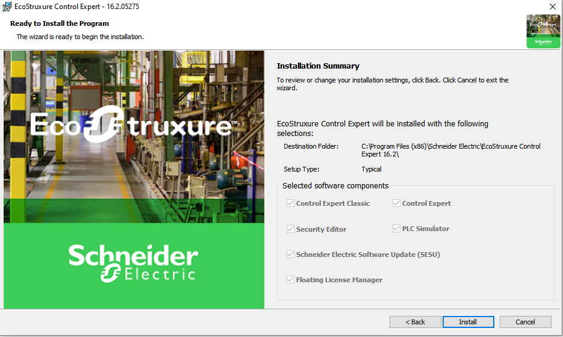
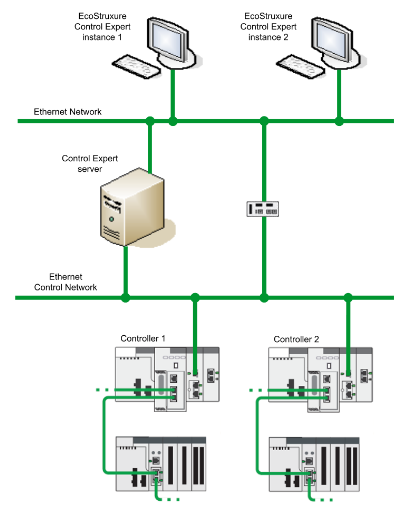

Типовий шлях папки встановлення EcoStruxure Control Expert:  `C:\Program Files (x86)\Schneider Electric\EcoStruxure Control Expert X`.
Папка встановлення Custom Libraries: `C:\ProgramData\Schneider Electric\EcoStruxure Control Expert X\CustomLibset\vX`

де X — це версія EcoStruxure Control Expert, яку ви встановлюєте.

## EcoStruxure™ Control Expert та EcoStruxure™ Control Expert Classic

**EcoStruxure Control Expert** - це ПЗ що містить **Topology Manager**, який керує системними проєктами (system projects). Один або кілька контролерів (кожен зі своїм власним проєктом керування) та різні пристрої утворюють системний проєкт. Проєкти керування (control projects) можуть адмінітсруватися окремо шляхом запуску одного чи кількох екземплярів редактора EcoStruxure Control Expert із Topology Manager. Використовується архітектура клієнт/сервер. Під час встановлення на комп’ютері інсталюються як клієнтський так і серверний екземпляр EcoStruxure Control Expert.

**Репозиторій Control Expert** — це база даних, якою керує EcoStruxure Control Expert і яка містить дані системного проєкту.

**EcoStruxure Control Expert Classic** - це однокористувацький застосунок, який дозволяє керувати лише одним проєктом керування одночасно.

Така структура дає можливість використовувати розподілену архітектуру, що складається з:

- одного комп’ютера, який виконує роль Control Expert server (на цьому ж комп’ютері також можна використовувати екземпляри EcoStruxure Control Expert, що підключаються локально до сервера); 
- одного або кількох віддалених комп’ютерів, на яких запускаються екземпляри EcoStruxure Control Expert і підключаються до Control Expert server.

У наступній таблиці описані порти, які використовуються EcoStruxure Control Expert.

| Порт                       | Опис                                                         | Значення |
| -------------------------- | ------------------------------------------------------------ | -------- |
| Базовий порт               | Порт (UDP і TCP), що використовується для обміну даними клієнт/сервер. | 20160    |
| Порт передавання файлів    | Порт (TCP), що використовується для передавання файлів у режимі клієнт/сервер. Порт автоматично передається усім екземплярам EcoStruxure Control Expert (client). | 20161    |
| Порт критичних повідомлень | Порт (TCP), що використовується для підтримки постійного каналу зв’язку клієнт/сервер. Використовується процесами SE.Automation.SystemManager.exe та SE.Automation.ToolAgent.exe. | 20162    |

## Комунікаційні драйвери 

Встановлення EcoStruxure Control Expert інсталює такі драйвери зв’язку:

- Modbus serial
- USB
- XIP

Ці драйвери створюють з’єднання між комп’ютером і контролером. У EcoStruxure Control Expert ви можете вибрати драйвер, який бажаєте використовувати. Загалом змінювати конфігурацію встановлених драйверів не потрібно. Проте, за допомогою інструмента Driver Manager можна переконфігурувати драйвер або інсталювати додаткові драйвери. Можна також додатково встановити драйвери Uni-Telway (для TSX Premium).

Кожне з’єднання потребує одного екземпляра драйвера, який використовує один порт, за винятком драйверів, що працюють із протоколом XWAY (наприклад, XIP), які використовують два порти. Порти, які використовуються екземпляром драйвера, залишаються відкритими, доки цей екземпляр виконується. Екземпляри драйверів можна запускати й зупиняти за допомогою інструмента Driver Manager. Рекомендовано видаляти драйвер, якщо він не використовується. 

## Security Editor

Security Editor використовується для керування доступом до різних функцій EcoStruxure Control Expert та пов’язаного програмного забезпечення керування завантаженням. Інструмент інсталюється автоматично як частина EcoStruxure Control Expert.

## PLC Simulator

PLC Simulator дозволяє імітувати роботу контролера для цілей тестування. Він не замінює фізичний контролер, і застосунок, що ґрунтується виключно на симуляції, не може використовуватися у виробничому середовищі без фізичного тестування та введення цього застосунку в експлуатацію. 

## Schneider Electric Software Update (SESU)

Schneider Electric Software Update (SESU) дозволяє отримувати сповіщення про нові оновлення прошивки та програмного забезпечення, а також встановлювати їх. Потрібне підключення до інтернету.

## Floating License Manager

Floating License Manager дозволяє розподіляти місця плаваючих ліцензій програмного забезпечення Schneider Electric у межах вашої організації.

## Додаткові компоненти

Наступні програмні компоненти встановлюються незалежно від типу інсталяції:

- драйвери зв’язку
- утиліта PL7 convertor
- утиліта Concept convertor
- OS Loader
- Libset Installer: цей інструмент можна використовувати для встановлення набору версій бібліотек (Libset), яких немає на вашому комп’ютері, якщо це необхідно.

- Device Type Managers (DTM), пов’язані з контролерами та модулями, доступними в Hardware Catalog EcoStruxure Control Expert
- License Manager

Примітка: Деяке обладнання, яке підтримується EcoStruxure Control Expert або EcoStruxure Control Expert Classic, може вимагати встановлення додаткового програмного забезпечення для використання й налаштування обладнання, наприклад, Altivar Process Variable Speed Drives або Advantys islands DTMs.

Перш ніж закрити майстер інсталяції, ви можете завантажити такі застосунки та бібліотеки:

- EcoStruxure Automation Device Maintenance (замінює OS Loader)
- EcoStruxure Control Expert Dif
- Modicon General Purpose Library для EcoStruxure Control Expert

