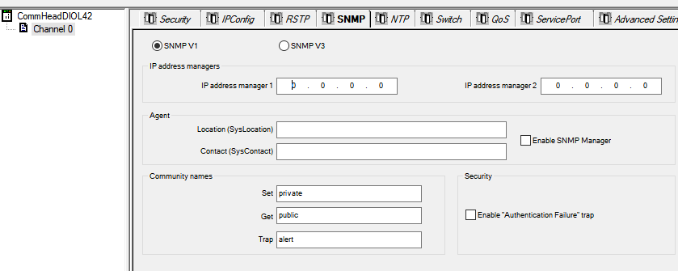
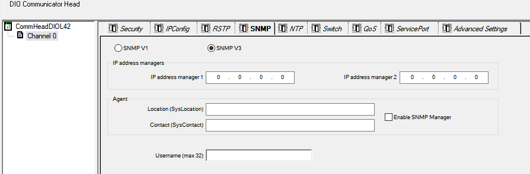

# SNMP

Використовуйте вкладку SNMP у Control Expert для налаштування окремих параметрів SNMP для таких модулів:

- модулі контролерів M580
- адаптери (e)X80 EIO на віддалених стійках RIO
- модулі адаптерів RIO 140CRA3120 у системах Quantum EIO

SNMP-агент — це програмний компонент служби SNMP, що працює на цих модулях і забезпечує доступ до діагностичної та керуючої інформації, визначеної підтримуваними MIB: MIB2, Bridge MIB і LLDP MIB.

Доступ до цих даних можна отримати за допомогою SNMP-браузерів, програмного забезпечення для керування мережею та інших інструментів. Крім того, SNMP-агент може бути налаштований з IP-адресами одного або двох пристроїв (зазвичай ПК з програмами для керування мережею), які слугуватимуть цільовими пристроями для повідомлень-пасток (trap), що ініціюються подіями. Пастки можуть інформувати керуючий пристрій про такі події: Link up, Link down, Cold start, Warm start та Authentication failure.

Використовуйте вкладку SNMP для налаштування SNMP-агентів модулів зв’язку у локальній стійці та віддалених стійках RIO. SNMP-агент може підключатися до одного або двох SNMP-менеджерів і обмінюватися з ними даними в рамках служби SNMP. Служба SNMP включає:

- перевірку автентифікації модулем Ethernet-зв’язку будь-якого SNMP-менеджера, що надсилає запити SNMP
- обробку подій та пасток

 Модулі контролерів M580 з версією прошивки ≥ 4.01 підтримують обидва:

- SNMP V1
- SNMP V3 із рівнем безпеки SNMPSecurityLevel = NoAuthNoPriv

Модулі контролерів M580 з версією прошивки < 4.01 підтримують тільки SNMP V1.
 Перегляд і редагування таких властивостей у вкладці SNMP:

| Властивість         | Опис                                                         |
| ------------------- | ------------------------------------------------------------ |
| SNMP Version        | SNMP V1 або SNMP V3. SNMP V1 і SNMP V3 мають різні формати та параметри, що можна налаштовувати. |
| IP Address Managers | `IP Address Manager 1` – IP-адреса першого SNMP-менеджера, якому SNMP-агент надсилає повідомлення-пастки. `IP Address Manager 2` – IP-адреса другого SNMP-менеджера, якому SNMP-агент надсилає повідомлення-пастки. |
| Agent               | `Location` – місце розташування пристрою (максимум 32 символи).  `Contact` – інформація про особу для контакту з технічного обслуговування пристрою (максимум 32 символи). `SNMP Manager` -  `Disabled` – можна редагувати параметри `Location` і `Contact`. `Enabled` – параметри `Location` і `Contact` редагуються тільки через SNMP Manager. |
| Community Names     | `Get` – пароль, потрібний SNMP-агенту перед виконанням команд читання від SNMP-менеджера (за замовчуванням = public).  `Set` – пароль, потрібний SNMP-агенту перед виконанням команд запису від SNMP-менеджера (за замовчуванням = private). | `Trap` – пароль, який SNMP-менеджер вимагає від SNMP-агента перед прийняттям повідомлень-пасток (за замовчуванням = alert). |
| Security            | `Enable Authentication Failure Trap` – TRUE означає, що SNMP-агент надсилатиме повідомлення-пастку до SNMP-менеджера у разі, якщо неавторизований менеджер надсилає команду `Get` або `Set` (за замовчуванням = Disabled). |
| Username            | Значення імені користувача, потрібне для SNMP V3.            |

